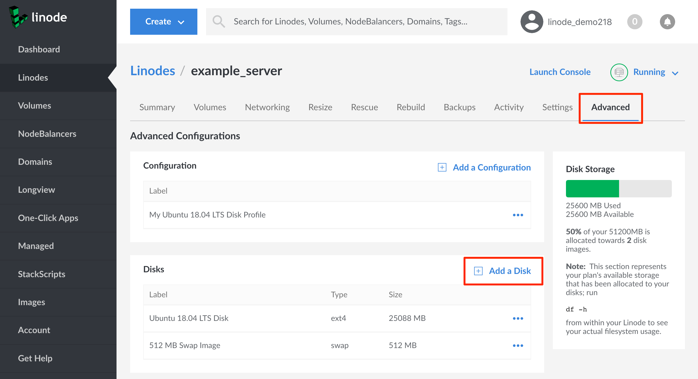
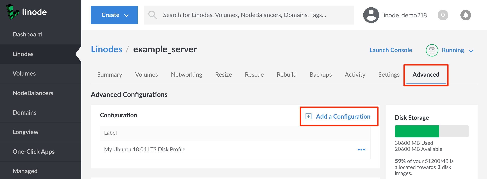
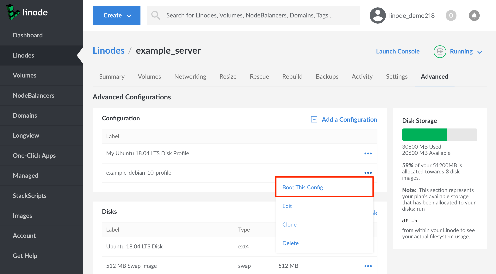

---
author:
  name: Linode
  email: docs@linode.com
description: 'Select and deploy the Linux distribution of your choice.'
keywords: ["linux", "linode manager", "image", "cloud manager"]
license: '[CC BY-ND 4.0](https://creativecommons.org/licenses/by-nd/4.0)'
modified_by:
  name: Linode
published: 2019-10-11
title: Deploy an Image to a Linode
classic_manager_link: quick-answers/linode-platform/deploy-an-image-to-a-linode-classic-manager/
---

When you first create a Linode, you generally [deploy a Linux distribution or other image](/docs/getting-started/#create-a-linode) to it upon creation. However, it is also possible to deploy additional images and Linux distributions to your Linode that will exist alongside your first image. Additionally, you can switch between these extra images by rebooting your Linode. This QuickAnswer guide will show you how to deploy an additional image.


To deploy additional images, your Linode will need some unallocated space for those new images. When following the steps below, if you find that you don't have sufficient unallocated space, then you have two options:

- [Resize/shrink other disks](/docs/quick-answers/linode-platform/resize-a-linode-disk/) on your Linode to make some room.
- [Upgrade your Linode](/docs/platform/disk-images/resizing-a-linode/) to a plan that offers more disk space.


## Deploy an Image

1.  Log into the [Linode Cloud Manager](https://cloud.linode.com/). Click on the **Linodes** link in the sidebar navigation. A table of your Linodes will appear.

1.  Click on the row corresponding to your Linode. A dashboard for your Linode will appear.

1.  Click on the **Advanced** tab from this page, and find the **Disks** panel that appears below it.

    

1.  On this panel, click the **Add a Disk** link.

1.  The **Add Disk** form will appear. Select the **Create from Image** option at the top of the form, then complete the remaining fields in the form:

    | Field | Description |
    |-------|-------------|
    | Label | A name for the disk created from the image that you will select. |
    | Image | The Linux distribution or other image that you would like to use. If you have any [custom images](/docs/platform/disk-images/linode-images/) saved, they will be listed at the bottom of the dropdown menu. |
    | Root Password | A strong, complex, and unique password for the root user on your new image's disk. |
    | SSH Keys | Any [SSH keys](/docs/security/authentication/use-public-key-authentication-with-ssh/) that you would like to assign to the root user on your new image's disk. |
    | Size | The size of the disk that will be deployed. If you also want to create a new swap disk, make sure to enter a value that's less than the **Maximum Size** label below this field. The current amount of unallocated space on your Linode will be listed in this label. |

1. When you have completed the form, click the **Add** button.

### Optional: Deploy a Swap Disk

Your new Linux distribution or image will often require a swap disk in order to boot. If you already have a swap disk on your Linode from a previous image deployment (visible under the **Disks** panel), you can reuse that same disk with your new image. Otherwise, you can create a new swap disk:

1. Revisit the **Disks** panel under the **Advanced** tab for your Linode. Click the **Add a Disk** link.

1. In the **Add Disk** form that appears, choose the **swap** option from the **Filesystem** dropdown menu. Then enter a label and size (usually 128MB, 256MB, or 512MB). Click the **Add** button to complete the form.

## Create a Configuration Profile

To boot your Linode with the new image, you'll need a [configuration profile](/docs/platform/disk-images/disk-images-and-configuration-profiles/#configuration-profiles) that is associated with the image:

1. Navigate to the **Advanced** tab for your Linode and find the **Configuration** panel underneath it. Click the **Add a Configuration** link on this panel:

    

1. The **Add Linode Configuration** form will appear. Enter values for these fields:

    | Field | Value |
    |-------|-------------|
    | Label | A name for the configuration profile. |
    | Comments | Enter any comments that may help you remember the purpose for your new configuration profile, or any other notes you'd like to record. |
    | Select a Kernel | Select the **GRUB 2** option. |
    | /dev/sda | Choose the disk for the new image/Linux distribution that you deployed. |
    | /dev/sdb | Choose your swap disk. |

    For all of Linode's standard distribution images, the other fields can retain their default values. For custom images, you may need to update other parts of the configuration profile; review the [Disks and Configuration Profiles](/docs/platform/disk-images/disk-images-and-configuration-profiles/#configuration-profiles) and [Install a Custom Distribution on a Linode](/docs/tools-reference/custom-kernels-distros/install-a-custom-distribution-on-a-linode/) articles for further guidance.

## Next Steps

To reboot with the new image, navigate to the **Configuration** panel under the **Advanced** tab for your Linode. Select the **more options ellipsis** for your new profile and click the **Boot This Config** option in the dropdown menu that appears:

For help with configuring the software on your new image, review the [Getting Started](/docs/getting-started/) and [How to Secure Your Server](/docs/security/securing-your-server/) guides.
