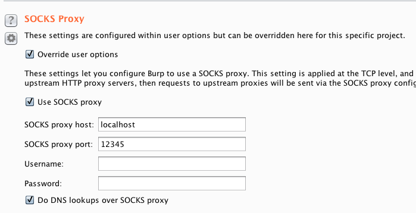

---
author:
  name: Linode
  email: docs@linode.com
description: 'Quick answer to proxy Burp Suite traffic through a Linode.'
keywords: ["burp suite", "burp", "proxy"]
license: '[CC BY-ND 4.0](https://creativecommons.org/licenses/by-nd/4.0)'
modified: 2018-09-06
modified_by:
  name: Linode
published: 2018-09-06
title: 'Proxy Burp Suite Traffic Through a Linode'
---

When testing with [Burp Suite](https://portswigger.net/burp), you may find yourself working in a environment with specific network restrictions. For example, a firewall appliance can interfere with your testing by dropping or modifying packets, resulting in false positives or false negatives.

One workaround is to proxy Burp's traffic through a Linode. Doing this will bypass local network restrictions and pipe everything directly to the internet via Linode's network.

1. [Configure your browser](https://support.portswigger.net/customer/portal/articles/1783055-configuring-your-browser-to-work-with-burp) to work with Burp.

1.  Open an SSH connection to your Linode through port `12345`. Local traffic will be passed to this port to your linode. Keep this terminal window running in the background during your testing.

        ssh -D 12345 root@yourlinodeip

1.  In Burp suite, open the **Project Options** and go to the **Connections** tab.

1.  Make the following changes:

 - Check the box to enable **Override user options**.

 - Enable **Use SOCKS proxy**.

 - In the field labeled **SOCKS proxy host**, enter **localhost**.

 - In the field labeled **SOCKS proxy port**, enter the port number you started the SSH connection to above.

 - Enable **Do DNS lookups over SOCKS proxy**.

    

1.  Now all browser traffic will be forwarded from Burp to your Linode over the SSH connection, then out to the internet. Confirm this by going to [https://whatsmyip.com/](https://whatsmyip.com/) with the browser you configured for Burp. The result should show your Linode's public IP address.