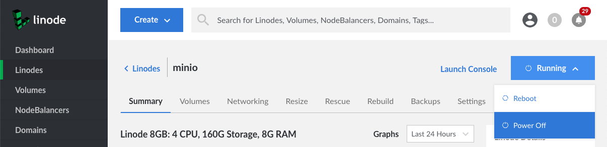

---
author:
  name: Nick Brewer
  email: docs@linode.com
description: 'Change the root user password for the Linux environment running on your Linode.'
keywords: ["linux", "linode", "cloud manager", "image"]
license: '[CC BY-ND 4.0](https://creativecommons.org/licenses/by-nd/4.0)'
modified: 2019-02-11
modified_by:
  name: Linode
published: 2019-02-11
title: Reset the Root Password on your Linode
aliases: ['quick-answers/linode-platform/reset-the-root-password-on-your-linode-new-manager/']
classic_manager_link: quick-answers/linode-platform/reset-the-root-password-on-your-linode-classic-manager/
---

This Quick Answer will show you how to reset the root password for the Linux distribution running on your Linode. See our [Accounts and Passwords](/docs/platform/manager/accounts-and-passwords-new-manager/#resetting-the-root-password) guide for additional information.

1.  Click the **Linodes** link in the sidebar.

1.  Select a Linode to navigate to its detail page.

1.  If the Linode's **Status** menu displays **Offline**, proceed to step 6.

1.  If the Linode's **Status** menu displays **Running**, click on the Status menu.

1.  Then, select the **Power Off** option from the exposed dropdown menu. A progress bar will appear that you can use to monitor the status of this operation.

    

1.  When the Linode is offline, navigate to the Linode's **Settings** tab.

1.  Under Settings, click on **Reset Root Password** to expand that panel.

1.  Select your primary disk from the **Disk** dropdown menu.

1.  Enter a new password for the `root` user in the **Password** field.

1.  Click **Save**

1.  Return to the Linode's **Summary** tab.

1.  Click on the **Status** menu, then select the **Power On** option from the exposed dropdown menu to power on your Linode.
