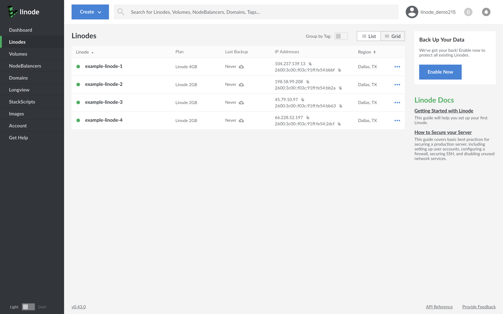
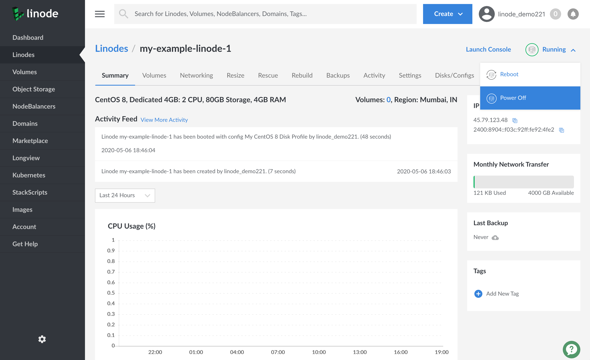
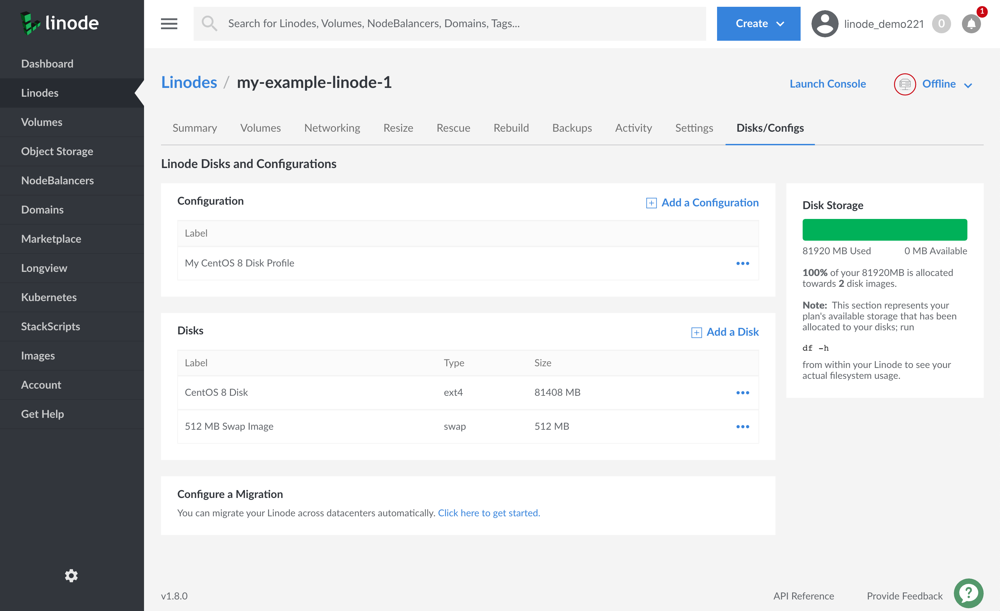
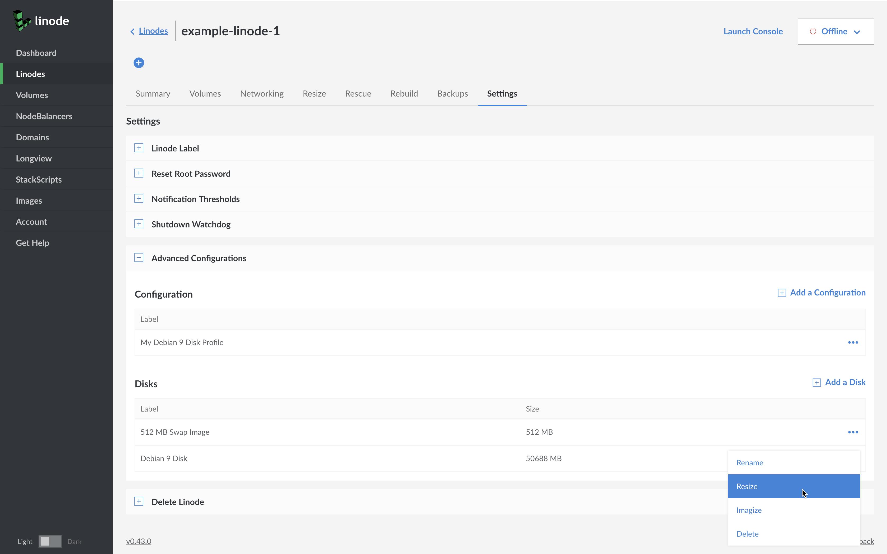
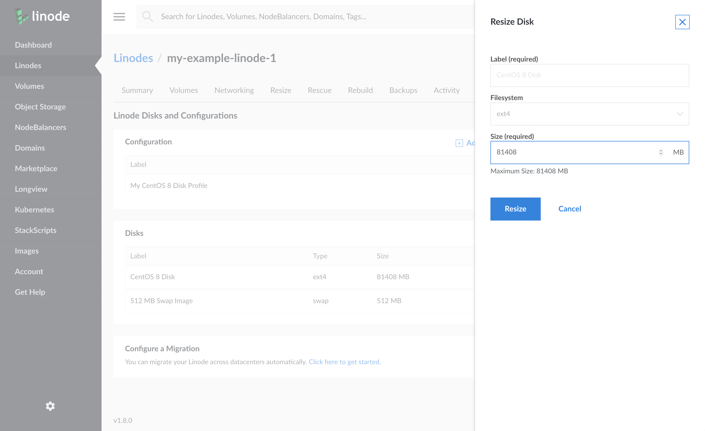

---
author:
  name: Linode Community
  email: docs@linode.com
description: 'Increase or decrease the size of your Linode disk.'
keywords: ["linode", "cloud manager", "disk", "resize"]
license: '[CC BY-ND 4.0](https://creativecommons.org/licenses/by-nd/4.0)'
published: 2018-12-26
modified_by:
  name: Linode
title: "Resize a Linode Disk"
show_on_rss_feed: false
aliases: ['quick-answers/linode-platform/resize-a-linode-disk-new-manager/']
classic_manager_link: quick-answers/linode-platform/resize-a-linode-disk-classic-manager/
---
This Quick Answer will show you how to resize a disk on your Linode. See our [Disks and Configuration Profiles](/docs/platform/disk-images/disk-images-and-configuration-profiles/) guide for additional information.

1. Log in to the [Linode Cloud Manager](https://cloud.linode.com/).

1. Click on the **Linodes** link in the sidebar and then select the Linode to be resized.

    

1. Power off the Linode. Watch the Linode's **Summary** section for confirmation that the Linode has powered off.

    
1. Navigate to the **Settings** tab and open the **Advanced Configurations** panel.

    
1. Under the **Disks** section, find the disk you would like to resize and choose the **Resize** option from the menu.

    

1. In the **Size** field, enter a different size for the disk in megabytes and select **Submit**.

    

1. Watch for confirmation that the disk has been resized.

1. Power on your Linode once the resize is complete.


The Linode Cloud Manager will not allow you to resize your disk to an amount smaller than the space taken up by files on your filesystem. To confirm how much space you're using, issue the `df -h` command on your Linode.
