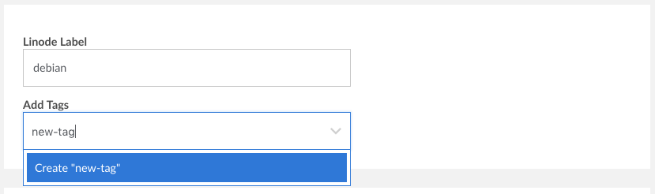
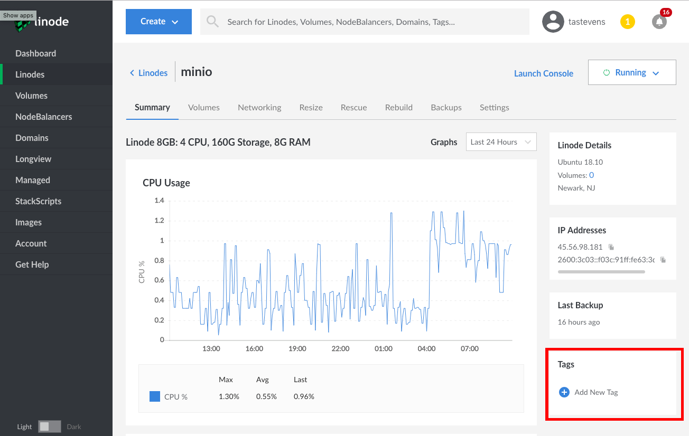
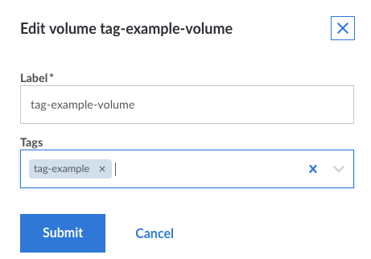
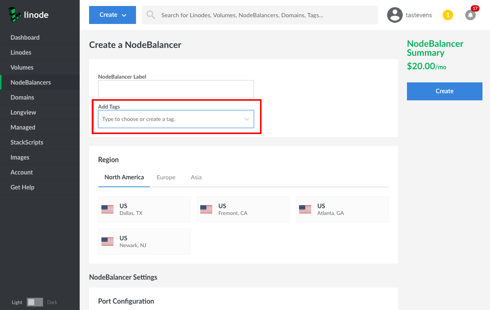
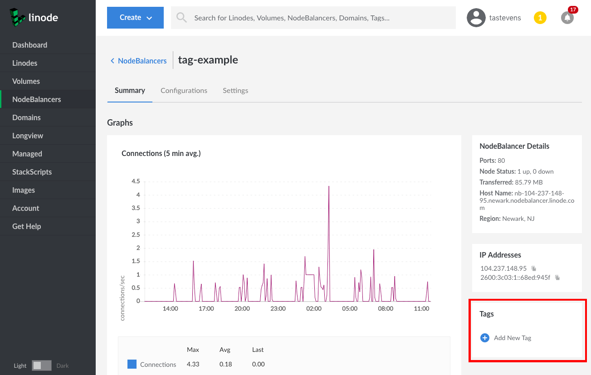
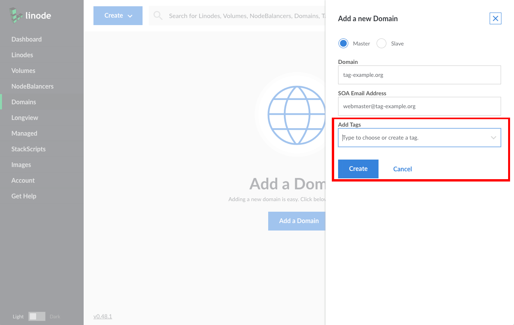
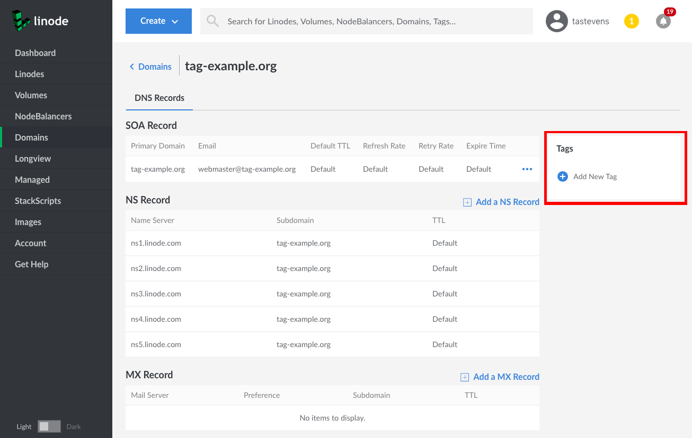
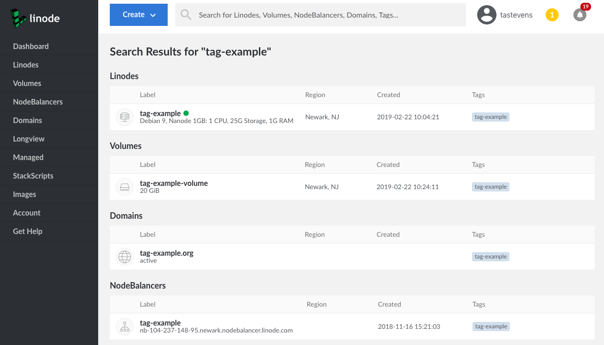

---
author:
  name: Linode Community
  email: docs@linode.com
description: 'How to create tags to organize your Linode services.'
keywords: ['list','of','keywords','and key phrases']
license: '[CC BY-ND 4.0](https://creativecommons.org/licenses/by-nd/4.0)'
published: 2019-02-22
modified: 2019-02-22
modified_by:
  name: Linode
title: "Tags and Groups"
contributor:
  name: Linode
---

Linode's [Cloud Manager](https://cloud.linode.com) and [API](https://developers.linode.com) allow you to create tags to help organize and group your Linode resources. Tags can be applied to Linodes, Block Storage Volumes, NodeBalancers, and Domains.

This guide will show you how to perform the following actions with the Cloud Manager:

-   Create and apply tags to your Linode resources
-   Search and group your Linode resources by tag
-   Import tags from the Classic Manager

## Tagging a Linode

### Tag a Linode at Creation

To tag a Linode at the time of its creation:

1.  In the Linode creation form, click the dropdown menu labeled **Add Tags** under the Linode Label field.

1.  Select one or more tags from the menu. Or, type in a new tag name and click the **Create "new-tag"** option that appears:

    

1.  Your tag will be applied when you finish creating the Linode.

### Tag an Existing Linode

To tag an existing Linode:

1.  Navigate to the Linode's details page.

1.  Click on the **Summary** tab.

1.  Locate the **Tags** box and click on the **Add New Tag** option.

1.  Select one or more tags from the dropdown menu that appears. Or, type in a new tag name and click the **Create "new-tag"** option that appears:

    

### Remove a Tag from a Linode

To remove a tag from a Linode:

1.  Navigate to the Linode's details page.

1.  Click on the **Summary** tab.

1.  Locate the **Tags** box. A list of your tags for the Linode will be displayed.

1.  Click on the **X** icon attached to the tag you would like to remove from your Linode.

## Tagging a Volume

### Tag a Volume at Creation

To tag a Volume at the time of its creation:

1.  In the Volume creation form, select the dropdown menu labeled **Tags**.

1.  Select one or more tags from the menu. Or, type in a new tag and click the **Create "new-tag"** option that appears.

    

1.  Once you are done configuring the Volume, click **Submit**.

### Tag an Existing Volume

To tag an existing Volume:

1.  Navigate to the Volumes page of the Cloud Manager.

1.  Select the ellipsis icon (three dot icon) corresponding to the Volume you would like to tag.

1.  Select **Edit Volume** from the menu that appears.

1.  The **Edit volume** form will appear. Click on the dropdown menu labeled **Tags**.

1.  Select one or more tags from the form. Or, type in a new tag and click the **Create "new-tag"** option that appears.

1.  When you are done, click **Submit**:

    

### Remove a Tag from a Volume

To remove a tag from a Volume:

1.  Navigate to the Volumes page of the Cloud Manager.

1.  Select the ellipsis icon (three dot icon) corresponding to the Volume you would like to tag.

1.  Select **Edit Volume** from the menu that appears.

1.  The **Edit volume** form will appear. A list of your tags for the Volume will be displayed in the **Tags** field.

1.  Click on the **X** icon attached to the tag you would like to remove from your Volume.

## Tagging a NodeBalancer

### Tag a NodeBalancer at Creation

To tag a NodeBalancer at the time of its creation:

1.  In the NodeBalancer creation form, click the dropdown menu labeled **Add Tags** under the NodeBalancer Label field.

1.  Select one or more tags from the menu. Or, type in a new tag and click the **Create "new-tag"** option that appears.

    

### Tag an Existing NodeBalancer

To tag an existing Linode:

1.  Navigate to the NodeBalancer's details page.

1.  Click on the **Summary** tab.

1.  Locate the **Tags** box and click on the **Add New Tag** option.

1.  Select one or more tags from the dropdown menu that appears. Or, type in a new tag name and click the **Create "new-tag"** option that appears:

    

### Remove a Tag from a NodeBalancer

To remove a tag from a NodeBalancer:

1.  Navigate to the NodeBalancer's details page.

1.  Click on the **Summary** tab.

1.  Locate the **Tags** box. A list of your tags for the NodeBalancer will be displayed.

1.  Click on the **X** icon attached to the tag you would like to remove from your NodeBalancer.

## Tagging a Domain

### Tag a Domain at Creation

To tag a domain at at the time of its creation:

1.  In the domain creation form, click the dropdown menu labeled **Add Tags**.

1.  Select one or more tags from the menu. Or, type in a new tag name and click the **Create "new-tag"** option that appears:

    

### Tag an Existing Domain

To tag an existing domain:

1.  Navigate to the domain's details page.

1.  Click on the **DNS Records** tab.

1.  Locate the box labeled **Tags** and click on the **Add New Tag** option.

1.  Select one or more tags from the dropdown menu that appears. Or, type in a new tag name and click the **Create "new-tag"** option that appears:

    

### Remove a Tag from a Domain

To remove a tag from a domain:

1.  Navigate to the domain's details page.

1.  Click on the **DNS Records** tab.

1.  Locate the **Tags** box. A list of your tags for the Domain will be displayed.

1.  Click on the **X** icon attached to the tag you would like to remove from your domain.

## Grouping by Tag

When viewing the Linodes, Volumes, NodeBalancers, and Domains pages, you are able to group the resources listed on those pages by tag. To group by tag, toggle the **Group by Tag** switch at the top of the each page:

## Searching by Tag

You can search your Linode resources by a tag's name:

1.  Type the tag name into the search bar at the top of the Cloud Manager and the results will be populated in a dropdown list that appears:

    

1.  To see a more organized view of your tagged resources, click on the blue **View search results page** banner inside the dropdown list, or hit the Enter key on your keyboard. You will be taken to the search results page:

    

1.  A second way to search by tag is to click on a tag wherever it appears in the Cloud Manager. For example, if you previously applied a tag named `tag-example` to one of your Linodes, clicking on that tag where it is displayed in the Linode's details page will take you to the search results page for `tag-example`.

## Importing Groups as Tags

If you have used the Display Groups feature in the Classic Manager, you can import your Display Groups to the Cloud Manager as tags:

1.  Navigate to the **Account** page in the sidebar menu, then click on the **Settings** tab.

1.  Expand the panel labeled **Import Display Groups as Tags** and then click **Import Display Groups**:

    

1.  A form will appear that lists your Display Groups and asks you to confirm the import action. To proceed, click the **Import Display Groups Now** button in this form.

    
Importing your Display Groups is a **one-time** operation. If you don't have any Display Groups configured in the Classic Manager this feature will not appear in the Cloud Manager.
