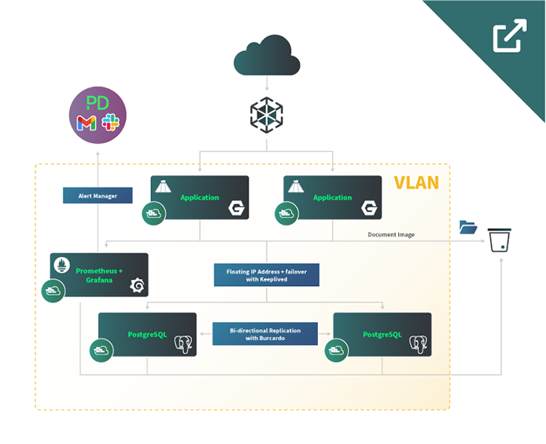

## Abstract

This reference architecture provides guidance on IaaS primitives, open source software, and architecture design, in order to implement a highly-available and production ready cloud-based document management system.

This deployment is using the [Mayan Electronic Document Management System](https://mayan-edms.com/) (EDMS) – an open source web application for document collaboration, tamper proof signing, transformations, and more. Mayan EDMS also comes with a REST API for integrations with 3rd party software. For this example, we are using the recommended [Docker Compose installation](https://docs.mayan-edms.com/chapters/docker/install_docker_compose.html#docker-compose-install), which the Mayan EDMS project recommends for most cases, with two exceptions. This architecture decouples the [PostgreSQL](https://www.postgresql.org/) database layer to achieve separation of concerns and architect for high availability; and employs [NGINX](https://www.nginx.com/) as reverse proxies to the application, using [Certbot](https://certbot.eff.org/) with the [dns_linode plugin](https://certbot-dns-linode.readthedocs.io/en/stable/) for SSL/TLS certificate management. [Unison](https://www.cis.upenn.edu/~bcpierce/unison/) provides bi-directional synchronization of the Let’s Encrypt directories so that both application nodes contain the same certificate and private key. Unison also synchronizes the Docker volume directories between the two instances.

A [NodeBalancer](/docs/products/networking/nodebalancers/) is configured with the TCP protocol to pass traffic through to the backend servers for SSL/TLS termination, and with Proxy Protocol V1 so that NGINX can log the originating client IP addresses. Linode S3-compatible [Object Storage](/docs/products/storage/object-storage/) is the storage backend for Mayan EDNS documents, as well as for routine database backups.

All nodes are secured with [Cloud Firewalls](/docs/products/networking/cloud-firewall/) for protection from the outside world, and communicate internally via private [VLAN](/docs/products/networking/vlans/). The application servers connect to the databases via a shared floating VLAN IP address, with [Keepalived](/docs/guides/ip-failover-legacy-keepalived/) to facilitate failover.

The PostgreSQL databases are implemented as an active-active cluster, using [Bucardo](https://bucardo.org/Bucardo/) for bi-directional replication. A backup script dumps the Mayan database, compresses the dump file, and then leverages [Rclone](https://rclone.org/) to upload the timestamped archive to the Object Storage bucket.

[Prometheus](https://prometheus.io/) is used to collect metrics for infrastructure performance monitoring and alerting. [Grafana](https://grafana.com/) provides rich visualization of the Prometheus data.

## Technologies Used

- [Mayan EDMS](https://mayan-edms.com/)
- [PostgreSQL 14](https://www.postgresql.org/)
- [Bucardo](https://bucardo.org/Bucardo/)
- [Keepalived](/docs/guides/ip-failover-legacy-keepalived/)
- [Prometheus](https://prometheus.io/)
- [Grafana](https://grafana.com/)
- [NGINX](https://www.nginx.com/)
- [Certbot](https://certbot.eff.org/) with the [dns_linode plugin](https://certbot-dns-linode.readthedocs.io/en/stable/)
- [Unison](https://www.cis.upenn.edu/~bcpierce/unison/)
- [Rclone](https://rclone.org/)
- **Linode Services**:
    - [Compute](/docs/products/compute/)
    - [Object Storage](/docs/products/storage/object-storage/)
    - [VLAN](/docs/products/networking/vlans/)
    - [NodeBalancer](/docs/products/networking/nodebalancers/)
    - [DNS Manager](/docs/products/networking/dns-manager/)
    - [API](/docs/api/)

## Business Benefits

- Web-based application – no software to install on end user devices
- Security, privacy, and total control of your data
- Easy integration with third-party software
- Automation of document workflows for business processes

## Diagrams

