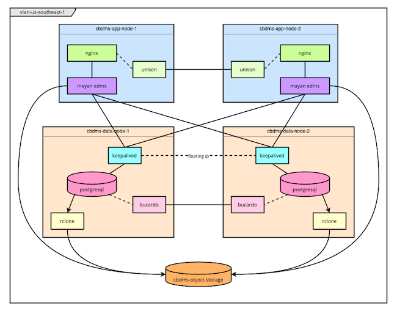
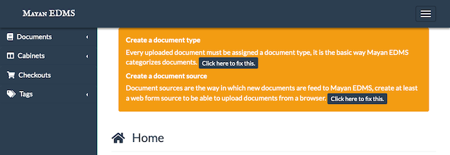
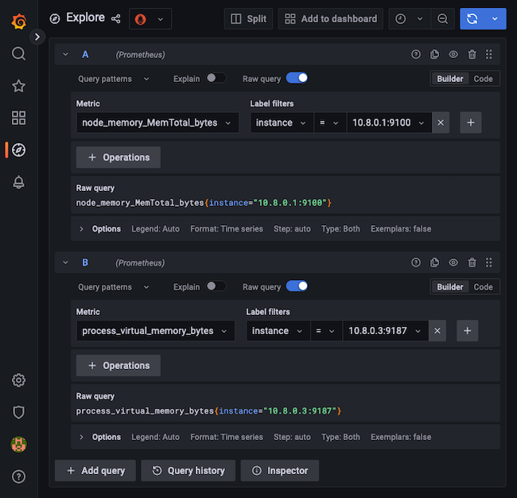
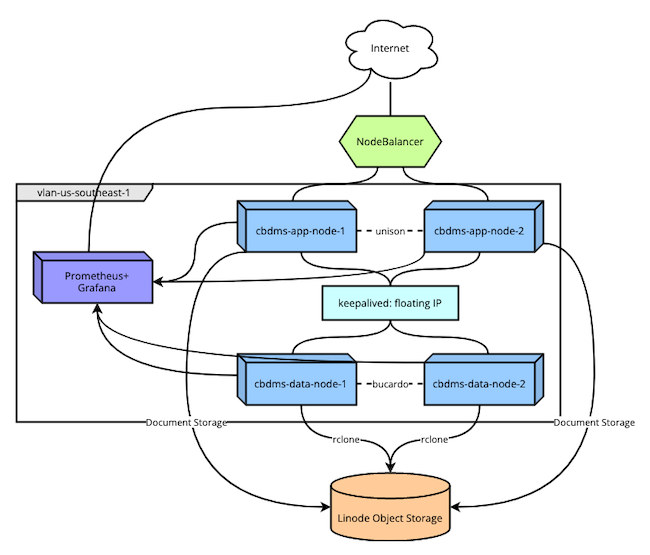
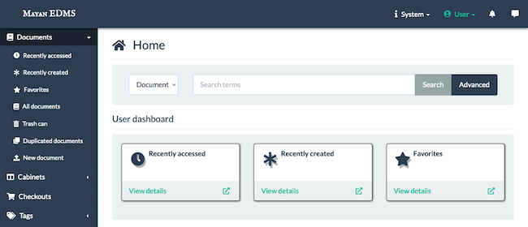

When you want to host your own document management system, it's important to have a solution that can handle your throughput and storage needs. An efficient architecture for a cloud-based document management system can provide both the scalability and high-availability you need.

This tutorial provides in-depth instructions for deploying a cloud-based document management system based on our own architecture. It ensures a robust system, using Terraform for infrastructure management and Linode's Cloud Firewall and VLAN services for security and network efficiency. The architecture also leverages the Mayan *Electronic Document Management System* (EDMS), a powerful open source tool for document management.

Follow along to fully provision your own production-ready and highly available document management system.

## Why a Cloud-based Document Management System

Numerous cloud EDMS services exist to handle document management. However, these may not meet your individual needs, especially as your number of documents increases. Implementing your own cloud-based document management system can provide a solution more fit to your particular needs. The architecture for a cloud-based document management system outlined here aims to be a strong base for that. The result is a highly available system that leverages technologies like Linode's Cloud Firewall and VLANs to ensure secure and efficient communication between nodes.

The best way to learn more about the architecture and what it offers is our overview documentation for [Redundant Cross-Datacenter Applications](/docs/reference-architecture/redundant-cross-datacenter-applications/). You may also be interested in reading our blog post, [Highly Available Mayan EDMS Reference Architecture](https://www.linode.com/blog/databases/deploy-a-cloud-based-electronic-document-management-system/).

## How to Provision a Cloud-based Document Management System

The next several sections walk you through an example process for implementing your own cloud-based document management system following our reference architecture.

This architecture requires deployment of several parallel nodes. In order to make the process less redundant and easier to maintain, this tutorial uses a Terraform script for the majority of the nodes.

### Setting Up the Prerequisites

Before you get started provisioning the architecture, you need to prepare the following:

-   A personal access token for the Linode API in order to run the Terraform script used in this tutorial. You can follow our [Get an API Access Token](/docs/products/tools/linode-api/guides/get-access-token/) guide to generate a personal access token. Be sure to give the token "Read/Write" permissions.

-   This tutorial uses [Terraform](https://www.terraform.io/) for provisioning instances, and you need to install Terraform to follow along. Terraform automates the process of provisioning infrastructure, making it an excellent solution when you need to deploy multiple similar nodes simultaneously.

    Install Terraform by following the [official installation guide](https://learn.hashicorp.com/tutorials/terraform/install-cli). This sets you up with the Terraform command line interface (CLI).

    You can learn more about using Terraform, particularly for provisioning Linode instances, in our [Beginner's Guide to Terraform](/docs/guides/beginners-guide-to-terraform/).

-   A domain name set up for use with your cloud-based document management system. Linode does not provide domain names, but Linode does employ DNS servers. These allow you to manage your domain name within the Linode Cloud Manager. More importantly for this tutorial, using Linode's DNS servers allows for the Certbot `dns_linode` plugin. This automates the process of procuring SSL certificates, which allows the Terraform process to completely handle the SSL setup.

    Once you have a domain name, you should configure Linode as its DNS name server. Then add that domain to your Linode Cloud Manager via the **Domains** option.

    Learn more about this process through our guide [DNS Manager - Get Started](/docs/products/networking/dns-manager/get-started/) and our other [DNS Manager guides](/docs/products/networking/dns-manager/guides/).

-   The Terraform script handles creation of a Linode Object Storage bucket. However, the script needs an access key to do so. Follow our guide on how to [Manage Access Keys](/docs/products/storage/object-storage/guides/access-keys/#create-an-access-key) for steps to create an access key for your Linode Object Storage. Keep in mind that you need both the **Access Key** and the **Secret Key** for the Terraform script.

### Application and Database Nodes

Both the application and database nodes can be deployed using Terraform. Terraform automates infrastructure deployment, and it can be a boon for projects like this, where you need to deploy multiple similar nodes.

This tutorial includes a full Terraform script. With a little customization, the script deploys two application nodes and two database nodes ready for use in a cloud-based document management system. The script also handles the setup of a Linode Object Storage bucket.

The included Terraform script can be a little daunting to approach blindly. Therefore, this tutorial covers it in two sections. The first provides a series of steps for executing the Terraform script. The second provides a breakdown of the script, which helps you navigate the script's actions should you want to customize them later.

#### Executing the Terraform Script

With these steps, the Terraform script deploys the application nodes, database nodes, and object storage bucket for your cloud-based document management system.


The configurations and commands used in this guide add multiple Linode instances to your account. Be sure to monitor your account closely in the Linode Cloud Manager to avoid unwanted charges.


1.  Download the Terraform package for this tutorial, which you can find [here](cbdms-terraform.zip).

1.  Unzip the package into your desired directory. The package contains a directory, `cbdms-terraform`, and the tutorial assumes you have unzipped the package in the current user's home directory. That should give you a `~/cbdc-terraform` directory.

    
On Linux systems, you may need to install `unzip` in order to unzip the package.
    

1.  Change into the unzipped `cbdms-terraform` directory:

    ```command
    cd ~/cbdms-terraform
    ```

    The remainder of these steps assume you are working in this directory.

1.  Open the `terraform.tfvars` file, and replace the capitalized placeholder values with your own.

    -   `LINODE_API_TOKEN` should be your Linode API access token, as discussed in the section above on prerequisites.

    -  `OBJECT_STORAGE_KEY` and `OBJECT_STORAGE_SECRET` should be the access key and your secret key, respectively, for your Linode Object Storage instance, as discussed in the section above on prerequisites.

    -   `NODE_ROOT_PASSWORD` should be the root password you intend to use for the nodes in the infrastructure.

    -   `DOMAIN_NAME` should be the domain name to be used for accessing the application, as set up in the previous section.

    -   `WEBMASTER_EMAIL_ADDRESS` should be the email address to be associated with the application. Specifically, this email address is used for registering an SSL certificate.

    
    Sensitive infrastructure data, such as passwords and tokens, are visible in plain text within the `terraform.tfvars` file. Review [Secrets Management with Terraform](/docs/applications/configuration-management/secrets-management-with-terraform/#how-to-manage-your-state-file) for guidance on how to secure these secrets.
    

1.  The Terraform script assumes that you have an SSH public key file stored at `~/.ssh/id_rsa.pub`. If this is not the case, add an `ssh_key` field to the `terraform.tfvars` file, and give it a string value designating the location of your SSH public key.

    For instance, include a line like the following if your public key file is stored in the current user's home directory:

    ```file {title="terraform.tfvars"}
    ssh_key = "~/id_rsa.pub"
    ```

    Learn more about SSH public keys in our tutorial [How to Use SSH Public Key Authentication](/docs/guides/use-public-key-authentication-with-ssh/)

1.  Initialize the Terraform project. Doing so has Terraform download the necessary provisions for deploying the infrastructure.

    ```command
    terraform init
    ```

1.  First, use the `plan` command to view an outline of the resources to be provisioned beforehand, essentially making a dry run:

    ```command
    terraform plan
    ```

1.  Use the Terraform CLI to apply the script, deploying all of the designated nodes. Before Terraform performs the deployment, it provides the outline from `plan` and asks you to confirm.

    ```command
    terraform apply
    ```

Once the script starts, it may take several minutes to finish. During that time, you should keep an eye on the output to ensure no errors arise during the provisioning process.

If at any point you want to remove the provisioned instances, you can use the Terraform CLI to efficiently do so. Just use the following command from within the Terraform project's directory:

```command
terraform destroy
```

#### Explanation of the Terraform Script

The Terraform script deployed in this tutorial uses Linode's Terraform provider to create a series of Linode instances. Specifically, the script creates two application nodes, two database nodes, and an object storage bucket.

Here is a brief outline of the script's process. Further on, you can find a diagram of the resulting infrastructure.

1.  First, the Terraform script adds a new bucket to your Linode Object Storage instance. This particular bucket gets used by Mayan EDMS for storing documents, and is also where `rclone` delivers PostgreSQL database backups.

1.  The Terraform script deploys two nodes for running the PostgreSQL databases, which act as the backends for the Mayan EDMS application. Terraform creates the nodes and subsequently delivers the configuration and script files to be used in setting up the nodes.

1.  Terraform executes one of the delivered scripts on each node. Located at `scripts/cbdms-data-node.sh`, the in-code comments walk you through its various actions.

    Essentially, the script configures the initial PostgreSQL users and databases, PostgreSQL connectivity, `keepalived`, and `rclone`. Along with these, the script also installs a Prometheus exporter for observing the PostgreSQL instance.

1.  The Terraform script deploys two nodes for running the Mayan EDMS application. Terraform creates each node and delivers a series of configuration files along with a script file.

1.  Terraform then executes the delivered script file. You can find the script at `scripts/cbdms-app-node.sh` within the Terraform directory, and follow along with its in-code comments.

    The script installs Mayan EDMS via Docker Compose, performing all of the initial setup. It likewise installs and configures NGINX as a proxy to Mayan EDMS and sets up SSL certification with Certbot. The script sets up Unison to synchronize the certificate files between the two instances. Finally, it also installs a Prometheus `node_exporter` to observe the instance.

1.  After all other resources have been deployed, Terraform executes another script on the first of the database nodes. This script handles the installation and setup of Bucardo for bi-directional replication between the two PostgreSQL databases.

By the end, you should have a deployed infrastructure like the one in the diagram here.

[](cbdms-infrastructure-terraform.png)

The number of application and database nodes deployed can be controlled via the `node_count` variable. However, this would require some adjustments to the various shell scripts deployed by Terraform.

Linode's Terraform provider also has the ability to provision the architecture's NodeBalancer. But the NodeBalancer is a single unit and can be entirely managed from within the Linode Cloud Manager. Thus, the tutorial instead covers manual deployment of the NodeBalancer for better demonstration.

The same is the case for the Prometheus-Grafana instance. Only one such instance is needed, and the Linode Marketplace provides the cleanest and most straightforward path for deploying it.

### Completing Mayan EDMS Set Up

In some cases, the Mayan EDMS may require a few more steps before it is fully ready to use. The process for this architecture decouples Mayan from its default, local PostgreSQL instance. Instead, Mayan is set up to use PostgreSQL on dedicated nodes. Doing so may cause an interruption to the Mayan setup process, which requires these additional steps to complete the setup.

To check whether you need to take these steps, navigate to one of your Mayan EDMS instances in a web browser. For instance, if your first application node has the remote IP address `192.0.2.0`, you can navigate to `https://192.0.2.0` in your browser. You may have to bypass a browser warning for HTTPS.

If you are prompted with credentials for an automatically generated administrator user, you do not need to complete the steps in this section. In this case, your Mayan EDMS process completed successfully.

Otherwise, follow the steps given below. Since there is bi-directional replication on the Postgres databases, you only need to complete these steps on one of the Mayan EDMS instances. These steps create an initial administrator user for your Mayan instances and add a default document type and source.

1.  Access the shell as a root user on one of your application nodes. You can do this either through SSH using the node's IP address or through the Linode Shell (Lish) console in the Linode Cloud Manager.

    -   For SSH, see our guide on [Connection to a Remote Server Over SSH](/docs/guides/connect-to-server-over-ssh/).

    -   For the Lish console, see our guide [Access Your System Console Using Lish](/docs/guides/lish/).

1.  Once logged in as root, execute the following command:

    ```command {title="Application Node"}
    docker exec -ti mayan-app-1 /opt/mayan-edms/bin/mayan-edms.py createsuperuser
    ```

    The command accesses the Docker container for Mayan and executes a dedicated script that Mayan has for creating an administrator user. The script prompts you to create a username and password for this user.

    ```output
    Username (leave blank to use 'root'): admin
    Email:
    Password:
    Password (again):
    Superuser created successfully.
    ```

1.  Access the Mayan EDMS interface through your web browser. You may be able to do this by navigating to the application node's the IP address using HTTPS. For instance, if your application node has the remote IP address `192.0.2.0`, navigate to `https://192.0.2.0`.

    However, if you are unable to access the interface by that means, you should wait to do so until after completing further steps below. Specifically, wait to access the interface until after deploying a NodeBalancer and setting up your domain name.

1.  Click the **Click here to fix this** button beneath the *Create a document type* heading at the top of the page to add a document type. The default document type is typically "Default", but you should add whatever document type or types makes sense for your needs.

1.  Click the **Click here to fix this** button beneath the *Create a document source* heading at the top of the page to add a document source. At the least, you should add a document source with the *Web form* option. This lets you add documents via the Mayan interface. Feel free to add whatever other document sources you intend to use.

    [](mayan-add-defaults.png)

### Prometheus and Grafana

This architecture uses Prometheus for collecting metrics about the Mayan nodes and PostgreSQL databases. It then uses Grafana for visualizing and consuming those metrics.

Prometheus and Grafana get their own node in the architecture. Deploying that node is a straightforward process through the Linode Marketplace.

1.  Follow our guide on [Deploying Prometheus and Grafana through the Linode Marketplace](/docs/products/tools/marketplace/guides/prometheus-grafana/) to get your Prometheus-Grafana node up and running.

    Be sure, when creating the instance, to add the VLAN created during the Terraform process. This VLAN should have a name like `vlan-us-southeast-1`. If you changed the region for the Terraform script, replace `us-southeast` in this example with the region you selected.

    You also need to add an IPAM address associated with the VLAN interface. The address you give needs to match the netmask for the IPAM addresses of the other nodes. This tutorial uses an IPAM address of `10.8.0.11/24` for the Prometheus-Grafana node.

    The optional **Limited User** and **Custom Domain** fields are not required for this tutorial.

1.  At this point, you should have a node with Prometheus and Grafana running, and with Prometheus added as a data source to the Grafana instance.

1.  Access the shell on your Prometheus-Grafana node. You can do so through SSH or through the Lish console in the Linode Cloud Manager. Guides on each method are linked in the section above on completing the Mayan EDMS setup.

1.  Using your preferred text editor, open the Prometheus configuration file, located at `/etc/prometheus/prometheus.yml`.

1.  Add the following lines to the end of the configuration file. Make sure that the spaces line up with the `- job_name: local_prometheus` block.

    ```file {title="/etc/prometheus/prometheus.yml" lang="yml"}
      - job_name: node
        static_configs:
        - targets: ['10.8.0.1:9100','10.8.0.2:9100']
      - job_name: postgres_exporter
        static_configs:
        - targets: ['10.8.0.3:9187','10.8.0.4:9187']
    ```

    These two blocks tell Prometheus to listen at the given addresses for the exporters installed on each of the application and database nodes. The exporters themselves, installed during the Terraform process, provide metrics that Prometheus can consume.

1.  You can now start building dashboards in Grafana using the metrics collected in Prometheus. Open the Grafana web interface as shown in the guide linked above, and use the **Explore** menu to create queries.

    Most of the metrics gathered by this Prometheus instance should have names like `node_*` and `pg_*`.

    [](grafana-explore.png)

1.  To jump start your view of the metrics, you can import pre-made Grafana dashboards. You can do this by navigating to the **Dashboard** option on the left-hand menu and selecting **Import**. There, enter the dashboard's ID and click the **Load** button.

    Here are a couple of options to get you started:

    -   For node monitoring, you can use [this dashboard](https://grafana.com/grafana/dashboards/1860) with ID `1860`.

    -   For PostgreSQL monitoring, you can use [this dashboard](https://grafana.com/grafana/dashboards/9628) with ID `9628`.

### NodeBalancer

The process for provisioning a Linode NodeBalancer instance can be managed entirely from within the Linode Cloud Manager. Follow along with our [Create a NodeBalancer](/docs/products/networking/nodebalancers/guides/create/) guide to set up your NodeBalancer.

Give your NodeBalancer the following settings:

-   Use `443` for the **Port** field, and select *TCP* as the **Protocol**. This has the NodeBalancer listen for traffic on the HTTPS port, but route that traffic through to the nodes using the TCP protocol. Leave **Proxy Protocol** as *None*.

-   Add two **Backend Nodes**, one for each application node created by the Terraform script. Give each node a descriptive label, like `cbdms-app-node-1`, and select the node's **IP Address** from the dropdown. Then enter `443` for the **Port** and `50` for the **Weight**.

Any other configuration options you can leave at their defaults or adjust as you desire.

### Domain Name

With your NodeBalancer established, you can have the Linode DNS name servers point your domain at it. The two application nodes were granted SSL certificates under the domain name. The NodeBalancer proxies requests for the domain to the nodes, where the SSL certification resides.

To complete this setup, you need to add an **A/AAAA** record for the domain name, with the record pointing to the IP address of the NodeBalancer. Follow our guide on how to [Manage DNS Records](/docs/products/networking/dns-manager/guides/manage-dns-records/#add-or-edit-a-dns-record) for steps to do so. You need to have your domain name set up in the Linode Cloud Manager, as indicated towards the beginning of this tutorial.

You can learn more about DNS records through our guide [Overview of DNS and DNS Records](/docs/guides/dns-overview/#a-and-aaaa).

### Cloud Firewalls

The Linode Cloud Firewall provides an easy-to-implement and robust firewall that you can attach to your Linode instances via the Cloud Manager. You can learn more about Linode Cloud Firewalls in our [selection of guides](/docs/products/networking/cloud-firewall/guides/) on the topic.

The cloud-based document management system architecture employs a Cloud Firewall on each node. Most of the nodes' communications between each other take place over the VLAN. Combining this with the Cloud Firewall for public Internet connections can give your system a potent security setup.

This tutorial uses three firewalls. The first covers the two application nodes, the second covers the two database nodes, and the third covers the Prometheus-Grafana node. The following steps walk you through creating them.

1.  Access the **Firewalls** page from the left-hand menu of the Linode Cloud Manager.

1.  Using the **Create Firewall** option, create each of the three firewalls. Enter a label for each, and for each select the nodes to be associated with the firewall. This tutorial names them `cbdms-app-firewall`, `cbdms-database-firewall`, and `cbdms-prometheus-firewall`.

1.  Access each of the new firewalls, and configure them with the rules described below.

    All three firewalls should have the following configured under **Rules**:

    -   **Default inbound policy** set to *Drop*, and the **Default outbound policy** set to *Accept*.

    -   An inbound rule to accept TCP connections on the SSH port, *22*.

    The firewall for the application and Prometheus-Graphna nodes should additionally have the following rule:

    -   An inbound rule to accept TCP connections on the HTTPS port, *443*.

Where are the additional rules for the database nodes? All of the databases' inbound connections occur securely over the VLAN, so all these nodes need are outbound connections to send data to object storage.

## How to Use the Cloud-based Document Management System

You should now have a fully operational cloud-based document management system. The complete deployed infrastructure should resemble the diagram shown here.

[](cbdms-infrastructure-complete.png)

To access Mayan EDMS, navigate to the domain name you associated with the NodeBalancer. Then log into Mayan using the administrator username and password provided (or created) earlier. This takes you to the homepage for your Mayan EDMS instance, where you can manage your instance's setup and documents.

[](mayan-home.png)

In summary, here's an overview of everything that goes on behind the scenes for this document management setup:

-   The NodeBalancer routes HTTPS requests to one of the application nodes.

-   NGINX receives a request, applies the SSL certification, and proxies the request to the node's Mayan EDMS instance.

-   Mayan stores things like configuration, users, and other data within the PostgreSQL databases. Its connection to these databases occurs via a floating URL on the VLAN (in this tutorial, `10.8.0.100`). The floating URL is maintained by `keepalived` configured for failover.

-   Mayan stores its documents in a Linode Object Storage bucket created for that purpose.

-   The PostgreSQL databases are kept in sync via bi-directional replication configured through Bucardo.

-   PostgreSQL periodically creates a backup of its Mayan database records. A service then uploads the these backups to the Linode Object Storage bucket.

## Conclusion

With this tutorial, you can have an entire production-ready implementation of our architecture for a cloud-based document management system. Throughout, it outlines how the various parts fit together, all with the goal of making things even more readily adaptable. With a little customization, the steps and scripts included here can be used for a wide range of needs.