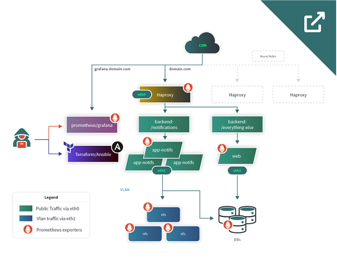

## Abstract
This reference architecture demonstrates how developers can horizontally scale their infrastructure using [Terraform](https://www.terraform.io/) and [Ansible](https://www.ansible.com/) when certain application performance thresholds are met. They can also observe detailed real-time metrics through the [Grafana](https://grafana.com/) dashboard from [Prometheus](https://prometheus.io/).

In this example, the main bottleneck is the */notifications* endpoint of a mobile app. When the client pushes notifications to the app, many users check the notifications on their devices, which call back to the server. This creates an overwhelming number of requests that can crash the server. This proposed architecture solves several issues by:

- Allowing the application to grow as the target audience increases by having multiple HAProxy nodes
- Establishing monitoring via Prometheus and Grafana
- Separating the main app and the notification callback to the app
- Scaling the app’s notifications section via configuration management tools
- Implementing network segmentation using Linode VLANs
- Adding resiliency to the database for uptime and reliability

## Technologies Used

- [Terraform](https://www.terraform.io/)
- [Ansible](https://www.ansible.com/)
- [Prometheus](https://prometheus.io/)
- [Grafana](https://grafana.com/)
- [HAProxy](http://www.haproxy.org/)

## Business Benefits

- Better user experience through scalability
- Proactive maintenance through observability and monitoring
- A high degree of reliability with no single point of failure
- A portable workload that can be deployed anywhere

## Diagrams

