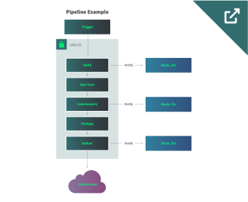
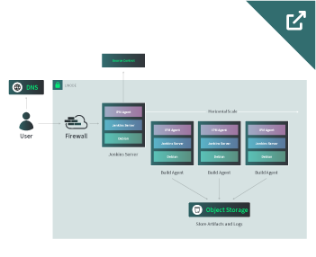

## Abstract

A standard [Jenkins](https://www.jenkins.io/) CI/CD system can be hosted within Linode (or other Cloud hosting providers). The Jenkins server is used to manage the pipelines and agents and host the dashboard for end-users. Depending on the scale and requirements, developers can deploy N-number of build agent servers to handle concurrent processes. This process can be automated using [Terraform](https://www.terraform.io/) to scale build agent servers horizontally.

## Diagrams

## Technologies Used

- [Jenkins](https://www.jenkins.io/)
- [Terraform](https://www.terraform.io/)
- **Linode Services**:
    - [Compute](https://www.linode.com/docs/products/compute/dedicated-cpu/)
    - [Firewall](https://www.linode.com/docs/products/networking/cloud-firewall/)
    - [Object Storage](https://www.linode.com/docs/products/storage/object-storage/)

## Business Benefits

- Reduce costs of large CI/CD deployments
- Granular control of environments
- Improved customizability
- Most control is in the hands of the developers