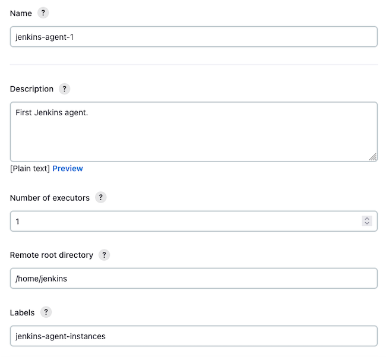
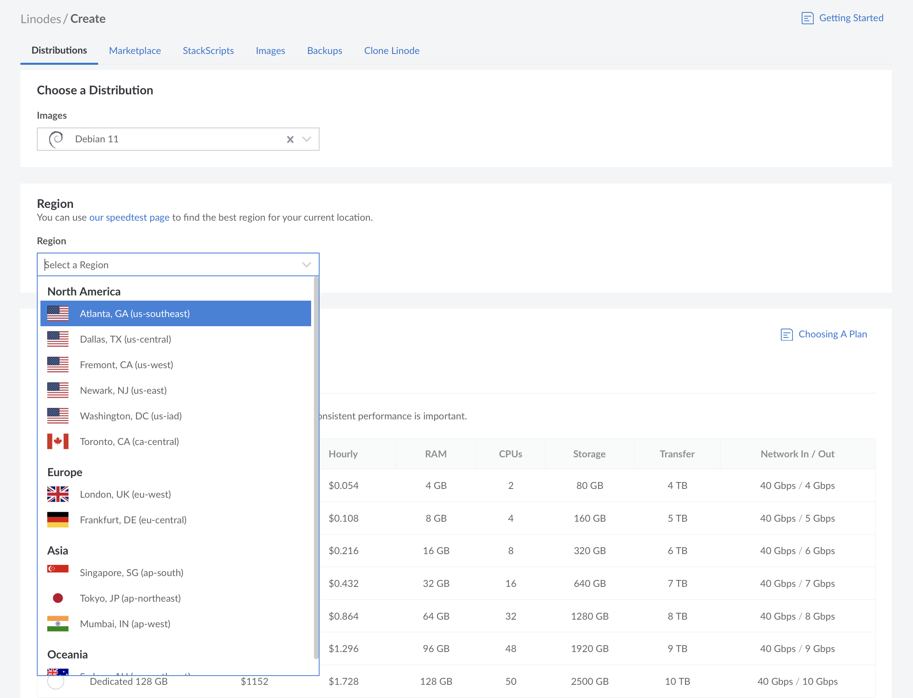
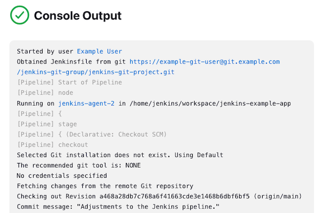
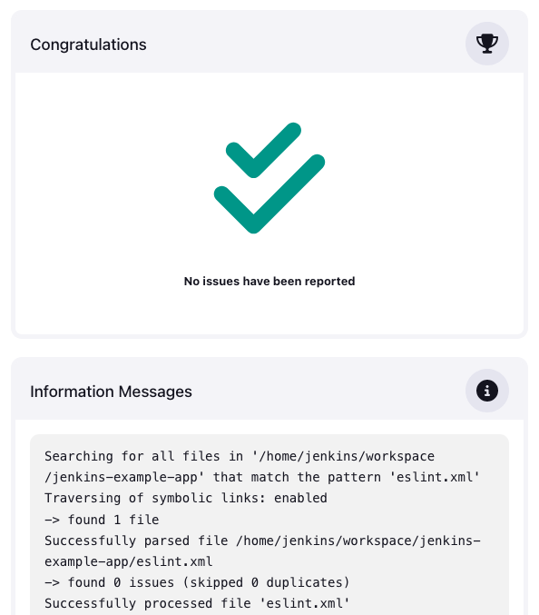
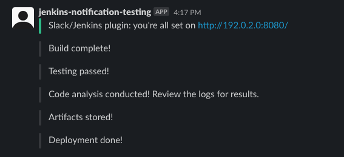

With Jenkins, you can implement a robust continuous integration and continuous delivery (CI/CD) setup for automating application builds, tests, and deployments. Linode's Jenkins CI/CD reference architecture ensures a scalable setup capable of deploying applications to Linode or any of many other hosting providers.

Get started by taking a look at the overview and diagrams for the architecture in our [Jenkins CI/CD on Linode to Any Hyperscaler](/docs/reference-architecture/jenkins-ci-cd-on-linode-to-any-hyperscaler/).

The present tutorial walks you through a complete implementation of our Jenkins CI/CD architecture. Throughout, follow along to provision the base setup and see extensive examples to help you get started using the architecture for your particular needs.

## Before You Begin

1. Create a Linode account, if you don't have one. See the [Getting Started with Linode](/docs/guides/getting-started/) documentation.

1. Create a new Compute Instance, which acts as the primary Jenkins server in this tutorial. See the [Creating a Compute Instance](/docs/guides/creating-a-compute-instance/) guide.

1. Follow our [Setting Up and Securing a Compute Instance](/docs/guides/set-up-and-secure/) guide to update your system. You may also wish to set the timezone, configure your hostname, create a limited user account, and harden SSH access.


This guide is written for a non-root user. Commands that require elevated privileges are prefixed with `sudo`. If you’re not familiar with the `sudo` command, see the [Users and Groups](/docs/guides/linux-users-and-groups/) guide.


## What Is Jenkins?

[Jenkins](https://www.jenkins.io/) is an open-source tool for automating deployments. Jenkins utilizes build pipelines to allow you to define build, test, and deployment processes. Throughout, you have access to shell commands, a dynamic user interface, and an array of plugins.

All this makes Jenkins an exceptional tool for automating CI/CD workflows. Jenkins handles continuous integration through features like Git repository monitoring, where pipelines can be triggered by Git commits. Jenkins' continuous delivery is supported by its ability to pull repositories and build, test and deploy from them.

Further plugins mean that you can adapt Jenkins to your needs — whether using a particular test suite, storing artifacts, or deploying to cloud providers.

Learn more about CI/CD principles in our guide [Introduction to Continuous Integration and Continuous Deployment](/docs/guides/introduction-ci-cd/).

You can also learn more particulars about automating builds with Jenkins through our guide [How to Automate Builds with Jenkins on Ubuntu 22.04](/docs/guides/automate-builds-with-jenkins-on-ubuntu/).

## How to Provision Jenkins for CI/CD

To start using Jenkins for CI/CD, you need at least a Jenkins server. The Jenkins server runs a dashboard from which you can manage and monitor your instance, and the server also orchestrates your Jenkins pipelines.

Jenkins additionally needs build agents to actually implement the steps given in its pipelines. For moderate needs, Jenkins can actually run one or more agents alongside the server, on the same machine. However, this tutorial covers a more robust implementation, with a suite of machines deployed specifically for running Jenkins build agents.

Follow along with this section of the tutorial to get both the Jenkins server and Jenkins build agents running. See how to install and start running the server on your current machine, and how to use Terraform to deploy your build agents automatically.

### Install the Jenkins Server

You need to start by installing Jenkins on a central server. This central Jenkins server then gives you access to the Jenkins dashboard, where you can manage everything from build agents to pipelines to plugins.

1. Log into the Compute Instance you created in the [Before You Begin](#before-you-begin) section.

1. Install Java 11 on this instance. You can do so through the OpenJDK package. For this tutorial, you just need the Java runtime (JRE), not the development kit.

    - On Debian and Ubuntu:

        ```command
        sudo apt install openjdk-11-jre
        ```

    - On CentOS and Fedora:

        ```command
        sudo dnf install java-11-openjdk
        ```

1. Install Jenkins. First, you need to add the Jenkins repository to your system's package manager. Then, after updating the package manager, you can install Jenkins directly from there.

    - On Debian and Ubuntu:

        ```command
        wget -q -O - https://pkg.jenkins.io/debian-stable/jenkins.io.key | sudo apt-key add -
        sudo sh -c 'echo deb http://pkg.jenkins.io/debian-stable binary/ > /etc/apt/sources.list.d/jenkins.list'
        sudo apt update
        sudo apt install jenkins
        ```

    - On CentOS and Fedora:

        ```command
        sudo wget -O /etc/yum.repos.d/jenkins.repo https://pkg.jenkins.io/redhat-stable/jenkins.repo
        sudo rpm --import https://pkg.jenkins.io/redhat-stable/jenkins.io.key
        sudo dnf upgrade
        sudo dnf install jenkins
        sudo systemctl daemon-reload
        ```

1. Start the Jenkins service if it is not already started, and enable the service for system startup.

    ```command
    sudo systemctl start jenkins
    sudo systemctl enable jenkins
    ```

1. In a web browser, navigate to port `8080` on your system's public IP address. You may first need to open the port in your system's firewall, which you can learn how to do from our guide on [securing a Linode Compute instance](/docs/products/compute/compute-instances/guides/set-up-and-secure/#configure-a-firewall).

1. Follow the installation steps you are presented with. Select to **Install suggested plugins**, and complete the form to create an initial administrator user.

At this point, you have a Jenkins server up and running and ready to start using. In fact, the Jenkins server includes a built-in build agent, which you could configure to use for building, testing, and deploying.

### Provision Linode Object Storage

Part of the architecture covered in this tutorial has logs and build artifacts stored on Linode Object Storage. Object Storage provides an efficient and accessible way to backup artifacts from you CI/CD pipelines.

To start, you need to have a Linode Object Storage bucket prepared to store your logs and artifacts. Our [Object Storage - Get Started](/docs/products/storage/object-storage/get-started/) guide to do so.

To follow along with the rest of the guide, perform these steps:

1.  [Provision a Linode Object Storage bucket](/docs/products/storage/object-storage/guides/manage-buckets/#create-a-bucket). When creating the bucket, you need to choose a cluster that it belongs to (under the **Region** menu). Take note of the cluster ID for the cluster you choose, which is displayed next to your **Region** menu selection. For example, if you chose the *Atlanta* region, your cluster ID is `us-southeast-1`.

    The name of the bucket needs to be unique for the cluster it is created in, not only among the buckets on your account, but also among buckets from all other Object Storage users on other accounts.

1.  [Generate an Object Storage access key](/docs/products/storage/object-storage/guides/access-keys/#create-an-access-key). The key should have **Limited Access** permissions. It should have read and write access to the bucket that you created. You need to save both the access key and secret access key for use later.

### Create Jenkins Build Agents

While your Jenkins server is capable of running build pipelines, your setup becomes more scalable when you leverage separate build agents. With the architecture covered in this tutorial, your central Jenkins server is dedicated to managing your CI/CD configurations. Pipeline tasks are then handled by dedicated build agents.

Dedicated agents give you a more scalable setup as well as more adaptability for a wider range of build and deployment needs.

Follow along here to deploy a set of three build agents for the Jenkins server setup above. These steps use [Terraform](https://www.terraform.io/) to deploy the agent instances, making it relatively easy and convenient to horizontally scale your agents.

#### Configure Agents within Jenkins

To start, you need to configure your Jenkins server to enable the agents and facilitate their connections to the server.

1. Open port `8081` on the system running your Jenkins server. Refer to the link above for securing compute instances to see how to open ports on your system.

1. Within Jenkins, enable TCP port usage for agents. To do so, open the Jenkins web interface, and navigate to **Manage Jenkins** > **Configure Global Security**. Under **Agents**, locate the **TCP port for inbound agents** setting, and set it to *Fixed*. Give `8081` as the port.

1. Create each of the agents from within the Jenkins dashboard. For each, navigate to **Manage Jenkins** > **Manage Nodes and Clouds**. Select the **New Node** button, and complete the agent configurations with the settings here.

    This tutorial starts you off with three agents. So to follow along be sure to create three agents using this configuration.

    - **Node name**: `docker-node-agent-1`, `docker-node-agent-2`, and then `docker-node-agent-3`

    - **Type**: *Permanent*

    - **Number of executors**: 1

    - **Remote root directory**: `/home/jenkins`

    - **Labels**: `docker-node-agent-instances`

    - **Usage**: *Use this node as much as possible*

    - **Launch method**: *Launch agent by connecting it to the controller*

    - **Availability**: *Keep this agent online as much as possible*

    The `docker-node` naming can later help to distinguish these agents as ones with Docker and Node.js installed. The label field adds a tag to each agent, providing a convenient way to designate specific sets of agent for executing pipelines.

    [](jenkins-config-agent.png)

1. Disable the built-in agent node. Navigate to **Manage Jenkins** > **Nodes** > **Built-In Node**. Choose **Configure**, and set the **Number of executors** to `0`.

#### Provision Agent Instances

Now you have what you need to support three build agents. This tutorial deploys a Linode Compute instance for each of these build agents, using Terraform to automate the process. This also makes it relatively easy to horizontally scale the number of agents as needed later.


The configurations and commands used in this guide add multiple Linode instances to your account. Be sure to monitor your account closely in the Linode Cloud Manager to avoid unwanted charges.


1. Install Terraform. Follow the relevant section of our [Use Terraform to Provision Linode Environments](/docs/guides/how-to-build-your-infrastructure-using-terraform-and-linode/#install-terraform) guide to do so.

1. Download our Terraform package for deploying Jenkins build agents:

    - [**jenkins-agents-terraform.zip**](jenkins-agents-terraform.zip)

    This includes scripts for deploying a set of Linode Compute instances, each running Ubuntu, Docker, Node.js, and a Jenkins agent service.

1. Extract the package's contents, and change into the resulting directory. You may first need to install the unzip utility, which you can generally do through your system's package manager.

    ```command
    unzip jekins-agents-terraform.zip
    cd jenkins-agents-terraform/
    ```

1. Open the `terraform.tfvars` file, and customize the variables there to your setup. Specifically, you need to provide:

    - A Linode personal access token, which you can learn about in our guide  [Linode API - Get Started](/docs/products/tools/api/get-started/#get-an-access-token)

    - A root password to be used for the deployed instances

    - One or more SSH public keys for SSH access into the instances

    - A number of instances to deploy; this tutorial uses three instances

    - The URL for your Jenkins server, including the protocol and port, as in: `http://<JENKINS_SERVER_IP_ADDRESS>:8080`

    - A list of secrets corresponding to each of your Jenkins agents; these are given after you create each agent within the Jenkins web interface

    - The access and secret keys for your Linode Object Storage instance

    - The cluster ID for your Linode Object Storage instance

    - The ID of the region that the Jenkins agent Compute Instances should be created in. Note that these are not necessarily the same as an Object Storage cluster ID. For example, the region ID for Atlanta is `us-southeast`, while the ID for the Object Storage cluster in Atlanta is `us-southeast-1`. There are several ways to find out what the ID of a region is:

        - Run the `regions list` command of the [Linode CLI](/docs/products/tools/cli/get-started/):

            ```command
            linode-cli regions list
            ```

        - Visit the [Regions List API endpoint](/docs/api/regions/#regions-list):

            ```command
            curl https://api.linode.com/v4/regions
            ```

        - The region IDs are displayed under the **Region** menu of the Create Linode form:

            

1. From within the directory with the `main.tf` file, run the following command to initialize the Terraform project and start deploying the instances.

    ```command
    terraform init
    terraform apply
    ```

This runs the `main.tf` script, which provisions the agents. The script additionally delivers and executes a shell script on each instance, which you can see as `scripts/initial_setup.sh`. That script does most of the set-up work, specifically the following:

- Updates and secures the system, including enabling the firewall

- Installs Docker, Node.js, rclone, and kubectl

- Installs Java 11, and sets up the Jenkins user

- Creates a script for downloading and running the Jenkins agent from the Jenkins server

- Creates and starts up a service to run the Jenkins agent

### Provision a Kubernetes Cluster on a Hyperscaler

The architecture covered here aims to use Jenkins to build an application and deploy it to a hyperscaler. To follow through with the examples provided here, you should thus have a target cloud you want your application deployed to.

Because this tutorial builds its example application into a Docker image, it makes sense to deploy the application to a Kubernetes cluster. This is what the example pipeline and Jenkins configuration in the rest of this tutorial do.

You can follow along with the tutorial by deploying a Linode Kubernetes Engine (LKE) cluster. Learn how in our [Linode Kubernetes Engine - Get Started](/docs/products/compute/kubernetes/get-started/).

However, the "Deploy" step in the pipeline elaborated below uses kubectl. This means that the setup can readily be adapted to deployments for almost any cloud Kubernetes provider.

And in fact you can adapt the commands in the "Deploy" portion of the pipeline for deployments to whatever cloud platform you need. Whatever you would normally use to script the deployment you can implement here. Or you could leverage one of the plugins you can find within the Jenkins dashboard, which you can see examples of further on.

#### Prepare a Docker Registry

Because this tutorial uses Kubernetes for its deployment, you need to have a Docker registry. This allows you to push built Docker images from the Jenkins agents and pull them onto the Kubernetes cluster.

The easiest solution here is [Docker Hub](https://hub.docker.com/), where you can add images after registering an account. Learn more, with a full-functioning example, in our guide [Create and Deploy a Docker Container Image to a Kubernetes Cluster](/docs/guides/deploy-container-image-to-kubernetes/).

You can also self-host a registry solution. One such solution is [Harbor](https://goharbor.io/), and you can deploy your own Harbor server readily through the Linode Marketplace. See our guide [Deploy Harbor through the Linode Marketplace](/docs/products/tools/marketplace/guides/harbor/) to see how.

Whatever solution you choose, you need later to provide the registry's path to the Jenkins pipeline.

- For Docker Hub, the path is your Docker Hub username; for instance, `example-docker-hub-user`

- For self-hosted solutions like Harbor, the path is the URL (minus the protocol); for Harbor, this might look like `harbor.example.com/library`

### Secure the Jenkins Instances

Each Jenkins instance, from the server to the agents, uses a system firewall. However, you can further safeguard and manage traffic on these instances by adding Linode Cloud Firewalls for each.

To get started, see our guide [Create a Cloud Firewall](/docs/products/networking/cloud-firewall/guides/create-a-cloud-firewall/). Then follow our [Manage Firewall Rules](/docs/products/networking/cloud-firewall/guides/manage-firewall-rules/) to add the individual rules you need.

The following is a basic example setup that you can expand on.

1. Create a `jenkins-server-firewall`. Select the Jenkins server instance as the **Linode** for this firewall, and give the firewall the following rules.

    - `accept-inbound-SSH`: Use the *SSH* rule preset

    - `accept-inbound-web-interface`: Use the *TCP* protocol, with a custom port of `8080`, and sources from *All IPv4, All IPv6* addresses

    - `accept-inbound-agents`: Use the *TCP* protocol, with a custom port of `8081`, and sources from *All IPv4, All IPv6* addresses

    - Set the **Default inbound policy** to *Drop*

    - Set the **Default outbound policy** to *Accept*

1. Create a `jenkins-agent-firewall`. Select each of the Jenkins agent instances as the **Linode** options for this firewall, and give the firewall the following rules.

    - `accept-inbound-SSH`: Use the *SSH* rule preset

    - Set the **Default inbound policy** to *Drop*

    - Set the **Default outbound policy** to *Accept*

## How to Use Jenkins CI/CD

All of the above sets you up with Jenkins and resources for it to deploy and store artifacts to. But how you go about setting up a Jenkins pipeline and deploying a project with it varies widely from project to project.

This section aims to give you a thorough example, with a basic functioning application using Node.js and Docker. Though your setup may not be the same, the example covers a wide ground to help you more readily learn and build from it.

### Set Up a Project

To demonstrate Jenkins's deployment pipeline, you should set up a project to build and deploy. This tutorial includes a basic application, along with a Docker definition, to test your Jenkins setup with.

Download the package with the example application:

- [**jenkins-example-app.zip**](jenkins-example-app.zip)

This example project includes the following components:

- A Node.js application for a simple RESTful service

- A Dockerfile to later create a Docker image

- A Jenkinsfile defining the project's pipeline

- A Kubernetes deployment file for deploying the application to a cluster

Go ahead now and extract the package and change into the resulting directory.

```command
unzip jenkins-example-app.zip
cd jenkins-example-app/
```

The steps in this tutorial do not require you to run the application locally. But if you want to try it out before going forward, you can install Docker on your workstation and run the following commands. You can find the results on your system's port `3000`.

```command
docker build -t example-app-image .
docker run -p 3000:3000 example-app-image
```

#### What is the Jenkinsfile

Jenkins provides two main ways of configuring pipelines.

- Within the Jenkins interface, whenever you add the pipeline item further on in this tutorial

- Within a `Jenkinsfile` on a remote repository

For convenience, this tutorial opts to use a `Jenkinsfile` included within the project repository. This file comes with a full pipeline script fit for the needs of this tutorial. You can review the script yourself, but, in summary, it provides the five stages outlined here.

- *Build*, where the application's Docker images is built and the Node.js dependencies installed for code analysis

- *Test*, where the Docker image is run and a shell script implements two simple test cases

- *Code Analysis*, where the [ESLint](https://eslint.org/) tool runs a standard JavaScript static code analysis

- *Package*, where artifacts are prepared and stored on Linode Object Storage

- *Deploy*, where a kubectl command deploys the built Docker image to the Kubernetes cluster

The example pipeline uses ESLint for a simple JavaScript code analysis, but there are more options to choose from depending on your codebase and needs. You can learn more about code analysis tools in our guide [What is Static Code Analysis?](/docs/guides/what-is-static-code-analysis/).

#### Create a Remote Repository

Jenkins shines when connected to a project on a version control repository. One of Jenkins more powerful features is its ability to watch for changes in a repository and automatically run the relevant pipeline. So for this tutorial you need to check the example application into a Git repository, and you can follow along here to do that.

1. Create a Git repository on a remote repository service. This tutorial uses GitHub.

    [Follow the GitHub documentation for creating a repository](https://docs.github.com/en/get-started/quickstart/create-a-repo), and name the new repository `jenkins-example-app`.

    
    It is possible to implement this reference architecture with another service like GitLab by changing some of the steps in this tutorial. This is outside of the scope of this tutorial.
    

1. Initialize a Git project within the downloaded `jenkins-example-app/` directory. This tutorial assumes that Git is installed, configured, and authenticated with your remote repository service (e.g. GitHub) on your workstation.

    
    Personal access tokens can be used to authenticate the Git command line: [GitHub documentation](https://docs.github.com/en/authentication/keeping-your-account-and-data-secure/creating-a-personal-access-token)
    

    Run the following commands in your local `jenkins-example-app/` directory. Replace `GIT_USERNAME` with your GitHub username. Replace `GIT_TOKEN` with your token for that repository. Replace `REMOTE_REPO_URL` with the remote repository's URL.

    ```command
    git init
    git add -A
    git commit -m "Initial commit."
    git branch -M main
    git remote add origin https://github.com/GIT_USERNAME/jenkins-example-app.git
    git push -u origin main
    ```

Your example repository has been set up on GitHub. The next sections show how to access it from within Jenkins.

#### Customize the Jenkinsfile

Before proceeding, you need to specify a few variables in the `Jenkinsfile` of the `jenkins-example-app` repo. These variables are assigned within the `environment` block near the top of the `Jenkinsfile`.

1. Open the `Jenkinsfile` in your local `jenkins-example-app` repository in a text editor. Modify these lines:

    - `DOCKER_REGISTRY_USERNAME`: Enter your username with your Docker registry service (e.g. your DockerHub account).

    - `DOCKER_REGISTRY_URL`: Enter the URL of your Docker registry service. If using DockerHub, leave this as a blank string.

    - `LINODE_S3_BUCKET`: Enter the name of the Object Storage bucket you created for your Jenkins artifacts.

    - `SLACK_CHANNEL`: Enter an existing Slack channel to which you want Jenkins to send pipeline progress messages.

        The Slack implementation is optional, and if you are not planning to implement Slack messaging you can remove the `slackSend` lines within the `Jenkinsfile`. You can also update these lines to use another messaging service, or use simple `echo` commands to post output to the Jenkins log. For example, this `slackSend` line can be updated to use `echo` as follows:

        - Before:

            ```file {title="Jenkinsfile"}
            slackSend(channel: "${SLACK_CHANNEL}", message: 'Build complete!')
            ```

        - After:

            ```file {title="Jenkinsfile"}
            echo 'Build complete!'
            ```

1. Save the `Jenkinsfile`, commit the changes, and push the changes to your remote repository:

    ```command
    git add .
    git commit -m "Update variables"
    git push -u origin main
    ```

#### Create a Repository Deploy Key

The Jenkins server is configured in the next sections to access your remote `jenkins-example-app` repository. To access the repository, the server is configured to connect via SSH to GitHub.

To avoid using your personal SSH keys for your GitHub account, a [*deploy key*](https://docs.github.com/en/authentication/connecting-to-github-with-ssh/managing-deploy-keys#deploy-keys) can be set up that is specific to the `jenkins-example-app` repository.

Follow the [GitHub documentation to generate and set up a new deploy key](https://docs.github.com/en/authentication/connecting-to-github-with-ssh/managing-deploy-keys#set-up-deploy-keys) on your repository. This new key does not need write access to the repository. Keep the new public and private keys recorded to use in the Jenkins server configuration.

### Configure the Jenkins Server

The next sections show how to set up a new pipeline in Jenkins and how to connect the Jenkins server to your GitHub repository. Some Jenkins plugins are used in the pipeline, and the tutorial shows how to install these.

#### Install Git on the Jenkins Server

These steps are optional, and you may not need to follow them if Git is already installed:

Git may not be installed by default on your Jenkins server. You can check if it is installed by running this command from an SSH session:

    ```command
    which git
    ```

This outputs the filepath of the `git` binary on your system if it is installed. If it is not installed, use your package manager to install the `git` package.

The Git installation that Jenkins uses is configured in **Manage Jenkins** > **Global Tool Configuration** > **Git installations**.

#### Git Host Key Verification in Jenkins

Jenkins may generate errors when it attempts to connect to GitHub if the GitHub host keys are not trusted by the server. To ensure that the server can connect to GitHub:

1. Navigate to **Manage Jenkins** > **Configure Global Security** > **Git Host Key Verification Configuration**.

1. Choose the **Manually provided keys** option for the **Host Key Verification Strategy** field.

1. In the **Approved Host Keys** text box, paste in the SSH key fingerprints for GitHub. These are listed in the [GitHub's SSH key fingerprints](https://docs.github.com/en/authentication/keeping-your-account-and-data-secure/githubs-ssh-key-fingerprints) documentation on GitHub. Copy and paste the lines starting with `github.com ` from that documentation.

1. Save the changes to the form.

#### Add the Deploy Key as a Jenkins Credential

The Jenkins server can store credentials that may be used to connect to different services in a pipeline. These can take the form of a single string of text, a username and password combination, an SSH private key, and other options.

The pipeline set up in the next section needs your deploy key to access the GitHub repository. Follow these steps to add that key as a credential in Jenkins:

1. Navigate to **Manage Jenkins** > **Manage Credentials**.

1. Under **Stores scoped to Jenkins**, click on **System**.

1. Under **System**, click **Global credentials (unrestricted)**.

1. Click the **Add credentials** button.

1. Fill out the **New credentials** form with these options:

    - **Kind**: **SSH Username with private key**

    - **ID**: `jenkins-example-deploy-key`

    - **Username**: `git`

    - **Private Key**: Choose **Enter Directly**, and then paste the private deploy key into the text field that appears.

1. Click **Create** to save the deploy key credential.

#### Add the Jenkins Pipeline

1. Within the Jenkins interface, select the **New Item** option. Jenkins presents a form, where you can enter a name for the project and should select the **Pipeline** option. This tutorial names the project `jenkins-example-app`.

1. This directs you to the project configuration form. Complete this form as follows, leaving any unmentioned options at their default values.

    - Under the **General** section, select **GitHub project**. In the resulting **Project url** field, enter your remote repository's URL, which is of the form `https://github.com/GIT_USERNAME/jenkins-example-app`

    
    Note that there is no `.git` suffix at the end of this URL.
    

    - Under the **Build Triggers** section, select the **GitHub hook trigger for GITScm polling** option. This is used to enable automatic Jenkins builds when new commits are pushed to the remote repo.

    - Under **Pipeline** > **Definition**, select *Pipeline script from SCM*. Complete the resulting fields as follows:

        - Select the *Git* option for **SCM**.

        - For **Repository URL**, enter the SSH URL for your repository, which looks like `git@github.com:GIT_USERNAME/jenkins-example-app.git`.

        - Enter `main` for **Branches to build**.

        - As the **Repository browser**, choose *githubweb* for GitHub and *gitlab* for GitLab.

        - For the **Repository browser** > **URL** field, enter the remote repository directory URL, which is of the form `https://github.com/GIT_USERNAME/jenkins-example-app`.

        
        Note that there is no `.git` suffix at the end of this URL.
        

        - Enter `Jenkinsfile` for the **Script path**.

The pipeline is now configured in Jenkins, but it relies on some plugins that aren't installed by default. The next section shows how to install those plugins.

#### Add Jenkins Plugins

Jenkins has a host of available plugins that can support a wide range of pipeline tasks. All of these plugins can be added to your Jenkins instance from **Manage Jenkins** > **Manage Plugins** > **Available Plugins**.

The example pipeline used in this tutorial leverages three such plugins, which you can add using the steps here. These steps also include credential configuration for the plugins.

1. Install the [Kubernetes CLI](https://plugins.jenkins.io/kubernetes-cli/) plugin by searching for it on the **Available Plugins** page. Then complete the following steps to configure the plugin:

    1. Within the Jenkins interface, navigate to **Manage Jenkins** > **Manage Credentials** > **System** > **Global credentials**. Select the **Add Credentials** button.

    1. Complete the resulting form as described here.

        - For **Kind**, select *Secret file*

        - For **File**, use the file browser to select a downloaded copy of your kubeconfig file

        - For **ID**, enter `jenkins-example-lke`. Part of the `Jenkinsfile` assumes a credential with this ID exists.

1. Install the [Warnings Next Generation](https://plugins.jenkins.io/warnings-ng/) plugin by searching for it on the **Available Plugins** page.

    This plugin does not require any additional set up for this tutorial. The pipeline leverages this plugin with its `recordIssues` command, which tells the plugin to look for the `eslint.xml` file. *Warnings Next Generation* parses the CheckStyle file output from ESLint and presents the results within a **CheckStyle Warnings** option on the project page.

1. Install the [Slack Notifications](https://plugins.jenkins.io/slack/) plugin by searching for it on the **Available Plugins** page. Then complete the following steps to configure the plugin.

    1. Navigate to the [Slack API](https://api.slack.com/) page, and select the **Create App** button. Sign into Slack, select your workspace, and choose to create an application from scratch. Finally, name your application.

    1. This takes you to a page for the Slack application. Select **OAuth & Permissions** from the left menu, and under the **Bot Token Scopes** section of the next page select **Add an OAuth Scope**. Choose the *chat:write* option and then the *chat:write.public* option. These allow your Slack application to send messages.

    1. From the left menu, select **Install App**, and then use the **Install to Workspace** button to deploy the Slack application.

        You should be shown an OAuth token, which you need to enter into Jenkins in the next step. You can access this token again by visiting the Slack application's **Install App** page again.

    1. Within the Jenkins interface, navigate to **Manage Jenkins** > **Manage Credentials** > **System** > **Global credentials**. Select the **Add Credentials** button. Complete the resulting form as described here.

        - For **Kind**, select *Secret text*

        - For **Secret**, paste or enter the Slack application token from above

        - For **ID**, enter `jenkins-example-slack`.

    1. Navigate to **Manage Jenkins** > **Configure System**, and find the **Slack** section. Complete the form in this section as follows.

        - For **Workspace**, enter the workspace name portion of your Slack URL

        - For **Credential**, select the `jenkins-example-slack` credential created above

### Add Docker Registry Credentials

The pipeline pushes a container image to your Docker registry, so credentials for the registry need to be added to Jenkins. No new plugins are needed for this.

Within the Jenkins interface, navigate to **Manage Jenkins** > **Manage Credentials** > **System** > **Global credentials**. Select the **Add Credentials** button. Complete the resulting form as described here.

- For **Kind**, select *Username with password*

- Enter your registry username and password in the relevant fields

- For **ID**, enter `jenkins-example-docker`. Part of the `Jenkinsfile` assumes a credential with this ID exists.

Click **Create** to save the registry login information.

### Manually Run the Pipeline

Everything is now in place to run the Jenkins CI/CD pipeline on the example project. You can do this manually within Jenkins by navigating to the project's page and selecting the **Build Now** option.

You can follow along with the build's progress from the project's page in Jenkins. Selecting the entry for the build itself, you can also choose the **Console Output** option to see the pipeline in detail.

[](jenkins-pipeline-output.png)

Once deployment has finished, you can access the **CheckStyle Warnings** option from the project's page to see the results of the static code analysis.



Navigating to your Slack workspace, you should see messages from the Jenkins bot in the appropriate channel. The example pipeline has Jenkins send messages to the `#jenkins-cicd-testing` channel, giving the status as each stage in the pipeline completes.



### View the Application in a Browser

Finally, to see the deployed example application in action, you can forward the port on the Kubernetes cluster to your workstation.


Install `kubectl` on your workstation if you don't have it already: [Install kubectl](https://www.linode.com/docs/products/compute/kubernetes/guides/kubectl/#install-kubectl).


1. Enter following command from your Jenkins server to make the application's service available on port `8080` on `localhost`. Update the path to your downloaded Kubernetes cluster's config on the first line:

    ```command
    export KUBECONFIG=/path/to/your/downloaded/jenkins-guide-kubeconfig.yaml
    kubectl port-forward service/example-app-service 8080:3000 --address='0.0.0.0'
    ```

1. Navigate to that port on `localhost` on your workstation, in a browser or at the command line:

    ```command
    curl http://localhost:8080
    ```

    ```output
    {"message":"Hello, World!"}
    ```

    Navigating to `http://localhost:8080/Jenkins%20User` should return:

    ```output
    {"message":"Hello, Jenkins User!"}
    ```

### Automatically Run the Pipeline with Webhooks

Instead of running the pipeline manually, a build can be triggered by making a Git push to the `main` branch on the example project's repository. Other triggers, like new release tags, can also be configured. These are triggered by using [*Webhooks*](https://en.wikipedia.org/wiki/Webhook).

Some additional setup needs to be completed to configure these automatic builds:

1. A GitHub personal access token that can manage webhooks settings on your repository is required. Set up a new token for this purpose:

    1. Create a new classic token with the **admin:org_hook** scope. No other scopes are needed for this token. Follow the [GitHub documentation](https://docs.github.com/en/authentication/keeping-your-account-and-data-secure/creating-a-personal-access-token) for steps to create a token.

    1. Add the token as a Jenkins credential. Navigate to **Manage Jenkins** > **Manage Credentials** > **System** > **Global credentials**, and click the **Add Credentials** button. Complete the form with these options:

        - **Kind**: **Secret text**

        - **Secret**: The new GitHub access token you created in the previous step.

        - **ID**: `github-access-token-webhook`

1. A webhook uses a secret password to authenticate. Set up this webhook secret:

    1. Generate a new long, random, unique, complex password (for example, with a password manager app).

    1. Add the webhook secret as a Jenkins credential. Navigate to **Manage Jenkins** > **Manage Credentials** > **System** > **Global credentials**, and click the **Add Credentials** button. Complete the form with these options:

        - **Kind**: **Secret text**

        - **Secret**: The new webhook secret you generated in the previous step.

        - **ID**: `webhook-shared-secret`

1. Configure the webhook in Jenkins:

    1. Navigate to **Manage Jenkins** > **Configure System** > **GitHub**.

    1. Click the **Add GitHub Server** > **GitHub Server** menu option.

    1. For the **Credentials** field that appears, select the `github-access-token-webhook` credential.

    1. Click the **Advanced** menu in the **GitHub** section to expand it. For the **Shared secret** field, select the `webhook-shared-secret` credential.

    1. Click the **Save** button to save the changes.

1. Configure the webhook in GitHub. Follow the [Setting up a webhook](https://docs.github.com/en/webhooks-and-events/webhooks/creating-webhooks#setting-up-a-webhook) GitHub documentation for your `jenkins-example-app` repository. Enter these options when creating the webhook, then click *Add webhook** to finish:

    - **Payload URL**: `<JENKINS_SERVER_URL>:8080/github-webhook/`. This may look like `http://<JENKINS_SERVER_IP>:8080/github-webhook/`.

    - **Content type**: `application/x-www-form-urlencoded`

    - **Secret**: The webhook secret you generated in a previous step.

Automatic builds should now be configured. To test this, create a new commit on your local `jenkins-example-app` repository and push it to GitHub:

1.  Navigate to your local `jenkins-example-app` repository on your workstation.

1.  Run this command to create an empty test file:

    ```command
    touch test.txt
    ```

1.  Commit the new test file and push it to GitHub:

    ```command
    git add .
    git commit -m "Empty test file"
    git push -u origin main
    ```

A new build should automatically start within a few moments in the pipeline dashboard in Jenkins. If it does not start, try inspecting the recent webhook deliveries in the GitHub dashboard: [Testing webhooks](https://docs.github.com/en/webhooks-and-events/webhooks/testing-webhooks). If the webhook failed, it may display a relevant error code to troubleshoot with.

## Conclusion

This tutorial provided a full implementation of the Jenkins CI/CD reference architecture.

Numerous features are likely to vary for your particular setup. For example, your application may employ a static-site generator and deploy the built static site to Linode Object Storage. Or, you may be using a language like Java and want a different code analysis tool, like SonarQube.

This tutorial gives you a set of implementation examples and tools that are sure to get you well on your way. Adapt the Terraform script and example pipeline, find the right Jenkins plugins, and tailor the rest of your configuration to your application.
