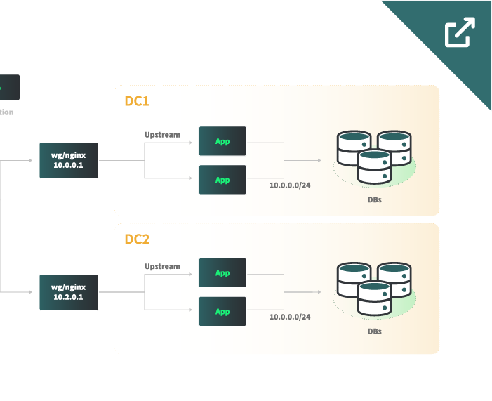

## Abstract

Create a completely segmented software-defined network using Linode VLANs and Wireguard&#174; to host inter-data center Software as a Service (Saas) applications.

In this example, all nodes (the app and database) have their eth0 interface set to a L2 VLAN IP which will prevent the nodes from being generally accessible. Node interoperability is routed through the [Wireguard](https://www.wireguard.com/)&#174;/[NGINX](https://www.nginx.com/) gateway to facilitate external networking; this also allows the gateway to be used as a bastion/entry point to the VPC segments. Networking operability is created and defined during the provisioning process using [Terraform](https://www.terraform.io/) where each node runs Wireguard locally for intranet discovery. This allows nodes to talk to each other and know which is the gateway.

Traffic is routed from an edge CDN to a Wireguard&#174; gateway that is also purposed as a NGINX load balancer. The traffic is then proxied to a group of app servers hosting a SaaS defined in an upstream. Each FQDN server defined in the upstream resolves to an internal VLAN IP which NGINX will route traffic to.

The application communicates with a [MongoDB](https://www.mongodb.com/) cluster which is configured as a replica set between nodes in different data centers. The MongoDB replica set can be deployed with its own VLAN or use the previously defined VLAN. MongoDB can be configured as a replica set with one primary server and many secondary servers which receive replication data. Application client drivers can connect to the replica set as a string which has logic to write to the primary.

As the application is primarily a SaaS, most of the state is maintained in the database and application changes are propagated via a code repository like Git.

## Technologies Used

- [Wireguard](https://www.wireguard.com/)&#174;
- [NGINX](https://www.nginx.com/)
- [MongoDB](https://www.mongodb.com/)
- [Terraform](https://www.terraform.io/)
- Linode:
    - [Cloud Firewalls](/docs/products/networking/cloud-firewall/) are used on the Wireguard&#174;/NGINX gateways

## Business Benefits

- A single egress IP makes it easier to whitelist external service allows connections
- Network isolation and segmentation of compute assets offers protection against threat actors
- Redundant, secure and geo-distributed applications via VPC-like implementation

## Considerations

Routing traffic through a single aggregation point creates a choke point where the gateway’s bandwidth is limited by the Linode instance type.

## Diagrams

“WireGuard” is a registered trademark of Jason A. Donenfeld.