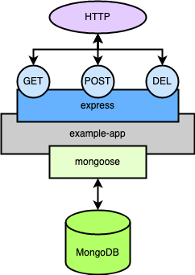

A redundant cross–data center architecture gives you a completely segmented software-defined network for your Software as a Service (SaaS) applications. The architecture uses Linode's Virtual LAN (VLAN) service along with Wireguard to network an application across data centers.

This guide presents a walkthrough for implementing a redundant cross–data center architecture using Terraform, Wireguard, and MongoDB within Linode's VLAN service.

## What Is a Redundant Cross–Data Center Architecture

A redundant cross–data center architecture utilizes a software-defined network to host Software-as-a-Service (SaaS) applications between multiple data centers. The architecture uses Linode's VLAN service along with Wireguard to create a virtual network safe from general access. NGINX, along with Wireguard, facilitates external networking.

Learn more about the architecture itself in our overview documentation for [Redundant Cross–Data Center Applications](/docs/reference-architecture/redundant-cross-datacenter-applications/).

## How to Implement a Redundant Cross–Data Center Architecture

The rest of this tutorial is devoted to providing a step-by-step implementation of the redundant cross–data center architecture.

The provisioning relies mostly on Terraform scripts, installing the software and handling much of the configuration up front. Subsequent sections walk you through the additional configuration steps for each layer of the infrastructure.

This implementation of the architecture is designed around three layers:

- A load balancer layer, which uses an NGINX proxy to the application instances

- A router layer, providing connections into VLANed nodes

- A data center layer, where the application and data storage exist within particular VLANs

### DNS Load Balancer

The setup assumes you have a DNS load balancer configured. The infrastructure utilizes nodes in different regions to promote redundancy. A DNS load balancer can then resolve to one of these regional nodes, depending on factors like availability.

[Cloudflare](https://www.cloudflare.com/load-balancing/) provides an exceptional DNS load balancing service that can be set up for this purpose.

### Provisioning Linode Instances

To jump start implementing the architecture, this tutorial uses [Terraform](https://www.terraform.io/). Learn more about using Terraform, particularly for provisioning Linode instances, in our [Beginner's Guide to Terraform](/docs/guides/beginners-guide-to-terraform/).

Follow along with the steps below to install Terraform and apply a series of scripts to provision each layer of this tutorial's infrastructure.

While the particulars of this Terraform setup may not cover all needs, they provide a good illustration and can be readily built on and adapted to fit your needs.


The configurations and commands used in this guide add multiple Linode instances to your account. Be sure to monitor your account closely in the Linode Manager to avoid unwanted charges.


1. Follow the Terraform [install guide](https://learn.hashicorp.com/tutorials/terraform/install-cli) to install the Terraform command-line interface (CLI) for your system.

1. Download the Terraform package for this tutorial, which you can find [here](rcdc-terraform-scripts.zip).

1. Unzip the package into your desired directory. Doing so may require installing a separate tool, typically `unzip` on Linux systems.

    The package contains a folder, `rcdc-terraform-scripts`, which contains further subdirectories for each of the Terraform scripts.

    This tutorial assumes that you unzipped the package in the current user's home directory, so that you should now have a `~/rcdc-terraform-scripts` directory.

1. Run the following commands to generate a keyfile for the MongoDB cluster. The Terraform script for provisioning the application instances automatically moves this file to the instances and configures MongoDB to use it:

        openssl rand -base64 756 > mongo-keyfile
        mv mongo-keyfile ~/rcdc-terraform-scripts/rcdc-datacenter-terraform/documents/mongo-keyfile

The unzipped `rcdc-terraform-scripts` directory contains three subdirectories, one for each layer of the infrastructure. Each has its own Terraform script.

Each of these next sections walk you through executing each of these scripts.

#### Load Balancers

First, start with the files in the `rcdc-loadbalancer-terraform` subdirectory.

1. Open the `terraform.tfvars` file. Any values in arrow brackets (`<...>`) should be replaced with your own values. Specifically:

    - Replace the `token` value with your Linode API access token. You can follow our [Get an API Access Token](/docs/products/tools/linode-api/guides/get-access-token/) guide to generate a personal access token. Be sure to give the token "Read/Write" permissions.

    - Replace the `password` value with a root password you intend to use for the load balancer nodes.

    
Sensitive infrastructure data (like passwords and tokens) are visible in plain text within the `terraform.tfvars` file. Review [Secrets Management with Terraform](/docs/applications/configuration-management/secrets-management-with-terraform/#how-to-manage-your-state-file) for guidance on how to secure these secrets.
    

1. The tutorial assumes that you have an SSH public key file stored at `~/.ssh/id_rsa.pub`. If this is not the case, add an `ssh_key` field to the `terraform.tfvars` file, and give it a string value designating the location of your SSH public key.

    For instance, include a line like the following if your public key file is stored in the current user's home directory:

        ssh_key = "~/id_rsa.pub"

    Learn more about SSH public keys in our tutorial [How to Use SSH Public Key Authentication](/docs/guides/use-public-key-authentication-with-ssh/)

1. Change into the script's directory, and initialize the Terraform configuration:

        cd ~/rcdc-terraform-scripts/rcdc-loadbalancer-terraform
        terraform init

1. Use the Terraform CLI to execute the script.

    You can first get an overview of the results — essentially making a dry run — with the command:

        terraform plan

    Then, when you are confident in the setup, provision instances using:

        terraform apply

    If at any point you want to remove any instances provisioned in this way, you can use the command:

        terraform destroy

#### Routers

Next, use the files within the `rcdc-router-terraform` subdirectory to provision the router nodes.

1. Open the `terraform.tfvars` file, and, just as you did for your load balancers above, start replacing the values in arrow brackets with your own.

    - Replace the `token` value with your Linode API access token, as with the previous script.

    - Replace the `password` value with a root password you intend to use for the router nodes.

    - Add an `ssh_key` field with the location of your SSH public key file if that location is not `~/.ssh/id_rsa.pub`.

1. Run the Terraform script to provision the router nodes:

        cd ~/rcdc-terraform-scripts/rcdc-router-terraform
        terraform init
        terraform apply

#### Data Centers

Finally, the files in the `rcdc-datacenter-terraform` subdirectory manage the data center nodes, where the example application and MongoDB databases live.

1. Open the `terraform.tfvars` file, and start replacing the values in arrow brackets with your own, much as you did with the previous two layers.

    - Replace the `mongodb_admin_password` value with a password you would like to use for the administrator user on the MongoDB instances.

    - Replace the `token` value with your Linode API access token, as with the previous script.

    - Replace the `password` value with a root password you intend to use for the router nodes.

    - Add an `ssh_key` field with the location of your SSH public key file if that location is not `~/.ssh/id_rsa.pub`.

1. Run the Terraform script to provision the router nodes:

        cd ~/rcdc-terraform-scripts/rcdc-datacenter-terraform
        terraform init
        terraform apply

### Applying VLAN Services

The architecture covered in this tutorial uses Linode's virtual LAN (VLAN) service to secure the data center nodes. Placing these instances on a VLAN keeps them from public Internet access, giving further security.

See our documentation on [Linode's VLAN service](/docs/products/networking/vlans/) for more on setting up instances using VLAN.

For the purposes of this tutorial, follow along with the steps below to apply the necessary VLAN configuration for the nodes. All of these steps take place within the Linode Cloud Manager. Specifically, you need to access the nodes' pages by clicking on the node name from the main dashboard.

1. Navigate to the **Configuration** tab for each of the router nodes, and select the **Edit** option on the main configuration. Then, make the following changes:

    - Set **eth0** to "Public Internet"

    - Set **eth1** to VLAN

    - Under **VLAN** create a VLAN based on the node's region

        - For the `us-southeast` region, create a VLAN named `rcdc-vlan-us-southeast-1`

        - For the `ca-central` region, create a VLAN named `rcdc-vlan-ca-central-1`

    - Enter an IPAM address of `10.3.0.1/24`

1. Navigate to the **Configuration** tab for each of the data center nodes, and select the **Edit** option on the main configuration. Then, make the following changes:

    - Set **eth0** to VLAN

    - Under **VLAN** choose the `rcdc-vlan` created above for the node's region

        - For the `us-southeast` region, use `rcdc-vlan-us-southeast-1`

        - For the `ca-central` region, use `rcdc-vlan-ca-central-1`

    - Enter an IPAM address of `10.3.0.2/24`

### Configuring the Wireguard VPNs

To complete the Wireguard set up, you need to issue a couple of commands on the load balancer instance. The Terraform script provides most of the necessary configuration. So, the only step remaining is to enable the application instances as peers on the load balancer instance.

For each of these commands, replace `<ClientPublicKey>` with the contents of the public key generated for Wireguard on the corresponding instance. Replace `<ClientPublicIP>` with the remote IP address of the instance:

    wg set wg0 peer <ClientPublicKey> allowed-ips 10.8.0.2,fd86:ea04:1115::2 endpoint <ClientPublicIP>:51820
    wg set wg0 peer <ClientPublicKey> allowed-ips 10.8.0.3,fd86:ea04:1115::3 endpoint <ClientPublicIP>:51820

    wg-quick down wg0
    wg set wg0 peer <> allowed-ips 10.2.0.<n>/32 endpoint <>:51820
    wg-quick up wg0

Do this between:

- Each load balancer and both routers

- Each router and its corresponding data center

- Each data center and the other

- Each load balancer and both data centers

On each, open the `/etc/wireguard/wg0.conf` file and add the following lines, depending on the node. Replace the placeholder values throughout these examples.

- On the load balancer nodes

        [Peer]
        PublicKey = <Router1PublicKey>
        AllowedIPs = 10.2.0.1/32
        Endpoint = <Router1IpAddress>:51820

        [Peer]
        PublicKey = <Router2PublicKey>
        AllowedIPs = 10.2.0.2/32
        Endpoint = <Router2IpAddress>:51820

        [Peer]
        PublicKey = <Datacenter1PublicKey>
        AllowedIPs = 10.3.0.1/32
        Endpoint = <Datacenter1IpAddress>:51820

        [Peer]
        PublicKey = <Datacenter2PublicKey>
        AllowedIPs = 10.3.0.2/32
        Endpoint = <Datacenter2IpAddress>:51820

- On the router nodes; increment the data center number to match the router number, e.g., the configuration below is for the first router

        [Peer]
        PublicKey = <Loadbalancer1PublicKey>
        AllowedIPs = 10.1.0.1/32
        Endpoint = <Loadbalancer1IpAddress>:51820

        [Peer]
        PublicKey = <Loadbalancer2PublicKey>
        AllowedIPs = 10.1.0.2/32
        Endpoint = <Loadbalancer2IpAddress>:51820

        [Peer]
        PublicKey = <Datacenter1PublicKey>
        AllowedIPs = 10.3.0.1/32
        Endpoint = <Datacenter1IpAddress>:51820

- On the data center nodes; increment the router number to match the data center number; use the information for the other data center; this configuration matches what should be done for the first data center

        [Peer]
        PublicKey = <Router1PublicKey>
        AllowedIPs = 10.2.0.1/32
        Endpoint = <Router1IpAddress>:51820

        [Peer]
        PublicKey = <Datacenter2PublicKey>
        AllowedIPs = 10.3.0.2/32
        Endpoint = <Datacenter2IpAddress>:51820

        [Peer]
        PublicKey = <Loadbalancer1PublicKey>
        AllowedIPs = 10.1.0.1/32
        Endpoint = <Loadbalancer1IpAddress>:51820

        [Peer]
        PublicKey = <Loadbalancer2PublicKey>
        AllowedIPs = 10.1.0.2/32
        Endpoint = <Loadbalancer2IpAddress>:51820

Each instance's public key can be identified using the `wg` command. Alternatively, you can find the public key in the instance's Wireguard configuration file, `/etc/wireguard/wg0.conf`

You can then test the connections by pinging each instance from the load balancer instance:

    ping 10.8.0.2
    ping 10.8.0.3

### Building a MongoDB Replica Set

The Terraform script handled most of the set up for your MongoDB instances. However, additional steps need to be taken to configure the replica set between the instances, now that the infrastructure's network is in place.

This next series of steps implements the MongoDB replica set using the network configuration developed in the preceding sections.

1. Access the node with the MongoDB instance that you want to make the primary member of the replica set. This tutorial uses `rcdc-datacenter-1`.

    To access this node over SSH, you can SSH into the associated router node (`rcdc-router-us-southeast`) and, from there, SSH into the data center node:

        ssh root@<rcdc-router-us-southeast-PUBLIC_IP_ADDRESS>
        ssh root@10.3.0.2

1. Open the MongoDB shell on the node. This command opens the shell in the `admin` database using administrator authentication. Replace `example-password` with the actual password you used in the Terraform script for setting up the data center nodes:

        mongosh admin -u 'admin' -p 'example-password'

1. Enter the following command there to initiate the replica set:

        rs.initiate( { _id: "rs0", members: [ { _id: 0, host: "mongo-repl-1:27017" }, { _id: 1, host: "mongo-repl-2:27017" } ] } )

The command does a few things, and to break those down:

- `rs.initiate` is MongoDB's function for creating a replica set.

- `{ _id: "rs0",` identifies the name of the replica set. This name has to be preconfigured in each MongoDB server's configuration file, which was handled by the Terraform script.

- `members: [` starts a list of the members of the replica set. The Terraform script assigned hostnames of `mongo-repl-1` and `mongo-repl-2` within each data center node. This list uses those hostnames for the replication, making the replication more future proof.

- `{ _id: 0, host: "mongo-repl-1:27017" },` establishes the first member, which is the current MongoDB instance.

- `{ _id: 1, host: "mongo-repl-2:27017" } ] } )` establishes the second member, the MongoDB instance running on the other data center.

You can verify the replica set by issuing the following command from within the MongoDB shell:

    rs.conf()

This outputs the configuration for your replica set, and it should list both of the MongoDB servers.

### Managing the Load Balancer

The Terraform script is able entirely to handle the setup of the NGINX load balancer. The script moves a configuration file to each load balancer instance and enables it.

Should you need to modify this configuration — for instance, to add additional application instances — you can find the configuration in the `/etc/nginx/sites-available` directory, as `rcdc-loadbalancer.conf`.

### Developing the Application

This tutorial includes a simple example application for demonstrating the architecture. The application is set up by the Terraform script on the data center nodes, where it uses the MongoDB instances for persistence.

Ideally, you may use GitHub or a similar service for application versioning, or even a continuous integration/continuous delivery (CI/CD) setup. That way, you can more readily ensure consistency of the applications between the nodes.

The Terraform script should automatically handle the installation of the application's prerequisites and the application itself. However, if it fails to initialize or you need to re-initialize the application, run the following commands on each data center node:

    nvm install node
    cd /usr/local/example-app
    npm install

You can start the application by accessing each data center node and executing the following commands:

    cd /usr/local/example-app
    node index.js

The example application should begin running on port `3001`.

The application exposes three endpoints on the `/todos` path — `GET`, `POST`, and `DELETE` — each allowing the application to manage the items in a to-do list. Below is an illustration of the structure of the application:

### Testing the Infrastructure

At this point, you can test the whole infrastructure through the example application. Issue the following series of commands on one of the load balancer nodes. Be sure to replace `<TODO_ID>` below with one of the `_id` values returned from one of the other cURL commands.

These commands adds two to-do items to the list, fetch all current to-do items, then delete the item with the `<TODO_ID>`.

    curl -X POST localhost/todos -H 'Content-Type: application/json' -d '{ "description": "First thing todo" }'
    curl -X POST localhost/todos -H 'Content-Type: application/json' -d '{ "description": "Another item todo, the second." }'
    curl localhost/todos
    curl -X DELETE localhost/todos/<TODO_ID>
    curl localhost/todos

Here is what happens whenever one of these commands gets issued:

- NGINX on the load balancer node receives the request to `localhost`, and proxies the request to one of the router nodes via the Wireguard connection

- The receiving router nodes forwards the traffic to port `3001` on its associated data center node via the VLAN connection

- The data center runs the application on port `3001`, and the application processes the request, making the appropriate commands to the MongoDB instance

- A response is passed back up the change, from the application, to the router, back to the load balancer node

## Conclusion

This tutorial covers a complete setup for a redundant cross–data center architecture. Much of the work is tucked within the two Terraform scripts, which you can freely customize to suite your particular needs. The tutorial provides a thorough overview of these scripts to help you get a jump start to adapting them to your needs.

Have more questions or want some help getting started? Feel free to reach out to our [Support](https://www.linode.com/support/) team.
