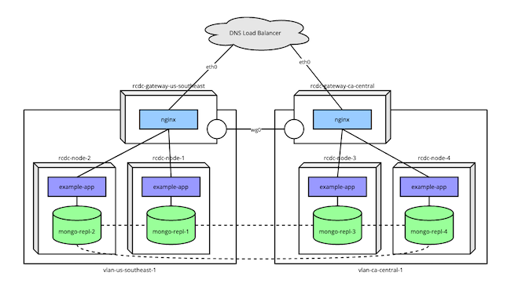
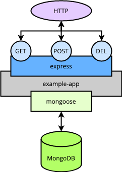
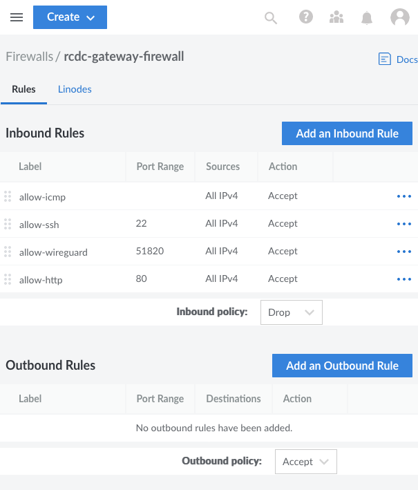

A redundant cross–data center architecture gives you a completely segmented software-defined network for your *Software as a Service* (SaaS) applications. The architecture uses Linode's Virtual LAN (VLAN) service along with WireGuard&#174; to network an application across data centers.

This guide presents a walkthrough for implementing a redundant cross–data center architecture using Terraform, WireGuard&#174;, and MongoDB within Linode's VLAN service.

## What Is a Redundant Cross–Data Center Architecture

A redundant cross–data center architecture utilizes a software-defined network to host Software-as-a-Service (SaaS) applications between multiple data centers. The architecture uses Linode's VLAN service along with WireGuard&#174; to create a virtual network safe from general access. NGINX, along with WireGuard&#174;, facilitates external networking.

Learn more about the architecture itself in our overview documentation for [Redundant Cross–Data Center Applications](/docs/reference-architecture/redundant-cross-datacenter-applications/).

## How to Implement a Redundant Cross–Data Center Architecture

The rest of this tutorial is devoted to providing a step-by-step implementation of the redundant cross–data center architecture.

The provisioning relies mostly on a Terraform script. Leveraging the Linode API, the script sets up each of the nodes with the necessary network interfaces, delivers the files, and runs some shell scripts. The shell scripts handle installing software and making necessary configurations on the nodes.

Outside of these scripts, only a few additional, manual configuration tasks need to be taken to have the infrastructure fully operational.

This tutorial spends much of its length discussing what these scripts do and why. The explanations along with your own review of the scripts should give you a strong footing for implementing your own redundant cross–data center infrastructure.

The diagram below illustrates the final goal for the implementation here.

-   An example application runs on several nodes spread between two data centers.

-   Each set of nodes operates within a VLAN, with availability to the Internet at large being managed by a gateway node.

-   The gateway nodes use WireGuard&#174; to communicate, which allows the MongoDB instances to form a replica set across data centers without general Internet availability.

[](rcdc-infrastructure-diagrams.png)

### DNS Load Balancer

The setup assumes you have a DNS load balancer configured. The infrastructure utilizes nodes in different regions to promote redundancy. A DNS load balancer can then resolve to one of these regional nodes, depending on factors like availability.

### Provisioning Linode Instances

The redundant cross-data center architecture as it is implemented here requires you to create numerous nodes, many of which are similar to others. To streamline the process, the tutorial uses [Terraform](https://www.terraform.io/).

Terraform is a tool for automating the process of provisioning infrastructure. You can learn more about using Terraform to provision Linode instances in our [Beginner's Guide to Terraform](/docs/guides/beginners-guide-to-terraform/).

The steps below give you everything you need to run the Terraform script for implementing the infrastructure here. Afterwards, you can find a high-level breakdown of what the script does.


The configurations and commands used in this guide add multiple Linode instances to your account. Be sure to monitor your account closely in the Linode Manager to avoid unwanted charges.


1.  Follow the Terraform [install guide](https://learn.hashicorp.com/tutorials/terraform/install-cli) to install the Terraform command line interface (CLI) for your system.

1.  Download the Terraform package for this tutorial, which you can find [here](rcdc-terraform.zip).

1.  Unzip the package into the current user's home directory so you have a `~/rcdc-terraform` directory. Doing so may require installing a separate tool, typically `unzip` on Linux systems. This folder contains both the Terraform script files and files to be delivered to instances within the infrastructure.

1.  Run the following commands to generate a keyfile for a MongoDB cluster. The Terraform script automatically delivers the file to each of the application nodes and configures each MongoDB instance to use it.

    ```command
    openssl rand -base64 756 > mongo-keyfile
    mv mongo-keyfile ~/rcdc-terraform/documents/mongo-keyfile
    ```

1.  With a text editor, open the `terraform.tfvars` file in the `rcdc-terraform`. Replace the `LINODE_API_TOKEN` and `INSTANCE_ROOT_PASSWORD` values with your own.

    -   The value for `token` needs to be your Linode API access token. You can follow our [Get an API Access Token](/docs/products/tools/linode-api/guides/get-access-token/) guide to generate a personal access token. Be sure to give the token "Read/Write" permissions.

    -   The `password` value should be the root password you intend to use for the nodes in the infrastructure.

    
    Sensitive infrastructure data (like passwords and tokens) are visible in plain text within the `terraform.tfvars` file. Review [Secrets Management with Terraform](/docs/applications/configuration-management/secrets-management-with-terraform/#how-to-manage-your-state-file) for guidance on how to secure these secrets.
    

    
    The Terraform script assumes you have an SSH public key file stored at `~/.ssh/id_rsa.pub`. If not, add an `ssh_key` field to the `terraform.tfvars` file, and give it a string value designating the location of your SSH public key.

    For instance, include a line like the following if your public key file is stored in the current user's home directory:

    ```command
    ssh_key = "~/id_rsa.pub"
    ```

    Learn more about SSH public keys in our tutorial [How to Use SSH Public Key Authentication](/docs/guides/use-public-key-authentication-with-ssh/)
    

1.  **Optional:** Adjust the `node_count` value to control the number of nodes created in each region. The script as it is does not work properly if anything other than two regions are specified, however, you can adjust the specific `regions` values.

1.  Change into the script's directory, and initialize the Terraform configuration:

    ```command
    cd ~/rcdc-terraform
    terraform init
    ```

    Terraform initializes by downloading the necessary provisioner files. In this case, the only provisioner used is the `linode` provisioner.

1.  Use the Terraform CLI to execute the script.

    You can first get an overview of the results (essentially a dry run) with the command:

    ```command
    terraform plan
    ```

    Then, when you are confident in the setup, provision the infrastructure using:

    ```command
    terraform apply
    ```

The script may take several minutes to run, and you should survey the output to ensure no errors arise during the provisioning process.

If at any point you want to remove the provisioned instances, you can use the command:

```command
terraform destroy
```

#### Terraform Script Details

The script used above handles several of the necessary provisioning tasks. Here's a breakdown of the script to make the whole process more transparent and approachable:

-   Creates two gateway nodes, one for each region. Each gateway is configured with **eth0** as a *Public Internet* interface and **eth1** as a *VLAN* interface. The script automatically creates a VLAN specific to each gateway's region.

    Using the default region names from the `terraform.tfvars` file, you should get:

    -   `rcdc-gateway-us-southeast`

    -   `rcdc-gateway-ca-central`

-   Delivers an NGINX configuration file and a shell script to each gateway node. The NGINX configuration is immediately placed in the directory for NGINX site configurations.

-   Executes the delivered shell script. This shell script handles network setup along with the installation and configuration of necessary software.

    The network configuration includes `networkd` routing, `iptables` rules for forwarding, and a `keepalive` configuration. You can learn more about some parts of the network configuration in our guide to [Configure Linux as a Router](/docs/guides/linux-router-and-ip-forwarding/).

    The necessary software includes WireGuard&#174; and NGINX. WireGuard&#174; provides a VPN for communications between the two gateways, and NGINX performs load balancing between each region's array of application nodes. The shell script handles the initial configuration for these applications.

-   Creates a given number of application nodes within each region. Each application node has only one interface, **eth0**, which connects to the VLAN created for that node's regional gateway.

    With the default of two nodes per region, you end up with the following set of instances:

    -   `rcdc-node-1` on `vlan-us-southeast-1`

    -   `rcdc-node-2` on `vlan-us-southeast-1`

    -   `rcdc-node-3` on `vlan-ca-central-1`

    -   `rcdc-node-4` on `vlan-ca-central-1`

-   Delivers a number of files to each application node, including:

    -   A shell script, described below.

    -   The `mongo-keyfile` you created.

    -   An example application for interacting with the MongoDB instance and a service file for running the application as a `systemctl` service.

-   Executes the delivered shell script. The shell script for the application nodes similarly handle network setup and software installation and configuration.

    The network configuration includes `networkd` routing. This synchronizes the application nodes' routes with those defined in the gateway nodes.

    Each application node needs Node.js to run the example application, which the shell script installs. The script also initializes the example application, installing its NPM dependencies and enabling its `systemctl` service.

    Each application node also has a MongoDB instance. These are set up to use the `mongo-keyfile`, which is used to align all the instances as a replica set.

    A MongoDB administrator user created on the first MongoDB instance (on `rcdc-node-1`). That user authentication data is disseminated to the other MongoDB instances when you manually configure replication later on.

### Configuring the WireGuard&#174; VPNs

To complete the WireGuard&#174; setup, each gateway node must be configured to recognize the other node as a WireGuard&#174; peer.

The most approachable method for this setup is to add a `[WireGuardPeer]` block to each gateway's WireGuard&#174; configuration file.

To make these additions, you need to access each gateway node through SSH, using the node's public IP address. For instance, assuming the public IP address for the `rcdc-gateway-us-southeast` node is `192.0.2.1`:

```command
ssh root@192.0.2.1
```

The WireGuard&#174; configuration file is located at `/etc/systemd/network/99-wg0.netdev`. You can either edit the file using your preferred text editor or issue the following from the command line:

```command
cat >>/etc/systemd/network/99-wg0.netdev<<EOF
[WireGuardPeer]
PublicKey=<OTHER_WIREGUARD_PUBLIC_KEY>
AllowedIPs=<OTHER_GATEWAY_LOCAL_IP>/24,<OTHER_WIREGUARD_NETWORK_IP>/32
Endpoint=<OTHER_GATEWAY_PUBLIC_IP>:51820
EOF
```

You need to replace the values in arrow brackets (`<...>`) above with the appropriate values for each gateway. Each gateway node's public keys are located in the `/etc/systemd/network/wg.public_key` file. The public IP address is available from the Linode Cloud Manager.

The following is what the these configuration files should looks like on each gateway. Replace the `_WG_PUBLIC_KEY` values with the respective gateway's public key, and replace `192.0.2.2` and `192.0.2.1` with the respective gateway's public IP addresses.

-   For the `rcdc-gateway-us-southeast` gateway:

    ```file {title="/etc/systemd/network/99-wg0.netdev"}
    # [...]

    [WireGuardPeer]
    PublicKey=CA_CENTRAL_WG_PUBLIC_KEY
    AllowedIPs=10.8.1.0/24,10.254.8.2/32
    Endpoint=192.0.2.2:51820
    ```

-   For the `rcdc-gateway-ca-central` gateway:

    ```file {title="/etc/systemd/network/99-wg0.netdev"}
    # [...]

    [WireGuardPeer]
    PublicKey=US_SOUTHEAST_WG_PUBLIC_KEY
    AllowedIPs=10.8.0.0/24,10.254.8.1/32
    Endpoint=192.0.2.1:51820
    ```

At this point, you should restart the `networkd` process using the command:

```command
systemctl restart systemd-networkd
```

You can then test the connection between the two gateway nodes by pinging one from the other. For instance, from the `rcdc-gateway-us-southeast` node:

```command
ping 10.8.1.1
```

```output
PING 10.8.1.1 (10.8.1.1) 56(84) bytes of data.
64 bytes from 10.8.1.1: icmp_seq=1 ttl=64 time=34.1 ms
```

### Building a MongoDB Replica Set

The Terraform script handled most of the work for the MongoDB instances. However, you need to issue some additional commands on one of the application instances to complete the setup.

The necessary commands establish a replica set between MongoDB instances across the application nodes. Communications between instances on the same VLAN use the local network. Communications between instances in different regions use the WireGuard&#174; network established by the gateway nodes.

Follow along with this next series of steps to initialize the replica set. These steps only need to be taken on one of your application nodes. In this case, that should be `rcdc-node-1`, where the MongoDB administrator user was set up.

1.  Log into the application node using SSH. Because the node operates on a VLAN, you need to use the gateway node as a bastion in order to SSH into the application node.

    So, assuming again that your `rcdc-gateway-us-southeast` node has a public IP address of `192.0.2.1`, you can use the commands:

    ```command
    ssh root@192.0.2.1
    ssh root@10.8.0.11
    ```

1.  Use the MongoDB shell to run a predefined script on the MongoDB instance. The script should be run as the administrator user, and you can provide the credentials for doing so from the command line.

    In this example, replace `MONGODB_ADMIN_PASSWORD` with the password you entered in the `terraform.tfvars` file before running the Terraform script:

    ```command
    mongosh admin -u 'admin' -p 'MONGODB_ADMIN_PASSWORD' /tmp/mongo-init-replication.js
    ```

The MongoDB script here contains a single command, which is all that is needed to initiate replication between the instances.

You can see the script at `/tmp/mongo-init-replication.js`. Below is a breakdown of what the script does:

-   `rs.initiate(` is MongoDB's function for creating a replica set.

-   `{ _id: "rs0",` identifies the name of the replica set. This name is preconfigured in each MongoDB server's configuration file, which was handled by the Terraform script.

-   `members: [` lists the members of the replica set.

-   `{ _id: 0, host: "mongo-repl-1:27017" }, [...] ] } )` defines the first member, then each subsequent member.

    The shell script executed during the Terraform provisioning assigned hostnames of `mongo-repl-1`, `mongo-repl-2`, etc. for each application node's local IP address. The script then input the collection of hosts in each node's `/etc/hosts` file. This helps make your MongoDB cluster more adaptable and future-proof.

Afterward, can verify the replica set by accessing the MongoDB shell and issuing this command:

```command
mongosh admin -u 'admin' -p 'MONGODB_ADMIN_PASSWORD'
rs.conf()
```

This outputs the configuration of your replica set. It should list all of the application nodes.

### Developing the Application

The Terraform process handled all of the setup for the example application used in this tutorial. This section briefly overviews the example application before testing the infrastructure with it.

The example application is a simple RESTful API built on Node.js. More specifically, it uses Express JS for managing the HTTP routing, and Mongoose for connecting to the node's MongoDB instance.

The application is designed to fetch, store, and delete to-do items. It thus exposes `GET /todos` for fetching all items, `POST /todos` for adding a new item, and `DELETE /todos/<id>` for removing an item.

The diagram below provides a basic overview of what each application node's setup looks like.



During the Terraform process, everything necessary for running the application is put into place. The application files are delivered to a directory on each application node, and the NPM dependencies are installed.

The Terraform process also includes an `example-app.service` file. This file is deployed to each application node to set up a `systemctl` service. That service then runs the application in the background and restarts it at system startup.

### Implementing a Cloud Firewall

Setting up a cloud firewall is optional for testing the infrastructure, but it is highly recommended for securing your gateway nodes.

The Linode Cloud Firewall provides an easy-to-implement firewall that you can attach to the gateway instances deployed above.

Learn more about Linode Cloud Firewalls in our [selection of guides](/docs/products/networking/cloud-firewall/guides/) on the topic.

The steps below outline a basic configuration you can use with the infrastructure deployed in this tutorial.

1.  Access the **Firewalls** section of the Linode Cloud Manager from its left-hand menu.

1.  Select **Create Firewall**, enter a label for the firewall (e.g. "rcdc-gateway-firewall"), and assign the firewall to the gateway instances `rcdc-gateay-us-southeast` and `rcdc-gateway-ca-central`.

1.  Navigate to the page for the new firewall. From the **Rules** tab, set default policies and add a set of **Inbound Rules**.

    It is recommended that you set the **Inbound** default policy to *Drop* and the **Outbound** default policy to *Accept*.

    The specific firewall rules you implement depend on your needs, but you should at least have the following set of inbound rules:

    -   A rule to allow inbound connections over SSH, `22/tcp`

    -   A rule to allow inbound connections over HTTP, `80/tcp`

    -   A rule to allow inbound WireGuard&#174; connections, configured for port `51820` using `udp`

    -   A rule to allow inbound ICMP traffic

    

1.  Click **Save Changes** to apply the settings.

### Testing the Infrastructure

With the infrastructure set up and networked, you can test everything through the example application.

All of this testing can be done from a machine outside the redundant cross-regional network. Ideally, you should have a DNS load balancer configured with the gateway's public IP addresses. Then, you would call the DNS load balancer to test the infrastructure. However, during initial testing, you can also make the calls shown here to each gateway independently.

In either case, replace the `192.0.2.0` URL used in the following example commands with the appropriate URL for you. That is, the DNS load balancer URL or public IP address for the gateway you're testing.

First, since the application does not start with any data, you should supply it with some. These two cURL commands each input a new to-do item.

```command
curl -X POST 192.0.2.0/todos -H 'Content-Type: application/json' -d '{ "description": "First thing todo" }'
curl -X POST 192.0.2.0/todos -H 'Content-Type: application/json' -d '{ "description": "Another item todo, the second." }'
```

Now you can fetch the full list of to-do items. It should contain both items added above.

```command
curl 192.0.2.0/todos
```

When you want to delete one of these items, you can use a command like the one below. Just replace `12345` in this example with and actual `_id` value from one of your to-do items.

```command
curl -X DELETE 192.0.2.0/todos/12345
```

To summarize, here is what essentially happens with each of these calls:

-   The DNS load balancer resolves to one of your gateway instances.

-   The NGINX load balancer in the given gateway fields the request to one of the application nodes in the associated region.

-   The example application running on that application node processes the request, makes the appropriate call to the local MongoDB instance, and returns the result.

-   The MongoDB instances stay synced within a particular VLAN via the local connection, while instances in different regions are synced across the gateways' WireGuard&#174; connection.

## Conclusion

This tutorial covers a complete setup for a redundant cross–data center architecture, which holds a wide range of possibilities. Much of the work is done by the Terraform script and its associated shell scripts. However, one of this tutorial's aims is to provide a thorough overview of how these scripts accomplish that work. This way, you are empowered to dig into these scripts and customize them to fit your particular needs.