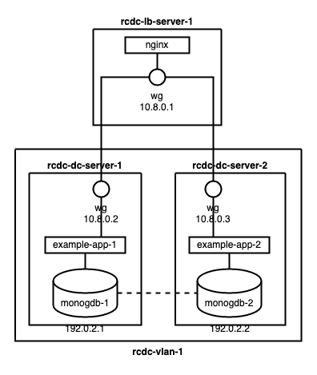

A redundant cross–data center architecture gives you a completely segmented software-defined network for your Software as a Service (SaaS) applications. The architecture uses Linode's Virtual LAN (VLAN) service along with Wireguard to network an application across data centers.

This guide presents a walkthrough for implementing a redundant cross–data center architecture using Terraform, Wireguard, and MongoDB within Linode's VLAN service.

## What Is a Redundant Cross–Data Center Architecture

A redundant cross–data center architecture utilizes a software-defined network to host Software-as-a-Service (SaaS) applications between multiple data centers. The architecture uses Linode's VLAN service along with Wireguard to create a virtual network safe from general access. NGINX, along with Wireguard, facilitates external networking.

Learn more about the architecture itself in our overview documentation for [Redundant Cross–Data Center Applications](/docs/reference-architecture/redundant-cross-datacenter-applications/).

## How to Implement a Redundant Cross–Data Center Architecture

The rest of this tutorial is devoted to providing a step-by-step implementation of the redundant cross–data center architecture.

The provisioning relies as much as possible on Terraform scripts, installing the software used and configuring it as much as possible up front.

From there, you can see the steps need to connect all of the pieces and run your application through the segmented software-defined network.

### Provisioning Linode Instances

To jump start implementing the architecture, this tutorial uses [Terraform](https://www.terraform.io/).

Learn more about using Terraform, particularly for provisioning Linode instances, in our [Beginner's Guide to Terraform](/docs/guides/beginners-guide-to-terraform/).

Follow along with the steps in this section to implement ready-made Terraform scripts for this tutorial. And, of course, use these scripts as a basis for your own implementation of this architecture, fit for your application's needs.


The configurations and commands used in this guide add multiple Linode instances to your account. Be sure to monitor your account closely in the Linode Manager to avoid unwanted charges.


For reference, by the end you should have a setup similar to what is shown in the diagram below. Further sections show how to complete the configuration, including implementing the VLAN.

1. Follow the Terraform [install guide](https://learn.hashicorp.com/tutorials/terraform/install-cli) to install the Terraform command-line interface (CLI) for your system.

1. Download the Terraform package for this tutorial, which you can find [here](rcdc-terraform-scripts.zip).

1. Unzip the package into its own directory. Doing so may require installing a separate tool, typically `unzip` on Linux systems.

    This tutorial assumes the package is unzipped into a `~/rcdc-terraform-scripts` directory.

1. Run the following commands to generate a keyfile for the MongoDB cluster. The Terraform script for provisioning the application instances automatically moves this file to the instances and configures MongoDB to use it:

        openssl rand -base64 756 > mongo-keyfile
        mv mongo-keyfile ~/rcdc-terraform-scripts/rcdc-dc-terraform/mongo-keyfile

The unzipped directory contains two further directories. One of these provisions a load-balancer instance, and other provisions a given number of application instances.

Follow these steps for each of the directories, starting with the load-balancer directory, `rcdc-lb-terraform`.

1. Using a terminal, change into the directory. For instance, you can change into the load-balancer's directory with:

        cd ~/rcdc-terraform-scripts/rcdc-lb-terraform

1. Open the `terraform.tfvars` file. Replace the placeholder `token` with your Linode API access token, and replace the `password` placeholder withe your own strong password.

    You can follow our [Get an API Access Token](/docs/products/tools/linode-api/guides/get-access-token/) guide to generate a personal access token. Be sure to give the token "Read/Write" permissions.

    
Sensitive infrastructure data (like passwords and tokens) are visible in plain text within the `terraform.tfstate` file. Review [Secrets Management with Terraform](/docs/applications/configuration-management/secrets-management-with-terraform/#how-to-manage-your-state-file) for guidance on how to secure these secrets.
    

1. The tutorial assumes that you have an SSH public key file stored at `~/.ssh/id_rsa.pub`. If this is not the case, add an `ssh_key` value to the `terraform.tfvars` file.

    For instance, include a line like the following if your public key file is stored in the current user's home directory:

        ssh_key = "~/id_rsa.pub"

1. Specifically for the application instances' script (in `rcdc-dc-terraform`), modify the `wg_server_public_key` and `wg_server_ip` variables in the `terraform.tfvars` file.

    These should correspond to values from the load balancer instance: the public key generated for Wireguard and the instance's public IP address, respectively.

1. Use the Terraform CLI to execute the script.

    You can first get an overview of the results — essentially making a dry run — with the command:

        terraform plan

    Then, when you are confident in the setup, provision instances using:

        terraform apply

    If at any point you want to remove any instances provisioned in this way, you can use the command:

        terraform destroy

### Applying VLAN Services

The architecture covered in this tutorial uses Linode's virtual LAN (VLAN) service to secure the application instances. Placing these instances on a VLAN keeps them from public Internet access, giving further security.

The Wireguard configuration ensure that, even so, the NGINX load balancer is able to communicate with the application instances.

1. From the Linode Cloud Manager, configure each Linode server provisioned by Terraform as part of the same VLAN. See our documentation on [Linode's VLAN service](/docs/products/networking/vlans/) for more on setting up instances using VLAN.

    - Navigate to the server's page, then select the **Configuration** tab.

    - Select **Edit** by the listed configuration, and change **eth0** from "Public Internet" to "VLAN."

    - For the first server, create a new VLAN, entering its name in the drop down field. For the second server, select the same VLAN you used for the first.

    - Enter an IPAM address for the server. These examples use `192.0.2.1/24` for the first server and `192.0.2.2/24` for the second.

### Configuring the Wireguard VPNs

To complete the Wireguard set up, you need to issue a couple of commands on the load balancer instance. The Terraform script provides most of the necessary configuration. So, the only step remaining is to enable the application instances as peers on the load balancer instance.

For each of these commands, replace `<ClientPublicKey>` with the contents of the public key generated for Wireguard on the corresponding instance. Replace `<ClientPublicIP>` with the remote IP address of the instance:

    wg set wg0 peer <ClientPublicKey> allowed-ips 10.8.0.2,fd86:ea04:1115::2 endpoint <ClientPublicIP>:51820
    wg set wg0 peer <ClientPublicKey> allowed-ips 10.8.0.3,fd86:ea04:1115::3 endpoint <ClientPublicIP>:51820

Each instance's public key can be identified using the `wg` command. Alternatively, you can find the public key in the instance's Wireguard configuration file, `/etc/wireguard/wg0.conf`

You can then test the connections by pinging each instance from the load balancer instance:

    ping 10.8.0.2
    ping 10.8.0.3

### Building a MongoDB Replica Set

The Terraform script provisioned the instances and did most of the installation and configuration. However, there are some additional steps you need to take to set up your MongoDB cluster as a replica set.

Each application instance has hostnames of `mongo-repl-1` and `mongo-repl-2`. Each of these corresponds to one of the instances, using the IPAM address configured as part of the VLAN setup.

For this tutorial, these addresses are `192.0.2.2` and `192.0.2.3`.

With that in place, setting up the MongoDB replica set is straightforward.

1. Access the instance with the MongoDB server that you want to be the primary member of the replica set. This tutorial uses `rcdc-dc-server-1`, with the IPAM address `192.0.2.2`.

1. Open the MongoDB shell:

        mongosh

1. Enter the following command there to initiate the replica set

        rs.initiate( { _id: "rs0", members: [ { _id: 0, host: "mongo-repl-1:27017" }, { _id: 1, host: "mongo-repl-2:27017" } ] } )

The command above does a few things:

- `rs.initiate` is MongoDB's function for creating a replica set.

- `{ _id: "rs0",` identifies the name of the replica set. This name has to be preconfigured in each MongoDB server's configuration file, which was handled by the Terraform script.

- `members: [` starts a list of the members of the replica set.

- `{ _id: 0, host: "mongo-repl-1:27017" },` establishes the first member. This is the MongoDB server on the current instance. Identifying the instances by their hostnames rather than IP addresses makes changes much easier in the future.

- `{ _id: 1, host: "mongo-repl-2:27017" } ] } )` establishes the second member, the MongoDB server on the other instance.

You can verify the replica set by issuing the following command from within the MongoDB shell:

    rs.conf()

This outputs the configuration for your replica set, and it should list both of the MongoDB servers.

### Developing the Application

This architecture connects to an application that uses MongoDB for data persistence. So, to start, this tutorial includes a simple example application to demonstrate the concepts.

You can find that application bundled with the Terraform scripts in the previous section. These scripts actually do the bulk of the work for setting up the application.

Start the application by accessing the instance and executing the following commands:

    cd /usr/local/example-app
    node index.js

The example application should begin running on port `3001`. You can test it with the following series of commands. Be sure to replace `<id>` below with one of the `_id` values returned from one of the other cURL commands:

    curl -X POST localhost:3001/todos -H 'Content-Type: application/json' -d '{ "description": "First thing todo" }'
    curl -X POST localhost:3001/todos -H 'Content-Type: application/json' -d '{ "description": "Another item todo, the second." }'
    curl localhost:3001/todos
    curl -X DELETE localhsot:3001/todos/<id>
    curl localhost:3001/todos

The example application uses Express JS to create a RESTful API. The application then uses Mongoose to connect to a local MongoDB instance for fetching, posting, and deleting data.

The application structure can be represented as shown in the diagram below:

### Configuring the NGINX Load Balancers

The Terraform script is able entirely to handle the setup of the NGINX load balancer. The script moves a configuration file to the instance and enables it.

Should you need to modify this configuration — for instance, to add additional application instances — you can find the configuration in the `/etc/nginx/sites-available` directory.

By default, this configuration serves the application on port `8080`. To alter this to the HTTP port, delete the `default` configuration and modify the `rcdc-lb.conf` file to listen on port `80` instead of port `8080`. Both of these files are stored in the `/etc/nginx/sites-available` directory.

### Verifying the Implementation
Show the architecture in action via a request to the application from `rcdc-lb-server:8080`

## Conclusion

This tutorial covers a complete setup for a redundant cross–data center architecture. Much of the work is tucked within the two Terraform scripts, which you can freely customize to suite your particular needs. The tutorial provides a thorough overview of these scripts to help you get a jump start to adapting them to your needs.

Have more questions or want some help getting started? Feel free to reach out to our [Support](https://www.linode.com/support/) team.

