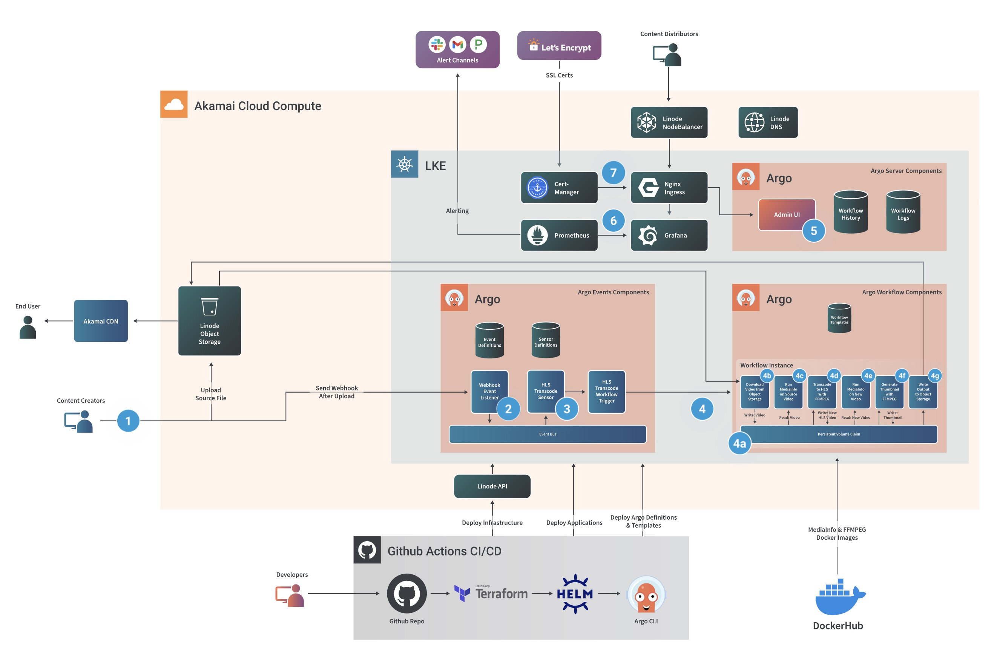

*Click to visit detailed diagrams*

## Abstract

This document provides a concrete example of how to create a scalable, portable, and cost-effective media processing workflow using Akamai Cloud Compute, Linode Kubernetes Engine, Akamai CDN and a CI/CD pipeline powered by GitHub Actions.  Specifically we will demonstrate a traditional Video On-Demand (VOD) workflow that takes a source video and shows you how you can output this to an online distribution format and how this architecture will allow you to cost-effectively scale to as many unique formats that you might need for your video transcoding needs.

The vast majority of use cases involve handling multi-media content.  Whether your infrastructure supporting user consumable content for blogs or social media, producing video or digital assets for streaming services, or other business using your applications at a global scale, you rely on engaging content. To start we want to quickly explore what a high level generic content workflow might look like.

## Technologies Used

* Argo
* FFmpeg
* MediaInfo
* GitHub
* Terraform
* Helm
* DockerHub
* Let’s Encrypt
* Cert-Manager
* Nginx
* Prometheus
* Grafana
* Akamai Connected Cloud Technologies
   * LKE
   * Node Balancer
   * Object Storage
   * Volumes
   * API
   * DNS

## Business Benefits

* Extensibility for unlimited media workflow possibilities. This reference architecture is highly extensible to support a myriad of media output format types and unique workflow steps definitions to output to any device, platform, or audience specification.
* Scalability. If you need to process a large amount of content in a short period of time to meet service launch or marketing campaign requirements, this solution supports horizontal scalability by adding more Linodes within the Kubernetes cluster, which enables high throughput.
* Cost-effectiveness. Traditional media workflows had to keep a deployed capacity for peak usage, but because this is built on Kubernetes and the workflow mechanism with Argo support dynamic pod scheduling and tear-down you can minimize your cost footprint.