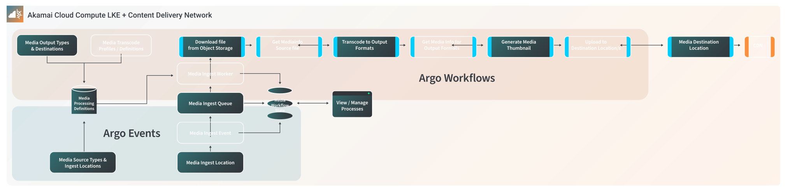

The diagrams featured here provide different perspectives on the architecture of a video transcoding workflow:

- [Figure 1](#figure-1-high-level-typical-media-ingest-workflow) describes the high-level components of a general video transcoding architecture without referring to particular technologies that may be used (with some exceptions).

- [Figure 2](#figure-2-akamai-cloud-compute-lke-with-argo-events-and-argo-workflow) presents the same components of figure 1, but with an overlay of how those components can be powered by Akamai Connected Cloud, Linode Kubernetes Engine (LKE), and [Argo](https://argoproj.github.io/).

- [Figure 3](#figure-3-end-to-end-vod-workflow-with-hls-video-output) presents a detailed version of this architecture with descriptions of how specific technologies are used to implement the components of the video transcoding workflow.

## Figure 1: High Level Typical Media Ingest Workflow


*Click to interact, scroll to zoom, click-and-hold to pan*


**Figure 1** illustrates a media processing lifecycle that has two typical contributors: *content creators* and *content distributors*.

- *Content creators* produce some type of multimedia content. This architecture assumes that this content is video. Typically the original content is in a high quality format so that it can be archived and transcoded to different formats in the future.

- *Content distributors* take the original high resolution format of the content and convert it into formats suitable for online distribution.

The steps in figure 1 are described as follows:

1. Prior to ingesting new content from a creator, a strategy is devised to understand what types of platforms, audiences, and devices the content is ultimately distributed to. It is the role of the content distribution team to understand:

    - What intake formats they are expecting from content creators
    - What destinations the content is published to
    - What output formats are needed for those destinations. This includes ancillary content such as metadata and images.

    
    For example, [HTTP Live Streaming (HLS)](https://en.wikipedia.org/wiki/HTTP_Live_Streaming) was the original format specified to support video playback on Apple devices. While HLS is supported much more widely today beyond just Apple devices, there are still always considerations for video distribution formats. These considerations may be based on budgets, audiences, devices to be supported, geographic regions, and so on.

    Those concepts are encapsulated in transcoding system configurations. These configurations are called *workflow specifications* and *transcode profiles*, and they are defined prior to any content ingestion. [Argo Workflows](https://argoproj.github.io/workflows/) is an example of a tool that supports DAG-based (Directed Acyclic Graph) workflows, and it can be used to define workflow specifications. An open-source tool called [PyTranscoder](https://pytranscoder.readthedocs.io/en/latest/) can be used to create transcode profiles for [FFmpeg](https://ffmpeg.org/).
    

1. Content creators send content files into the media processing system. A way to upload content into a Media Ingest Location is provided to the content creator. This is typically a file system, FTP/SFTP endpoint, or cloud storage bucket.

1. When new files are added, a Media Ingest Event starts the workflow lifecycle. For example, there may be an application process that watches for new files and triggers the workflow. Or, the workflow may be started when a webhook notification is received from the Media Ingest Location.

1. Because transcoding is very CPU intensive, and because parallel processing is dependent on available computing resources, it is typical for a media processing workflow to queue up workloads in a Media Ingest Queue. This queue is consumed as processing slots become available.

1. Media Ingest Workers represent the actual processing tasks that are performed on a given file in a workflow. Steps 5a-5e illustrate the typical sub-processes that are carried out on video files.

    1. The video file is downloaded from an object storage location to the local compute instance where it is processed.

    1. The [MediaInfo](https://mediaarea.net/en/MediaInfo) tool is used to collect metadata about the source file.

    1. The source file is transcoded to the desired outputs. These outputs are specified by the transcoding parameters, which are based on the content distribution requirements.

    1. After the new transcoded outputs are created, metadata is gathered for them. This information is used to validate that the output formats match the desired specifications. This metadata can also be used to catalog the content in other systems of record.

    1. After transcoding to the required outputs, one or more thumbnail images may be generated. These typically accompany the content when it is published for consumption.

1. The files are uploaded to the desired Media Destination Location (also sometimes referred to as the content origin).

1. After being prepared in the proper distribution formats, most content is delivered to end consumers through a Content Delivery Network (CDN). The CDN caches content in the geographic regions it is served to, which reduces latency and increases reliability of playback.
{#figure-1-description .large-diagram}

A system is set up to allow observability of the content workflows. Content distributors need to be able to handle errors, assess utilization, and make decisions based on the types of workloads their systems are processing. A dashboard or tool to view and collect this information helps diagnose these situations.

## Figure 2: Akamai Cloud Compute LKE with Argo Events and Argo Workflow


*Click to interact, scroll to zoom, click-and-hold to pan*


**Figure 2** provides an overview of the tools and technologies overlaid onto the VOD workflow use case. This overview illustrates how the Akamai Connected Cloud and Linode Kubernetes Engine (LKE) are combined with an event-driven and highly scalable workflow management tool called [Argo](https://argoproj.github.io/). Argo is an open source Kubernetes-native workflow engine supporting DAG and step-based workflows, and it is a member of the Cloud Native Computing Foundation (CNCF). This combination of technologies allows for a flexible, portable, and cost-effective media processing solution.

## Figure 3: End-to-End VOD Workflow with HLS Video Output


*Click to interact, scroll to zoom, click-and-hold to pan*


**Figure 3** represents a built-out, detailed reference architecture implementation. It includes:

- A CI/CD workflow using GitOps (located at bottom of diagram). The reference architecture also includes deployment automation using GitHub for source code and GitHub Actions for continuous delivery.
- A media processing lifecycle management workflow application, built with Linode Kubernetes Engine using [Argo Events](https://argoproj.github.io/events/) and [Argo Workflows](https://argoproj.github.io/workflows/). The components of Argo are configured with YAML files that can be applied through [Kubectl](https://kubernetes.io/docs/reference/kubectl/) or through [Argo CLI](https://argoproj.github.io/argo-workflows/walk-through/argo-cli/).
- Content distribution using Akamai CDN.

The deployment method for this architecture uses [Terraform](https://www.terraform.io/) and [Helm Charts](https://helm.sh/). Linode supports Terraform through the [Linode Terraform Provider](https://www.linode.com/products/linode-terraform-provider/), and Argo supports the [Argo Events Helm Chart and Argo Workflow Helm Chart](https://github.com/argoproj/argo-helm) for application deployment.

The benefit of this design is that deployment of the entire reference architecture can be completely automated, which fulfills cloud native and DevOps principles. This incudes the architecture infrastructure, applications, and the application setup and configuration.

Some key features of figure 3 are described as follows:

1. Content creators ingest files into Linode Object Storage. Object storage can receive files from a CLI, a programmatic integration, or from desktop tools such as Cyberduck. Linode Object Storage supports lifecycle policies, so source files can be automatically purged regularly. A purging policy should only be implemented if a separate system-of-record for your high resolution source content is maintained.

    
    Supported upload methods are described in the [Linode Object Storage documentation](/docs/products/storage/object-storage/guides/#clients-and-tools).
    

1. [Argo Event Sources](https://argoproj.github.io/argo-events/concepts/event_source/) includes 20+ origination mechanisms that can be setup to generate event messages that are written to [Argo Event Bus](https://argoproj.github.io/argo-events/concepts/eventbus/). In this reference architecture we have enabled a [Webhook Event Source](https://argoproj.github.io/argo-events/eventsources/setup/webhook/) that a user or system can send HTTP requests. The the filename they are ingesting is included in this request.

1. [Argo Sensors](https://argoproj.github.io/argo-events/concepts/sensor/) are configurations that map well-defined Event Sources to a specific [Argo Trigger](https://argoproj.github.io/argo-events/concepts/trigger/). A Trigger defines the target process to invoke. In the reference architecture, the Trigger is an [Argo Workflow](https://argoproj.github.io/argo-workflows/) that converts the source file to an [HTTP Live Streaming (HLS)](https://en.wikipedia.org/wiki/HTTP_Live_Streaming) adaptive bitrate output.

1.  Argo Workflows enable well-defined sequences of tasks that are described by [Argo Templates](https://argoproj.github.io/argo-workflows/workflow-templates/). Workflows use YAML definitions to describe actions that should occur on artifacts, including file transfers, container commands, web requests, and data manipulation. Argo workflow orchestration manages dynamic pod scheduling in Kubernetes based on the steps and processes defined in the Workflow definition, which live for the lifecycle of the workflow.

    1. The workflow creates a persistent volume to be shared by all steps of the workflow. This is a common file-based workspace for all steps of the workflow to access. The source files and output files are stored on this volume.

    1.  Argo has integrated capabilities to communicate with S3-compliant storage, which includes Linode Object Storage. The source file is transferred from Object Storage to the local persistent volume claim.

    1.  MediaInfo and FFmpeg are two industry-standard open source tools for media processing workflows. These are incorporated into the reference architecture with community-supported containers from [DockerHub](https://hub.docker.com/). MediaInfo gathers information about the source file, and this metadata is passed to the transcoding process.

    1.  FFmpeg is used to transcode and package the file in HLS format.

    1.  MediaInfo gathers file information about the output files created in the previous step.

    1.  FFmpeg is also be used to generate one or more thumbnails from the original source file.

    1. HLS outputs are uploaded to a defined destination on Linode Object Storage. These files serve as the content origin for the Akamai Content Delivery Network.

1. This reference architecture provides operational observability for systems and for content management. [Argo Workflows UI](https://argoproj.github.io/argo-workflows/argo-server/#access-the-argo-workflows-ui) shows media workflows that are in process, completed, or failed. With these features, real-time visibility and operational error handling can be achieved.

1. [Prometheus](https://prometheus.io/) and [Grafana](https://grafana.com/) provide system-wide metrics and observability to developers and site reliability engineers. This information is used to manage the capacity, performance, and health of the overall infrastructure.

1. A combination of [Cert-Manager](https://cert-manager.io/), [Let’s Encrypt](https://letsencrypt.org/), [NGINX Ingress](https://docs.nginx.com/nginx-ingress-controller/), [Linode NodeBalancers](https://www.linode.com/products/nodebalancers/), and [Linode DNS](https://www.linode.com/products/dns-manager/) enable communication with internal components of the application over a secure TLS connection. This includes the Argo Workflow UI, Grafana UI, and Argo Events Webhook.
{#figure-3-description .large-diagram}