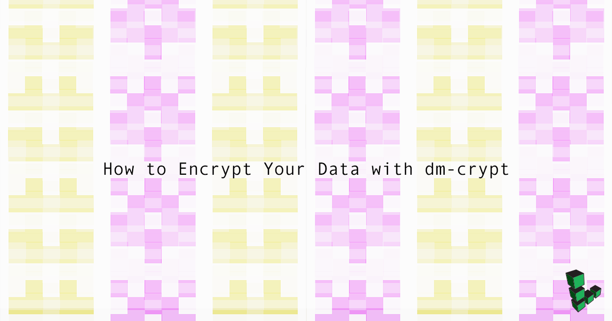
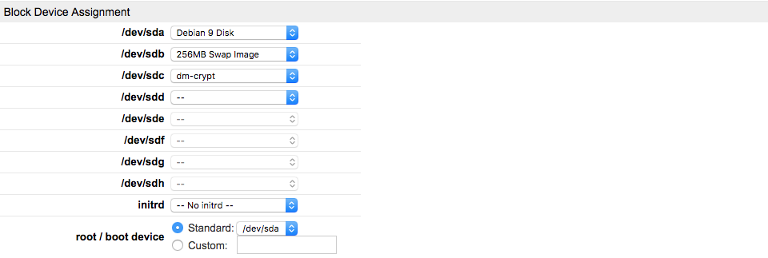

---
author:
  name: Linode Community
  email: docs@linode.com
description: 'This guide shows how to use dm-crypt in plain mode or with LUKS to encrypt your data disk, partition or file container.'
og_description: 'dm-crypt is a transparent encryption subsystem. In this guide you will learn how to encrypt disks, partition, swap, and use encrypted files. '
keywords: ['dm-crypt', 'encryption', 'encrypt', 'luks']
license: '[CC BY-ND 4.0](https://creativecommons.org/licenses/by-nd/4.0)'
published: 2017-12-18
modified: 2018-12-18
modified_by:
  name: Linode
title: 'How to Encrypt Your Data with dm-crypt'
contributor:
  name: Alexandru Andrei
aliases: ['security/encrypt-data-disk-with-dm-crypt/']
---

dm-crypt is a transparent disk encryption subsystem. In this guide you will learn how to encrypt disks, partition, swap and even use files as encrypted, and portable containers for your sensitive data.

*dm-crypt* maps a physical block device to a virtual block device. When you write to the virtual device, every block of data is encrypted and stored on the physical device. When you read from the virtual device, every block is decrypted at runtime. Consequently, The blocks of data are encrypted on the storage device and the virtual device looks like a normal, unencrypted block device as far as the system is concerned. Because of this you should be aware of two important aspects:

-  Closing the virtual device when not in use will maximize the safety of your data.

-  When the virtual device is open, if an attacker manages to break into your server and gains access to the Linux kernel, he may be able to read from that device. While this is hard to do on a well-configured, secure, Linode, you can increase security by looking into ways to harden the Linux kernel (e.g. *grsecurity*) and/or *Mandatory Access Control* systems like *AppArmor* or *SELinux*.

## Before You Begin


The steps in this guide require root privileges. Be sure to run the steps below as `root` or with the `sudo` prefix. For more information on privileges, see our [Users and Groups](/docs/tools-reference/linux-users-and-groups) guide.


1.  Familiarize yourself with our [Getting Started](/docs/getting-started) guide, deploy a Debian 9 image, reserving approximately 4096 MB for your operating system so that you can use the rest of your available disk space as encrypted storage:

    

2.  Go to the Linode Manager dashboard, create a new disk and select **unformatted / raw** under **Type**:

    

2.  Open your [configuration profile](/docs/platform/disk-images/disk-images-and-configuration-profiles) and review your **Block Device Assignment**. Add any additional disk(s) and/or block storage devices if they aren't already included. Throughout this guide replace `/dev/sdX` with the device name of your storage disk.

    

3.  After your block device assignments are configured, boot your Linode.

4.  Log in as root and update your system:

        apt update && apt upgrade

5.  Install `cryptsetup`:

        apt install cryptsetup


Another way to set up an encrypted data partition is by attaching a [Block Storage](/docs/platform/how-to-use-block-storage-with-your-linode) volume to your Linode, and skipping the instructions for creating a filesystem and mounting the device, since that will be done on the virtual device mapped by dm-crypt.


## How to Map Whole Disks, Partitions and Files

Mapping a whole disk or a partition can be done by changing parameters in the `cryptsetup` command. Files can be used as block devices by dm-crypt. This is also simple, and consists of pointing `cryptsetup` to the desired `/path/to/file` instead of `/dev/sdb`. However, you have to allocate the space used by that file beforehand. Store these files in `/root/`. The following command will allocate a 10GB file:

    fallocate -l 10G /root/encrypted-container

Another way to create a 10GB file container is with this command:

    truncate -s 10G /root/encrypted-container

The advantage of this command is that the file starts out by occupying 0 bytes on the filesystem and grows as required.

A benefit of using files as encrypted containers is that they're slightly easier to move around from system to system. But keep in mind that files are also more prone to being deleted accidentally.

## dm-crypt in Plain Mode vs dm-crypt with LUKS Extension


In plain mode, dm-crypt simply encrypts the device sector-by-sector, without adding any kind of headers or metadata. It's advised that beginners do not use this until they understand the risks.


Advantages of using Plain Mode:

*   It's more resistant to damage compared to LUKS. The header can't be destroyed, resulting in a lost data set.
*   Details of the encryption algorithm are obscured.
*   It's not immediately obvious that the user is using encryption or dm-crypt.

Disadvantages of using Plain Mode:

*   If you enter the wrong password, no checks are performed and dm-crypt accepts any passphrase without complaining. Although you may notice something is wrong when your filesystem refuses to mount, there's still the potential of overwriting useful data.
*   The same is true for opening your block device with different encryption settings. This might happen when you upgrade your distribution and the defaults change or when you open your device on a different operating system.
*   There's no easy way of changing your password, the whole container will have to be decrypted with the old password and re-encrypted with the new secret.
*   There are no mechanisms by which to strengthen your passphrase against brute-force attacks.

This doesn't mean that plain mode is worse than LUKS, just that one mode of operation is simple and raw, that some experts might prefer, and requires more attention and care, while the other is a more user-friendly option, includes more bells and whistles and tries to protect beginners against some common mistakes.

Advantages of using the LUKS extension:

*   You can change your password without re-encrypting the whole block device.
*   Multiple decryption keys are supported so you can share the container with others but without sharing your password. Keys can also be revoked.
*   Has mechanisms to strengthen passphrases against brute-force attacks.
*   Encryption settings are stored in a header and protect you against accidentally re-encrypting with a different password or different cryptographic parameters.

Disadvantages of using LUKS:

*   The header is not encrypted so containers are easily recognizable. Encryption settings are also stored in the clear.
*   The header contains the master key so if that is overwritten there is no way to recover your data.

## How to Use dm-crypt in Plain Mode without LUKS


Remember to replace `sdX` with the name of the device you want to encrypt.


1.  To map your device in plain mode:

        cryptsetup --verify-passphrase open --type plain /dev/sdX sdX-plain

2.  Now you can use the newly created virtual block device `/dev/mapper/sdX-plain`. It can be partitioned, formatted, and used just like a normal block device. It's not necessary to partition it before creating a filesystem, but you can if your use case requires it. Create an ext4 filesystem:

        mkfs.ext4 /dev/mapper/sdX-plain

3.  Set up a mount point in the `root` directory.

        mkdir /root/encrypted

4.  Mount the mapped device:

        mount /dev/mapper/sdX-plain /root/encrypted/

    And that's it, everything you write to `/root/encrypted` will be encrypted on your real block device.

5.  When you're done working with the filesystem, unmount it, and close the mapped device to maximize the safety of your data:

        cd /root/ && umount /root/encrypted && cryptsetup close sdX-plain


As mentioned earlier, dm-crypt in plain mode doesn't check to see if you're using the same password or encryption settings every time. This exposes your server to the risk of being re-encrypted and having useful data overwritten. It's a good idea to routinely specify encryption settings on the command line every time you use dm-crypt in plain mode. Here's an example you can use: `cryptsetup --verify-passphrase --hash ripemd160 --cipher aes-cbc-essiv:sha256 --key-size 256 open --type plain /dev/sdX sdX-plain`


## How to Use dm-crypt with LUKS

1.  If you've followed the steps in the previous section, make sure the virtual device is closed (see: step 5). Add a LUKS header to your block device:

        cryptsetup luksFormat /dev/sdX

2.  Open your LUKS container and map it to the virtual device:

        cryptsetup luksOpen /dev/sdX sdX-luks

3.  Create an ext4 filesystem:

        mkfs.ext4 /dev/mapper/sdX-luks

4.  If you didn't follow the steps in the previous section, then create a mount point in the root user's home directory with `mkdir /root/encrypted` and then mount your filesystem:

        mount /dev/mapper/sdX-luks /root/encrypted/

5.  When you're done working with the encrypted container, unmount the filesystem and close the virtual device to keep your data safe:

        cd /root/ && umount /root/encrypted && cryptsetup luksClose sdX-luks

### Backup and Restore the LUKS Header


Follow these steps very carefully.


1.  Since the LUKS header is so important and losing it means losing your entire container, back it up:

        cryptsetup luksHeaderBackup /dev/sdX --header-backup-file sdX-luks-header

2.  Test a scenario where the LUKS header is accidentally overwritten:

        dd conv=notrunc if=/dev/zero of=/dev/sdX bs=128 count=1

3.  Trying to open your container will now return an error:

        cryptsetup luksOpen /dev/sdX sdX-luks

4.  Restore the valid header:

        cryptsetup luksHeaderRestore /dev/sdX --header-backup-file sdX-luks-header

5.  Open your container again:

        cryptsetup luksOpen /dev/sdX sdX-luks

### Manage LUKS Keys

LUKS provides eight key slots, each of which can be used to store a password that can be used to access and decrypt your data. This section will review the basic commands to edit, add, and delete these passwords.

1.  To change your passphrase:

        cryptsetup luksChangeKey /dev/sdX

2.  To set up an additional passphrase that can unlock the container:

        cryptsetup luksAddKey /dev/sdX

3.  To remove a passphrase from a key slot:

        cryptsetup luksRemoveKey /dev/sdX

4.  To see which key slots are in use:

        cryptsetup luksDump /dev/sdX

## Encrypt Swap

Swapped memory keeps data indefinitely on the physical device until it is overwritten, exposing you to the possibility of leaking private information. You can disable it entirely if you have a large amount of RAM on your Linode, or encrypt it with a random key each time your Linode boots.

1.  Open `/etc/crypttab` in a text editor and append the following line, replacing `/dev/sdX` with the path to your swap device:

    
swap-encrypted  /dev/sdX  /dev/urandom   swap,noearly


2.  Save the file, then open `/etc/fstab` and append the following line:

    
/dev/mapper/swap-encrypted none swap sw 0 0


    Also, remove the line that points to unencrypted swap. It should look similar to this:

    
/dev/sdb         none            swap    sw              0       0


3. Save the file and reboot your Linode.
