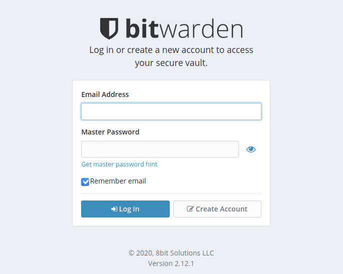
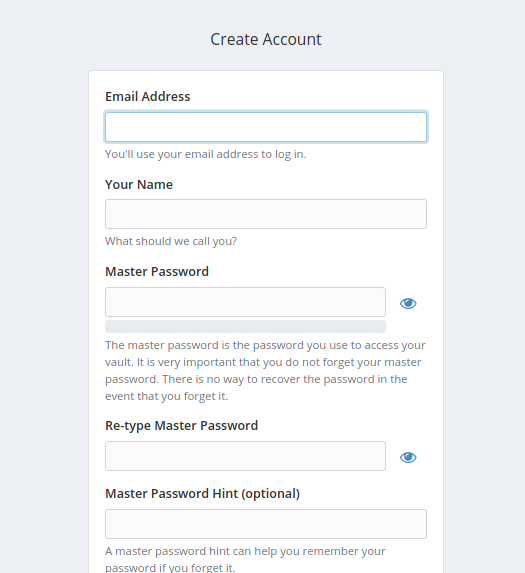
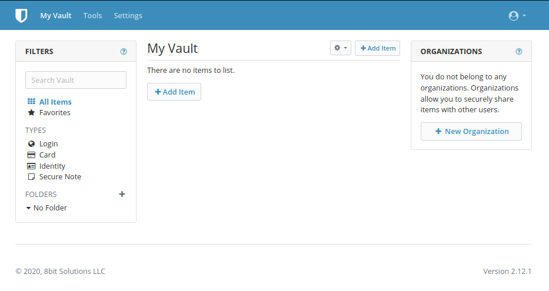
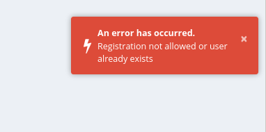
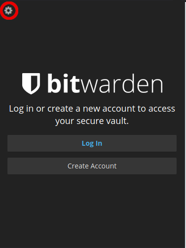

---
author:
  name: Linode Community
  email: docs@linode.com
description: 'This guide will explain how to set up and run a self-hosted instance of the bitwarden_rs password manager.'
keywords: ['security', 'web application', 'password', 'bitwarden']
license: '[CC BY-ND 4.0](https://creativecommons.org/licenses/by-nd/4.0)'
modified: 2020-02-24
published: 2020-02-24
modified_by:
  name: Linode
title: "How to Self-Host the bitwarden_rs Password Manager"
h1_title: "Self-Host the bitwarden_rs Password Manager"
contributor:
  name: Tyler Langlois
  link: https://tjll.net
---

[Bitwarden](https://bitwarden.com/) is an open source password management application that can be self-hosted and run on your own infrastructure. The [bitwarden_rs](https://github.com/dani-garcia/bitwarden_rs) project provides a lightweight, single-process, API-compatible service ideal for running personal instances. By running your own bitwarden_rs service, you can use Bitwarden browser extensions and mobile applications backed by your own server.


By self-hosting your own password manager, you are assuming responsibility for the security and resiliency of sensitive information stored within bitwarden_rs. Before storing important information and credentials within the application, ensure that you are confident with the security of your server and have taken the necessary backup measures mentioned in this tutorial.


## In this Guide

This guide will use the official bitwarden_rs [Docker image](https://github.com/dani-garcia/bitwarden_rs/wiki/Which-container-image-to-use). A reverse proxy ([Caddy](https://caddyserver.com/)) will be configured in front of the Docker container and provide TLS termination for both the web-based vault interface as well as the websocket server.

This configuration of bitwarden_rs will also use the default SQL backend for the application (sqlite3). The SQL datastore backing bitwarden_rs contains the user data for the application and is therefore the primary concern for a backup scheme to ensure that sensitive data stored within bitwarden_rs is saved in the event of a data loss scenario.

The version of bitwarden_rs that this guide references is 1.13.1, which is the latest version at the time of writing. As part of regular maintenance and to ensure that any relevant security updates are applied to the application, ensure that you follow the [upgrade instructions](https://github.com/dani-garcia/bitwarden_rs/wiki/Updating-the-bitwarden-image) provided by the project regularly to keep your deployment up to date with current upstream releases.

Ubuntu 18.04 is the distribution used in this guide. Generally speaking, any Linux distribution that supports running Docker containers should be equally compatible with the steps explained in this guide.

### Before you Begin

1. Familiarize yourself with our [Getting Started](/docs/getting-started) guide and complete the steps for setting your Linode's hostname and timezone.

1. Follow the "[How to Secure Your Server](/docs/security/securing-your-server/)" guide in order to properly harden your Linode against malicious users. This step is important to ensure bitwarden_rs is properly secured.

   
If you choose to configure a firewall, remember to open ports 80 and 443 for the Caddy server when you reach that portion of this tutorial.


1. Make sure you have registered a Fully Qualified Domain Name (FQDN) and set up [A and AAAA](/docs/networking/dns/dns-records-an-introduction/#a-and-aaaa) DNS records that point to your Linode's public [IPv4 and IPv6 addresses](/docs/getting-started/#find-your-linode-s-ip-address). Consult our [DNS Records: An Introduction](/docs/networking/dns/dns-records-an-introduction/) and [DNS Manager](/docs/platform/manager/dns-manager/) guides for help with setting up a domain. A proper domain name is important to acquire a certificate for HTTPS connectivity.

## Install Docker

1. First, uninstall any potentially previously-installed packages.

        sudo apt-get remove docker docker-engine docker.io containerd runc

   If `apt-get` indicates that no packages were found, continue normally.

1. Install package prerequisites for compatibility with the upstream Docker repository.

        sudo apt-get install apt-transport-https ca-certificates curl gnupg-agent software-properties-common

1. Add the official Docker GPG repository key.

        sudo curl -fsSL https://download.docker.com/linux/ubuntu/gpg | sudo apt-key add -

1. Add the Docker upstream repository.

        sudo add-apt-repository "deb [arch=amd64] https://download.docker.com/linux/ubuntu $(lsb_release -cs) stable"

1. Update the `apt` package cache.

        sudo apt-get update

1. Install the required Docker packages.

        sudo apt-get install docker-ce docker-ce-cli containerd.io

1. Start and enable the `docker` daemon.

        sudo systemctl enable --now docker

1. Confirm that you can run `docker` commands. The following command should return without errors and show zero running containers.

        sudo docker ps

## Install bitwarden_rs

This section will outline how to download the bitwarden_rs Docker image, setup volume persistence, and manage the Docker container.

1. Pull the bitwarden_rs image.

        sudo docker pull bitwardenrs/server:1.13.1

1. Select the desired filesystem path to store application data. In this guide, the path `/srv/bitwarden` will be used. Create the directory if necessary, and enforce strict permissions for the root user only.

        sudo mkdir /srv/bitwarden
        sudo chmod go-rwx /srv/bitwarden

1. Create the Docker container for bitwarden_rs.

        sudo docker run -d --name bitwarden -v /srv/bitwarden:/data -e WEBSOCKET_ENABLED=true -p 127.0.0.1:8080:80 -p 127.0.0.1:3012:3012 --restart on-failure bitwardenrs/server:1.13.1

    This command uses the following flags to establish a persistent container to serve the bitwarden_rs application:
    
    - `-d` daemonizes the container to run in the background.
    - Using `--name bitwarden` gives the container a human-readable name to avoid the need to reference the running container by a temporary identifier.
    - By passing the host path `/srv/bitwarden` to the volume (`-v`) flag, data will be persisted outside of the container whenever it is stopped.
    - The environment variable `WEBSOCKET_ENABLED` enables the extra websocket server for bitwarden_rs.
    - Each `-p` flag forwards the respective host ports to the container (port 8080 for the main bitwarden_rs web service and port 3012 for websocket traffic). Normal HTTP and HTTPS ports will be served with Caddy.
    - `--restart=on-failure` ensures that the container remains up in the event of container failure or host restart.

   As part of these steps, note that the container will listen for traffic on the local loopback interface (`127.0.0.1`) and _not_ a publicly reachable IP address. This is to ensure that any traffic originating from outside the host must connect to the Caddy server, which will enforce encrypted TLS connections.
    
## Configure Caddy as a Reverse Proxy

External clients will communicate with Caddy, which will automatically manage reverse proxying websocket traffic. Caddy will also provision as well as renew TLS certificates via Let's Encrypt automatically.

1. Pull the Caddy `alpine` image.

        sudo docker pull caddy/caddy:alpine

1. Create the following Caddyfile. Be sure to replace `example.com` with the name of your domain that you set up in the "Before You Begin" section of this guide, and have confirmed that the domain points to your Linode's IP address. This domain will serve the web interface for bitwarden_hs hosted and secured by Caddy's automatic TLS.

   
example.com {
  encode gzip

  # The negotiation endpoint is also proxied to Rocket
  reverse_proxy /notifications/hub/negotiate 0.0.0.0:8080

  # Notifications redirected to the websockets server
  reverse_proxy /notifications/hub 0.0.0.0:3012

  # Send all other traffic to the regular bitwarden_rs endpoint
  reverse_proxy 0.0.0.0:8080
}


1. Prepare a directory for Caddy in `/etc` to store state information such as Let's Encrypt certificates.

        sudo mkdir /etc/caddy
        sudo chmod go-rwx /etc/caddy

1. Start another Docker container to run a persistent `caddy` daemon.

        sudo docker run -d --name caddy -v /etc/Caddyfile:/etc/caddy/Caddyfile -v /etc/caddy:/root/.local/share/caddy --net host --restart on-failure caddy/caddy:alpine

   Many of these flags passed to the `docker` command are similar to those used in the `bitwarden_rs` instructions, with one notable difference. The `--net host` flag runs Caddy bound to the host machine's networking interface rather than constrained to the container, in order to simplify access to other containers and necessary ports for Caddy's operation over HTTP and HTTPS.

1. View the Caddy container's logs in order to confirm that a Let's Encrypt certificate has been provisioned for your chosen domain.

        sudo docker logs caddy

   There will likely be many logs that are returned from this command, so take a moment to read through the logs to verify that lines similar to the following are included in your log output, indicating that certificate provisioning has been successful.

   
2020/02/24 04:40:50 [INFO][example.com] Obtain certificate
2020/02/24 04:40:50 [INFO][example.com] Obtain: Waiting on rate limiter...
2020/02/24 04:40:50 [INFO][example.com] Obtain: Done waiting
2020/02/24 04:40:50 [INFO] [example.com] acme: Obtaining bundled SAN certificate
2020/02/24 04:40:50 [INFO] [example.com] AuthURL: <url>
2020/02/24 04:40:50 [INFO] [example.com] acme: Could not find solver for: tls-alpn-01
2020/02/24 04:40:50 [INFO] [example.com] acme: use http-01 solver
2020/02/24 04:40:50 [INFO] [example.com] acme: Trying to solve HTTP-01
2020/02/24 04:40:50 [INFO][example.com] Served key authentication (distributed)
2020/02/24 04:40:53 [INFO] [example.com] The server validated our request
2020/02/24 04:40:53 [INFO] [example.com] acme: Validations succeeded; requesting certificates
2020/02/24 04:40:54 [INFO] [example.com] Server responded with a certificate.


   If you find any log lines similar to the following, which indicate failure, double check that your server is reachable from your chosen domain.

   
2020/02/23 05:46:19 [INFO] Unable to deactivate the authorization: <url>
2020/02/23 05:46:19 [ERROR][example.com] failed to obtain certificate: acme: Error -> One or more domains had a problem:


   In order to avoid rate limiting problems, you should stop your `caddy` server if you find any certificate provisioning issues with `sudo docker stop caddy`. You may start the server again with `sudo docker start caddy` after resolving any issues found in the aforementioned container logs.

## Initial Setup

1. Navigate to your chosen domain in a local web browser (in this tutorial, `example.com`). Verify that your browser renders the Bitwarden web vault login page, and that the page is served over TLS/SSL.

   
   
   If you see the login page, congratulations! bitwarden_rs is running and operational. The first step in using the password manager is to create an account. Do so now by clicking on the "Create Account" button on the login page.

1. A new page will appear with several fields.

   

   Fill each field with the appropriate information, choosing a strong and secure master password.

   
Although a user email is required at time of registration, by default, your deployment of bitwarden_rs cannot send email without additional configuration. If you would like to configure SMTP in order to enable bitwarden_rs to send emails such as invitation emails, follow [these instructions on the bitwarden_rs wiki](https://github.com/dani-garcia/bitwarden_rs/wiki/SMTP-configuration) using SMTP information from your chosen SMTP provider.


1. After registering, you will be returned to the login screen. Log in with your chosen credentials, which should take you to the web vault view.

   

   At this point, your bitwarden_rs installation is functional.

### Disable Anonymous User Sign Up

As an additional security precaution, you may elect to disable user registration. This is recommended on servers that are publicly reachable to avoid abuse of the service.

1. Stop the running bitwarden_rs container and remove it.

        sudo docker stop bitwarden
        sudo docker rm bitwarden

1. Start a new bitwarden container, but with the `SIGNUPS_ALLOWED` environment variable set to `false`.

        sudo docker run -d --name bitwarden -v /srv/bitwarden:/data -e WEBSOCKET_ENABLED=true -e SIGNUPS_ALLOWED=false -p 127.0.0.1:8080:80 -p 127.0.0.1:3012:3012 --restart on-failure bitwardenrs/server:1.13.1

1. If you attempt to create a new account after these changes, the following error will appear on the account creation page.

   

   Your deployment of bitwarden_rs will not permit any additional user registrations. If you would like to invite users without needing to change the bitwarden_rs container environment variable flags, consider following the upstream documentation to [enable the admin panel](https://github.com/dani-garcia/bitwarden_rs/wiki/Enabling-admin-page) to provide user invitation functionality.

## Backup bitwarden_rs SQLite Database

Before relying on this service for any important data, you should take additional steps to safeguard the data stored within bitwarden_rs. Encrypted data is stored within a flat file sqlite3 database. In order to reliably backup this data, you should use the sqlite `.backup` command instead of simply copying the file in order to ensure that the database is in a consistent state when the backup is taken.

1. Review the ["Backing Up Your Data"](/docs/security/backups/backing-up-your-data/) guide in order to determine the best location to store your backups. In this example, a local filesystem path will be used. In a more resilient setup, these local backups should be replicated onto another service or host to guard against single-host failure.

1. Install the `sqlite3` package, which will provide the `sqlite3` command for the backup script.

        sudo apt-get install sqlite3

1. Create a directory for backups.

        sudo mkdir /srv/backup
        sudo chmod go-rwx /srv/backup

1. Create the following systemd service.

   
[Unit]
Description=backup the bitwarden sqlite database

[Service]
Type=oneshot
WorkingDirectory=/srv/backup
ExecStart=/usr/bin/env sh -c 'sqlite3 /srv/bitwarden/db.sqlite3 ".backup backup-$(date -Is | tr : _).sq3"'
ExecStart=/usr/bin/find . -type f -mtime +30 -name 'backup*' -delete


   This service unit will create a timestamped file and cleanup any backups older than 30 days.

1. To take an initial backup and verify the systemd service works, start the backup service.

        sudo systemctl start bitwarden-backup.service

1. Verify that a backup file is present:

        sudo ls -l /srv/backup/

   This command should return with one backup sqlite3 file shown.

   
total 136
-rw-r--r-- 1 root root 139264 Feb 24 18:16 backup-2020-02-24T18_16_50-07_00.sq3


1. To schedule regular backups using this backup service unit, create the following systemd timer unit.

   
[Unit]
Description=schedule bitwarden backups

[Timer]
OnCalendar=04:00
Persistent=true

[Install]
WantedBy=multi-user.target


   This schedules the backup to occur at 4:00 in the time zone set for your Linode. You may alter this time to trigger at your desired time of day.

   
The `Persistent=true` line instructs systemd to fire the timer if the timer was unable to trigger at its previous target time, such as if the system was being rebooted.


1. Start and enable this timer unit.

        sudo systemctl enable bitwarden-backup.timer
        sudo systemctl start bitwarden-backup.timer

1. Finally, to view the timer's next execution time, check the status of the timer.

        systemctl status bitwarden-backup.timer

   You should see output similar to the following:

   
● bitwarden-backup.timer - schedule bitwarden backups
  Loaded: loaded (/etc/systemd/system/bitwarden-backup.timer; enabled; vendor preset: enabled)
  Active: active (waiting) since Mon 2020-02-24 22:09:44 MST; 7s ago
  Trigger: Tue 2020-02-25 04:00:00 MST; 5h 50min left


   This indicates that a backup will be taken in 5 hours and 50 minutes.


Ensure that your backups are kept on a volume or host independent of your Linode in case of a disaster recover recovery scenario. Consider using [Linode Block Storage](/docs/platform/block-storage/how-to-use-block-storage-with-your-linode/) as one potential solution for permanent backup storage and archival.


## Using bitwarden_rs

bitwarden_rs provides a compatible API for many [Bitwarden apps and browser extensions](https://bitwarden.com/). In order to configure these applications to use your hosted instance, you may need to configure your mobile application or browser extension to rely on your custom domain and API endpoint.

1. As an example, this is the initial login screen for the Firefox Bitwarden browser extension. In order to configure a custom server, click on the gear in the upper left corner.

   

1. On the next page, enter your custom domain under "Server URL", such as `https://example.com`. Similar steps can be taken on the iOS and Android mobile applications - edit your application's settings before login to use a custom Server URL, and you will log in to your custom instance of bitwarden_rs.

## Additional Reading

With bitwarden_rs running securely over TLS and regularly backed up, you may choose to follow [additional documentation provided by the bitwarden_rs project](https://github.com/dani-garcia/bitwarden_rs/wiki) to add more functionality to your installation. Some of these features include:

- [Support for U2F authentication](https://github.com/dani-garcia/bitwarden_rs/wiki/Enabling-U2F-authentication)
- [SMTP configuration to support sending emails](https://github.com/dani-garcia/bitwarden_rs/wiki/SMTP-configuration) for features like account creation invitation
