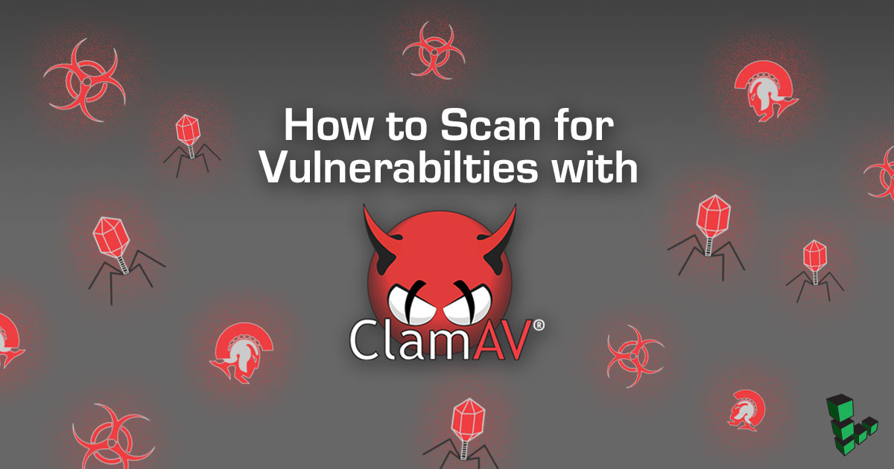

---
author:
  name: Harry Phillips
  email: docs@linode.com
og_description: 'If you suspect your Linode might be compromised by malware, you can boot into rescue mode and scan your system with ClamAV. Learn more with our guide.'
description: "ClamAV lets you scan your system for malware while your Linode is running in rescue mode."
keywords: ["malware", " ClamAV", " vulnerability", " scan", " antivirus"]
license: '[CC BY-ND 4.0](https://creativecommons.org/licenses/by-nd/4.0)'
aliases: ['security/scanning-your-linode-for-malware/']
modified: 2019-04-17
modified_by:
  name: Linode
published: 2017-10-31
title: How to Scan for Vulnerabilties with ClamAV
external_resources:
 - '[ClamAV](https://www.clamav.net/)'
 - '[Recovering from a System Compromise](/docs/security/recovering-from-a-system-compromise/)'
---

## Introduction
The following instructions show how to run a malware scan using [ClamAV](https://www.clamav.net/) on your system. This guide will help you investigate a system that you suspect might be compromised or infected.


This guide does not guarantee removal of all possible compromises, only malware known by ClamAV.


## Before You Begin

1.  The steps in this guide require root privileges. Because you are booting into FINNIX and using root by default, this should not be a problem. If you are adapting these steps to run in a different environment, be sure to run the steps below as `root` or with the `sudo` prefix. For more information on privileges, see our [Users and Groups](/docs/tools-reference/linux-users-and-groups/) guide.

2.  Boot your Linode into rescue mode. For more information about rescue mode, see our [Rescue and Rebuild](/docs/troubleshooting/rescue-and-rebuild/#booting-into-rescue-mode) guide.

    
You need to follow only the steps mentioned in sections **Booting into Rescue Mode** and **Connecting to a Linode Running in Rescue Mode**.


    The typical difference between rescue mode and booting your Linode is that in rescue mode, your Linode starts up from a separate Linux Distribution called FINNIX, which does not automatically run any services that may be compromised. FINNIX also uses a virtual disk that is kept in memory. Changes to this virtual disk are lost if you reboot your Linode.

3.  When you are in rescue mode, you can access your Linode’s disks, but you have to mount them first. The path to the disks will be different from what you would see if you booted normally.


If your Linode has had networking restrictions imposed to prevent it from performing malicious activity, such as sending out SPAM or brute forcing other servers, you will need to contact Linode Support via a [support ticket](https://www.linode.com/contact), calling 855-454-6633 in the U.S. or +1 609-380-7100 from outside the U.S. The support team will temporarily lift these restrictions while you are in rescue mode.


## Install ClamAV

1.  Update the Finnix GPG Key:

        gpg --keyserver keys.gnupg.net --recv-keys 04EE7237B7D453EC 648ACFD622F3D138
        gpg -a --export B7D453EC | apt-key add -
        gpg -a --export 22F3D138 | apt-key add -

2.  Update your packages:

        apt update

3.  Install ClamAV into your temporary RAM disk:

        apt install clamav

4.  Update the malware definitions.

        freshclam

5.  Mount your Linode’s Disks:

        mount -o barrier=0 /dev/sda

    
The following assumes that you have only one disk that you want to scan and you assigned that disk to `/dev/sda` when you booted into rescue mode. If you have more than one disk, just repeat the following steps for each disk that you need to mount, replacing `/dev/sda` with the name of each disk.


## Scan Your System

1.  Create a quarantine directory to deposit any detected malware, so you can analyze it later if desired:

        mkdir -p /media/sda/clamav/log/
        mkdir -p /media/sda/clamav/quarantine/

2.  Run the scan:

        clamscan -r --log=/media/sda/clamav/log/scan.log --move=/media/sda/clamav/quarantine /media/sda

    This operation might take some time to complete. On completion, a scan summary will show the number of infected files.

3. Review the ClamAV logs, located at `/media/sda/clamav/log/scan.log`. Any malware found during the scan can be found in `/media/sda/clamav/quarantine/`.
