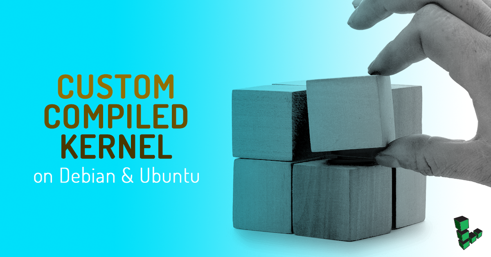
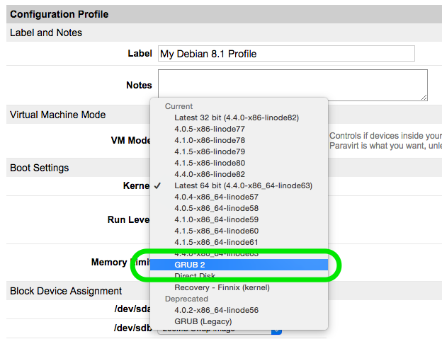

---
author:
  name: Alex Fornuto
  email: docs@linode.com
description: 'Instructions for compiling and configuring a custom kernel your Debian or Ubuntu Linode'
keywords: ["compile kernel", "kernel compiling", "custom linux kernel", "custom linode", " debian", "ubuntu"]
license: '[CC BY-ND 4.0](https://creativecommons.org/licenses/by-nd/4.0)'
modified: 2017-08-01
modified_by:
  name: Linode
published: 2017-08-01
title: 'Custom Compiled Kernel on Debian & Ubuntu'
---

Compiling your own Linux kernel is useful if you need to enable or disable certain kernel features that are not available in Linode-supplied or distribution-supplied kernels. For example, some users desire [SELinux](http://en.wikipedia.org/wiki/Security-Enhanced_Linux) support, which is not enabled in stock Linode kernels, and may not be enabled in some distribution-supplied kernels.

If you'd rather run a distribution-supplied kernel instead, please follow our guide for [Running a Distribution-Supplied Kernel](/docs/tools-reference/custom-kernels-distros/run-a-distribution-supplied-kernel-with-kvm).

Prior to these instructions, follow the steps outlined in our [Getting Started guide](/docs/getting-started/). Then, log in to your Linode as the `root` user.

## Prepare the System

1.  Update your package repositories and installed packages, and install additional packages needed for compiling and running your kernel:

        apt-get update && apt-get upgrade
        apt-get install -y build-essential libncurses5-dev gcc libssl-dev grub2 bc

    
When installing `GRUB`, you'll be asked which disk images you'd like GRUB to configure. Unless you're planning on using the **Direct Disk** option in the Linode Configuration Manager, this is not required.


2.  Since some distributions install a pre-compiled kernel package into the `/boot/` directory along with their development package, avoid confusion later by removing any existing files there. **Warning**, this will delete everything within the `/boot/` directory _without_ asking for confirmation:

        rm -rf /boot/*

## Compile and Install the Kernel

### Download Kernel Sources

1.  Download the latest 4.x kernel sources from [kernel.org](http://kernel.org/). A conventional location to download to is `/usr/src/`:

        cd /usr/src
        wget https://cdn.kernel.org/pub/linux/kernel/v4.x/linux-4.7.tar.xz

2.  Expand the archived file and change directories:

        tar -xvf linux-4.7.tar.xz
        cd linux-4.7

### Configure the Kernel

The kernel must be properly configured to run within the Linode environment. Some required configuration options may include:

    CONFIG_KVM_GUEST=y
    CONFIG_VIRTIO_PCI=y
    CONFIG_VIRTIO_PCI_LEGACY=y
    CONFIG_SCSI_VIRTIO=y
    CONFIG_VIRTIO_NET=y
    CONFIG_SERIAL_8250=y
    CONFIG_SERIAL_8250_CONSOLE=y

We recommend that you start with a kernel configuration (config) from a running Linode kernel. All Linode kernels expose their configuration via `/proc/config.gz`. For example:

    zcat /proc/config.gz > .config
    make oldconfig

`make oldconfig` prompts the user to answer any new configuration options not present in the old configuration file.

Changes to the kernel's configuration can be made with the `menuconfig` command. Enable any additional options, making sure to leave filesystem support (likely ext3 or ext4) compiled into the kernel (*not* configured as a module). For example, to enable SELinux support, check the option "Security options --\> NSA SELinux Support" in the configuration interface:

    make menuconfig

Once your configuration options are set, exit the configuration interface and answer "y" for yes when asked whether you would like to save the new kernel configuration.

### Compile the Kernel

1.  Compile and install the kernel and modules:

        make deb-pkg

2.  The `make deb-pkg` command will create five deb packages in /usr/src/ that you will need to install:

        dpkg -i linux-*.deb

3.  Edit `/etc/default/grub` and add or change the following variables to match. Comment or remove any lines starting with `GRUB_HIDDEN`, and if the word *splash* appears in the line `GRUB_CMDLINE_LINUX_DEFAULT`, remove it. There will be other variables in this file, but we are only concerned with those listed below:

    
GRUB_TIMEOUT=10
GRUB_DISABLE_LINUX_UUID=true
GRUB_CMDLINE_LINUX="console=tty1 console=ttyS0,19200n8 net.ifnames=0"
GRUB_SERIAL_COMMAND="serial --speed=19200 --unit=0 --word=8 --parity=no --stop=1"
GRUB_TERMINAL=serial
GRUB_GFXPAYLOAD_LINUX=text
GRUB_DISABLE_OS_PROBER=true



4.  Update the bootloader:

        update-grub

## Configure the Linode

1.  In the Linode Dashboard, click **Edit** next to your Configuration Profile (usually named after the version of Linux installed).

2.  Under **Boot Settings** Click on the **Kernel** drop-down menu, and select **GRUB2**:

    

3.  Click **Save Changes**. You can now reboot the Linode. We suggest opening a [LISH](/docs/networking/using-the-linode-shell-lish) or [GLISH](/docs/networking/using-the-graphic-shell-glish) session first, so you can monitor the boot process and troubleshoot if necessary.

    
You may need to run `cp /boot/grub/unicode.pf2 /boot/grub/fonts/` for the boot menu to properly display in GLISH. Your Linode will still boot, assuming there are no configuration issues, without this command.


Congratulations, you've booted your Linode using a custom-compiled kernel!

