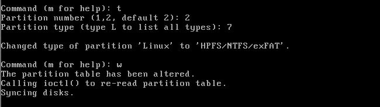

---
author:
  name: Scott Lott
  email: scott@clicksimply.com
description: 'Run Windows 7/Windows Server 2012 or newer on Servers.'
keywords: 'windows, windows server, windows 10, windows 8, windows 7, windows server 2012, windows server 2012 R2, windows 8.1, kvm'
license: '[CC BY-ND 4.0](https://creativecommons.org/licenses/by-nd/4.0)'
published: 'Friday, June 24th, 2016'
modified: Friday, June 24th, 2016
modified_by:
  name:  Scott Lott
title: 'Windows on Linode'
contributor:
  name: Scott Lott
  link: Website
  external_resources:(replace /dev/sda2(replace /dev/sda2
- '[ClickSimply.com](http://clicksimply.com)'
---

*This is a Linode Community guide. Write for us and earn $250 per published guide.*

## Introduction
Linode has a wide selection of popular Linux distributions that fill almost any web hosting need.  But what if you don't even want to use Linux, what if you want to run Windows Server?  Or maybe  you’d just like to setup a remote workstation?  Thanks to recent additions like KVM and the wide suite of tools Linode provides it’s now possible to do this, and only takes a short while to set up!

## Before You Begin
You should be comfortable with the Linux command line, installing software, and installing operating systems.  You should also be familiar with the difference between a disk & partition including how they work together.  We'll be following the same general principal as the [Linode Custom Distro Guide](https://www.linode.com/docs/tools-reference/custom-kernels-distros/running-a-custom-linux-distro-on-a-linode-vps) with a few key differences to make it work with Windows.

To complete the guide you'll need these resources:

1. A Linux, Windows, or OS X host computer with at least 30 GB of free hard drive space and a stable internet connection.

2. Download a copy of a [Finnix](http://www.finnix.org/Download) Linux.

3. Download a copy of [VirtualBox](https://www.virtualbox.org/wiki/Downloads) for the host OS you're using.

4. An authentic copy of Windows.  I’ve tested this process back to Windows 7/Windows Server 2012 but we’ll be using a [Windows 10 trial](https://www.microsoft.com/en-us/evalcenter/evaluate-windows-10-enterprise) for this guide.

5. An active Linode VPS.

6. A few spare hours.

{: .caution}
>Linode's backup system uses partition level scanning to work, Windows NTFS partitions aren't compatible with the system at all.  This means you won't be able to use Linode's automatic backup system with th VPS holding Windows on it.

## A Quick Summary
Sometimes it's helpful to get the big picture before diving into something, so here's basically what we're going to do in this guide:

1. Create two virtual machines, one on Linode and one on our local computer.

2. Install Windows on our local VM and enable remote desktop connections.

3. Clone the local VM disk to the Linode VPS.

4. Increase the size of the Windows partition to fill the VPS drive space.

5. Use RDP on the local machine to connect to the VPS.

Excellent, let's get started!

## Setup Windows On A Local Virtual Machine
The first step of the process is to make a Windows based virtual machine that is preconfigured to run in a remote environment.  We'll configure the VM, install Windows, then make some small changes to the Windows settings.

1. Head over to the [VirtualBox Website](https://www.virtualbox.org/wiki/Downloads) and download a free copy of VirtualBox for the host OS you're using.  Install VirtualBox and open it up.

2. Now let's make the VM.  You can give it whatever name makes sense to you.

	

3. 2GB of ram is fine, this just needs to be enough to run the VM on your local machine. 

	

4. Hit "Next" through the defaults until this screen.  The HDD should be no larger than 24GB, the smaller the better.

	

5. Now attach the Windows ISO to the VM.

	

6. Boot up the VM and setup Windows.  Once you're on the Windows Desktop, you're ready for the next step.

	{: .caution}
	> * Install Windows on a single partition that fills the hard drive (basically the default settings).
	> * Don't install any programs or add files to the system at this point!  We need it to be as light on disk space as possible.
	> * If possible, don't yet activate Windows.  Wait until after Windows is installed on the Linode VPS to activate it.  The change in hardware will likely force the need for a second activation if you do it now.
	> * Don't install the VirtualBox Guest additions, they'll just get in your way and needlessly fluff up the system.

	

7. Now we need to enable remote desktop.  There is an [article on How-To Geek](http://www.howtogeek.com/howto/windows-vista/turn-on-remote-desktop-in-windows-vista/) on this for all modern Windows systems.  The screenshots below outline how it can be done in Windows 10 Enterprise.

	7.1 Go to the control panel, then System & Security.
	
	

	7.2 Select "Allow Remote Access" under the "System" heading.
	
	

	7.3 Make sure the "Allow Remote Connections" option is checked.  I unchecked the secure option to keep things simple for now, this is an easy setting to adjust later in production mode.

	

8. Now that we have remote desktop enabled, lets shutdown the Windows VM and minimize VirtualBox.  We're going to work on someting else for the next few minutes.

## Setup A Linode VPS
In the last step we prepared a Windows system to send over the wire to a VPS, but right now there's nowhere to send it.  We've got to configure a minimal VPS server and set it up to recieve the Windows image.

1. Create a new Linode VPS, the smallest Linode VPS will work so pick whatever size you'd like. 

2. Once the VM is created, we're going to make a single disk using the settings below.  The size should be the largest possible allowed, filling all available disk space for this VPS.

	

3. Now we need a Configuration Profile that will boot Windows.  The settings below get it done.

	
	...
	

4. Next we boot the VPS into Rescue Mode and access it via the Glish interface.

	
    
	The Glish option is under the "Remote Access" tab.
    
	

5. Set a password using the `passwd` command.
 
	

6. Now start up the SSH server with `service ssh start`.
	
    
	
    We're good to go on setting up the VPS, lets get Windows moved over to your VPS!

## We Need To Move Your Windows, All Of Them
Okay, we've got both ends setup now and we're ready to copy the Windows system over. 

We're going back to the local Windows Virtual Machine.  We need to boot it up with Finnix instead of Windows.  If you haven't already downloaded Finnix you can do so [here](http://www.finnix.org/Download).

1. Select the Finnix ISO to boot in VirtualBox.

	

2. Bootup Finnix and select the 64-bit boot option.

	
	
    Once you get the command line you're good to go.
	
    

3. Alright, we're ready to do the transfer with the following command:

		dd if=/dev/sda | pv | gzip -9 | ssh root@LinodeIP "gzip -d | dd of=/dev/sda"
        
	The first "/dev/sda" is the local vm drive that holds windows, the last "/dev/sda" is the location of the empty disk we created a few minutes ago.  If you need to find out which drive is which use `fdisk -l` to see what drives are connected to the system.
        
	Once you start the command, you'll likely get asked to accept a certficiate.  Type "yes" and enter, then type the password you set earlier for the VPS when prompted.  The transfer will begin once the password is accepted.
	
    

	This can take a while, up to a few hours.  Take a nap, let this run overnight, walk the dog, etc.

4. When the transfer completes, we should see something like this:

	
	
    At this point we can shutdown the local vm with `shutdown -h now` and delete the VM completely from our computer.
	
    

## Finishing Up & RDP
1. We need to go back to our Glish window for the VPS.  When you bring the Glish window back up the screen will just be black, press a button to wake it up and see the command line like we left it.  Lets do a restart with `reboot`.
	
    

2. Once the VPS shuts down it's going to cancel the current Glish session so close the Glish window when this happens.  Then, reopen the Glish window.  You should be seeing a Windows boot logo and finally a login screen.  Success!
	
    

	Your mouse doesn't work, that's okay because we're going to use a different protocol from here on out for remote access to your VPS, RDP.  Let's close the Glish window one last time.

3. Time to connect to your VPS with RDP.  We have to setup an RDP Client on our host computer.  

	3.1 **Windows Host**: Press the Windows Key + R and type "mstsc" then press enter.

	3.2 **OS X Host**: Download the free [Remote Desktop App](https://itunes.apple.com/us/app/microsoft-remote-desktop/id715768417?mt=12) from the App Store.
	
	3.3 **Linux Host**: Visit [this page](https://github.com/FreeRDP/Remmina/wiki) and follow the instructions to install Remmina RDP client. 

4. Once you get the RDP application up, it's time to connect to your VPS.  The "Computer" we're connecting to is the IP Address for your VPS.  The OS X and Linux RDP clients will look different, but configuration should be identical.

	

5. The next few images are just going through the final connection steps:
	
    
    
    We use the manually login option, using the login details we set for our Windows system when we installed it.
    
	
    
	
	
    And Voila!  We should now be remotely connected to Windows running on your VPS.  Technically you could stop here but there's some more loose ends we should take care of. 
	
    

## Making the Drive Bigger
Now that we've got Windows running on our VPS we need to fill the availble disk space with the Windows partition.

1. We need to do a proper shutdown of Windows since we're resizing the disk.  Start by going into the control panel and disable Lassie.

	

2. We can't shutdown Windows from the start menu in a remote desktop session, so open a command prompt by clicking on the start menu and searching for "cmd".  Then, enter this into the command window:
	
    	shutdown /s /t 0
        
	The VPS will shutdown and close your RDP session automatically.

3. Once that's all done it's time to reboot into rescue mode again, we're going to use Finnix to resize the Windows partition.  Once it boots up, bring up the Glish console.
	
    
	
    Then on the Remote Access tab...
	
    

4. Lets dive into the primary disk, type `fdisk /dev/sda`.  Next press 'd'.  You'll be asked for a partition number.  The partition number is the last number of the partition location, for example we'd type a '2' here to target /dev/sda2.
	
    
	
    Don't worry about the whole "Partition has been deleted" message.  We'll take care of that in the next step.

5. Okay, now lets remake the partition at a larger size.  Type 'n', then enter, 'p', then enter. Next type "2" for the partition number and enter.  For the First Sector it needs to stay exactly the same as it was before.  Just press enter to apply the default, finally the Last Sector should be as high as possible, also usually the default so just press enter again.  

	

6. To finish up with fdisk we'll set the partition type then write the changes to disk.  Type "t" to go into partition type mode, select the same partition as before, then provide "7" as the partition type.  Finally, type "w" to commit changes and press enter.  All done with fdisk!
	
    

7. Now that we've resized the physical disk and the partition container, we need to resize the partition itself.  Let's type `ntfsresize --info /dev/sda2` (replace /dev/sda2 with whatever the primary partition is) into the Glish window to see how things are going.
	
    
	
    Notice space in use shows 49%, exactly what we want to see since we doubled the disk size from it's original.  Let's go ahead and resize the NTFS partition.  

8. I setup a  4096 VPS with a 48 GB hard drive, so the command I'm going to use is:

		ntfsresize --size 48G /dev/sda2
	
    You'll replace "48G" with the GB size of the VPS you have.
	
    
	
    Don't worry about oversizing the partition, ntfsresize won't let you.  It's possible to play with the GB number a little to get a bit more space out of the system, your mileage may vary.

9. That's it!  The resize is complete, shutdown with `shutdown -h now`, turn Lassie back on, then boot up your Windows VPS normally with the new larger disk!  Once you access it via RDP you should see all the new space and other resouces!
	
    

{: .caution}
>This process almost always causes windows to do a chkdsk on startup and show the startup recovery options.  You can use Glish to skip past most of it or just expect to wait a few minutes for the first boot to finish.

## More Reading
* For long term use it's best to lock down the RDP connection using [this guide from How-To Geek](http://www.howtogeek.com/175087/how-to-enable-and-secure-remote-desktop-on-windows/).