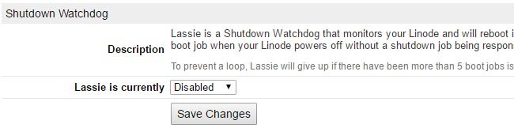

---
author:
  name: Scott Lott
  email: scott@clicksimply.com
description: 'Run Windows 7/Windows Server 2012 or newer on Servers.'
keywords: 'windows, windows server, windows 10, windows 8, windows 7, windows server 2012, windows server 2012 R2, windows 8.1, kvm'
license: '[CC BY-ND 4.0](https://creativecommons.org/licenses/by-nd/4.0)'
published: 'Friday, June 24th, 2016'
modified: Weekday, Month 00th, 2015
modified_by:
  name:  Scott Lott
title: 'Windows on Linode'
contributor:
  name: Scott Lott
  link: Website
  external_resources:
- '[ClickSimply.com](http://clicksimply.com)'
---

*This is a Linode Community guide. Write for us and earn $250 per published guide.*

## Introduction
Linode has a wide selection of popular Linux distributions that fill almost any web hosting need.  But what if you don't even want to use Linux, what if you want to run Windows Server?  Or maybe  you’d just like to setup a remote workstation?  Thanks to recent additions like KVM and the wide suite of tools Linode provides it’s now possible to do this, and only takes a short while to set up!

## Before You Begin
You should be comfortable with the Linux command line, installing software, and installing operating systems.  You should also be familiar with the difference between a disk & partition including how they work together.  We'll be following the same general principal as the [Linode Custom Distro Guide](https://www.linode.com/docs/tools-reference/custom-kernels-distros/running-a-custom-linux-distro-on-a-linode-vps) with a few key differences to make it work with Windows.

To complete the guide you'll need these resources:
1. A Linux, Windows, or OS X host computer with at least 30 GB of free hard drive space and a stable internet connection.
2. Download a copy of a [Finnix](http://www.finnix.org/Download) Linux.
3. Download a copy of [VirtualBox](https://www.virtualbox.org/wiki/Downloads) for the host OS you're using.
3. An authentic copy of Windows.  I’ve tested this process back to Windows 7/Windows Server 2012 but we’ll be using a [Windows 10 trial](https://www.microsoft.com/en-us/evalcenter/evaluate-windows-10-enterprise) for this guide.
4. An active Linode2048.
5. A few spare hours.

{: .caution}
>
>Linode's backup system uses partition level scanning to work, Windows NTFS partitions aren't compatible with the system at all.  This means you won't be able to use Linode's automatic backup system with th VPS holding Windows on it.

## Setup Windows On A Local Virtual Machine
The first step of the process is to make a Windows based virtual machine that is preconfigured to run in a remote environment.  We'll configure the VM, install Windows, then make some small changes to the Windows settings.

1. Head over to the [VirtualBox Website](https://www.virtualbox.org/wiki/Downloads) and download a free copy of VirtualBox for the host OS you're using.  Install VirtualBox and open it up.

2. Now let's make the VM.  You can give it whatever name makes sense to you.

3. 2GB of ram is fine, this just needs to be enough to run the VM on your local machine. 

4. Hit "Next" through the defaults until this screen.  We need the VM to have exactly 24GB to match the Linode VPS we're going to copy this to later.

5. Now attach the Windows ISO to the VM.

6. Boot up the VM and setup Windows.  Once you're on the Windows Desktop, you're ready for the next step.
{: .caution}
>
> * Don't install any programs or add files to the system at this point!  We need it to be as light on disk space as possible.
> * If possible, don't yet activate Windows.  Wait until after Windows is installed on the Linode VPS to activate it.  The change in hardware will likely force the need for a second activation if you do it now.
> * Don't install the VirtualBox Guest additions, they'll just get in your way and needlessly fluff up the system.

7. Now we need to enable remote desktop.  There is an [article on How-To Geek](http://www.howtogeek.com/howto/windows-vista/turn-on-remote-desktop-in-windows-vista/) on this for all modern Windows systems.  The screenshots below outline how it can be done in Windows 10 Enterprise.

	7.1 Go to the control panel, then System & Security.

	7.2 Select "Allow Remote Access" under the "System" heading.

	7.3 Make sure the "Allow Remote Connections" option is checked.  I unchecked the secure option to keep things simple for now, this is an easy setting to adjust later in production mode.

8. Now that we have remote desktop enabled, lets shutdown the Windows VM and minimize VirtualBox.  We're going to work on someting else for the next few minutes.

## Setup A Linode VPS
In the last step we prepared a Windows system to send over the wire to a VPS, but right now there's nowhere to send it.  We've got to configure a minimal VPS server and set it up to recieve the Windows image.

1. Create a new "2048" VPS.  I know that's crazy small, we'll go over how to resize to a larger VPS later.  For now, it's just easier to keep the resources identical to the local VM.

2. Once the VM is created, we're going to make a single disk using the settings below.

3. Now we need a Configuration Profile that will boot Windows.  The settings below get it done.

..

4. Next we boot the VPS into Rescue Mode and access it via the Glish interface.

The Glish option is under the "Remote Access" tab.

5. Set a password using the `passwd` command.

6. Now start up the SSH server with `service ssh start`.

7. We're almost done here!  Before the next step, we need to know where are primary disk is.  We can do that with `fdisk -l`.

We can see a few disks here, but only one of them is 24 GiB, the exact size we set our primary disk before!  Knowing the size, we can see above that the primary disk is located at "/dev/sda".  Let's write that down and label it "Remote Disk Location".  Once you write it down, go ahead and close the Glish window but keep your VPS running.

## We Need To Move Your Windows, All Of Them
Okay, we've got both ends setup now and we're ready to copy the Windows system over to VPS. 

We're going back to the local Windows Virtual Machine.  We need to boot it up with Finnix instead of Windows.  If you haven't already downloaded Finnix you can do so [here](http://www.finnix.org/Download).

1. Select the Finnix ISO to boot in VirtualBox.

2. Bootup Finnix and select the 64-bit boot option.

Once you get the command line you're good to go.

3. We need to know what disk to copy, let's see what disks are present with `fdisk -l`.

We can see that "/dev/sda" has a 24 GiB size, this is our primary disk!  Write down that disk location and label it "Local Disk Location".  On this virtual machine we can see it's "/dev/sda", yours is probably the same but we still need to make 100% sure.

4. Alright, we're ready to transfer the Windows HDD over to the VPS with the following command:
	dd if={Local Disk Location} | pv | gzip -9 | ssh root@{VPS IP} "gzip -d | dd of={Remote Disk Location}"
Where {Local Disk Location} \== your local disk location we found, {Remote Disk Location} \== the remote disk location we found, and {VPS IP} \== the IP address of your Linode VPS.  For example, my command looks like this:
	dd if=/dev/sda | pv | gzip -9 | ssh root@45.33.41.131 "gzip -d | dd of=/dev/sda"
Once you start the command, you'll likely get asked to accept a certficiate.  Type "yes" and enter, then type the password you set earlier for the VPS when prompted.  The transfer will begin once the password is accepted.

This can take a while, up to a few hours.  Take a nap, let this run overnight, walk the dog, etc.
*The command used in this step was originally contributed by [Nathan Sweet](https://github.com/NathanSweet).*

5. When the transfer completes, we should see something like this:

At this point we can shutdown the local vm with `shutdown -h now` and delete the VM completely from our computer.

## Finishing Up & RDP
1. We need to go back to our Glish window for the VPS.  When you bring the Glish window back up the screen will just be black, press a button to wake it up and see the command line like we left it.  Lets do a restart with `reboot`.

2. Once the VPS shuts down it's going to cancel the current Glish session so close the Glish window when this happens.  Then, reopen the Glish window.  You should be seeing a Windows boot logo and finally a login screen.  Success!

Your mouse doesn't work, that's okay because we're going to use a different protocol from here on out for remote access to your VPS, RDP.  Let's close the Glish window one last time.

3. Time to connect to your VPS with RDP.  We have to setup an RDP Client on our host computer.  
	3.1 **Windows Host**: Press the Windows Key + R and type "mstsc" then press enter.
	3.2 **OS X Host**: Download the free [Remote Desktop App](https://itunes.apple.com/us/app/microsoft-remote-desktop/id715768417?mt=12) from the App Store.
	3.3 **Linux Host**: Visit [this page](https://github.com/FreeRDP/Remmina/wiki) and follow the instructions to install Remmina RDP client. 

4. Once you get the RDP application up, it's time to connect to your VPS.  The "Computer" we're connecting to is the IP Address for your VPS.  The OS X and Linux RDP clients will look different, but configuration should be identical.

5. The next few images are just going through the final connection steps:

And Voila!  We should now be remotely connected to Windows running on your VPS.  Technically you could stop here but there's some more loose ends we should take care of. 

## Making the Drive Bigger
Now that we've got Windows running on our VPS we need to give it some extra space.  25 GB will get filled up instantly on any Windows install so let's do this.

1. Disconnect your RDP session, then go into the Linode Manager and disable Lassie for your VPS.
2. Reconnect to the VPS using Glish like we did before.  Once the black Glish window appears, hit the spacebar to bring the screen to life and show the login page.  We need to perform a proper Windows shutdown since we're resizing the disks.  By tapping the "Tab" and arrow keys you can navigate to the power icon and press enter.  Then select shutdown from the dropdown list using the arrows and enter key once again.

Close the glish window once it shuts down.

3. Resize your VPS to whatever size you'd like now that it's shut down.  I'm just going to bump up to the 4096.

4. Edit the single disk on your VPS to make it larger to acomodate the bigger disk size.

5. Once that's all done it's time to reboot into rescue mode again, we're going to use Finnix to resize the Windows partition.  Once it boots up, bring up the Glish console.

Then on the Remote Access tab...

6. We need to resize the partition container first, fdisk is the best tool for this.  Our Windows partition should be at /dev/sda2 but lets just confirm that with a `fdisk -l`

We can see that our primary disk is still at /dev/sda by seeing that it's 48 GiB in size, exactly how big we set in the Linode Manager in step 4. Under /dev/sda we see two partitions, one of them is 23.5G, that's almost exactly the same size we set our original Windows partition a while ago.  So sure enough, /dev/sda2 is our primary partition.  Let's get to work on it.

7. Lets dive into the primary disk, type `fdisk /dev/sda`.  Replace '/dev/sda' with the primary disk you found in the previous step.  Next press 'd'.  You'll be asked for a partition number.  The partition number is the last number of the partition location in the last step, for example we'd type a '2' here to target /dev/sda2. Once we press enter the command will get executed.

Don't worry about the whole "Partition has been deleted" message.  We'll take care of that in the next step.

8. Okay, now lets remake the partition at a larger size.  Type 'n', then enter, 'p', then enter. Next give it the partition number we've been using (probably 2).  For the First Sector just press enter to apply the default, finally the Last Sector should be as high as possible, also usually the default so just press enter again.  

9. To finish up with fdisk we'll set the partition type then write the changes to disk.  Type "t" to go into partition type mode, select the same partition as before, then provide "7" as the partition type.  Finally, type "w" to commit changes and press enter.  All done with fdisk!

10. Now that we've resized the physical disk and the partition container, we need to resize the partition itself.  Let's type `ntfsresize --info /dev/sda2` (replace /dev/sda2 with whatver the primary partition is) into the Glish window to see how things are going.

Notice space in use shows 49%, exactly what we want to see since we doubled the disk size from it's original.  Let's go ahead and resize the NTFS partition.  

11. I resized to a 48GB VPS, so the command I'm going to use is:
	ntfsresize --size 48G /dev/sda2
You'll replace "48G" with the GB size of the VPS you have and "/dev/sda2" with your primary partition.  When prompted to confirm accept with the enter key and the resize will happen.

Don't worry about oversizing the partition, ntfsresize won't let you.  It's possible to play with the GB number a little to get a bit more space out of the system, your mileage may vary.

12. That's it!  The resize is complete, shutdown with `shutdown -h now`, turn Lassie back on, then boot up your Windows VPS normally with the new larger disk!  Once you access it via RDP you should see all the new space and other resouces!

{: .caution}
>
>This process almost always causes windows to do a chkdsk on startup and show the startup recovery options.  You can use Glish to skip past most of it or just expect to wait a few minutes for the first boot to finish.

## More Reading
* For long term use it's best to lock down the RDP connection using [this guide from How-To Geek](http://www.howtogeek.com/175087/how-to-enable-and-secure-remote-desktop-on-windows/).