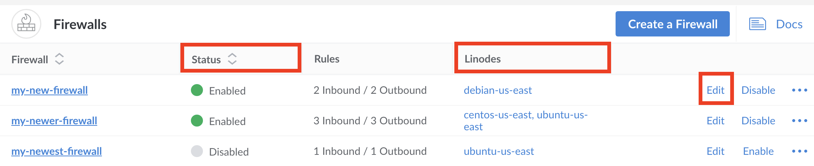
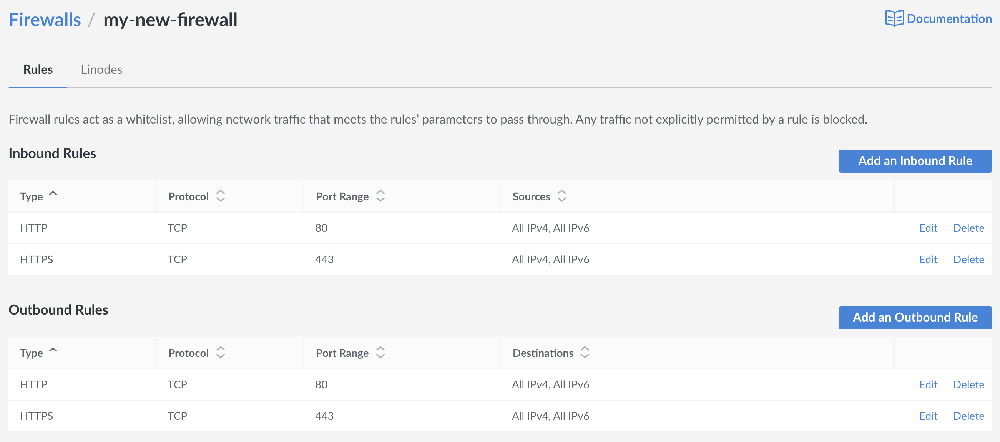

---
author:
  name: Linode
  email: docs@linode.com
description: 'Troubleshooting your system's Firewalls'
og_description: 'Troubleshooting your Firewall'
keywords: ["Linode troubleshooting", "Cloud Firewall", "Firewall"]
license: '[CC BY-ND 4.0](https://creativecommons.org/licenses/by-nd/4.0)'
published: 2020-08-04
title: Firewall Troubleshooting
---

This guide presents troubleshooting strategies for Linodes that may be unresponsive due to issues caused by a firewall.

In many cases, you will suspect a firewall issue if only some of your services are inaccessible, or in situations of limited access. A firewall may also be suspected if an issue was noticed not long after implementing new firewall issues.

It's important to note that while a Firewall is often responsible for cases of limited access, these issues may be caused by a wide array off other issues such as limited network access, resource contention like throttled memory, or internal processes or services that are not configured to communicate.

## Before You Begin

There are a few core troubleshooting tools you should familiarize yourself with that are used when diagnosing connection problems.

### The Linode Shell (Lish)

[*Lish*](/docs/platform/manager/using-the-linode-shell-lish/) is a shell that provides access to your Linode's serial console. Lish does not establish a network connection to your Linode, so you can use it when your networking is down or SSH is inaccessible. If you find yourself locked out of ssh, much of your troubleshooting for basic connection issues will be performed from the Lish console.

To learn about Lish in more detail, and for instructions on how to connect to your Linode via Lish, review the [Using the Linode Shell (Lish)](/docs/platform/manager/using-the-linode-shell-lish/) guide. In particular, [using your web browser](/docs/platform/manager/using-the-linode-shell-lish/#use-a-web-browser) is a fast and simple way to access Lish.

## Is my Linode Powered On?

To begin, log in to the [Linode Manager](https://cloud.linode.com/) and inspect the Linode's dashboard. If the Linode is powered off, turn it on.

## Is my Cloud Firewall Effecting Me?

If you're using Linode's Cloud Firewall then it's important to check your rules and to observe which Linodes are currently affected by Cloud Firewall.


The root user is available in Lish even if root user login is disabled in your SSH configuration.


To do this, log in to your [Cloud Manager](cloud.linode.com) and access the [Firewalls Section](cloud.linode.com/firewalls) here you will see a list of all the firewalls currently active on your account. To find the Linode that you believe is being affected, look in the `Linodes` column for the label you've assigned it. Next, check the `Status` column to confirm that the firewall is `Enabled`. If so, you can check what rules are currently applied by clicking on the `Edit` button to the right of each row, or by clicking on the label of the Firewall itself.

Once you've accessed the `rules` page for a firewall, you'll be able to see a list of all of the Firewall Rules that will affect Linodes that the firewall has been applied to. You can also view these individual rules by Type, Protocol, Port Range, and Sources. If these rules seem to be affecting your service or services, you may either remove or edit these rules independently by clicking on the `Edit` or`Delete` button to the right of each rule respectively.


Cloud Firewall rules are applied on the host level and will not be detectable internally on Linodes.


## Checking Firewall Rules with UFW

**Uncomplicated Firewall** or **UFW** is an iptables frontend that is designed for ease-of-use. To find more information, see our guide on [Configuring UFW](/security/firewalls/configure-firewall-with-ufw/).

To see all active UFW rules, enter the following command:

        sudo ufw status

Your output will be similar to the following:


Status: active

To                         Action      From
--                         ------      ----
22                         ALLOW       Anywhere
80/tcp                     ALLOW       Anywhere
443                        ALLOW       Anywhere
22 (v6)                    ALLOW       Anywhere (v6)
80/tcp (v6)                ALLOW       Anywhere (v6)
443 (v6)                   ALLOW       Anywhere (v6)


If the status is active, the rules listed will all be in place. To remove any individual firewall rule, use the following syntax:

        sudo ufw delete <Action> <To>

So to delete the Allow rule for port 80, the command would be as follows:

        sudo ufw delete allow 80

## Checking Firewall Rules with FirewallD

`firewalld` is the default firewall tool for Centos and Fedora.. While also a frontend for iptables like UFW, firewalld has some behaviours that are unique, like configuration sets and zones.

To list all all configurations for all zones, enter the following command:

        sudo firewall-cmd --list-all-zones

If you find a rule that doesn't belong, it can be safely removed using the following syntax:

sudo firewall-cmd --zone=zonename --remove-service=servicename --permanent

For more informaton on understanding firewalld, [see our guide to firewalld](/docs/security/firewalls/introduction-to-firewalld-on-centos/)

## Checking Firewall Rules with iptables

`iptables` is the most common firewall used on Linux systems. If you're unsure of which firewall software you may be using, and you aren't using CentOS or Fedora which favor FirewallD, chances are that you're always using iptables in some form.

To list all active firewall rules using iptables, enter the following commands for IPv4 and IPv6 respectfully:

        sudo iptables -L -nv

        sudo ip6tables -L -nv

Removing rules uses the same syntax to add rules, with the addition of `-D` or `--delete`. For example, the following commands can each be used to delete a rule that drops connections to port 110, on the eth0 interface, towards the IPv4 address 198.51.100.0:

        iptables --delete INPUT -j DROP -p tcp --destination-port 110 -i eth0 -d 198.51.100.0
        iptables -D INPUT -j DROP -p tcp --destination-port 110 -i eth0 -d 198.51.100.0

For more information on reading and interpreting iptables rules see [our guide on iptables](https://www.linode.com/docs/security/firewalls/control-network-traffic-with-iptables/#basic-iptables-rulesets-for-ipv4-and-ipv6)