---
author:
  name: Linode
  email: docs@linode.com
description: 'Our guide to rescuing and rebuilding your Linode.'
keywords: ["rescue", "rebuild"]
license: '[CC BY-ND 4.0](https://creativecommons.org/licenses/by-nd/4.0)'
aliases: ['rescue-and-rebuild/','troubleshooting/finnix-rescue-mode/']
modified_by:
  name: Linode
published: 2012-05-31
title: Rescue and Rebuild
classic_manager_link: troubleshooting/rescue-and-rebuild-classic-manager/
---

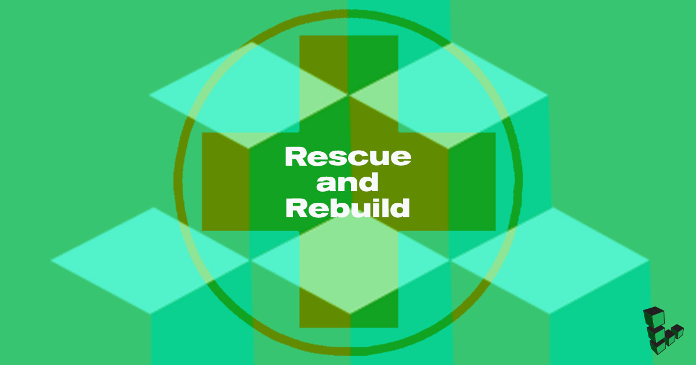

Even the best system administrators may need to deal with unplanned events in the operation of their services. The Linode Cloud Manager provides recovery tools that you can leverage if you are having trouble connecting to one of your Linodes, and this guide describes those tools:

-  You can boot your Linode into [*Rescue Mode*](#rescuing) to perform system recovery tasks and transfer data off your disks, if necessary.

- If you are unable to resolve your system's issues, you can [*rebuild*](#rebuilding) your Linode from a backup or start over with a fresh Linux distribution.

## Troubleshooting Resources

While this guide outlines the recovery tools that Linode makes available to you, it does not provide a specific troubleshooting strategy. Our other guides offer a logical progression of steps you can follow when troubleshooting different symptoms:

-   If you are not able to establish basic network connections with your Linode, we recommend that you review the [Troubleshooting Basic Connection Issues](/docs/troubleshooting/troubleshooting-basic-connection-issues/) guide.

-   If you can ping your Linode but can't access SSH, follow the [Troubleshooting SSH](/docs/troubleshooting/troubleshooting-ssh/) guide.

-   If you can access SSH but are experiencing an outage with a web server or other service, review [Troubleshooting Web Servers, Databases, and Other Services](/docs/troubleshooting/troubleshooting-web-servers-databases-other-services/).

-   For an overview of all these issues and answers to other questions, check out the [Troubleshooting Overview](/docs/troubleshooting/troubleshooting/) guide.

## Rescuing

*Rescue Mode* is a safe environment for performing many system recovery and disk management tasks. Rescue Mode is based on the [Finnix recovery distribution](http://www.finnix.org/), a self-contained and bootable Linux distribution that you can mount your Linode's disks from. You can also use Rescue Mode for tasks other than disaster recovery, such as:

- Formatting disks to use different filesystems

- Copying data between disks

- Downloading files from a disk via SSH and SFTP

### Rescue Mode Overview

To access Rescue Mode, you will need to [reboot your Linode](#booting-into-rescue-mode) from the Linode Cloud Manager and then connect via [Lish](#connecting-to-a-linode-running-in-rescue-mode) or [SSH](#starting-ssh). After you connect, you can [perform a check on your filesystem](#performing-a-file-system-check) if you suspect that it is corrupted. If you need access to a certain software package to troubleshoot your system, you can [install it](#installing-packages).

Your disks will not be mounted by default, so [mount](#mounting-disks) them in order to access your files. Once you mount your primary filesystem, you can [*change root*](#change-root) to have Rescue Mode emulate your normal Linux distribution.

### Booting into Rescue Mode

To boot your Linode into Rescue Mode:

1.  Log in to the [Linode Cloud Manager](https://cloud.linode.com).

1.  Click on the **Linodes** link in the sidebar:

    [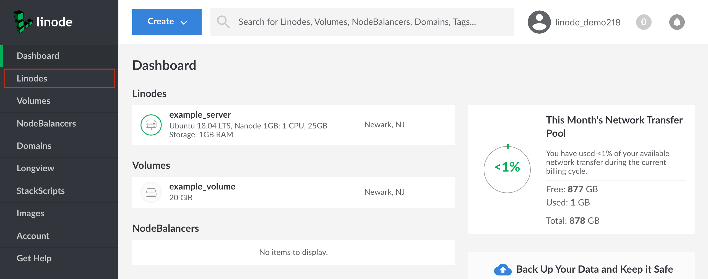](cloud-manager-dashboard.png)

1.  Select a Linode:

    [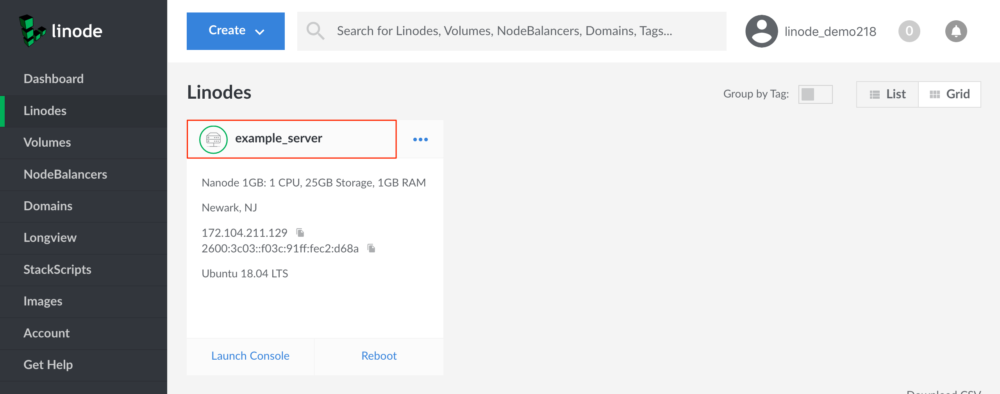](cloud-manager-linodes-page.png)

1.  The Linode's detail page will appear. Click on the **Rescue** tab:

    [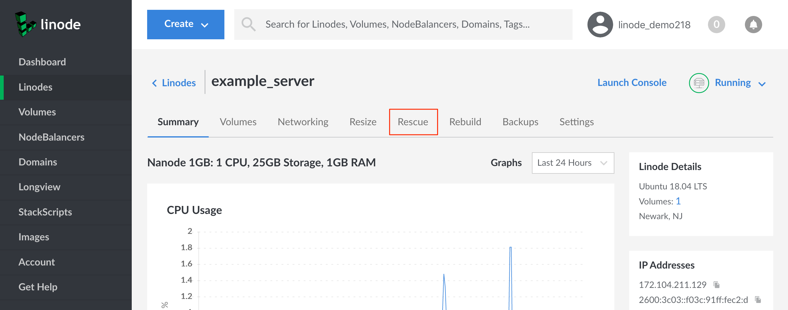](cloud-manager-linode-detail-page-rescue-tab-highlighted.png)

1.  In the **Rescue** form, select the disks you want to be mounted:

    

    
Make a note of which devices your disks are assigned to (e.g. `/dev/sda`, `/dev/sdb`, etc). For example, in the screenshot shown above, the Ubuntu disk corresponds to `/dev/sda`. These assignments will be where you can mount your disks from inside Rescue Mode.


1.  If you need to assign more than two disks to be accessible inside Rescue Mode, click the **Add Disk** option:

    [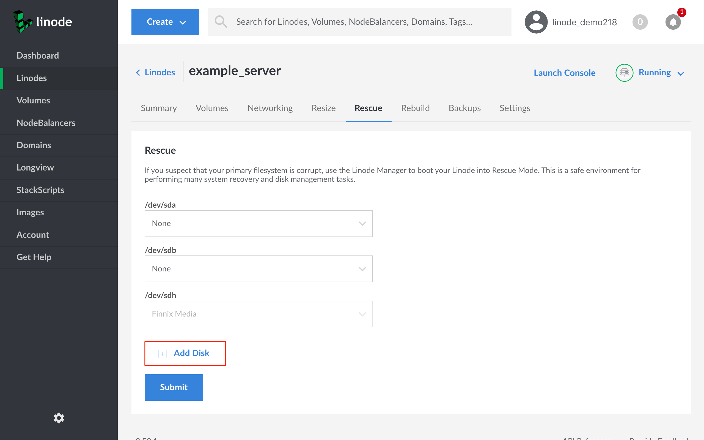](cloud-manager-rescue-form-add-disk-highlighted.png)

    
You can assign up to 7 disks in Rescue Mode. `/dev/sdh` is always assigned to the Finnix recovery distribution.


1.  Click the **Submit** button. The Linode will reboot into Rescue Mode, and a progress bar will appear. When this progress bar completes, proceed to [Connecting to a Linode Running in Rescue Mode](#connecting-to-a-linode-running-in-rescue-mode).

    [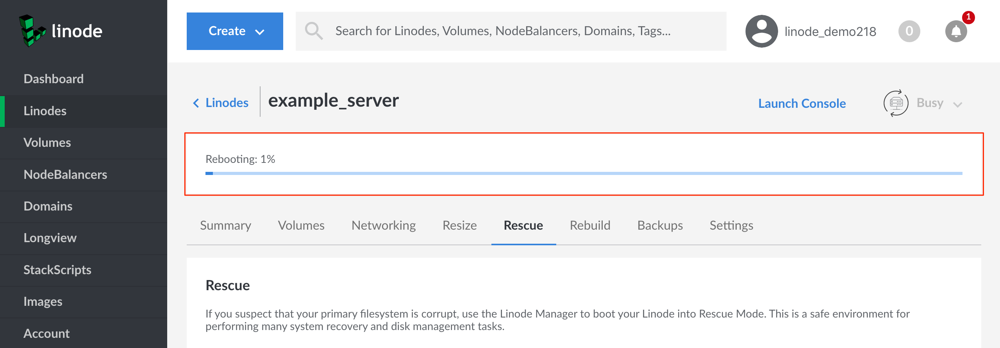](cloud-manager-rescue-form-reboot-progress-bar-highlighted.png)

### Connecting to a Linode Running in Rescue Mode

By default, Rescue Mode's Finnix environment does not accept SSH connections. To access your Linode when it's running in Rescue Mode, connect to it via the *Lish* console.


It is possible to enable SSH for Rescue Mode by manually starting the SSH daemon. Using SSH can provide a nicer experience and will allow you to copy files off of your server. Review the [Starting SSH](#starting-ssh) section for instructions. You will need to use Lish at least once in order to start SSH.


To connect with Lish:

1.  From the Linode's detail page, click the **Launch Console** button:

    [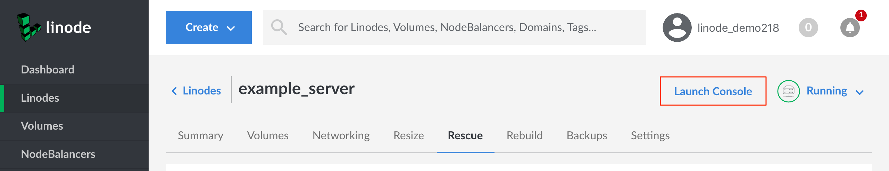](cloud-manager-rescue-tab-launch-console-highlighted.png)

1.  A new window will appear which displays your Lish console, a `Welcome to Finnix!` message, and a root prompt:

    [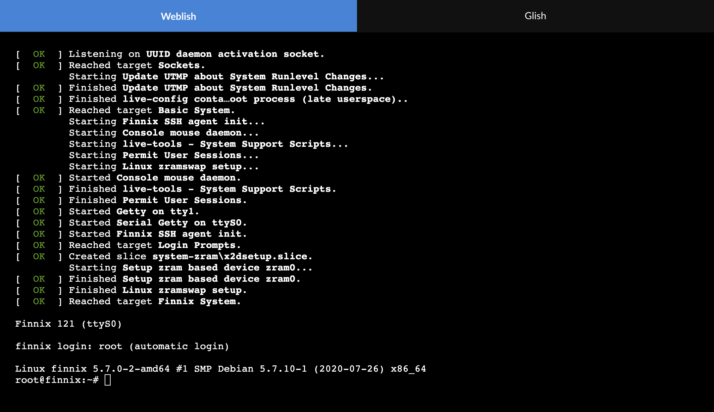](cloud-manager-new-lish-window.png)

Review the [Using the Linode Shell (Lish)](/docs/platform/manager/using-the-linode-shell-lish/) guide for further explanation of the Lish console and alternative methods for accessing it, including [from your computer's terminal application](/docs/platform/manager/using-the-linode-shell-lish/#use-a-terminal-application).

### Starting SSH

The Finnix recovery distribution does not automatically start an SSH server, but you can enable one manually. This is useful if your Linode won't boot and you need to copy files off of the disks. You can also copy entire disks over SSH. To start SSH:

1.  Open the [Lish console](#connecting-to-a-linode-running-in-rescue-mode) for your Linode.

1.  Set the `root` password for the Finnix rescue environment by entering the following command:

        passwd

    
This root password is separate from the root password of the disk that you normally boot from. Setting the root password for Finnix will not affect the root account of your distribution.


1.  Enter the new password for the `root` user.

1.  Start the SSH server:

        service ssh start

You can now connect to the server as root with the SSH client on your computer. You can also access mounted disks with an SFTP client:

- For instructions on connecting with an SFTP client, see the [File Transfer reference manuals](/docs/tools-reference/file-transfer/).

- For instructions on copying an entire disk over SSH, see [Copy a Disk Over SSH](/docs/platform/disk-images/copying-a-disk-image-over-ssh/).

### Performing a File System Check

You can use the `fsck` system utility (short for "file system check") to check the consistency of filesystems and repair any damage detected. If you suspect that your Linode's filesystem is corrupted, you should run `fsck` to check for and repair any damage:

1.  Enter the `df -h` command to verify that your primary disks are not currently mounted:

        root@ttyS0:~# df -h
        Filesystem      Size  Used Avail Use% Mounted on
        tmpfs           739M 1016K  738M   1% /media/ramdisk
        /dev/sdh        160M  160M     0 100% /media/sdh
        /dev/loop0      146M  146M     0 100% /media/compressed_root
        unionfs         739M 1016K  738M   1% /
        devtmpfs         10M     0   10M   0% /dev

    Your primary disks should not appear in the list. In the [example screenshot](cloud-manager-rescue-form-dev-sda-highlighted.png) from the [Booting into Rescue Mode](#booting-into-rescue-mode) section, we assigned the Ubuntu 18.04 disk to `/dev/sda`. Because this device does not appear in the example output from `df -h`, we can run a filesystem check on it.

     
Never run `fsck` on a mounted disk. Do not continue unless you're sure that the target disk is unmounted.


1.  Run `fsck` by entering the following command, replacing `/dev/sda` with the location of the disk you want to check and repair:

        e2fsck -f /dev/sda

1.  If no problems are detected, `fsck` will display the tests it performed:

        e2fsck -f /dev/sda
        e2fsck 1.42.13 (17-May-2015)
        Pass 1: Checking inodes, blocks, and sizes
        Pass 2: Checking directory structure
        Pass 3: Checking directory connectivity
        Pass 4: Checking reference counts
        Pass 5: Checking group summary information
        /dev/sda: 109771/1568000 files (0.5% non-contiguous), 675014/6422528 blocks

1.  If `fsck` determines that there is a problem with your filesystem, it will prompt you to fix problems as they are found during each test:

        root@ttyS0:~# e2fsck -f /dev/sda
        e2fsck 1.42.13 (17-May-2015)
        ext2fs_check_desc: Corrupt group descriptor: bad block for block bitmap
        e2fsck: Group descriptors look bad... trying backup blocks...
        e2fsck: Bad magic number in super-block while using the backup blockse2fsck: gok
        Superblock has an invalid journal (inode 8).
        Clear<y>?

    Press **enter** to automatically attempt to fix the problems.

    Once the filesystem check completes, any problems detected should be fixed. Try rebooting the Linode from the Cloud Manager. If `fsck` fixed the issues, the Linode should boot normally.

### Installing Packages

The Finnix recovery distribution is based on Debian, so you can use the [`apt` package management system](/docs/tools-reference/linux-package-management/#debian-and-ubuntu-package-management) to install additional software packages in the temporary rescue environment. For example, you could install and run the `htop` utility by issuing the following commands:

    apt update
    apt install htop
    htop

The software packages you install will be available as long as your Linode is running in Rescue Mode.

### Mounting Disks

By default, your disks are not mounted when your Linode boots into Rescue Mode. However, you can manually mount a disk under Rescue Mode to perform system recovery and maintenance tasks. Run the `mount` command, replacing `/dev/sda` with the location of the disk you want to mount:

    mount -o barrier=0 /dev/sda

Disks that contain a single filesystem will have mount points under `/media` in the rescue environment's `/etc/fstab` file. To view the directories on the disk, enter the following command:

    ls /media/sda

Now you can read and write to files on the mounted disk.

### Change Root

*Changing root* is the process of changing your working root directory. When you change root (abbreviated as *chroot*) to your Linode root disk, you will be able to run commands as though you are logged into that system.

Chroot will allow you to change user passwords, remove/install packages, and do other system maintenance and recovery tasks in your Linode's normal Linux environment.

1.  Before you can use chroot, you need to mount your root disk with execute permissions:

        mount -o exec,barrier=0 /dev/sda

    
If you mounted your disk prior to reviewing this section, unmount the disk:

    umount /dev/sda

Then, remount it with the `exec` option.


1.  Then to create the chroot, you need to mount the temporary filesystems:

        cd /media/sda
        mount -t proc proc proc/
        mount -t sysfs sys sys/
        mount -o bind /dev dev/
        mount -t devpts pts dev/pts/

1.  Chroot to your disk:

        chroot /media/sda /bin/bash

1.  To exit the chroot and get back to Finnix type "exit" :

        exit

## Rebuilding

If you can't rescue and resolve issues on an existing disk, you will likely need to rebuild your Linode. Rebuilding your Linode is the process of starting over with a set of known-good disks that you can boot from. There are a few different ways you can do this:

-   If you are subscribed to the [Linode Backup Service](https://www.linode.com/backups), you can [restore from an existing backup](#restoring-from-a-linode-backup) and return your Linode to a previous state.

-   If you aren't subscribed to the Linode Backup Service, you can copy files off an existing disk and then [use the Rebuild feature](#use-the-rebuild-feature) of the Cloud Manager to erase everything and start over again from scratch.

-   If you have a backup system other than the Linode Backup Service in place, you can [rebuild your Linode](#use-the-rebuild-feature) and then restore your data from that backup service. The methods for restoring your data will vary by the kind of backup system that you use.


Did an unauthorized intruder gain access to your Linode? Since it is virtually impossible to determine the full scope of an attacker's reach into a compromised system, you should never continue using a compromised Linode.

We recommend that you follow the instructions in [Recovering from a System Compromise](/docs/security/recovering-from-a-system-compromise/). You'll need to create a new Linode, copy your existing data from the old Linode to the new one, and then swap IP addresses.


### Restoring from a Linode Backup

If you previously enabled the [Linode Backup Service](https://www.linode.com/backups), you may be able to restore one of the backups to your Linode. Review the [Restoring from a Backup](/docs/platform/disk-images/linode-backup-service/#restore-from-a-backup) section (specifically, the [Restore to an Existing Linode](/docs/platform/disk-images/linode-backup-service/#restore-to-an-existing-linode) section) of the [The Linode Backup Service](/docs/platform/disk-images/linode-backup-service/) guide for instructions.

If you created backups with an application other than the Linode Backup Service, review the application's instructions to restore a backup to your Linode.

### Use the Rebuild Feature

The Linode Cloud Manager provides a *Rebuild* feature which will perform the following two actions:

1.  Your current disks are removed.

1.  A new set of disks is provisioned from one of the Cloud Manager's built-in Linux images, or from one of your [saved images](/docs/platform/disk-images/linode-images/).

    
If you use the Rebuild feature, the data from the disks that are deleted will not be retrievable.

If you'd like to deploy a new Linux distribution without erasing your existing disks, follow the instructions in the [Creating a Disk with a Linux Distribution Installed](/docs/platform/disk-images/disk-images-and-configuration-profiles/#creating-a-disk-with-a-linux-distribution-installed) section of the [Disks and Configuration Profiles](/docs/platform/disk-images/disk-images-and-configuration-profiles/) guide. This is a better option for those who need to create a new distribution, but also need to save their existing data.

Your Linode will need to have some amount of unallocated disk space in order to provision a new distribution. If your Linode does not have enough unallocated space, you can [shrink your existing disks](/docs/platform/disk-images/disk-images-and-configuration-profiles/#resizing-a-disk) to free up space or [resize your Linode](/docs/platform/disk-images/resizing-a-linode/) to a higher resource tier.
    

    If you need to copy files from your existing disk to another location before rebuilding, you can [start SSH](#starting-ssh) under Rescue Mode and then use an SFTP client to copy files to your computer.

To use the Rebuild feature:

1.  If you need to copy files from your existing disk to another location before rebuilding, you can [start SSH](#starting-ssh) under Rescue Mode and then use an [SFTP client](/docs/tools-reference/file-transfer/) to copy files to your computer, another server, or somewhere else.

1.  Log in to the [Linode Cloud Manager](https://cloud.linode.com).

1.  Click on the **Linodes** link in the sidebar:

    

1.  Select a Linode:

    

1.  The Linode's detail page will appear. Click on the **Rebuild** tab:

    [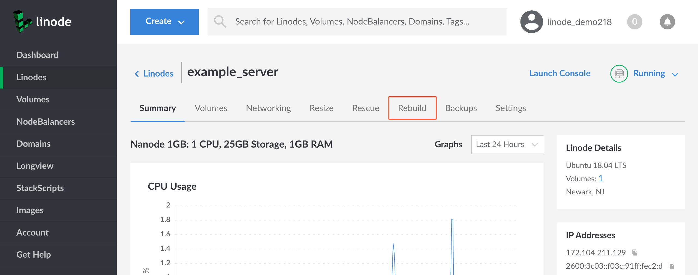](cloud-manager-linode-detail-page-rebuild-tab-highlighted.png)

1.  Complete the Rebuild form. Select an image to deploy and enter a root password. Optionally, select one or more SSH keys (if you have not added any SSH Keys via the Cloud Manager, this option will not be available).

1.  Click on the **Rebuild** button after completing the form:

    [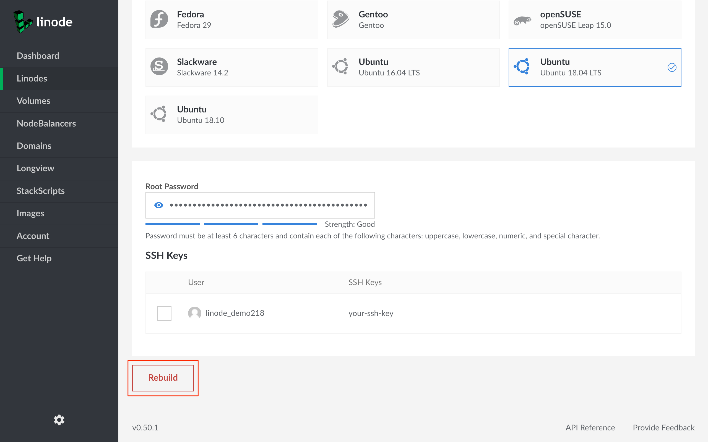](cloud-manager-rebuild-form-rebuild-button-highlighted.png)

1.  A confirmation dialog will appear. Click the **Rebuild** button in the dialog to start the rebuild process:

    

1.  You will be returned to the **Summary** tab for the Linode and a **Rebuilding** progress bar will appear. When the operation completes, your Linode will be booted under the new Linux image:

    [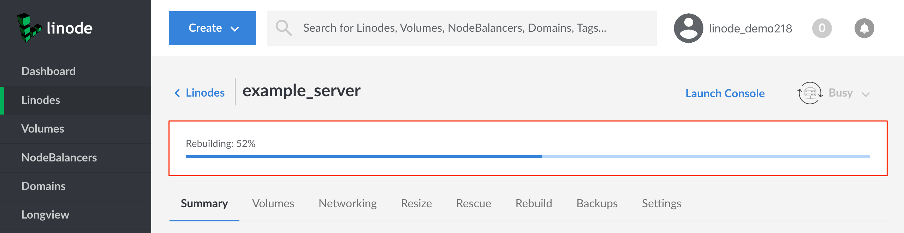](cloud-manager-linode-detail-page-rebuild-progress-bar-highlighted.png)
