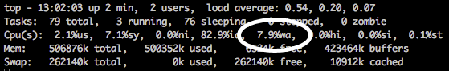

---
author:
  name: Linode
  email: docs@linode.com
description: An overview of different troubleshooting topics.
keywords: ['troubleshooting']
license: '[CC BY-ND 4.0](https://creativecommons.org/licenses/by-nd/4.0)'
aliases: ['quick-start-troubleshooting/']
modified: 2019-01-25
modified_by:
  name: Linode
published: 2012-04-05
title: Troubleshooting Overview
---

We know it's frustrating when you run into problems with your Linode. That's why we've created this introductory troubleshooting checklist. Use it to diagnose and resolve basic issues with your Linode through a process of elimination. Here's how:

-   Select the issue that best describes your problem

-   Follow the troubleshooting steps in the order they are presented

-   Once you've identified a problem, try fixing it with the suggested solutions

-   If you can't find your problem in this guide, take a look at the [troubleshooting manuals](/docs/troubleshooting/)


This guide explains how to use different troubleshooting commands on your Linode. These commands can produce diagnostic information and logs that may expose the root of your connection issues. For some specific examples of diagnostic information, this guide also explains the corresponding cause of the issue and presents solutions for it.

If the information and logs you gather do not match a solution outlined here, consider searching the [Linode Community Site](https://www.linode.com/community/questions/) for posts that match your system's symptoms. Or, post a new question in the Community Site and include your commands' output.

Linode is not responsible for the configuration or installation of software on your Linode. Refer to Linode's [Scope of Support](/docs/platform/billing-and-support/support/#scope-of-support) for a description of which issues Linode Support can help with.


## Linode is Unresponsive

If your Linode is unresponsive, either at the Lish console or to basic network requests, read through the [Troubleshooting Basic Connection Issues](/docs/troubleshooting/troubleshooting-basic-connection-issues/) guide.

## Linode is Slow


You should follow all steps in the [Linode is Unresponsive](#linode-is-unresponsive) section before using this checklist.


### Is your Disk Full?

If your Linode's disk is full, this can cause performance degradation and instability for your applications. Use the following command to determine the free space on your Linode's filesystem:

    df -h

The output will look similar to this:

    Filesystem      Size  Used Avail Use% Mounted on
    /dev/root       189G  166G   14G  93% /
    devtmpfs        3.9G     0  3.9G   0% /dev
    tmpfs           3.9G   16K  3.9G   1% /dev/shm
    tmpfs           3.9G  399M  3.6G  10% /run
    tmpfs           5.0M     0  5.0M   0% /run/lock
    tmpfs           3.9G     0  3.9G   0% /sys/fs/cgroup
    tmpfs           799M     0  799M   0% /run/user/1000

In this example, you can see that the root filesystem is 93% full. Here's a command you can use to list all files over 200MB on your root filesystem:

    sudo find / -xdev -type f -size +200M -exec ls -lah {} \;

You can adjust the `+200M` value in this command as needed, to search for files above a specific size.

#### Deleted Files

If a service deletes a file that it is no longer using, the file remains on your disk until the next time the service has been rebooted. In this example you'll see how deleted files belonging to Apache can take up space.

Use the following command to check for deleted files that are currently open:

    sudo lsof | grep deleted  | numfmt --field=8 --to=iec

This command will check the output of `lsof` for files marked as deleted, and will convert the file sizes so that they're more easily readable. In this example Apache is holding on to several old files:

    apache2   32341         www-data   13u      REG                8,0          0        24K /tmp/.ZendSem.OmCTIC (deleted)
    apache2   32341         www-data   14w      REG               0,19          0       243M /run/lock/apache2/proxy.13748 (deleted)
    apache2   32341         www-data   15w      REG               0,19          0       243M /run/lock/apache2/mpm-accept.13748 (deleted)
    apache2   32342         www-data   12w      REG               0,19          0       158M /run/lock/apache2/ssl-cache.13747 (deleted)
    apache2   32342         www-data   13u      REG                8,0          0        24K /tmp/.ZendSem.OmCTIC (deleted)
    apache2   32342         www-data   14w      REG               0,19          0       243M /run/lock/apache2/proxy.13748 (deleted)
    apache2   32342         www-data   15wW     REG               0,19          0       243M /run/lock/apache2/mpm-accept.13748 (deleted)
    apache2   32343         www-data   12w      REG               0,19          0       158M /run/lock/apache2/ssl-cache.13747 (deleted)

To free up this space, you can simply restart the Apache process on your Linode.

### Is the Linode Out of Memory?

The applications on your Linode require a certain amount of physical memory to function correctly. If all of the available physical memory is consumed, your Linode could slow down, display out of memory errors, or become unresponsive. Here's how to tell if your Linode is out of memory:

1.  Log in to the [Linode Manager](https://manager.linode.com).
1.  Click the **Linode** tab. A list of your Linodes appears.
1.  Select a Linode. The Linode's dashboard appears.
1.  Click the **Remote Access** tab.
1.  Select the **Launch Lish Console** link. The LISH console window appears. If memory errors are displayed in the LISH console, stop some running services to free up memory or upgrade to larger plan.
1.  Read through the [Troubleshooting Memory and Networking Issues](/docs/troubleshooting/troubleshooting-memory-and-networking-issues/) guide for troubleshooting commands which display your memory use.
1.  If an application is consuming all of your available memory, you have three options. You can kill the application, change the application's settings to reduce its memory footprint, or [upgrade your Linode](https://www.linode.com/pricing) to a larger plan.

If your Linode is not out of memory, continue to the next section.

### Is there a Disk I/O Bottleneck?

Disk input/output (I/O) bottlenecks can occur when an application or service is reading or writing an excessive amount of information to disk and the processor has to wait to process the information. High I/O wait can significantly slow down your server. Here's how to tell if your server currently has an I/O bottleneck:

1.  Open a terminal window and log in to your Linode via SSH.
1.  Enter `top` to access the `top` monitoring utility. The screen shown below appears.

    

1.  Examine the I/O wait percentage, as shown above. If the number is zero, your server does not currently have a bottleneck.
1.  If your I/O wait percentage is above zero, verify that your server has enough free memory available. In many cases, high I/O is an indication that your server has started "swapping," or using disk space as memory.
1.  If your server has free memory available and is not using swap space, use `iotop` or [vmstat](/docs/uptime/monitoring/use-vmstat-to-monitor-system-performance/) to find the application responsible for the excessive I/O. Databases are the usual suspects. You may need to stop and/or reconfigure the application.

     
You must run `iotop` as `root` or with `sudo`.


1.  If you cannot determine the source of the IO bottleneck, contact [Linode support](/docs/platform/billing-and-support/support/) for assistance.

Since `top` only reports what is currently happening, and most I/O issues are temporary, it helps to have a monitoring utility set up so you can see a graph of I/O trends and spot potential issues *before* they become major problems. See the guides in [Server Monitoring](/docs/uptime/monitoring/) for instructions on setting up a server monitoring utility.

## Website is Not Loading

If your website is unresponsive or not loading correctly, read through the [Troubleshooting Web Servers, Databases, and Other Services](/docs/troubleshooting/troubleshooting-web-servers-databases-other-services/) guide.


You should follow all steps in the [Linode is Slow](#linode-is-slow) section before following this guide.


## Can't Connect via SSH or FTP

If you can't connect to your Linode over SSH, read through the [Troubleshooting SSH](/docs/troubleshooting/troubleshooting-ssh/) guide.


You should follow all steps in the [Linode is Slow](#linode-is-slow) section before following this guide.


### Are You Using Telnet or FTP?

Telnet and FTP are disabled on your Linode by default, and we strongly recommend that you do not use those protocols. Instead, please use Secure Shell (SSH) and SSH File Transfer Protocol (SFTP) - the secure versions of the Telnet and FTP protocols. All Linodes come with an SSH server enabled, and you can connect to port 22 with SSH and SFTP clients. For more information, see [Connecting to Your Linode](/docs/getting-started/#connect-to-your-linode-via-ssh).

## Forgot My Username or Password

### Linode User/Root Password

If you've forgotten the password for the root user on your Linode, you can follow the our steps for [resetting the root password](/docs/platform/accounts-and-passwords/#resetting-the-root-password) from the Linode Manager.

Once you have access to your Linode as the root user, you can reset the password for any additional system users with the `passwd` command. In this case, we'll reset the password for the `example` user:

    passwd example

### Linode Manager User

*  If you forget your Linode Manager username, you can confirm it by supplying your email address [here](https://manager.linode.com/session/forgot/username).

*  Assuming you know your Linode Manager username, but you've forgotten the password, you can retrieve it [here](https://manager.linode.com/session/forgot/password).

If you've followed these steps, but you're still having trouble accessing your account, please [contact Support](/docs/platform/support/#contacting-linode-support).

## Linode Manager is Displaying "Incorrect" Information

Use the following checklist if the Linode Manager is displaying "incorrect" information.

### Did You Recently Change your Account?

If you recently created a new account, resized an existing Linode, or added extra bandwidth, the bandwidth displayed in the Linode Manager will be prorated for the amount of time left in the current billing cycle. For example, if you create an account on the 15th day of the month, the Manager will indicate that your account has been allocated half of the plan's bandwidth for the current month. This information is an accurate representation of the bandwidth available for the rest of the billing period. When then next billing period starts, the Manager will indicate that all of the plan's bandwidth is available.

### Did You Add Additional Storage?

If you recently upgraded your plan, your Linode won't be able to take advantage of the additional space until you resize the disk. You can use the Linode Manager to see if there's additional storage space available for disks:

1.  Log in to the [Linode Manager](https://manager.linode.com).
1.  Click the **Linode** tab. A list of your Linodes appears.
1.  Select a Linode. The Linode's dashboard appears.
1.  Examine the *Storage* pane on the sidebar, as shown below. If you have free storage space, you can allocate that space to your existing disks.

Follow our steps for [resizing a disk](/docs/platform/disk-images/disk-images-and-configuration-profiles/#resizing-a-disk) to take advantage of the extra space.
