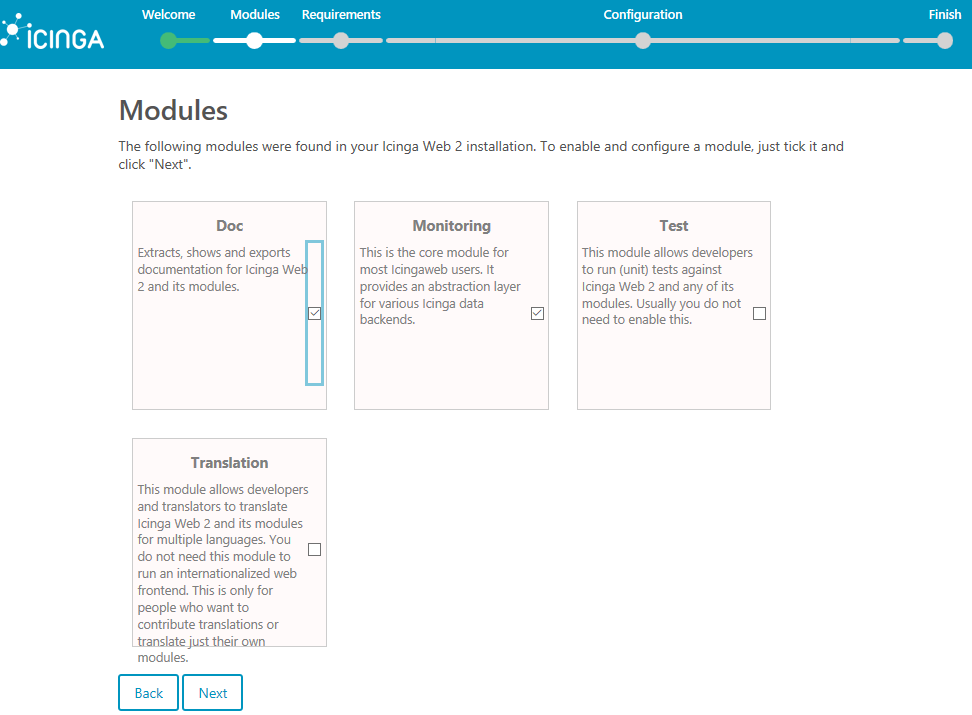

---
author:
  name: Matt Vass
  email: linuxboxgo@gmail.com
description: 'This guide will show you how to install and configure Icinga2 monitoring system in the latest release of Debian 9'
keywords: 'debian, icinga, monitoring'
license: '[CC BY-ND 4.0](https://creativecommons.org/licenses/by-nd/4.0)'
modified: 'Tuesday, October 24th, 2017'
modified_by:
  name: Matt Vass
published: ' '
title: 'Install Icinga2 in Debian 9.2'
external_resources:
 - '[Official Icinga Documentation](https://www.icinga.com/docs/icinga2/latest/doc/01-about/)'
---

Icinga, previously a fork of popular Nagios monitoring system, is an Open-Source network monitoring application that can be used to monitor critical services and systems over your premises. Icinga2 can check and monitor hosts in a network or it can verify network external protocols, such as the state of a HTTP server, a mail server a file share service or others. However, Icinga2 can be configured to monitor internal systems state and check the load, the memory, the disk free space or other internal parameters via Icinga agents deployed in every node that needs to me monitored. Icinga can also be configured to send notifications and alerts via e-mail or SMS to the system administrators defined in contacts.  Icinga is highly deployed in Linux on top of Apache web server, PHP server-side interpreted programming language and MySQL or MariaDB database. These components make what we know as the LAMP stack.

In this tutorial we’ll cover how to install and configure the latest version Icinga2 web monitoring tool in Debian 9.2 in order to monitor our network infrastructure. We’ll also cover how we can setup icinga2 to monitor remote hosts services, such as HTTP servers, via regular command checks and how to deploy Icinga2 agent-based services running on the nodes that needs to be monitored in order to securely collect internal nodes system information, such as memory consumption, the system load degree, number of running processes or other important internal system parameters.

## Prerequisites

-	Debian 9.2 installed on a virtual private server
-	Root account access via console or remotely via SSH service or `sudo` root privileges for a local or remote account
-	A domain name, private or public, depending on your deployment, with the proper DNS records configured for web services
-	A mail service properly configured at your premises in order to send mail alerts

### Initial System Configurations

Before deploying Icinga2 web monitoring application in your own VPS, first assure the system meets all the software requirements for compiling and installing the application.  On the first step, update your system repositories and software packages by issuing the below command.

  `apt update`

  `apt upgrade`

On the next, setup your system hostname by executing the following command. Replace your hostname variable accordingly.

`hostnamectl set-hostname icinga`

Verify machine hostname and hosts file by issuing the below commands.

`hostnamectl`

`cat /etc/hostname`

Reboot the Linode from the Manager:

Icinga2 network monitoring application needs a web server, such as Apache HTTP server, and a PHP pre-processing language interpreter gateway to run properly. Install Apache web server and the PHP interpreter alongside with all required PHP modules needed by Icinga to run properly in your system by issuing the following command in your VPS console.

`apt install apache2 libapache2-mod-php7.0 php7.0-xml php7.0-opcache php7.0-xml php7.0-mbstring php7.0-json php7.0-curl php7.0-ldap php7.0-cli php7.0-gd php7.0-intl php7.0-readline`

After Apache web server and PHP interpreter had been installed in your Debian system, test if the web server is up and running and listening for network connections on port 80 by issuing the following command with root privileges. The result shoud be similar as shown in the below image.

`ss- tulpn`

In case you have a firewall enabled in your Debian system, such as UFW firewall application, you should add a new rule to allow HTTP traffic to pass through firewall by issuing the following command.

`ufw allow WWW`

or

`ufw allow 80/tcp`

If you’re using `iptables` raw rules to manage Firewall rules in your Debian server, add the following rule to allow port 80 inbound traffic on the firewall so that visitors can browse Icinga2 web interface.

`apt-get install -y iptables-persistent`

`iptables -I INPUT -p tcp --destination-port 80 -j ACCEPT`

`systemctl iptables-persistent save`

`systemctl iptables-persistent reload`

Next, enable and apply the following Apache modules which will be used to redirect HTTP connections to HTTPS, by issuing the below command.

`a2enmod rewrite`

`systemctl restart apache2`

Finally, test if Apache web server default web page can be displayed in your client’s browsers by visiting your Debian VPS IP address or your domain name or server FQDN via HTTP protocol. If you don’t know your machine IP address, execute `ip a` command to reveal the IP address of your server. The default Apache page for Debian will be displayed in your browser, as shown in the below screenshot.

[http://your_domain.tld](http://your_domain.tld)

On the next step we need to make some further changes to PHP default configuration file in order to assure that the PHP timezone setting is correctly configured and matches your system geographical location. Open `/etc/php/7.0/apache2/php.ini` file for editing and assure that the following lines are setup as follows. Also, initially, make a backup of PHP configuration file.

`cp /etc/php/7.0/apache2/php.ini{,.backup}`

`nano /etc/php/7.0/apache2/php.ini`

Search, edit and change the following variables in `php.ini` configuration file:

~~~
date.timezone = Europe/London
~~~

Replace the timezone variable accordingly to your physical time by consulting the list of time zones provided by PHP docs at the following link http://php.net/manual/en/timezones.php 

If you want to increase the load speed of your application via OPCache plugin available in PHP7, append the following OPCache settings at the bottom of the PHP interpreter configuration file, as detailed below:

 
~~~ conf
opcache.enable=1 
opcache.enable_cli=1 
opcache.interned_strings_buffer=8 
opcache.max_accelerated_files=10000 
opcache.memory_consumption=128 
opcache.save_comments=1
opcache.revalidate_freq=1
~~~

After you’ve made all changes explained above, restart apache daemon to apply the new changes by issuing the following command.

`systemctl restart apache2`

## Configure Icinga2 Databases

Next, we’ll start by installing the backend database needed by Icinga2 monitoring web application and Icinga Web 2 frontend to store users, contacts and other collected data. Execute the following command to install MariaDB database and PHP module needed to access MySQL database in Debian 9.

`apt install php7.0-mysql mariadb-server mariadb-client`

Then, log in to MySQL console and secure MariaDB root account by issuing the following commands.

`mysql -h localhost`
~~~
use mysql;
update user set plugin='' where user='root';
flush privileges;
exit
~~~

On the next step, you need to further secure MariaDB database by executing the script `mysql_secure_installation`. This script will ask a series of questions designed to secure MariaDB database: change MySQL root password, remove anonymous users, disable remote root logins and delete the test database. Execute the script by issuing the below command and say yes to all asked questions, as shown in the below script output except.

`sudo mysql_secure_installation`

<pre>
NOTE: RUNNING ALL PARTS OF THIS SCRIPT IS RECOMMENDED FOR ALL MariaDB
      SERVERS IN PRODUCTION USE!  PLEASE READ EACH STEP CAREFULLY!
 
In order to log into MariaDB to secure it, we'll need the current
password for the root user.  If you've just installed MariaDB, and
you haven't set the root password yet, the password will be blank,
so you should just press enter here.
 
Enter current password for root (enter for none):
OK, successfully used password, moving on...
 
Setting the root password ensures that nobody can log into the MariaDB
root user without the proper authorisation.
 
You already have a root password set, so you can safely answer 'n'.
 
<b>Change the root password? [Y/n] y</b>

New password:
Re-enter new password:
Password updated successfully!
Reloading privilege tables..
 ... Success!
 
 
By default, a MariaDB installation has an anonymous user, allowing anyone
to log into MariaDB without having to have a user account created for
them.  This is intended only for testing, and to make the installation
go a bit smoother.  You should remove them before moving into a
production environment.
 
<b>Remove anonymous users? [Y/n] y </b>
 ... Success!
 
Normally, root should only be allowed to connect from 'localhost'.  This
ensures that someone cannot guess at the root password from the network.
 
<b>Disallow root login remotely? [Y/n] y </b>
 ... Success!
 
By default, MariaDB comes with a database named 'test' that anyone can
access.  This is also intended only for testing, and should be removed
before moving into a production environment.
 
<b>Remove test database and access to it? [Y/n] y </b>
 - Dropping test database...
 ... Success!
 - Removing privileges on test database...
 ... Success!
 
Reloading the privilege tables will ensure that all changes made so far
will take effect immediately.
 
<b>Reload privilege tables now? [Y/n] y </b>
 ... Success!
 
Cleaning up...
 
All done!  If you've completed all of the above steps, your MariaDB
installation should now be secure.
 
Thanks for using MariaDB!
</pre>
 
 
Next, logged in to MariaDB database console and create the database for Icinga2 application.  Also create a user with a strong password to manage Icinga2 application database, by issuing the following commands. You should replace database name, user and password used in this example with your own database name and credentials.

`mysql –u root -p`
~~~
create database icingadb;
grant all privileges on icingadb.* to 'icinga_user'@'localhost' identified by 'strongpassword';
flush privileges 
exit
~~~

Create the second MySQL database used by Icinga2 web to store its interface users and groups, by issuing the following commands. Also, as on the above database, make sure you replace the database name and credentials accordingly and choose a strong password for database user. To ease the database administration process you can use the same MySQL user account to manage both databases simultaneously (`icinga_user'@'localhost`)

`mysql –u root –p`
~~~
create database icinga_users;
grant all privileges on icinga_users.* to 'icinga_user'@'localhost' identified by 'strongpassword';
flush privileges 
exit
~~~

## Install Icinga2

The installation of Icinga2 will be done via Debian 9 Apt Package Manager tool which will be used to download and install the latest version of the application pre-compiled binaries from Debian 9 repositories. In order to install Icinga2 application and Icinga2 MySQL module for accessing MariaDB database backend, execute the below command.

`apt install icinga2 icinga2-ido-mysql`

During the installation of Icinag2 via Debian 9 repositories, you will be asked a series of question that will help you in setting-up the application. In the first question prompt, you will be asked if you want to configure and enable Icinga2 to use MySQL module. Select Yes from the prompt and hit [enter] key to continue as illustrated in the below image.

The next prompt question will ask you if you want to configure database for icinga2-ido-mysql with dbconfig-common option. Choose No from the prompt and press [enter] key to finish Icinga2 installation.

After Icinga2 application has been installed in your Debian VPS, start Icinga2 service and check the daemon status by running the following commands.

`systemctl start icinga2.service`

`systemctl status icinga2.service`

### Install Icinga2 Web Interface

In order to manage Icinga2 engine via a web control panel interface or visualize the state of services and hosts status from browsers, you need to install Icinga2 web interface and Icinga2 command line utility packages by issuing the below command. This packages will be also pulled from Debian 9 repositories.

`apt install icingaweb2 icingacli`

Afterwards, restart Icinga2 daemon to reflect changes and verify Icinga2 daemon engine status by issuing the below command.

`systemctl restart icinga2.service`

`systemctl status icinga2.service`

Finally, before starting to set-up Icinga2 via its web interface, go ahead and install MySQL schema required Icinga2 database by executing the following command. Icinga2 MySQL database schema is can be found in `/usr/share/icinga2-ido-mysql/schema/` system path.

`mysql -u root icingadb -p < /usr/share/icinga2-ido-mysql/schema/mysql.sql`

Also, you need to open and edit Icinga2 MySQL IDO configuration file and add Icinga2 engine database credentials, as shown in the below excerpt. Use the credentials of the first created database from the earlier database creation step.

`nano /etc/icinga2/features-enabled/ido-mysql.conf`

`ido-mysql.conf` file excerpt:

~~~ conf
library "db_ido_mysql"

object IdoMysqlConnection "ido-mysql" {
  user = "icinga_user",
  password = "strongpassword",
  host = "localhost",
  database = "icingadb"
}
~~~

Save the file and restart Icinga2 daemon to apply settings by issuing the following command. 

`systemctl restart icinga2.service`

You need to also execute the following commands in order to create Icinga Web 2 log directory and add the proper file system permissions in order to grant Icinga2 group with write permissions to this system path.

`mkdir -p /var/log/icingaweb2/`

`chgrp -R icingaweb2 /var/log/icingaweb2/`

`chmod -R 775 /var/log/icingaweb2/`

### Configure Icinga2 via Web Interface

Before starting to configure Icinga2 via a web browser, first you need to generate an installation token by issuing following command. Write down this token key, because we’ll needed later to start the set-up via web interface.

`icingacli setup token create`

The output of this command should be something like:

`The newly generated setup token is: 4358c2c0d345673c`

To show the generated token in case you’ve forgotten or you haven’t noted yet, execute the below command.

`icingacli setup token show` 

The command output should be:

`The current setup token is: 4358c2c0d345673c`

Start Icinga2 confguration process by opening a browser and navigate your VPS IP address or domain name via HTTP protocol at the following address.

[http://your_VPS_IP/icingaweb2/setup](http://your_VPS_IP/icingaweb2/setup)

In the first installation stage, you will be asked to fill the token filed with the generated token from command line in order to start the installation process, as shown in the below screenshot. Add the generated toked copied to clipboard and press the Next button to continue the configuration process.

On the next screen select and enable Doc and Monitoring modules and hit on Next button to continue, as illustrated in the below image.

Next, Icinga2 will check your system requirements and PHP modules to see if all requirements are meet to continue with the installation and configuration process. Scroll down to the end of the page and hit on Next button to continue. This step is illustrated in the following two images.

On the next screen, choose **Authentication Type = Database** and hit Next button to continue.

In the next step add the credentials need to access Icinga2 database created for storing web interface users and groups. First add the name of the MySQL database (add database information of the second database created earlier). Use `icingaweb_db` as a name for this resource and leave the Host, Port and Character set variables as default.  Also, don’t enable Persistent and SSL options and hit on **Validate Configuration button** to validate the database. After the database has been validated successfully, hit on Next button to continue to the next phase of Icinga2’s configuration process.

Next, define a name for database authentication backed (you can use the default value) and hit on Next button to continue, as illustrated in the below screenshot

On the next screen, add a username with a strong password in order to log in to Icinga2 web interface and further manage Icinga2 engine and click on the Next button to continue the configuration process.

Next, adjust Icinga2 application and logging configurations by using the below settings:

-Check **Show Stacktraces**

-Storage Type = **Database**

-Logging Type = **File**

-Logging Level = **Error**

-File path = `/var/log/icingaweb2/icingaweb2.log`

Hit on the Next button to continue the set-up process.

The next configuration screen will present a summary of Icinga2 configuration will all configuration made until reaching this step. Review the information report and hit on Next button to continue further with the configuration process.

At the following installation screen, press on Next button to continue with setting-up Icinga2 engine monitoring module.

In the next setup screen add a name for Icinga2 Backend, select **IDO** as Backend Type and hit on Next button to continue.

Next, add Icinga2 engine database credentials in order to setup the IDO resource environment. After adding Icinga2 database credentials, hit on **Validate Configuration** button to validate Icinga2 Monitoring IDO Resource and, then, after the successfully validated message appears in the screen, hit on Next button to continue to next setup stage.

Next, configure Icinga2 Command Transport module with the below configurations and hit on Next button to continue the setup process.

-Transport Name = icinga2

-Transport Type = Local Command File

-Command File = `/var/run/icinga2/cmd/icinga2.cmd`

On the next screen configure the monitoring security environment variables in order protect eavesdropping sensitive information and hit the Next button to continue. You should be safe to continue with the default values provided by Icinga2.

The next configuration screen will display a detailed report with all configurations made until this step. A message will also show you that Icinga2 Monitoring module has been successfully configured. Review all the configurations made so far and hit on the Finish button to complete the setup process.

Finally, after the installation and setup-up process completes, a green message will inform you that Icinga Web 2 has been successfully set up. The only thing left now is to hit on the Login to Icinga Web 2 button in order to exit the setup process and log in to Icinga Web 2 login webpage.

Log in to Icinga Web 2 with the account credentials configured during the installation process and you will be directed to Icinga Web 2 Dashboard, where you should see the default services and VPS system resources that are currently monitored by Icinga2 engine.

## Secure Icinga Web 2 Interface Via TLS

To access Icinga2 monitoring application via HTTPS protocol that will secure the traffic for your clients, issue the following command to enable Apache web server SSL module and SSL site configuration file. Also, enable Apache rewrite module in order to force users to visit the interface via HTTPS.

`a2enmod ssl rewrite`

`a2ensite default-ssl.conf`

Next, open Apache sites-enabled default configuration file located in `/etc/apache2/sites-enabled/` directory and update the file with the following lines to enable URL rewrite rules.

`nano /etc/apache2/sites-enabled/000-default.conf`

Insert the below lines of code after DocumentRoot statement as shown in the below excerpt.

~~~ conf
<Directory /var/www/html>
  Options +FollowSymlinks
  AllowOverride All
  Require all granted
</Directory>
~~~

Finally, restart Apache daemon to apply the new configuration file and visit your domain name or your VPS IP address via HTTP protocol. Because you’re using the Self-Signed certificate generated by Apache, an error warning should be displayed in the browser. Accept the warning in order to continue and be redirected to Icinga Web 2 via HTTPS protocol.

`systemctl restart apache2`

[https://your_VPS_IP](https://your_VPS_IP)

In case the UFW firewall application blocks incoming network connections to HTTPS port, you should add a new rule to allow HTTPS traffic to pass through firewall by issuing the following command.

`ufw allow 443/tcp`

If `iptables` is the default firewall application installed to protect your Debian system at network level, add the following rule to allow port 443 inbound traffic in the firewall so that visitors can browse your domain name.

`iptables -I INPUT -p tcp --destination-port 443 -j ACCEPT`

`systemctl iptables-persistent save`

`systemctl iptables-persistent reload`

Finally, to force visitors to browse Icinga Web 2 interface via HTTPS protocol, create a new `.htaccess` file in your web server document root path with the following content.

`nano /var/www/html/.htaccess`

`.htaccess` file excerpt:

~~~ conf
<IfModule mod_rewrite.c>
RewriteEngine On
RewriteCond %{HTTPS} off
RewriteRule (.*) https://%{SERVER_NAME}/$1 [R,L] 
</IfModule>
~~~

That’s all! You have successfully installed, set-up and secured Icinga2 engine monitoring application and Icinga Web 2 Interface in Debian 9. 
<!--

### Monitor Remote Hosts via Simple Host Monitoring

In order to monitor a host and its external services via regular command checks, Icinga2 uses a mechanism that issues a ping command at regular time intervals against the server's IP address and also, using its internal built-in commands, regularly verifies the state of remote network services protocols, such as HTTP, SSH, SMTP, IMAP, POP or others. Icinga2 stores Host definitions in objects. These objects with their attributes used for applying rules for Service, Notification, Dependency and Scheduled Downtime can be found in `hosts.conf` file, which can be located in `/etc/icinga2/conf.d/` directory. To add a new host definition in order to be periodically monitored by Icinga2 engine via ICMP checks, in order to check if the host is online, open `hosts.conf` configuration file for editing and add the following lines add the bottom of the file.

`nano /etc/icinga2/conf.d/hosts.conf`

Icinga Host definition sample:

~~~ conf
object Host "WebServer VPS" {
  import "generic-host"
  address = "10.25.1.31"
  check_command = "hostalive"
}
~~~

Assuming that you want to check the status of a web server that runs in this node, add the following lines after host definition. This check will verify if the web server is alive and responds with the proper HTTP codes.

~~~ conf
object Service "http" {
  host_name = " WebServer VPS"
  check_command = "http"
}
~~~

Finally, to apply the Host definitions and start periodically monitor the new host resource and the external web server, restart icinga2 daemon by issuing the following command.

`systemctl restart icinga2.service`

Verify the state of the new added host by navigating to **Overview -> Hosts** in Icinga’s Web 2 interface. In the right plane you should see the health status of the new added host. 

To display the status of the host’s HTTP service, navigate to **Overview -> Servicegroups** and hit on HTTP Checks. In the right plane you should see health status of the external web service.

### Monitor Remote Hosts via Icinga2 Agent Monitoring
Icina2 can monitor nodes internal health parameters, such as CPU load, disk space, memory, number of running process via a secured channel setup between a master node and client node on port 5665/TCP. In this instance we’ll configure our Icinga2 to act as the master node and check the internal parameters health status of a remote client node, where a CentOS 7 server runs. In this specific type of configuration, also named Top Down Command Endpoint model, the check commands will be scheduled on the master node and then will be sent to the client via a TLS connection.  

First, we need to setup Icinga2 master node in our current Debian 9 server. Execute the below command to configure this instance of Icinga2 as a master node.

`icinga2 node wizard`

 Use the below command output excerpt to configure the master node:

<pre>
Welcome to the Icinga 2 Setup Wizard!

We'll guide you through all required configuration details.

<b>Please specify if this is a satellite setup ('n' installs a master setup) [Y/n]: n </b>
Starting the Master setup routine...
Please specifiy the common name (CN) [icinga]: <b>press Enter</b>
Checking for existing certificates for common name 'icinga'...
Certificates not yet generated. Running 'api setup' now.
information/cli: Generating new CA.
information/base: Writing private key to '/var/lib/icinga2/ca/ca.key'.
information/base: Writing X509 certificate to '/var/lib/icinga2/ca/ca.crt'.
information/cli: Generating new CSR in '/etc/icinga2/pki/icinga.csr'.
information/base: Writing private key to '/etc/icinga2/pki/icinga.key'.
information/base: Writing certificate signing request to '/etc/icinga2/pki/icinga.csr'.
information/cli: Signing CSR with CA and writing certificate to '/etc/icinga2/pki/icinga.crt'.
information/pki: Writing certificate to file '/etc/icinga2/pki/icinga.crt'.
information/cli: Copying CA certificate to '/etc/icinga2/pki/ca.crt'.
Generating master configuration for Icinga 2.
information/cli: Adding new ApiUser 'root' in '/etc/icinga2/conf.d/api-users.conf'.
information/cli: Enabling the 'api' feature.
Enabling feature api. Make sure to restart Icinga 2 for these changes to take effect.
information/cli: Dumping config items to file '/etc/icinga2/zones.conf'.
information/cli: Created backup file '/etc/icinga2/zones.conf.orig'.
Please specify the API bind host/port (optional): press Enter
Bind Host []: <b>press Enter</b>
Bind Port []: <b>press Enter</b>
information/cli: Created backup file '/etc/icinga2/features-available/api.conf.orig'.
information/cli: Updating constants.conf.
information/cli: Created backup file '/etc/icinga2/constants.conf.orig'.
information/cli: Updating constants file '/etc/icinga2/constants.conf'.
information/cli: Updating constants file '/etc/icinga2/constants.conf'.
information/cli: Updating constants file '/etc/icinga2/constants.conf'.
Done.

Now restart your Icinga 2 daemon to finish the installation!
</pre>

In order to apply the master node configuration, restart Icinga2 service and check daemon status by issuing the following commands.

`systemctl restart icinga2.service`

`systemctl status icinga2.service`

Also, issue ss command to output the port number of this master node and open the port in your Debian firewall.

`netstat -tulpn| grep icinga`

On the next step, generate a client ticket for your client node by issuing the following command. Use the *hostname* of your client to generate the ticket. In this example the client node hostname is `centos`. Replace the hostname of the client appropriately and make sure you run the command with `root` privileges.

`icinga2 pki ticket --cn 'centos'`

The command will generate and display a key. Make sure you copy or note down this key because you will need to setup the CentOS client later.

## Configure CentOS 7 Client Node

Now, log in to your CentOS 7 system with an account with `root` privileges or directly as root and issue the following command to enable EPEL and Icinga2 repositories in CentOS. Also, make sure your CentOS 7 system is configured with a static IP address.

`yum install epel-release`

`yum install https://packages.icinga.com/epel/icinga-rpm-release-7-latest.noarch.rpm`

Next, install Igina2 engine and Nagios plugins required by Icinga2 to execute the check commands in CentOS by issuing the following command.

`yum install icinga2 nagios-plugins-all`

After Icinga2 daemon has been installed in your CentOS system, start Icinga2 node wizard and configure this system as a satellite node instead of master node, by executing the below command.

`icinga2 node wizard`

 Use the below command output excerpt to configure CentOS 7 client node:

<pre>
Welcome to the Icinga 2 Setup Wizard!

We'll guide you through all required configuration details.

<b>Please specify if this is a satellite setup ('n' installs a master setup) [Y/n]: y </b>
Starting the Node setup routine...
Please specifiy the common name (CN) [centos]: <b>Press Enter</b>
Please specify the master endpoint(s) this node should connect to:
Master Common Name (CN from your master setup): <b>icinga</b>
</>Do you want to establish a connection to the master from this node? [Y/n]: y </b>
Please fill out the master connection information:
Master endpoint host (Your master's IP address or FQDN): <b>10.25.32.120 </b>
Master endpoint port [5665]: <b>Press Enter </b>
Add more master endpoints? [y/N]:<b> n </b>
Please specify the master connection for CSR auto-signing (defaults to master endpoint host): <b>press Enter </b>
Host [10.25.32.120]: <b>press Enter</b>
Port [5665]: <b>press Enter</b>
information/base: Writing private key to '/etc/icinga2/pki/centos.key'.
information/base: Writing X509 certificate to '/etc/icinga2/pki/centos.crt'.
information/cli: Fetching public certificate from master (10.25.32.120, 5665):

Certificate information:

 Subject:     CN = icinga
 Issuer:      CN = Icinga CA
 Valid From:  Aug 21 21:54:45 2016 GMT
 Valid Until: Aug 24 21:54:45 2031 GMT
 Fingerprint: 4C 6D 49 09 C0 A5 66 3C 77 12 3C 58 AF 78 08 DC 11 53 A8 68

Is this information correct? [y/N]: <b>y</b>
information/cli: Received trusted master certificate.

Please specify the request ticket generated on your Icinga 2 master.
 (Hint: # icinga2 pki ticket --cn 'centos'): <b>a34c7fcbc4f5311257d2a5d4e7f1961dc3c64cb5 </b> (Enter the ticket key generated on the master node)
information/cli: Requesting certificate with ticket 'a34c7fcbc4f5311257d2a5d4e7f1961dc3c64cb5'.

information/cli: Created backup file '/etc/icinga2/pki/centos.crt.orig'.
information/cli: Writing signed certificate to file '/etc/icinga2/pki/centos.crt'.
information/cli: Writing CA certificate to file '/etc/icinga2/pki/ca.crt'.
Please specify the API bind host/port (optional): <b>press Enter</b>
Bind Host []: <b>press Enter</b>
Bind Port []: <b>press Enter</b>
Accept config from master? [y/N]: <b> y </b>
Accept commands from master? [y/N]: <b>y </b>
information/cli: Disabling the Notification feature.
Disabling feature notification. Make sure to restart Icinga 2 for these changes to take effect.
information/cli: Enabling the Apilistener feature.
Enabling feature api. Make sure to restart Icinga 2 for these changes to take effect.
information/cli: Created backup file '/etc/icinga2/features-available/api.conf.orig'.
information/cli: Generating local zones.conf.
information/cli: Dumping config items to file '/etc/icinga2/zones.conf'.
information/cli: Created backup file '/etc/icinga2/zones.conf.orig'.
information/cli: Updating constants.conf.
information/cli: Created backup file '/etc/icinga2/constants.conf.orig'.
information/cli: Updating constants file '/etc/icinga2/constants.conf'.
information/cli: Updating constants file '/etc/icinga2/constants.conf'.
Done.

Now restart your Icinga 2 daemon to finish the installation!
</pre>

After the client node wizard completes, restart Icinga2 service, check Icinga2 service status, run `ss` command to list Icinga’s listening port and add the Icinga2 listening port number to CentOS firewall application, by issuing the below commands.

`systemctl restart icinga2`

`systemctl status icinga2`

`ss –tlpn|grep icinga2`

`firewall-cmd --add-port=5665/tcp --permanent`

`firewall-cmd --reload`

This last step completes the configuration on CentOS 7 Client node. 

## Setup Icinga2 Master Agent-based Monitoring
Now, go back to Icinga2 master node server console and create CentOS client zone directory and client configuration and services files by issuing the below commands.

`mkdir /etc/icinga2/zones.d/centos/`

`touch /etc/icinga2/zones.d/centos/centos.conf`

`touch /etc/icinga2/zones.d/centos/services.conf`

Next, open `centos.conf` zone configuration file for editing and add the following lines:

~~~ conf
object Zone "centos" {
  endpoints = [ "centos" ]
  parent = "icinga"
}

object Endpoint "centos" {
  host = "192.168.1.100"
}

object Host "centos" {
  import "generic-host"
  address = "192.168.1.100"
  vars.os = "Linux"
  vars.notification["mail"] = {
    groups = [ "icingaadmins" ]
  }
  vars.client_endpoint = name
}
~~~

The centos endpoint object zone will report back to its master node defined by `parent = “icinga”` statement.  Replace the CentOS hostname and IP address accordingly.

Now, open CentOS zone services configuration file and update the file as shown in the below excerpt:

`vi /etc/icinga2/zones.d/centos/services.conf`

`services.conf` file excerpt:

~~~ conf
apply Service "users" {
  import "generic-service"
  check_command = "users"
  command_endpoint = host.vars.client_endpoint
  assign where host.vars.client_endpoint
}

apply Service "procs" {
  import "generic-service"
  check_command = "procs"
  command_endpoint = host.vars.client_endpoint
  assign where host.vars.client_endpoint
}
~~~

 In this configuration file we’ve defined the following services checks for the remote client:  verify number of logged-in users to the system and the number of processes running in the system. The `command_endpoint` lines forces the service checks to be transmitted to the remote CentOS system and executed by Icinga2 engine command endpoint. You can add as many commands as you’d like here to be executed internally on the remote host. However, if Icinga sent instructions are not present on the remote node as Nagios plugin scripts, the commands won’t execute and an error should be displayed in icinga2 web interface.

Finally, to apply all the configurations made so far, restart icinga2 service and navigate to Icinga Web 2 interface to verify if the command checks are running on the remote node host. If the configuration is correctly configured you should see a list of internal parameters displayed for your remote client endpoint node.

 DEAR COPY EDITOR-- CONSIDER REMOVING THIS COMMENTED SECTION. 

-->

That’s all! You have successfully configured Icinga2 as a master node and added a CentOS 7 machine client node to be remotely checked via Icinga2 agent-based monitoring system and another remote host to be actively monitored via external services command checks.
For further complex configurations regarding Icinga2 installation and setup and monitoring mechanisms, please visit Icinga2 documentation at the following internet address: https://www.icinga.com/docs/icinga2/latest/doc/01-about/ 

