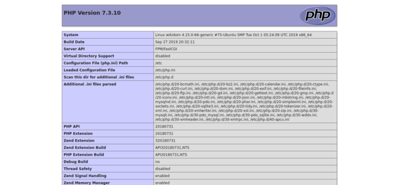

---
author:
  name: Linode
  email: docs@linode.com
contributor:
  name: Bagas Sanjaya
published: 2019-11-15
modified: 2019-11-15
modified_by:
  name: Linode
title: "Serve PHP with PHP-FPM and Apache"
description: 'Serve PHP files on Apache with PHP-FPM'
keywords: ["apache", "php-fpm"]
license: '[CC BY-ND 4.0](https://creativecommons.org/licenses/by-nd/4.0)'
external_resources:
 - '[Apache mod_proxy Docs](https://httpd.apache.org/docs/current/mod/mod_proxy.html)'
 - '[PHP Manual](https://secure.php.net/docs.php)'
---

While you can serve PHP on Apache using `mod_php` (default configuration), the system resources used are hungry. This because `mod_php` is loaded even for static assets (such as HTML, JavaScript, and image files), depending on your Apache setup.

With PHP-FPM and Apache paired, requests for PHP files are offloaded to PHP-FPM as reverse proxy, thus separating memory footprint of processing PHP from Apache and reduce system resources usage. In addition, this setup can be used with all MPMs (`prefork`, `worker`, and `event`), while `mod_php` is only compatible with `prefork` MPM.

This guide will configure Apache to process PHP files by PHP-FPM.

## Before You Begin

**You need to have a working LAMP setup**. Linode maintains [install guides for LAMP](/docs/web-servers/lamp/) which you can follow.


This guide use CentOS 7 with PHP 7.3 from [IUS Repository](https://ius.io). Configuration files may be placed on different places, depending on your OS, PHP and Apache version, and repository when you installed PHP and Apache packages. Substitute paths, package and service names when appropriate.



All steps on this guide require root privileges. Ensure that you run them as root or by prefixing them with `sudo` as non-root user. See [Users & Groups guide](/docs/tools-reference/linux-users-and-groups/) for more details.


## Install and Configure PHP-FPM

1.  Install PHP-FPM (for example, if you have PHP 7.3 installed on your system):

        yum install php73-fpm

2.  In order for Apache to be able to serve PHP with PHP-FPM without permission errors, PHP-FPM have to be run by user and group Apache is running, and PHP-FPM socket have to be owned by Apache.

    Set them by edit `user`, `group`, `listen.owner`, and `listen.group` options on  default pool configuration (`/etc/php-fpm.d/www.conf`) to:

    
...
; Unix user/group of processes
; Note: The user is mandatory. If the group is not set, the default user's group
;       will be used.
user = apache
group = apache
...
; Set permissions for unix socket, if one is used. In Linux, read/write
; permissions must be set in order to allow connections from a web server. Many
; BSD-derived systems allow connections regardless of permissions.
; Default Values: user and group are set as the running user
;                 mode is set to 0660
listen.owner = apache
listen.group = apache
;listen.mode = 0660
...


3.  PHP-FPM accepts requests either from TCP socket (`127.0.0.1:9000`) or by Unix socket. The latter is recommended because it avoids network overhead caused by the former.

    Again, edit default pool configuration to choose Unix socket:

    
...
;listen = 127.0.0.1:9000
...
listen = /run/php-fpm/www.sock
...


4.  By default, PHP-FPM enable `PATH_INFO`/`PATH_TRANSLATED` support. With mentioned support, however, PHP-FPM arbitrarily process every `.php` requests, even though that the URI doesn't exist, thus malicious scripts can be injected into Apache.

    To avoid the problem, limit requests that PHP-FPM processes by set `cgi.fix_pathinfo` to `0` (no) on PHP master configuration (`/etc/php.ini`). This cause PHP-FPM to only try literal URI, and return error when it doesn't exist:

    
...
; cgi.fix_pathinfo provides *real* PATH_INFO/PATH_TRANSLATED support for CGI.  PHP's
; previous behaviour was to set PATH_TRANSLATED to SCRIPT_FILENAME, and to not grok
; what PATH_INFO is.  For more information on PATH_INFO, see the cgi specs.  Setting
; this to 1 will cause PHP CGI to fix its paths to conform to the spec.  A setting
; of zero causes PHP to behave as before.  Default is 1.  You should fix your scripts
; to use SCRIPT_FILENAME rather than PATH_TRANSLATED.
; http://php.net/cgi.fix-pathinfo
cgi.fix_pathinfo=0
...


5.  Restart PHP-FPM service to take the changes above effective:

        systemctl restart php-fpm.service

## Enable PHP-FPM Support on Apache

1.  Install package that contain configurations for PHP-FPM:

        yum install php73-fpm-httpd

    If your PHP distribution doesn't provide such package, you can create the configuration manually with following below:

    
#
# The following lines prevent .user.ini files from being viewed by Web clients.
#
<Files ".user.ini">
    Require all denied
</Files>

#
# Allow php to handle Multiviews
#
AddType text/html .php

#
# Add index.php to the list of files that will be served as directory
# indexes.
#
DirectoryIndex index.php

#
# Redirect to local php-fpm (no mod_php in default configuration)
#
# Enable http authorization headers
SetEnvIfNoCase ^Authorization$ "(.+)" HTTP_AUTHORIZATION=$1

<FilesMatch \.(php|phar)$>
    #SetHandler "proxy:fcgi://127.0.0.1:9000"
    SetHandler "proxy:unix:/run/php-fpm/www.sock|fcgi://localhost"
</FilesMatch>


2.  Ensure that `mod_proxy` and `mod_proxy_fcgi` are loaded:

    
...
LoadModule proxy_module modules/mod_proxy.so
...
LoadModule proxy_fcgi_module modules/mod_proxy_fcgi.so
...


3.  You can now remove `mod_php` package, since it has been replaced by PHP-FPM:

        yum remove mod_php73

4.  Syntax-check Apache configurations, then reload Apache:

        apachectl configtest && apachectl graceful

## Apache Site Configuration

1.  We will start from basic `VirtualHost` block serving HTTP site. As usual, replace `domain.tld` and `/path/to/document-root` with domain and document root of your site, respectively:

    
<VirtualHost *:80>
    ServerName   domain.tld
    DocumentRoot /path/to/document-root
    DirectoryIndex index.html

    <Location />
        Options FollowSymlinks Multiviews
        Require all granted
    </Location>
</VirtualHost>


2.  Inside `VirtualHost` block above, add `FilesMatch` block which matches PHP files and set the handler to PHP-FPM, via Unix socket:

    
<VirtualHost *:80>
...
    <FilesMatch \.(php|phar)$>
        SetHandler "proxy:unix/run/php-fpm/www.sock|fcgi://localhost"
    </FilesMatch>
...
</VirtualHost>


    You can configure proxy parameters with `Proxy` block and `ProxySet` directive. For example, some install scripts for many [CMS](/docs/websites/cms/cms-overview/) may require timeout more than default (60 seconds) or they will return `504 Gateway Timeout` error. Then the configuration will be:

    
...
    <Proxy "unix:/run/php-fpm/www.sock|fcgi://localhost">
        ProxySet timeout=100
    </Proxy>

    # Since we have Proxy block above, just SetHandler to FCGI address
    <FilesMatch \.(php|phar)$>
        SetHandler "proxy:fcgi://localhost"
    </FilesMatch>
...


    
Timeout value on `ProxySet` directive must match `max_execution_time` value on `php.ini` or least value between the former and latter will be in effect.


3.  If your web application offer user uploads, add `LocationMatch` block which deny PHP requests on uploads directory:

    
...
    <LocationMatch "/path/to/uploads/.+\.(php|phar)$">
        Require all denied
    </LocationMatch>
...


4.  Add `index.php` as valid index page:

    
...
    DirectoryIndex index.php index.html
...


5.  Syntax check and restart Apache:

        apachectl configtest && apachectl graceful

6.  Create `phpinfo.php` script, so you can test if PHP-FPM is working as intended:

        echo "<?php phpinfo(); ?>" > /path/to/document-root/phpinfo.php

7.  Visit `phpinfo.php` script from your browser. You should see details of your PHP configuration, which will be like:

    

    Notice the `Server API` entry. On typical LAMP stack with `mod_php`, `Server API` is `Apache 2.0 Handler`. Because we use PHP-FPM in place of `mod_php`, `Server API` is `FPM/FastCGI` instead.

8.  To test whether restriction directives to PHP requests above are working, copy `phpinfo.php` script to uploads directory:

        cp /path/to/document-root/phpinfo.php /path/to/document-root/path/to/uploads/

    Now try to visit the script from uploads URL. Apache should return `403 Forbidden` page:

    

9.  Once all done, delete the test script as it contains system configurations, which should not be known to untrusted users:

        find /path/to/document-root -type f -name phpinfo.php -delete
