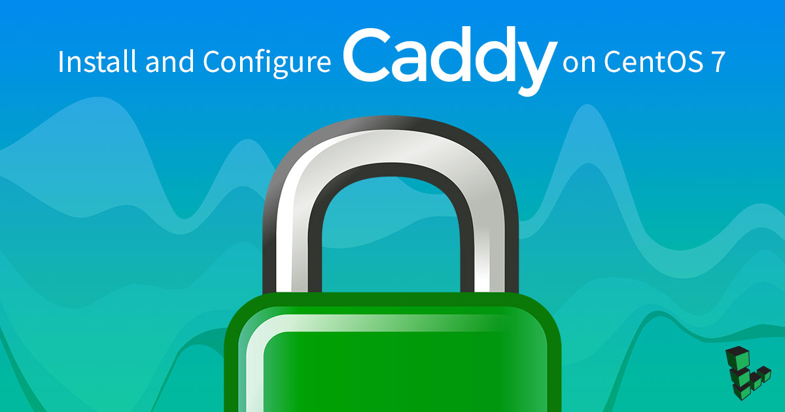

---
author:
  name: Linode Community
  email: docs@linode.com
description: 'This guide will show you how to install and configure Caddy and run it as a systemd service.'
keywords: ["caddy", "web server"]
license: '[CC BY-ND 4.0](https://creativecommons.org/licenses/by-nd/4.0)'
published: 2017-09-14
modified: 2018-02-02
modified_by:
  name: Linode
title: 'Install and Configure Caddy on CentOS 7'
contributor:
  name: Konstantin Kuchinin
  link: https://github.com/coocheenin
external_resources:
- '[Caddy Official Site](https://caddyserver.com)'
---

[Caddy](https://caddyserver.com/) is a fast, open-source and security-focused web server written in [Go](https://golang.org/). Caddy includes modern features such as support for virtual hosts, minification of static files, and HTTP/2. Caddy is also the first web-server that can obtain and renew SSL/TLS certificates automatically using [Let's Encrypt](https://letsencrypt.org/).

## Before You Begin

1.  Familiarize yourself with our [Getting Started](/docs/getting-started) guide and complete the steps for setting your Linode's hostname and timezone.

2.  This guide will use `sudo` wherever possible. Complete the sections of our [Securing Your Server](/docs/security/securing-your-server) guide to create a standard user account, harden SSH access and remove unnecessary network services.

3.  You will need to register your site's domain name and follow our [DNS Manager Overview](/docs/networking/dns/dns-manager-overview#add-records) guide to point your domain to your Linode.

4.  Update your system:

        sudo yum update

## Install Caddy

1.  Enable the [EPEL](https://fedoraproject.org/wiki/EPEL) repository:

        sudo yum install epel-release

2.  Install Caddy:

        sudo yum install caddy


Caddy has recently changed their [license](https://caddyserver.com/products/licenses). Please read over the license agreement to ensure that you are not violating the license with your project. To use Caddy without a commercial license, you may need to [compile from source](/docs/web-servers/caddy/compile-caddy-from-source).

## Add Web Content

1.  Set up a home directory, **web root**, for your website:

        sudo mkdir -p /var/www/my-website

2.  Create a test page:

        echo '<!doctype html><head><title>Caddy Test Page</title></head><body><h1>Hello, World!</h1></body></html>' > /var/www/my-website/index.html

3.  Restore the correct selinux labels on the web root:

        sudo restorecon -r /var/www/my-website

## Configure the Caddyfile

Add your hostname and web root to the Caddy configuration. Replace `example.com` with your site's domain name:


example.com {
root /var/www/my-website
}


## Enable the Caddy Service

1.  Enable the Caddy service:

        sudo systemctl enable --now caddy.service

2.  Type your domain into a browser window on your local machine and you should see the test page. If everything is configured correctly, you should see a green lock symbol in the URL bar, indicating that your connection is secure.
