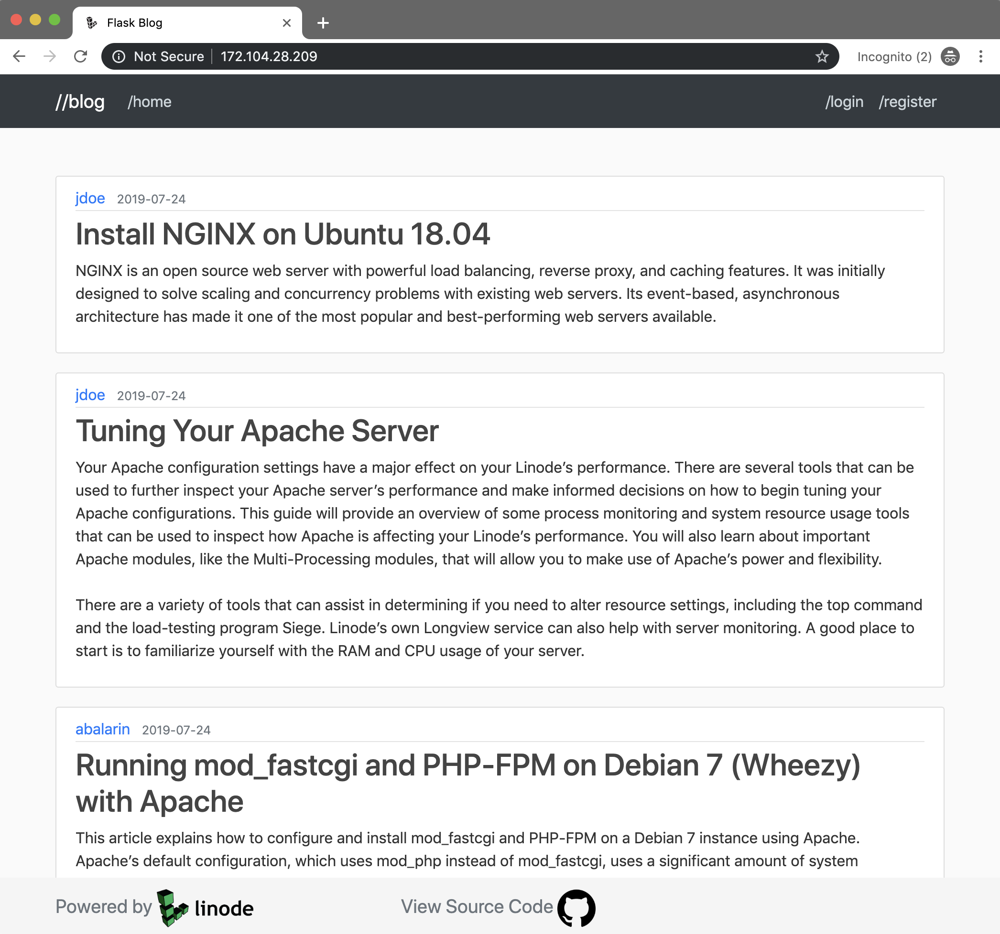

---
author:
  name: Austin Balarin
  email: abalarin@linode.com
description: 'Deploying a Flask Application on to a production environment.'
keywords: ['python','flask','gunicorn','nginx', 'flask deployment', 'python flask']
license: '[CC BY-ND 4.0](https://creativecommons.org/licenses/by-nd/4.0)'
published: 2019-07-25
modified: 2019-07-25
modified_by:
  name: abalarin
title: "Deploy a Flask Application on Ubuntu"
contributor:
  name: Austin Balarin
  link: https://github.com/abalarin
external_resources:
- '[Python](https://www.python.org/)'
- '[Flask](https://flask.palletsprojects.com/en/1.0.x/)'
- '[NGINX](https://www.nginx.com/resources/wiki/)'
- '[Gunicorn](http://docs.gunicorn.org/en/stable/)'
---

This guide will walk you through deploying a Flask Application to a Production Environment.

In this guide we will setup the following for our Application to communicate with the world:

- Web Server, to handle HTTP/HTTPS requests. We will be using NGINX in this guide.
- Web Server Gateway Interface (WSGI), for your Application to communicate with a web server. We will be using Gunicorn to communicate with our NGINX web server.
- Supervisor, to automatically restart Gunicorn if it crashes or your Linode reboots unexpectedly.

## Before You Begin
1.  Create a Flask Application or use this [Example Application](https://github.com/abalarin/Flask-on-Linode) and run it on your local machine.

2.  Familiarize yourself with our [Getting Started](/docs/getting-started/) guide and complete the steps for setting your Linode's hostname and timezone.

3.  This guide will use `sudo` wherever possible. Complete the sections of our [Securing Your Server](/docs/security/securing-your-server/) to create a standard user account, harden SSH access and remove unnecessary network services.

4.  Update your system:

        sudo apt-get update && sudo apt-get upgrade

## Move Your App to Your Linode
You have done a decent amount of development on your Flask Application on your local development environment and are ready to deploy it to a production environment.


This guide assumes you will transfer your project to your Linode's `\home` directory. It doesn't necessarily matter where your project is located so long as you are cognizant of your projects location when configuring deployment and running commands.


#### Retrieving App From Source Control
1.  SSH into your Linode. Replace the example IP address with your Linode’s IP address:

        ssh user@172.104.28.209

2. Navigate to the Home directory of your Linode:

        cd /home

3. Pull your project from source control. Replace the example repo with yours:

        git clone https://github.com/abalarin/Flask-on-Linode.git

#### Retrieving App From Your Local Machine
1.  From your local machine SCP your project into your Linode's Home directory. Replace the example IP address with your Linode’s IP address and `flask_app` with the name of your projects root directory:

        scp -r flask_app/ user@172.104.28.209:/home

## Configure NGINX
NGINX is a free, open-source, high-performance HTTP server and reverse proxy, as well as an IMAP/POP3 proxy server.

1. Install NGINX:

        sudo apt install nginx

2. Create an NGINX configuration file for your app. Replace `flaskapp` with your applications name and `172.104.28.209` with your Linode's IP or your FQDN:

        sudo nano /etc/nginx/sites-enabled/flaskapp

    
server {
	listen 80;
	server_name 172.104.28.209;

	location / {
		proxy_pass http://127.0.0.1:8000;
		proxy_set_header Host $host;
		proxy_set_header X-Forwarded-For $proxy_add_x_forwarded_for;
	}
}


3. Disable the default configuration file by removing the symlink in `/etc/nginx/sites-enabled/`:

        unlink /etc/nginx/sites-enabled/default

4. Reload your NGINX configuration:

        sudo nginx -s reload

5. Navigate to your Linodes IP in a web browser. You should see the following or similar NGINX Gateway error. Next we are going to set up our WSGI to communicate with NGINX and serve our application to the internet.

    

## Install Python and Packages
You should now be in your applications root directory on your Linode. We are going to install and configure the last little bit of requirements to deploy our Application.

1. Install Python 3:

        sudo apt install python3

2. Install pip:

        sudo apt install python3-pip

3. Install Flask Packages/libraries. If you are using the [Example Flask Blog Application](https://github.com/abalarin/Flask-on-Linode.git) then the packages should be located in [`/home/Flask-on-Linode/flask_app/requirements.txt`](https://github.com/abalarin/Flask-on-Linode/blob/master/flask_app/requirements.txt):

        pip3 install -r requirements.txt

### Configure Environment Variables
Most Applications will need some kind of configuration. There are different settings you might want to change depending on the application environment like toggling the debug mode, setting the secret key, database URI configuration, etc., see the [Flask Configuration docs](https://flask.palletsprojects.com/en/1.1.x/config/) for more details.


This section can be skipped if you do not have any environment variables.



If you do have environment variables then you will likely want to put them in some kind of configuration file that is **outside of source control**. If you upload your environment variables to a public repository then anyone can access them and compromise your Linode or Application.


The following is a basic example of some environment variables that you might have in your application.

1.  Create a configuration file for any of the environment variables of your Application:

        sudo nano /etc/config.json

    
{
  "SECRET_KEY": "1A37BbcCJh67",
  "SQLALCHEMY_DATABASE_URI": "sqlite:///site.db"
}


You will likely not want to store your `SECRET_KEY` as a static environment variable. It should be [randomly generated](https://flask.palletsprojects.com/en/1.0.x/quickstart/#sessions) on each unique visit to your site.


2.  Modify your Flask configuration and import the newly created configuration. The following is an example based off of our [Example Flask App](https://github.com/abalarin/Flask-on-Linode).

    
import json
import urllib3

with open('/etc/config.json') as config_file:
  config = json.load(config_file)

app.config['SECRET_KEY'] = config.get('SECRET_KEY')
app.config['SQLALCHEMY_DATABASE_URI'] = config.get('SQLALCHEMY_DATABASE_URI')



## Deploy your Application
Gunicorn 'Green Unicorn' is a Python WSGI HTTP Server for UNIX. It's a pre-fork worker model. The Gunicorn server is broadly compatible with various web frameworks, simply implemented, light on server resources, and fairly speedy.

1. Install Gunicorn:

        pip3 install gunicorn

2. Run Gunicorn from your Application's root directory or a directory up from your Application's entry point. In the below example we are telling Gunicorn to look for the WSGI instance named **app** in the **flask_app** directory. In our example project this WSGI instance named **app** is located in [`\home\Flask-on-Linode\flask_app\__init__.py`](https://github.com/abalarin/Flask-on-Linode/blob/master/flask_app/__init__.py).

        gunicorn -w 3 flask_app:app

    
root@localhost:/home/Flask-on-Linode# gunicorn -w 3 flask_app:app
[2019-07-25 15:09:04 +0000] [32421] [INFO] Starting gunicorn 19.9.0
[2019-07-25 15:09:04 +0000] [32421] [INFO] Listening at: http://127.0.0.1:8000 (32421)
[2019-07-25 15:09:04 +0000] [32421] [INFO] Using worker: sync
[2019-07-25 15:09:04 +0000] [32424] [INFO] Booting worker with pid: 32424
[2019-07-25 15:09:04 +0000] [32425] [INFO] Booting worker with pid: 32425
[2019-07-25 15:09:04 +0000] [32426] [INFO] Booting worker with pid: 32426


    
You can specify the amount of workers you want Gunicorn to use with the `-w` flag. A good rule of thumb to determine worker count is double your CPU core's and add 1. For a Nanode with 1 CPU core thats 3 workers.


**Your Application is now live!! You should be able to navigate to it by entering your Linodes IP into a web browser.**

## Configure Supervisor
Supervisor is a client/server system that allows its users to monitor and control a number of processes on UNIX-like operating systems. Supervisor is great for auto-reloading Gunicorn if it crashes or if your Linode is rebooted unexpectedly.

1. Install Supervisor:

        sudo apt install supervisor

2. Create a Supervisor program:

        sudo nano /etc/supervisor/conf.d/flaskapp.conf

    
[program:flaskapp]
directory=/home/Flask-on-Linode
command=gunicorn -w 3 flask_app:app
autostart=true
autorestart=true
stopasgroup=true
killasgroup=true
stderr_logfile=/var/log/flaskapp/flaskapp.err.log
stdout_logfile=/var/log/flaskapp/flaskapp.out.log


3. Create the log files we listed in the above example of a Supervisor program for Gunicorn to write to:

        sudo mkdir /var/log/flaskapp
        touch /var/log/flaskapp/flaskapp.out.log
        touch /var/log/flaskapp/flaskapp.err.log

4. Reload Supervisor to apply changes:

        sudo supervisorctl reload
    
root@localhost:/home/Flask-on-Linode# sudo supervisorctl reload
Restarted supervisord


It may take a few seconds to load but your application should now be accessible again via your Linode's IP. If you are unable to access your application or receive a bad gateway error, Gunicorn is likely not running. Check your log files:

    cat /var/log/flaskapp/flaskapp.err.log
    cat /var/log/flaskapp/flaskapp.out.log
