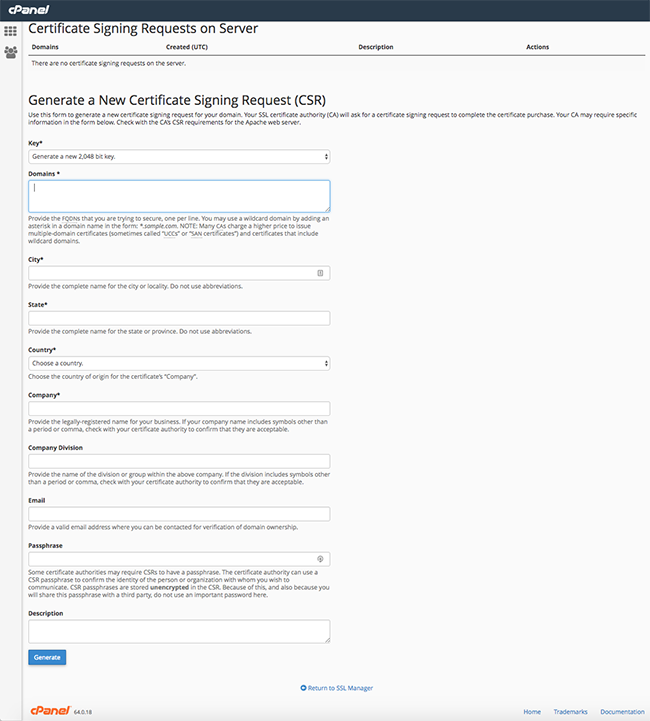
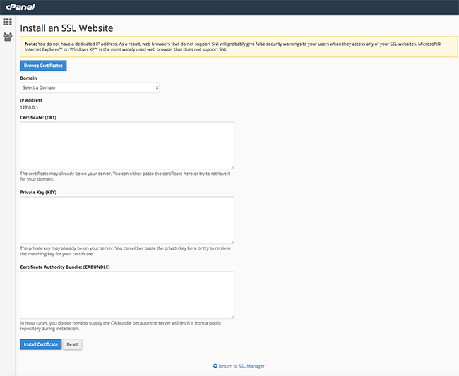

---
author:
  name: Chris Ciufo
  email: docs@linode.com
description: 'Generate a CSR and install a commercial SSL certificate through the cPanel interface.'
keywords: ["ssl", "ip"]
tags: ["security", "ssl", "centos", "cms"]
license: '[CC BY-ND 4.0](https://creativecommons.org/licenses/by-nd/4.0)'
aliases: ['/web-applications/control-panels/cpanel/ssl-on-cpanel/','/websites/cms/install-a-commercial-ssl-certificate-using-cpanel/']
modified: 2017-04-28
modified_by:
  name: Jonathan Chun
published: 2011-09-27
title: Install a Commercial SSL Certificate Using cPanel
external_resources:
 - '[cPanel Home Page](https://cpanel.com)'
 - '[cPanel Support](https://cpanel.com/support)'
 - '[cPanel Documentation](https://documentation.cpanel.net)'
---

[cPanel](https://cpanel.com/) is a commercial web-based control panel for server systems. It can help ease the burden of common system administration tasks such as website creation, database deployment and management, and more. This guide will show you how to install SSL certificates on your Linode using cPanel, through the cPanel interface. This guide was made on a cPanel server using the default *paper_lantern* theme.

## Before You Begin

1.  This guide requires that you have cPanel/WHM installed and configured on your system. If you do not have it installed, follow our instructions on how to [Install cPanel on CentOS](/docs/websites/cms/install-cpanel-on-centos).

2.  You should have a cPanel account created. If you have not created an account yet, reference the cPanel Documentation to learn how to [Create a New Account](https://documentation.cpanel.net/display/ALD/Create+a+New+Account).

When you're ready to proceed, log into your cPanel account, go to the **Security** section, and click on **SSL/TLS**.

## Create a Certificate Signing Request

You will need a Certificate Signing Request to obtain an SSL certificate from any issuer. To generate your CSR, click on **Generate, view, or delete SSL certificate signing requests**. On this page, you will need to fill out the form with your information as requested and click on the **Create** button at the bottom:

After you submit the CSR form, you will see several different sections. The ones you will need are:

- **Encoded Certificate Signing Request**: This is your CSR.
- **Encoded Key**: This is the private key that you will need to install the certificate once generated.

With this information on hand, you can contact the certificate authority of choice to obtain a certificate. Some certificate authorities include:
- [Verisign](http://www.verisign.com/)
- [GeoTrust](https://www.geotrust.com/)
- [Comodo](https://www.comodo.com/)
- [DigiCert](https://www.digicert.com/)
- [Thawte](https://www.thawte.com/)

## Install a Commercial SSL Certificate

Once you have obtained an SSL certificate from your issuer of choice, you can proceed to the installation by clicking **Manage SSL sites**. On this page, you will need to scroll down and select the domain you wish to install an SSL certificate on.

Paste the contents of your `.crt` file into the top box. Next, paste the encoded key from before into the **Private Key** section. Finally, if your Certificate Authority (SSL Issuer) provided you with intermediate certificates (usually a `.cabundle` file), paste the contents of that file into the final box labeled **Certificate Authority Bundle**.

Click on **Install Certificate**, and cPanel will automatically install your certificate and configure SNI as necessary. The process can take a few minutes, so don't worry if it doesn't complete instantly. On occasion, the installation bar will hang and not complete even after several minutes. In this case, simply refresh the page and you should see that the certificate has been installed.

## Troubleshooting

In general, this process is very straightforward and should not result in any complications. If something does go wrong, the best place to get help would be either at the [cPanel Forums](https://forums.cpanel.net/) or by contacting [cPanel Support](https://cpanel.com/support) directly.
