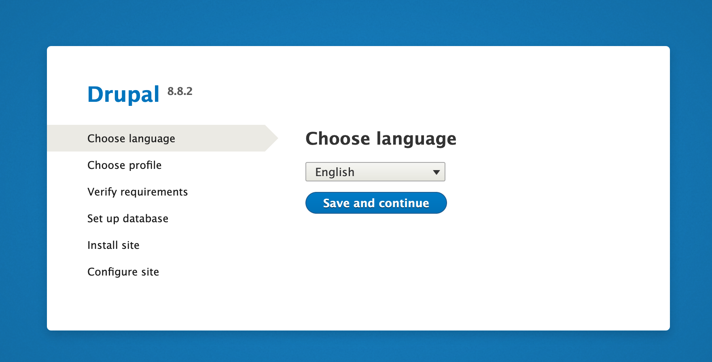

---
author:
    name: Linode
    email: docs@linode.com
description: 'Drupal 8 is the lastest version of the popular Drupal content management system. This guide will show you how to install, configure, and optimize the Drupal CMS on your Linode so you can begin developing your own websites.'
keywords: ["drupal", "cms", "apache", "php", "content management system", "drupal 8"]
license: '[CC BY-ND 4.0](https://creativecommons.org/licenses/by-nd/4.0)'
modified_by:
    name: Linode
published: 2020-02-18
title: How to Install and Configure Drupal on CentOS 8
h1_title: Installing Drupal on CentOS 8
---

Drupal 8 is the latest version of the popular [Drupal](https://www.drupal.org/) content management system. This guide demonstrates how to install Drupal 8 on your Linode running Ubuntu.

## Before You Begin

1.  Familiarize yourself with our [Getting Started](/docs/getting-started) guide and complete the steps for setting your Linode's hostname and timezone.

2.  This guide will use `sudo` wherever possible. Complete the sections of our [Securing Your Server](/docs/security/securing-your-server) guide to create a standard user account, harden SSH access, remove unnecessary network services and create firewall rules for your web server; you may need to make additional firewall exceptions for your specific application.

3.  Install and configure a [LAMP stack on CentOS 8](/docs/web-servers/lamp/install-lamp-stack-on-centos-8)

## Download and Prepare Drupal 8

1.  See Drupal's [download page](https://www.drupal.org/project/drupal) for the exact URL of Drupal 8's core tarball.

    If you installed and configured your Apache server using [LAMP stack on CentOS 8](/docs/web-servers/lamp/install-lamp-stack-on-centos-8) guide, the publicly accessible DocumentRoot should be located at `/var/www/html/example.com/public_html/`. Change to that directory and download Drupal 8 with wget:

        cd /var/www/html/example.com
        sudo yum install wget
        sudo wget http://ftp.drupal.org/files/projects/drupal-8.8.2.tar.gz

    
Ensure that the version number matches the Drupal 8 version you wish to download.


2.  Extract the downloaded tarball's contents into Apache's DocumentRoot:

        sudo yum install tar
        sudo tar -zxvf drupal-8.*.tar.gz --strip-components=1 -C public_html

3.  Drupal depends on a PHP graphics library called GD. Install GD and other dependencies:

        sudo yum install -y php php-{cli,mysqlnd,json,opcache,xml,mbstring,gd,curl}

4.  Drupal 8's `settings.php` file is configured when the first start configuration is run. The file must be created from the default templates and their permissions changed so that Drupal can write to them.

        cd /var/www/html/example.com/public_html/sites/default
        sudo cp /var/www/html/example.com/public_html/sites/default/default.settings.php /var/www/html/example.com/public_html/sites/default/settings.php

5.  Enforce [trusted hostnames](https://www.drupal.org/node/2410395) with those that users will access your site from.

    
$settings['trusted_host_patterns'] = array(
  '^www\.example\.com$',
  '^example\.com$',
  );



    
*trusted_host_patterns* also accepts IP addresses or localhost.


## Configure Apache 2.4

1.  Drupal 8 enables [Clean URLs](https://www.drupal.org/getting-started/clean-urls) by default so Apache's rewrite module is enabled on CentOS. However, you will need to set directory permissions and SELinux labels:

        sudo yum install policycoreutils-python-utils
        sudo semanage fcontext -a -t httpd_sys_rw_content_t "/var/www/html/example.com/public_html(/.*)?"
        sudo semanage fcontext -a -t httpd_sys_rw_content_t '/var/www/html/example.com/public_html/sites/default/settings.php'
        sudo semanage fcontext -a -t httpd_sys_rw_content_t '/var/www/html/example.com/public_html/sites/default/files'
        sudo restorecon -Rv /var/www/html/example.com/public_html
        sudo restorecon -v /var/www/html/example.com/public_html/sites/default/settings.php

2.  Then specify the rewrite conditions for DocumentRoot in Apache's configuration file.
    If you installed and configured your Apache server using [LAMP stack on CentOS 8](/docs/web-servers/lamp/install-lamp-stack-on-centos-8) guide, the configuration file for your site is located at `/etc/httpd/conf.d/example.com.conf`.

    
<Directory /var/www/html/example.com/public_html>
     Options Indexes FollowSymLinks
     AllowOverride All
    Require all granted
</Directory>



3.  Change ownership of Apache's DocumentRoot from the system's root user to Apache. This allows you to install modules and themes, and to update Drupal, all without being prompted for FTP credentials.

        sudo chown apache:apache -R /var/www/html/example.com/public_html

4.  Restart Apache so all changes are applied. If you’re using a Linux distribution which uses systemd (CentOS 7, Debian 8, Fedora, Ubuntu 15.10+):

        sudo systemctl restart httpd

    If your init system is SystemV or Upstart (CentOS 6, Debian 7, Ubuntu 14.04):

        sudo service httpd restart

## Drupal First Start

1.  Go to your Linode's domain or IP address in a web browser. This will show you the first step of Drupal 8's web configuration. Choose your language and proceed to the next page.

    

2.  Choose whether you want a Standard or Minimal installation profile.

    

3.  Complete the database configuration using the DB name, username and password you created when [setting up your LAMP stack](/docs/web-servers/lamp/install-lamp-stack-on-ubuntu-18-04) with a MySQL or MariaDB database.

    

    
If you forgot the name of your database, log back in to MySQL or MariaDB with: `mysql -u root -p` and enter: `show databases;`.


4.  After Drupal 8 installs your site, you'll be shown a site configuration page where you must create the admin user for your website. Do not use the same password that you used for your database.

    

    Next, you'll be taken to the administrative dashboard which will say that Drupal 8 was installed successfully.

    

5.  Now that Drupal 8 is finished writing to `settings.php` and `services.yaml`, you can restore their default permissions:

        sudo chmod 644 /var/www/html/example.com/public_html/sites/default/{settings.php,services.yml}

## Where to Go From Here

Drupal has a significant amount of documentation for [security best practices](https://www.drupal.org/security/secure-configuration) to consider when hardening any Drupal server. There is also extensive [community documentation](https://www.drupal.org/documentation) and there are multiple ways of [participating in the Drupal community](https://www.drupal.org/community).
