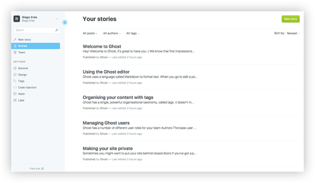

---
author:
  name: Linode
  email: docs@linode.com
description: 'This tutorial will teach you how to install Ghost, a publishing platform great for running blogs and sharing published content, on Ubuntu 18.04 and using Docker Compose'
og_description: 'Easily publish your own professional-looking blog using Ghost on your Linode.'
keywords: ["ghost", "install ghost", "ghost on linode", "configure ghost", "deploy ghost on ubuntu 18.04", "docker", "docker compose"]
license: '[CC BY-ND 4.0](https://creativecommons.org/licenses/by-nd/4.0)'
modified: 2018-08-16
modified_by:
  name: Linode
published: 2018-08-16
title: How to Install Ghost CMS with Docker Compose on Ubuntu 18.04
external_resources:
- '[Ghost Setup Documentation](https://docs.ghost.org/v1.0.0)'
- '[Ghost Theme Documentation](https://themes.ghost.org/v1.0.0)'
- '[Ghost API Documentation](https://api.ghost.org/v1.0.0)'
- '[Ghost on Docker Hub](https://docs.docker.com/samples/library/ghost/)'
---

<!--  -->

[Ghost](https://ghost.org/developers/) is an open source blogging platform that helps you easily create a professional-looking online blog.

Ghost's 1.0.0 version is the first major, stable release of the Ghost content management system (CMS). Ghost 1.0.0 has a brand new Markdown editor, refreshed user interface, new default theme design, and more. Ghost has been [frequently updated since](https://github.com/TryGhost/Ghost/releases) this major release, and the current version at time of publication is [1.25.5](https://github.com/TryGhost/Ghost/releases/tag/1.25.5).

In this guide you'll deploy Ghost using Docker Compose on Ubuntu 18.04. Ghost is powered by JavaScript and Node.js. Using Docker to deploy Ghost will encapsulate all of Ghost's Node dependencies and keep the deployment self-contained. The Docker Compose services are also fast to set up and easy to update.

## Before you Begin

1.  Familiarize yourself with Linode's [Getting Started](/docs/getting-started/) guide and complete the steps for deploying and setting up a Linode running Ubuntu 18.04, including setting the hostname and timezone.

1.  This guide uses `sudo` wherever possible. Complete the sections of our [Securing Your Server](/docs/security/securing-your-server/) guide to create a standard user account, harden SSH access and remove unnecessary network services.

    
Replace each instance of example.com in this guide with your Ghost site’s domain name.


1.  Complete the [Add DNS Records](/docs/websites/set-up-web-server-host-website/#add-dns-records) steps to register a domain name that will point to your Ghost Linode.

1.  Ensure your system is up to date:

        sudo apt update && sudo apt upgrade

1.  Your Ghost site will serve its content over HTTPS, so you will need to obtain an SSL/TLS certificate. Request and download a free certificate from [Let's Encrypt](https://letsencrypt.org) by using [Certbot](https://certbot.eff.org):

        sudo apt-get install software-properties-common
        sudo add-apt-repository ppa:certbot/certbot
        sudo apt-get update
        sudo apt-get install certbot
        sudo certbot certonly --standalone -d example.com

    These commands will download a certificate to `/etc/letsencrypt/live/example.com/` on your Linode.

    
Why not use [Certbot's Docker container](https://hub.docker.com/r/certbot/certbot/)? When your certificate is periodically renewed, your web server will need to be reloaded in order to use the new certificate. This is usually accomplished by passing a web server reload command through Certbot's [`--deploy-hook` option](https://certbot.eff.org/docs/api/hooks.html#certbot.hooks.deploy_hook).

In your deployment, the web server will run in its own container, and the Certbot container would not be able to directly reload it. A workaround for this limitation would be needed to enable this architecture.


1.  You will need to install Docker and Docker Compose before proceeding. If you haven't used Docker before, it's recommended that you review the [Introduction to Docker](/docs/applications/containers/introduction-to-docker/), [When and Why to Use Docker](/docs/applications/containers/when-and-why-to-use-docker/), and [How to Use Docker Compose](/docs/applications/containers/how-to-use-docker-compose/) guides for some context on how these technologies work.

### Install Docker



### Install Docker Compose



## Install Ghost

The Ghost deployment has three different components:

-   The Ghost service itself
-   A database (MySQL) that will store your blog posts
-   A web server (NGINX) that will proxy requests on HTTP and HTTPS to your Ghost service

These services are listed in a single Docker Compose file.

### Create the Docker Compose file

1.  Create a directory to hold your new Docker Compose services:

        mkdir ghost
        cd ghost

1.  Create a file named `docker-compose.yml` and open it in your text editor. Paste in the contents from the following snippet. Replace `example.com` with your domain, and insert a new database password where `your_database_root_password` appears. The values for `database__connection__password` and `MYSQL_ROOT_PASSWORD` should be the same.

    
version: '3'
services:

  ghost:
    image: ghost:latest
    restart: always
    depends_on:
      - db
    environment:
      url: https://example.com
      database__client: mysql
      database__connection__host: db
      database__connection__user: root
      database__connection__password: your_database_root_password
      database__connection__database: ghost
    volumes:
      - /opt/ghost_content:/var/lib/ghost/content

  db:
    image: mysql:5.7
    restart: always
    environment:
      MYSQL_ROOT_PASSWORD: your_database_root_password
    volumes:
      - /opt/ghost_mysql:/var/lib/mysql

  nginx:
    build:
      context: ./nginx
      dockerfile: Dockerfile
    restart: always
    depends_on:
      - ghost
    ports:
      - "80:80"
      - "443:443"
    volumes:
       - /etc/letsencrypt/:/etc/letsencrypt/
       - /usr/share/nginx/html:/usr/share/nginx/html


1.  The Docker Compose file creates a few [Docker bind mounts](https://docs.docker.com/storage/bind-mounts/#choosing-the--v-or---mount-flag):

    -   `/var/lib/ghost/content` and `/var/lib/mysql` inside your containers are mapped to `/opt/ghost_content` and `/opt/ghost_mysql` on the Linode. These locations store your Ghost content.

    -   NGINX uses a bind mount for `/etc/letsencrypt/` to access your Let's Encrypt certificates.

    -   NGINX also uses a bind mount for `/usr/share/nginx/html` so that it can access the [Let's Encrypt challenge files](https://letsencrypt.org/how-it-works/) that are created when your certificate is renewed.

    Create directories for those bind mounts (except for `/etc/letsencrypt/`, which was already created when you first generated your certificate):

        sudo mkdir /opt/ghost_content
        sudo mkdir /opt/ghost_mysql
        sudo mkdir -p /usr/share/nginx/html

### Create the NGINX Docker image

The Docker Compose file relies on a customized NGINX image. This image will be packaged with the appropriate server block settings.

1.  Create a new `nginx` directory for this image:

        mkdir nginx

1.  Create a file named `Dockerfile` in the `nginx` directory and paste in the following contents:

    
FROM nginx:latest

COPY default.conf /etc/nginx/conf.d


1.  Create a file named `default.conf` in the `nginx` directory and paste in the following contents. Replace all instances of `example.com` with your domain:

    
server {
  listen 80;
  listen [::]:80;
  server_name example.com;
  # Useful for Let's Encrypt
  location /.well-known/acme-challenge/ { root /usr/share/nginx/html; allow all; }
  location / { return 301 https://$host$request_uri; }
}

server {
  listen 443 ssl http2;
  listen [::]:443 ssl http2;
  server_name example.com;

  ssl_protocols TLSv1.2;
  ssl_ciphers HIGH:!MEDIUM:!LOW:!aNULL:!NULL:!SHA;
  ssl_prefer_server_ciphers on;
  ssl_session_cache shared:SSL:10m;

  ssl_certificate     /etc/letsencrypt/live/example.com/fullchain.pem;
  ssl_certificate_key /etc/letsencrypt/live/example.com/privkey.pem;

  location / {
    proxy_set_header Host $host;
    proxy_set_header X-Real-IP $remote_addr;
    proxy_set_header X-Forwarded-Proto https;
    proxy_pass http://ghost:2368;
  }
}


    This configuration will redirect all requests on HTTP to HTTPS (except for Let's Encrypt challenge requests), and all requests on HTTPS will be proxied to the Ghost service.

### Run and Test Your Site

From the `ghost` directory start the Ghost CMS by running all services defined in the `docker-compose.yml` file:

    docker-compose up -d

Verify that your blog appears by loading your domain in a web browser. It may take a few minutes for Docker to start your services, so try refreshing if the page does not appear when you first load it.

If your site doesn’t ever appear in your browser, try reviewing the logs generated by Docker for more information. To see these errors:

1.  Shut down your containers:

        cd ghost
        docker-compose down

1.  Run Docker Compose in an attached state so that you can view the logs generated by each container:

        docker-compose up

1.  To shut down your services and return the command prompt again, enter `CTRL-C`.

## Complete the Setup

To complete the setup process, navigate to the Ghost configuration page by appending `/ghost` to the end of your blog’s URL or IP. This example uses `https://example.com/ghost`.

1. On the welcome screen, click **Create your account**:

    

2. Enter your email, create a user, password, and blog title:

    

3. Invite additional members to your team. If you’d prefer to skip this step, click **I’ll do this later, take me to my blog!** at the bottom of the page.

    

4. Navigate the Ghost admin area to create your first post, change your site's theme, or configure additional settings:

    

## Usage and Maintenance

You do not need to manually start your containers if you reboot your Linode, because the option `restart: always` was assigned to your services in your `docker-compose.yml` file. This option tells Docker Compose to automatically start your services when the server boots.

### Update Ghost

Your `docker-compose.yml` specifies the `latest` version of the Ghost image, so it’s easy to update your Ghost version:

    docker-compose down
    docker-compose pull && docker-compose up -d

### Renew your Let's Encrypt Certificate

1.  Open your Crontab in your editor:

        sudo crontab -e

1.  Add a line which will automatically invoke Certbot at 11PM every day. Replace `example.com` with your domain:

        0 23 * * *   certbot certonly -n --webroot -w /usr/share/nginx/html -d example.com --deploy-hook='docker exec ghost_nginx_1 nginx -s reload'

    Certbot will only renew your certificate if its expiration date is within 30 days. Running this every night ensures that if something goes wrong at first, the script will have a number of chances to try again before the expiration.

1.  You can test your new job with the `--dry-run` option:

        sudo bash -c "certbot certonly -n --webroot -w /usr/share/nginx/html -d example.com --deploy-hook='docker exec ghost_nginx_1 nginx -s reload'"