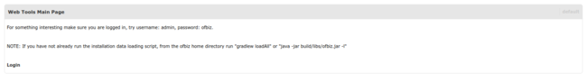
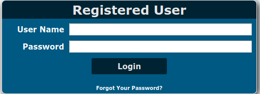
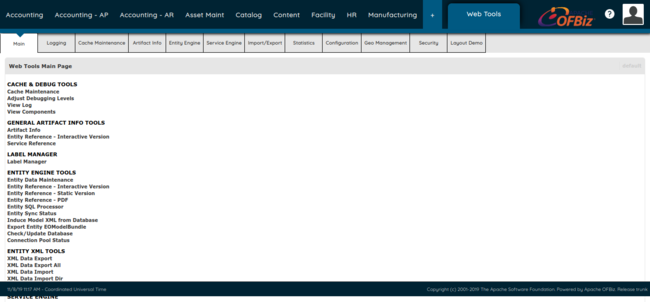
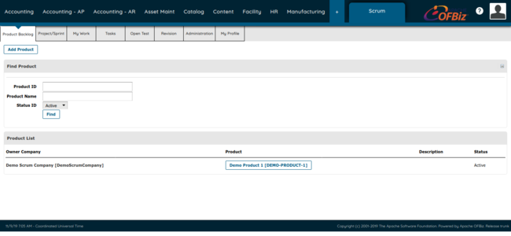

---
author:
    name: Linode
    email: docs@linode.com
modified: 2019-11-06
modified_by:
    name: Linode
contributor:
    name: Bagas Sanjaya
license: '[CC BY-ND 4.0](https://creativecommons.org/licenses/by-nd/4.0)' 
title: "Install Apache OFBiz with NGINX and PostgreSQL"
description: 'Apache OFBiz is an open-source, flexible ERP solution by Apache, written in Java. It allows developers to extend and enhance it, thanks to its common architecture framework. This guide covers installing OFBiz from Git repo, so upgrading and maintenance will be easier. The setup will also use NGINX (as reverse proxy) and PostgreSQL (for database backend).'
keywords: ["OFBiz", "Apache OFBiz"]
external_resources:
 - '[OFBiz Wiki](https://cwiki.apache.org/confluence/display/OFBIZ/Home)'
 - '[OFBiz End User Documentation](https://cwiki.apache.org/confluence/display/OFBIZ/Documentation#Documentation-End-UserDocumentation)'
 - '[OFBiz Technical Documentation](https://cwiki.apache.org/confluence/display/OFBIZ/Technical+Documentation)'
---

[OFBiz](https://ofbiz.apache.org/) is an open-source ERP solution created by Apache Software Foundation, written in Java. With its flexible architecture framework, developers can extend and customize it to suit any businesses' needs, from small to large enterprises.

This guide covers installing and configuring OFBiz, installed from Git repository (to ease maintenance, upgrade, and customization). NGINX will serve OFBiz as reverse proxy, and PostgreSQL will back the database.

## Before You Begin

1.  Complete [Getting Started](/docs/getting-started/) guide.

2.  Follow [Securing Your Server](/docs/security/securing-your-server/) guide, except *Configuring a Firewall* section. We will configure the firewall with UFW later in this guide.

3.  Update your packages.


This guide use CentOS 7, but you can adapt to other OS as appropriate.



Some commands require root privilege. Such will be prefixed with `#` symbol. You can also run them as regular user with `sudo`. See [Understanding Sudo](/docs/tools-reference/linux-users-and-groups/#understanding-sudo) for more details.


## Install JDK 8

JDK (Java Development Kit) 8 is required for building and running OFBiz.

Luckily, OpenJDK is available from distribution's repository, so you can install it directly:

    # yum install java-1.8.0-openjdk java-1.8.0-openjdk-devel

Alternatively, [login](https://login.oracle.com/oaam_server/login.do) to your Oracle account, then download [Oracle JDK](https://www.oracle.com/technetwork/java/javase/downloads/index.html). Select JDK 8, then follow [installation instruction here](https://docs.oracle.com/javase/8/docs/technotes/guides/install/linux_jdk.html). Install using `.tar.gz` archive.

## UFW Firewall Configuration

Below are basic firewall rules to allow SSH connections, HTTP ports, and internal ports used by OFBiz. For more information, refer to our [UFW guide](/docs/security/firewalls/configure-firewall-with-ufw/) for details:

    # ufw allow ssh
    # ufw allow 8443/tcp
    # ufw allow 80,443/tcp
    # ufw allow 8009
    # ufw allow 1099
    # ufw allow 9989,9990
    # ufw allow 45564
    # ufw enable

## Add User for Running OFBiz

For security reasons, create dedicated user for running and maintaining OFBiz instance.

**Debian & Ubuntu:**

    # addgroup ofbiz-user
    # adduser --ingroup ofbiz-user ofbiz

**Other Linux systems:**

    # groupadd ofbiz-user
    # useradd -g ofbiz-user ofbiz

The remaining of this guide will be run as `ofbiz` user, unless otherwise noted. Switch to the user:

    # su - ofbiz

## Add JDK Environment Variables to the Shell

If you installed JDK via OpenJDK packages above, this section isn't required, because the package will set up environment variables for you. If you instead install Oracle JDK via archives, append following to `~/.bashrc` and `~/.bash_profile`:


export JAVA_HOME=/path/to/jdk8
export PATH=$PATH:$JAVA_HOME/bin


## Get, Build, and Run OFBiz

1.  Create directory to store OFBiz files:

        # mkdir /opt/ofbiz-framework

2.  Change ownership and permission so that `ofbiz` user can write to the directory:

        # chown -R ofbiz:ofbiz-user /opt/ofbiz-framework
        # chmod -R 755 /opt/ofbiz-framework

3.  Download latest OFBiz snapshot from GitHub repository:

        $ cd /opt/
        $ git clone https://github.com/apache/ofbiz-framework.git --depth 1

4.  OFBiz use `gradlew` script (front-end to Gradle build system) to run all build tasks (from compiling to running and stopping instances).

    Clean residual artifacts, build OFBiz, and load default dataset. This use [embedded Derby database system](https://db.apache.org/derby/), which is rather slow. We will switch to PostgreSQL later:

        $ ./gradlew cleanAll loadAll

5.  Start OFBiz. This will print a lot of informations to your console, so suppress them and run on the background:

        $ ./gradlew ofbiz &> /dev/null & disown

    Alternatively:

        $ ./gradlew ofbizBackground

6.  Navigate to your OFBiz administration interface on `https://your_linode_ip:8443/webtools`. Since OFBiz use self-signed SSL certificate, certificate warning will be thrown by your browser. Bypass the warning and proceed anyway.

    You should now see the page which invites you to log in:

    

    Click login link and you will see log in page:

    

    Log in to OFBiz with `admin` username and `ofbiz` password. You should be landed on main page of *Web Tools* administration interface, which look like:

    

    Now you can explore the rests of OFBiz interface to get acquainted.

7.  When you have done using OFBiz, stop the instance:

        $ ./gradlew "ofbiz --shutdown"

## Plugins

With Plugins, one can extend OFBiz using pre-built solutions, without having to reinvent them. OFBiz developers maintain official plugins which [the full list can be checked here](https://cwiki.apache.org/confluence/display/OFBIZ/Plugins+stack).

Below `scrum` plugin will be installed. This plugin allow enterprises to manage agile development activities. You can substitute `scrum` for other plugins that you interested. The `pullPluginSource` task will download, build, and install the plugin from source.

To install the plugin:

    $ ./gradlew pullPluginSource -PpluginID=scrum


You need to have recent version of Subversion installed on your system before installing any plugins using `gradlew` script.


Alternatively, to install all plugins at once:

    $ ./gradlew pullAllPluginsSource

You can also download all plugins using Git:

    $ git clone --depth 1 https://github.com/apache/ofbiz-plugins.git plugins

For the plugins to be effective, rebuild OFBiz:

    $ ./gradlew cleanAll loadAll

Next time when OFBiz is started (`./gradlew ofbiz`), interface for each plugins's component (`scrum` for example) can be accessed via web interface, like:

## Serve OFBiz with NGINX

OFBiz instances can be served by using reverse proxy. Here we will use NGINX, which is suitable for this task (fast, lightweight, etc.). For more details of NGINX configurations refer to [Getting Started with NGINX guide series](/docs/web-servers/nginx/nginx-installation-and-basic-setup/).

For this guide we use [upstream NGINX repo](http://nginx.org/en/linux_packages.html).

1.  Since we're about to edit OFBiz source code, which is version-controlled by Git, create and switch to separate branch (`production`) to store customizations. This branch will be based on mainline branch (`trunk`), which will be kept unchanged/pristine. Further edits to OFBiz code will be on `production` branch:

        $ git checkout -b production trunk

    
Plugin directory (`plugins/`) is not affected by Git operations on `ofbiz-framework` directory, since it is added into `.gitignore`. When you later [update OFBiz](#updating-ofbiz), you may need to update your plugins to make them work with your current OFBiz snapshot.


2.  Currently, in order to access OFBiz, the client have to visit `https://mydomain.tld:8443`. With reverse proxy, they can just make requests to `mydomain.tld` and NGINX will pass them to OFBiz. Also, the URL will be rewritten without `8443` port in the URL.

    In order for reverse proxy to work, the OFBiz files must be edited. File `framework/webapp/config/url.properties` contains URL configurations. Edit the file and set standard HTTP port (80 and 443) and URL domain you wish to serve:

    
...
# HTTPS Port (Secure port)
port.https.enabled=Y
# empty by default see OFBIZ-9206
port.https=443
force.https.host=mydomain.tld

# HTTP Port (Not Secure port)
port.http=80
force.http.host=mydomain.tld
...


3.  Rebuild OFBiz:

        $ ./gradlew cleanAll loadAll

4.  Create NGINX site configuration for your OFBiz instance. In this configuration, NGINX will try to serve static assets (JavaScript, HTML & CSS files, images), then request to OFBiz otherwise. Also, HTTPS site is enabled with SSL certificate validated for your domain:

    
server {
    listen 80;
    listen [::]:80;
    server_name mydomain.tld;

    access_log /path/to/access.log;
    error_log  /path/to/error.log;

    return 301 https://mydomain.tld$request_uri;
}

server {
    listen 443 ssl;
    listen [::]:443 ssl;
    server_name mydomain.tld;

    access_log /path/to/access.log;
    error_log  /path/to/error.log;

    # SSL credentials
    ssl_certificate     /path/to/mydomain.cert.pem;
    ssl_certificate_key /path/to/mydomain.key.pem;

    # Pass to OFBiz instance at localhost
    location @ofbiz {
        proxy_pass https://127.0.0.1:8443;
        proxy_set_header Host $host;
        proxy_set_header X-Real-IP $remote_addr;
        proxy_set_header X-Forwarded_For $proxy_add_x_forwarded_for;
    }

    # Try static assets from common theme's images directory and expires
    # for 3 days
    location ~* \.(js|css|png|jpg|jpeg|gif|ico)$ {
        root /opt/ofbiz-framework/themes/common-theme/webapp/images;
        try_files $uri @ofbiz;
        expires 3d;
    }

    # Root Location
    location / {
        root /opt/ofbiz-framework/themes/common-theme/webapp/images;
        try_files $uri $uri/ @ofbiz;
    }


5.  Syntax check and reload NGINX:

        # nginx -t && nginx -s reload

6.  Visit OFBiz administration interface at `mydomain.tld/webtools`. You should see `Login` link to log in to OFBiz. Again, use `admin` username and `ofbiz` password.

7.  Commit changes to Git:

    
Prior to commit, set your username and email address to use for Git. Refer to [Getting Started with Git](/docs/development/version-control/how-to-configure-git/#configure-git) for details.


        $ git commit -a -m "Set URL and Port on webapp for reverse proxy support"

## PostgreSQL

By default, OFBiz use embedded Derby as database backend. For production enviroments however, an external database is recommended. For this guide, we will use PostgreSQL. Feel free to adapt this guide if you wish to use different database (such as MySQL/MariaDB)

### Install PostgreSQL

1.  Install repo package from [upstream](https://www.postgresql.org/download/linux/redhat/) and EPEL repo:

        # yum install https://download.postgresql.org/pub/repos/yum/reporpms/EL-7-x86_64/pgdg-redhat-repo-latest.noarch.rpm
        # yum install epel-release

2.  Update your system and install PostgreSQL 11 (substitute with other versions as needed):

        # yum update
        # yum install postgresql11 postgresql11-server

3.  Initialize the database and start PostgreSQL service:

        # /usr/pgsql-11/bin/postgresql-11-setup initdb
        # systmectl enable postgresql-11 --now

### OFBiz Entity Engine Setup

OFBiz uses *entity engine* to manage data. *Entity* is defined as a piece of data defined by set of fields and relation to other entity. This concept is borrowed from [*Entity-Relation*](https://en.wikipedia.org/wiki/Entity%E2%80%93relationship_model) concept in Relational Database Management Systems.

To configure the entity engine to use PostgreSQL:

1.  Configure local PostgreSQL data source on `framework/entity/config/entity.xml`. Set the domain to `localhost` and use default port of 5432. The name after the domain (`ofbiz` in `jdbc:postgresql:127.0.0.1:5432/ofbiz`) defines the name of database. Also, set database credentials (username and password):

    
...
<datasource name="localpostgres"
        ...>
    ...
    <inline-jdbc
            jdbc-driver="org.postgresql.Driver"
            jdbc-uri="jdbc:postgresql://127.0.0.1:5432/ofbiz"
            jdbc-username="dbuser"
            jdbc-password="dbpassword" .../>
</datasource>
<datasource name="localpostolap"
        ...>
    ...
    <inline-jdbc
            jdbc-driver="org.postgresql.Driver"
            jdbc-uri="jdbc:postgresql://127.0.0.1:5432/ofbizolap"
            jdbc-username="dbuser"
            jdbc-password="dbpassword" .../>
</datasource>
<datasource name="localposttenant"
        ...>
    ...
    <inline-jdbc
            jdbc-driver="org.postgresql.Driver"
            jdbc-uri="jdbc:postgresql://127.0.0.1:5432/ofbiztenant"
            jdbc-username="dbusername"
            jdbc-password="dbpassword" .../>
</datasource>
...


2. Still editing the same file, use local PostgreSQL as data source for all *delegators* (`default`, `default-no-eca`, and `test`):

    
...
    <delegator name="default" entity-model-reader="main" entity-group-reader="main" entity-eca-reader="main" distributed-cache-clear-enabled="false">
        <group-map group-name="org.apache.ofbiz" datasource-name="localpostgres"/>
        <group-map group-name="org.apache.ofbiz.olap" datasource-name="localpostgresolap"/>
        <group-map group-name="org.apache.ofbiz.tenant" datasource-name="localpostgrestenant"/>
    </delegator>
   <delegator name="default-no-eca" entity-model-reader="main" entity-group-reader="main" entity-eca-reader="main" entity-eca-enabled="false" distributed-cache-clear-enabled="false">
        <group-map group-name="org.apache.ofbiz" datasource-name="localpostgres"/>
        <group-map group-name="org.apache.ofbiz.olap" datasource-name="localpostgresolap"/>
        <group-map group-name="org.apache.ofbiz.tenant" datasource-name="localpostgrestenant"/>
    </delegator>
    <delegator name="test" entity-model-reader="main" entity-group-reader="main" entity-eca-reader="main">
        <group-map group-name="org.apache.ofbiz" datasource-name="localpostgres"/>
        <group-map group-name="org.apache.ofbiz.olap" datasource-name="localpostgresolap"/>
        <group-map group-name="org.apache.ofbiz.tenant" datasource-name="localpostgrestenant"/>
    </delegator>
...


3.  Add [PostgreSQL JDBC driver](https://jdbc.postgresql.org) as build-time dependency to `build.gradle`. Substitute the version number with latest driver version on its website:

    
dependencies {
    ...
    implementation 'org.postgresql:postgresql:42.2.8'
    ...
}
 

### Database Setup

1.  In order for OFBiz to be able loading data into the database, [password-based authentication](https://www.postgresql.org/docs/11/auth-password.html) must be used. Depending on your distribution, this method may not be default authentication method, and other methods are used instead (such as [peer authentication](https://www.postgresql.org/docs/11/auth-peer.html)). If this is the case, you need editing PostgreSQL configurations to use password-based authentication.

    PostgreSQL supports both [SCRAM](https://en.wikipedia.org/wiki/Salted_Challenge_Response_Authentication_Mechanism) SHA-256 and MD5 for challenge-response scheme based password authentication. The former is more secure than the latter, so we will use this authentication method.

    
SCRAM SHA-256 password authentication method is supported on PostgreSQL 10 or later. If you use version 9.6 or earlier, you have to use MD5 password authentication method instead.


    Edit client authentication configuration file (`pg_hba.conf`) and change authentication method for all network-based local connections to SCRAM SHA-256: 

    
...
# IPv4 local connections:
host    all             all             127.0.0.1/32            scram-sha-256
# IPv6 local connections:
host    all             all             ::1/128                 scram-sha-256
...


    Also edit database master configuration (`postgresql.conf`) to use SCRAM SHA-256 for password-based authentication:

    
...
password_encryption = scram-sha-256
...


    Then restart PostgreSQL:

        # systemctl restart postgresql-11.service

2.  Login to PostgreSQL as database superuser:

        # su -c "psql" - postgres

3.  Add database user (*role* in PostgreSQL terms) for use by OFBiz. Ensure that username and password match the ones specified on [OFBiz entity engine configuration](#ofbiz-entity-engine-setup):

        postgres=# CREATE ROLE dbusername WITH NOCREATEDB LOGIN PASSWORD 'dbpassword';

4.  Create three databases (`ofbiz`, `ofbizolap`, and `ofbiztenant`) and own them to OFBiz database user (`dbusername`). Set encoding to UTF-8. To work-around locale issues, specify `template0` as template which databases are created from:

        postgres=# CREATE DATABASE ofbiz WITH OWNER dbusername TEMPLATE template0 ENCODING 'UTF8';
        postgres=# CREATE DATABASE ofbizolap WITH OWNER dbusername TEMPLATE template0 ENCODING 'UTF8';
        postgres=# CREATE DATABASE ofbiztenant WITH OWNER dbusername TEMPLATE template0 ENCODING 'UTF8';

5.  Quit PostgreSQL shell:

        postgres# \q

6.  To test database connection, login to PostgreSQL as OFBiz database user:

        $ psql -h 127.0.0.1 -U dbusername -W

    Enter password for database user. If login success, you will be greeted with PostgreSQL shell, like:

    
dbusername=>


    If it fails, double-check your database configurations.

7.  Commit changes to Git:

        $ git commit -a -m "Use PostgreSQL backend"

### Rebuild OFBiz

Rebuild OFBiz to load data into new database backend:

    $ ./gradlew cleanAll loadAll

Depending on your Linode, the build can take 2 to 5 times faster than when using Derby backend.

## systemd Service

With OFBiz run as systemd service, you don't have to manually invoke `gradlew` script in order to run OFBiz.

1.  Create service file:

    
# OFBiz service

[Unit]
Description=OFBiz Service - Open for Business

[Service]
Type=simple

# environment variables
# comment out if you use OpenJDK from your distribution instead
# of Oracle JDK
Environment="JAVA_HOME=/path/to/jdk8"
Environment="PATH=/path/to/jdk8/bin:/bin:/sbin:/usr/bin:/usr/sbin"

User=ofbiz
WorkingDirectory=/opt/ofbiz-framework

# start and stop executables
# note that systemd requires specifying full/absolute path to executables
ExecStart=/opt/ofbiz-framework/gradlew ofbiz
ExecStop=/opt/ofbiz-framework/gradlew "ofbiz --shutdown"

[Install]
WantedBy=multi-user.target


2.  Reload systemd daemon, then enable and immediately start the service:

        # systemctl daemon-reload
        # systemctl enable ofbiz.service --now

3.  To view logs emitted from `gradlew`, use `journalctl`:

        # journalctl -u ofbiz.service

## Updating OFBiz

1.  Stop OFBiz service:

        # systemctl stop ofbiz.service

2.  Switch back to `trunk` branch:

        $ git checkout trunk

3.  Pull changes from upstream:

        $ git pull

4.  Update `production` branch by rebase it against `trunk`:

        $ git checkout production
        $ git rebase trunk

5.  If you have any plugins installed, update them too. For example, to update `scrum` plugin which is installed through `gradlew` script:

        $ cd plugins/scrum
        $ svn update

    Alternatively, if you install all plugins via Git, you can perform update by:

        $ cd plugins
        $ git pull

6.  Rebuild OFBiz for updates to take effect:

        $ cd /opt/ofbiz-framework
        $ ./gradlew cleanAll loadAll
