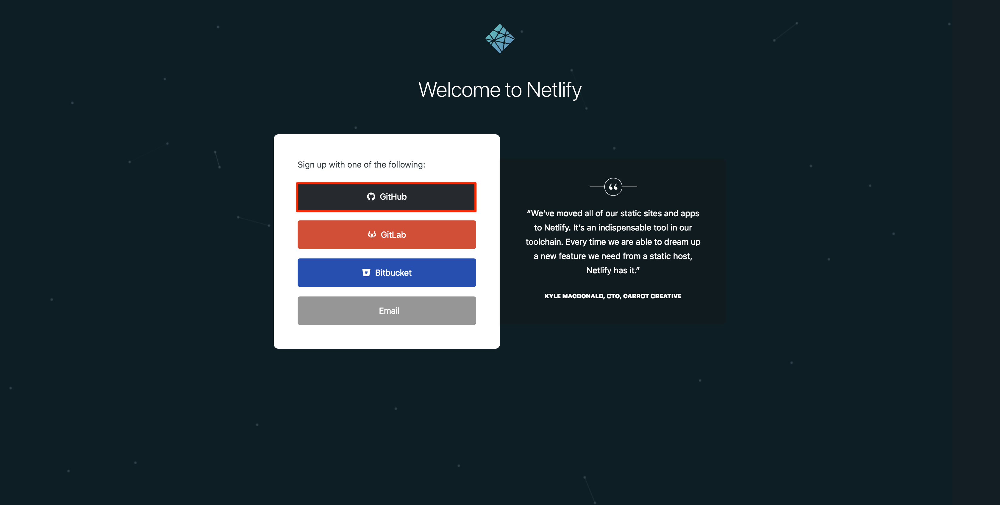

---
author:
  name: Linode Community
  email: docs@linode.com
description: 'Create a CI/CD Pipeline with Gatsby.js, Netlify and Travis CI'
keywords: ['gatsbyjs','gatsby','ssg','static site generator', 'travis', 'netlify']
license: '[CC BY-ND 4.0](https://creativecommons.org/licenses/by-nd/4.0)'
published: 2018-08-09
modified: 2018-08-09
modified_by:
  name: Linode
title: "Create a CI/CD Pipeline with Gatsby.js, Netlify and Travis CI"
contributor:
  name: Linode
external_resources:
- '[Link Title 1](http://www.example.com)'
- '[Link Title 2](http://www.example.net)'
---
Gatsby is a [Static Site Generator](/docs/websites/static-sites/how-to-choose-static-site-generator/#what-is-a-static-site) for React built on Node.js. Gatsby uses a modern web technology stack based on client-side Javascript, reusable APIs and prebuilt Markdown, otherwise known as the [*JAMstack*](https://jamstack.org/). This method of building a site is fast, secure and scalable. All production site pages are prebuilt and static, so Gatsby does not have to build HTML for each page request.

[Netlify](https://www.netlify.com/) is a PaaS provider that allows you to quickly deploy sites on their platform. In this guide Netlify will be used to provide a preview of your Gatsby site that can be shared with different stakeholders for site change approvals.

[Travis CI](https://travis-ci.com/) is a continuous integration tool that can be integrated with a GitHub repository to test and deploy your code. This tool will be used in this guide to test and deploy your Gatsby site to a Linode.

This guide creates the following CI/CD workflow:

1. Make code changes to your Gatsby project in your local git repository.

1. Push these changes to your remote git repository and submit a pull request.

1. Netlify will create a preview of the site with a unique URL that can be shared.

1. Travis CI will build the site in a container and run any declared tests.

1. When all tests pass, merge the PR into master to trigger a deployment to the live production site.

## Before You Begin

- Follow the [Getting Started](https://www.linode.com/docs/getting-started/) and [Securing Your Server](https://www.linode.com/docs/security/securing-your-server/) guides. This guide will use sudo wherever possible. Complete the sections of our Securing Your Server guide to create a standard user account, harden SSH access and remove unnecessary network services.
- Install [NGINX on Ubuntu 18.04](https://www.linode.com/docs/web-servers/nginx/install-nginx-ubuntu/).
- Set up and [host a website on a Linode](/docs/websites/set-up-web-server-host-website/).
    - Make sure your Linode’s hostname and Fully Qualified Domain Name (FQDN) are set. Throughout this guide our FQDN is `example.com`

        - To check your hostname run:

                hostname
                hostname -f

            The first command will output your short hostname; the second, your fully-qualified domain name (FQDN).
- Create a [GitHub](https://github.com/) account, if you don't have one.

## NGINX Configuration

NGINX should be installed on your [Linode running Ubuntu 18.04](/docs/web-servers/nginx/install-nginx-ubuntu/). Below is a copy of the NGINX configuration file that will be used for the Gatsby production site:


server {
    listen       80;
    server_name  example.com;
    #charset koi8-r;
    #access_log  /var/log/nginx/host.access.log  main;

    location / {
        root   /usr/share/nginx/html/example.com/public;
        index  index.html index.htm;
    }

    #error_page  404              /404.html;

    # redirect server error pages to the static page /50x.html

    error_page   500 502 503 504  /50x.html;
    location = /50x.html {
        root   /usr/share/nginx/html/example.com/public;
    }
}


The `root` directive is pointing to the `public` directory within the Gatsby site files. This directory and all its static files are created whenever the `gatsby build` command is issued. Our production site should only server static files to site visitors.

### Test NGINX

1. Test your configuration for errors:

        sudo nginx -t

1. Reload the configuration:

        sudo nginx -s reload

Navigate to your Linode’s FQDN or IP address in a browser. You should see the NGINX default page displayed.

## Install Gatsby on Your Local Computer

You will develop Gatsby locally and version control your files using [Git](/docs/development/version-control/how-to-configure-git/).

1. Install Node.js on your local computer:

        sudo apt install nodejs

1. Ensure Node.js was installed by checking its version:

        node --version

    Gatsby supports versions of Node back to v6.

1. Install the Node Package Manager (npm)

        sudo apt install npm

    Gatsby supports versions of npm back to v3.

1. Install the Gatsby command line:

        sudo npm install --global gatsby-cli

1. Gatsby uses [*starters*](https://www.gatsbyjs.org/docs/gatsby-starters/#gatsby-starters) to provide a pre-configured base Gatsby site that you can use to build on top off. We will use the "Hello World" starter to create a simple Gatsby site to demo. Install the "Hello World" starter in your home directory and `cd` into the directory. Replace `example-site` with the name of your project:

        gatsby new example-site https://github.com/gatsbyjs/gatsby-starter-hello-world
        cd ~/example-site

1. Inspect the contents of the directory with `ls`. You should see a similar output:

    
    LICENSE  node_modules  package.json  package-lock.json  public  README.md  src
    

    The `src` directory contains your project's source files. This starter will include the [React](https://reactjs.org/) javascript component file `src/pages/index.js`, which will be mapped to our example site's homepage and you will edit throughout this guide.

    Gatsby uses React *components* to build your site's static pages. Components are small and isolated pieces of code. Page components are stored in the `src/pages` directory and automatically become site pages with paths based on the file name.

1. Gatsby has a built-in development server with hot reloading, so that you can view local changes as you make them. This command will build the static files from the `src` directory's React components. Open a new shell session and run the Gatsby development server:

        gatsby develop

    You can now view your "Hello World" starter site in a browser. At the bottom of your shell session you will see a localhost address similar to `http://localhost:8000/`. Copy and paste this address into a browser window to view the Gatsby site. You should see a page displaying "Hello World".

1. Return to your initial shell session and `ls` to view the contents of your directory:

    
    LICENSE  node_modules  package.json  package-lock.json  public  README.md  src  public
    

    The example-site directory will now contain a `public` directory. This directory holds the static files built by Gatsby. Your NGINX server will serve the static files located in the `public` directory.

1. Open the `src/pages/index.js` file in your text editor and add some new text between the `
` tags to view the hot reloading in action:

    
    import React from "react"

    export default () => 
Hello world and universe!

    

    Navigate back to your browser window to view the updated text automatically appear on the page.

### Version Control Your Gatsby Project

Once you have created your "Hello World" Gatsby site, begin tracking your files locally. If you have not already set up a [GitHub](https://github.com/) account, you will need to do this before proceeding.

1. Make sure you are in the the `example-site` directory. Initialize a git repository to begin tracking your project files and stage all the files for your first commit:

        git init
        git add -A

    The Hello World starter includes a `.gitignore` file to designate which files and directories to ignore. By default it is set to ignore any files in the `public` directory. The `public` directory files will not be tracked locally, because they will be built dynamically using a Travis CI deploy script.

1. Commit all the Hello World starter files:

        git commit -m 'Initial commit'

1. Navigate to your Github account, create a new remote repository named `example-site` and copy the new remote repository's URL.

1. Add the remote repository as your local repository's origin. Replace `example-site.git` with your own repository's URL:

        git remote add origin https://github.com/example-site.git

1. Verify the origin location for the remote repository:

        git remote -v

1. Push your local repository to the remote repository:

        git push origin master

1. Navigate to your GitHub account and verify that all the files have been pushed successfully to the remote repository.

## Connect Your Remote Repository to Netlify

You will now connect Netlify to your GitHub account and Gatsby remote repository. Netlify will deploy every pull request issued to your GitHub remote repository to a unique URL. You can share this URL with anyone who needs to provide project approvals. Since this preview is generated per pull request, you can verify changes before merging to Master and deploying the Gatsby site to the production Linode server.

1. Navigate to the [Netlify](https://www.netlify.com/) site and click on the **Sign Up** link.

    

1. Click on the **GitHub** button to connect your GitHub account with Netlify. If you used a different web based version control service, select that option instead.

    

1. You will be taken to the GitHub site and asked to authorize Netlify to access your account. Click on the **Authorize Netlify** button:

    

1. Add your new site to Netlify and continue along with the prompts to finish connecting your repository to Netlify. Be sure to select the remote repository created in the previous steps:

    

1. Provide the desired deploy settings for your repository. Unless you are sure you need something different, keep the Netlify defaults:

    

    You can add a `netlify.toml` [configuration file](https://www.netlify.com/docs/netlify-toml-reference/) to your repository to define more deployment settings.

1. Navigate to your local Gatsby `example-site` directory and create a new branch to test Netlify:

        cd ~/example-site
        git checkout -b test-netlify

1. Push up the new branch to the remote repository:

        git push origin master

    Open up your GitHub account and create a [Pull Request](https://help.github.com/articles/creating-a-pull-request/). When you view the Pull Request, you will see a *deploy/netlify* row with a *Details* link. You can click on *Details* to view your Gatsby site's deploy preview.

    

    Every time you push changes to your branch, Netlify will provide a new preview link.

## Travis CI
Travis CI will test your Gatsby Hello World site and deploy it to the Linode production server whenever a pull request is merged to your remote repository's Master branch.

### Connect Your Remote Repository to Travis CI

1. Navigate to the [Travis CI](https://travis-ci.com/) site and click on the *Sign up with GitHub* button.

1. You will be redirected to your GitHub account. Authorize Travis CI to access your GitHub account.

    

1. You will be redirected to your Travis CI account's page where you will be able to see a listing of all your public repositories. Click on the toggle button next to your remote Gatsby repository to activate Travis CI for the repository.

### Configure Travis CI

1. Now that Travis CI is connected to your remote repository, navigate to your local Gatsby repository and create a new Git branch to keep track of your Travis configurations:

        cd ~/example-site
        git checkout -b travis-configs

1. Create a `.travis.yml` file at the root of the project.

        cd ~/example-site
        touch .travis.yml

    The `.travis.yml` file will contain all the configurations Travis needs to run your tests and trigger deployment to your Linode production server.

    
Make sure you commit changes at logical intervals as you modify your Gatsby `example-site` repository.


1. Open the `.travis.yml` file in a text editor and add the following lines:

    
language: node_js
node_js:
- "10.0"

dist: trusty
sudo: false

addons:
ssh_known_hosts:
- 192.0.2.0
    

    Since Gatsby is built with Node.js, set the Travis environment to use `node_js` as the build language and the latest version of Node.js (`10.0` as of writing this guide). You could use a different build and testing language, like Python if preferred.

    Travis can run your builds on different types of environments:

    - A sudo enabled, full virtual machine per build, that runs Linux.
    - A fast boot time container environment running Linux Ubuntu Trusty 14.04 in which sudo commands are not available.
    - An OS X environment for Objective-C and other OS X specific projects.

    The `.travis.yml` file uses a container environment running Linux Ubuntu Trusty 14.04. Travis CI can add entries to `~/.ssh/known_hosts` prior to cloning your git repository. Replace `192.0.2.0` with your Linode server's IP address.

        The Gatsby *Hello World* starter includes a `package.json` file. This file will be used by Travis during the build to create the build environment and run any declared tests. Creating tests for Gatsby is out of scope for this guide. [Mocha] is a commonly used Javascript test framework. To add a test to your Travis environment, you can edit the `package.json` file at the root of the local Gatsby project and add your mocha test script.

    
{
  "name": "gatsby-starter-hello-world",
  "description": "Gatsby hello world starter",
  "license": "MIT",
  "scripts": {
    "develop": "gatsby develop",
    "build": "gatsby build",
    "serve": "gatsby serve",
    "test": "mocha"
  },
  "dependencies": {
    "gatsby": "^1.9.277",
    "gatsby-link": "^1.6.46"
  }
}
    

1. You will need the Travis CLI to generate an encrypted version of your secret SSH key. Install the Travis CLI to your local computer:

        gem install travis

1. Log into your git hub account via the Travis CLI. Follow the prompts to provide your GitHub login credentials:

        travis login --org

1. Create a `scripts` directory to hold files related to deploying your Gatsby site:

        mkdir scripts

1. Generate a pair of ssh keys to use when deploying your site to the production server to the Create ssh separate keys to store in the `scripts` directory:

        ssh-keygen -t rsa -b 4096 -C "your_email@example.com" -f ~/example-site/scripts/id_rsa

    Your `scripts` directory will now have your pair of SSH keys, `id_rsa` and `id_rsa.pub`.

1. Add the location of the secret `id_rsa` key to your Gatsby projects `.gitignore` file. This will ensure that you do not accidentally commit the secret key to your remote repository:

    
scripts/id_rsa
    

1. Encrypt your ssh keys using the Travis CLI. Make sure you are in your `scripts` directory when issuing the command:

        cd scripts
        travis encrypt-file id_rsa --add

    You should now see a `id_rsa.enc` file in your scripts directory. The `--add` flag tells Travis CLI to add the following line to the `.travis.yml` file:

    
before_install:
    - openssl aes-256-cbc -K $encrypted_07d52615a665_key -iv $encrypted_07d52615a665_iv
    -in id_rsa.enc -out .ssh/id_rsa -d
    

    Edit the `.travis.yml` file to update the location of the encrypted secret key file for your Gatsby project with `scripts/id_rsa.enc`:

    
before_install:
    - openssl aes-256-cbc -K $encrypted_07d52615a665_key -iv $encrypted_07d52615a665_iv
    - in scripts/id_rsa.enc -out .ssh/id_rsa -d
    

1. Set up the SSH agent and ssh keys on the [Travis Worker](https://github.com/travis-ci/worker). The Travis Worker is the component of Travis CI that will run a CI job on your Travis build environment. Add the following lines after the secret key encryption lines:

    
before_install:
- openssl aes-256-cbc -K $encrypted_07d52615a665_key -iv $encrypted_07d52615a665_iv
- in scripts/id_rsa.enc -out scripts/id_rsa -d
- eval "$(ssh-agent -s)"
- cp scripts/id_rsa ~/.ssh/id_rsa
- chmod 600 ~/.ssh/id_rsa
- ssh-add ~/.ssh/id_rsa
- echo -e "Host 192.0.2.0\n\tStrictHostKeyChecking no\n" >> ~/.ssh/config
    

1. The Linode production server will need a copy of the public key. Add your deploy key to the Linode production server. Replace `192.0.2.0` with your Linode's IP address:

        scp ~/example-site/scripts/id_rsa.pub example_user@192.0.2.0:~/.ssh/authorized_keys

1. Provide deploy configurations for Travis to complete when a pull request is merged to the Master branch. Add the following lines to the bottom of the `.travis.yml` file:

    
deploy:
- provider: script
skip_cleanup: true
script: bash scripts/deploy.sh
on:
branch: master
    

    When a pull request is merged to the remote repository's Master branch, Travis will start a new build, run through all the defined tests and begin the deployment. The deployment steps are further defined in a script we will create, `scripts/deploy.sh`.

    The complete and final version of your `.travis.yml` file should resemble the following:
        
language: node_js
node_js:
- "10.0"

dist: trusty
sudo: false

addons:
ssh_known_hosts:
- 192.0.2.0

before_install:
- openssl aes-256-cbc -K $encrypted_07d52615a665_key -iv $encrypted_07d52615a665_iv
-in scripts/id_rsa.enc -out scripts/id_rsa -d
- eval "$(ssh-agent -s)"
- cp scripts/id_rsa ~/.ssh/id_rsa
- chmod 600 ~/.ssh/id_rsa
- ssh-add ~/.ssh/id_rsa
- echo -e "Host 192.0.2.0\n\tStrictHostKeyChecking no\n" >> ~/.ssh/config

deploy:
- provider: script
skip_cleanup: true
script: bash scripts/deploy.sh
on:
  branch: master
    

### Create a Deployment Script

In the previous section you completed the configurations for the Travis build. In this section, you will prepare the Linode to receive Git pushes from the Travis Worker and create the deployment script that Travis will use to deploy your Gatsby site. This script will only run when a pull request is merged to master from your remote repository.

1. SSH into your Linode and create a new directory that will be initialized as a bare Git repository:

        mkdir ~/gatsbybare.git

1. Navigate to the new directory and initialize the bare Git repository:

        cd ~/gatsbybare.git
        git init --bare

    A bare git repository stores git objects and does not keep a working directory or checked out files of the repository. Bare repositories provide a centralized place where users can push their changes. GitHub is an example of a bare git repository and common practice is to name this type of repository with the `.git` extension.

1. Configure the git directory to allow linking two repositories together:

        git config receive.denyCurrentBranch updateInstead

1. When Travis deploys the Gatsby site to the bare Git repository a Git hook will create a [detached working tree](https://git-scm.com/docs/git-worktree) copy of the bare Git repository files, which will make them available to the location of the `example-site.com` [NGINX root](/docs/websites/static-sites/install-gatsbyjs/#nginx-configuration). Your static Gatsby files are served from this location. From the bare Git repository, create a Git hook `post-receive` file and make it executable:

        touch hooks/post-receive
        chmod +x hooks/post-receive

    - Add the following lines to the `post-receive` Git hook file:

        
    #!/bin/sh
    git --work-tree=/usr/share/nginx/html/example-site --git-dir=/home/user/gatsbybare.git checkout -f
        

        Replace the directory locations with the location of your site's NGINX root and bare Git repository.

    - Navigate to the location of your `example-site.com` NGINX root and initialize a Git repository:

            cd /usr/share/nginx/html/example-site
            git init

1. Return to your local computer and ensure you are in the `travis-configs` branch of your Gatsby project's repository. Create your `deploy.sh` script in the `scripts` directory of your Gatsby project and make it executable:

        touch scripts/deploy.sh
        chmod +x scripts/deploy.sh

    - Create a deploy version of Gatsby's `.gitignore` file. When Travis deploys to the Linode server, the files in the `public/` directory should be tracked, since it holds all our site's static files. The deploy version of the `.gitignore` file will not contain an ignore rule for the `public/` directory. Make a copy of the `.gitignore` file in the `scripts` directory and remove the `public` ignore rule from the file:

            cp .gitignore scripts/prodignore

        
.cache/
public # remove this line
yarn-error.log
        

    - Open the `deploy.sh` file in your text editor and add the following lines:

        
#!/bin/bash
set -x

gatsby build

# Configure Git to only push the current branch
git config --global push.default simple

# Remove .gitignore and replace with a production version
rm -f .gitignore
cp scripts/prodignore .gitignore

# Add the Linode production server as a remote for the Travis Worker
git remote add production ssh://user@192.0.2.0:/home/user/gatsbybare.git

# Add and commit all the static files generated by the Gatsby build
git add . && git commit -m "Gatsby build"

# Push all changes to the Lindoe production server
git push -f production HEAD:master
        

        The deploy script builds the Gatsby static files and pushes them to the Linode. Replace `ssh://user@192.0.2.0:/home/user/gatsbybare.git` with your Linode's user, IP address and location of your bare Git repository.

### Test Your Travis Deployment
You will need to test your Travis CI/CD Pipeline to ensure it behaves as expected.

1. Commit all remaining changes to your Git branch and push them up to the remote GitHub repository:

        git push origin travis-configs

    This push will trigger a Netlify and Travis build.

1. Navigate to your remote GitHub repository and create a pull request for the `travis-configs` branch. In the pull request, you will be able to see the progress of the Netlify and Travis builds as they happen.

1. Travis requires a `0` exit for all build steps and tests in order to pass and allow the pull request to be merged into Master. Once your build and tests pass, merge the pull request into Master to begin a new Travis build, test and deployment to the Linode production server. You can log in to the [Travis site](https://travis-ci.org/) to view the build for the Master branch.

1. When the build, tests and deployment has completed, open a browser and enter the address of your Gatsby site, `http://example-site.com` to view the changes we added to the `index.js` page component in the `travis-configs` branch.

### Troubleshooting
If your Travis build is failing, here are some places to look when troubleshooting:

- Ensure all your `.sh` scripts are executable, including the Git hook on the Linode.
- You can test the Git hook on the linode server by running `bash ~/gatsbybare.git/post-receive`
- If you encounter permissions issues, make sure your local repository Gatsby files and Linode directories are owned by the same user group.
- To view the contents of the bare Git repository you can run `git ls-tree --full-tree -r HEAD`.