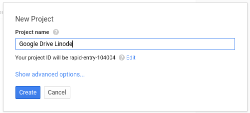
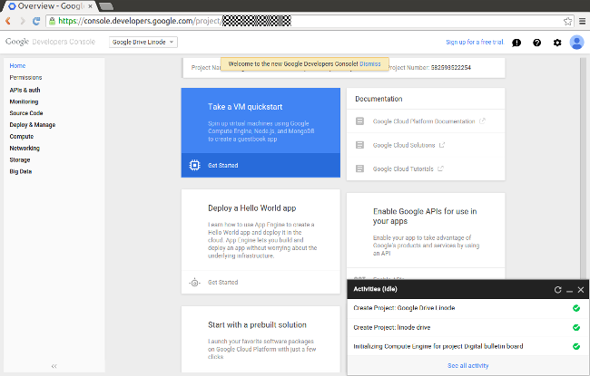
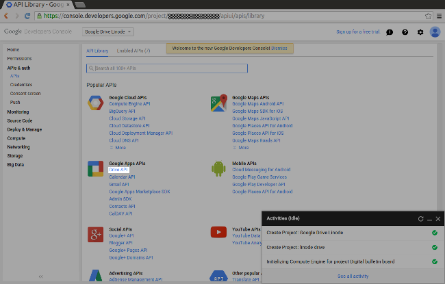
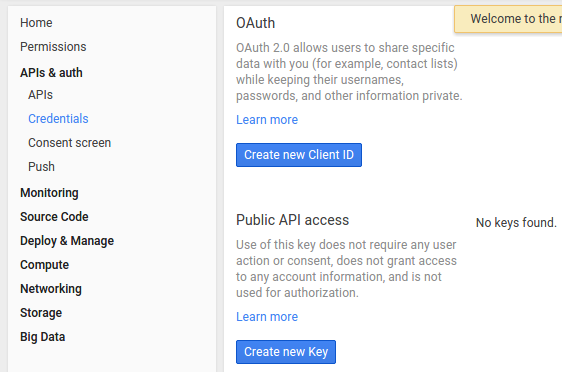
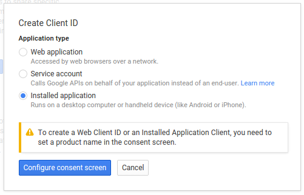
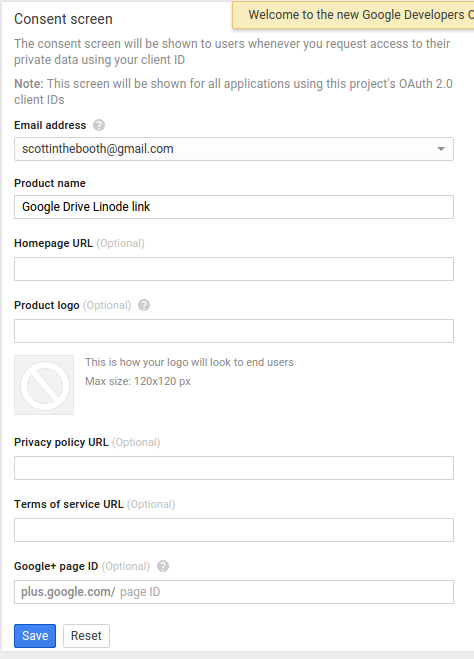
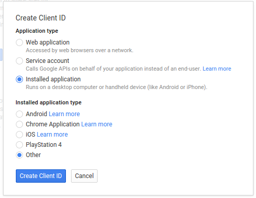
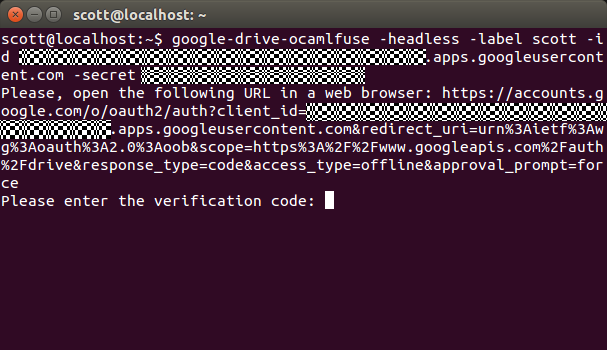

---
author:
    name: Scott Sumner
    email: scottinthebooth@gmail.com
description: 'Access Google Drive from your Linode console'
keywords: 'google,drive,console,fuse,apt,ubuntu'
license: '[CC BY-ND 3.0](http://creativecommons.org/licenses/by-nd/3.0/us/)'
published: 'Weekday, Month 00th, 2015'
modified: Weekday, Month 00th, 2015
modified_by:
    name: Linode
title: 'Access Google Drive from Linode'
contributor:
    name: Scott Sumner
    link:
---

If you've discovered Google Drive then you know that it can be an indispensible tool for moving files around.  While one of the standard counter-arguments is "just carry a flash drive" that works great until you need to add a file to your Linode.  Here's how to install and configure a great and free piece of software to access your Google Drive from your Linode!

**Google-drive-ocamlfuse (ocamlfuse)** uses the Drive API to scan and access your Google Drive contents.  A majority of the steps are authorizing its use and applying that authorization to the copy running on your Linode.  Let's get started, I'll explain a little more along the way.

## Installing software

First we have to add the repository where ocamlfuse lives to our Linode.  Once that's done we update so the changes are visible to us and then install like normal.  Login to your Linode via SSH and do the following:

1. Add the repository

    sudo add-apt-repository ppa:alessandro-strada/ppa

2. update apt

    sudo apt-get update

3. install the application

    sudo apt-get install google-drive-ocamlfuse

## Setup access to the Google Drive API

Now we're going to turn on API access to Google Drive and create a set of credentials.  Do these steps from a web browser on your regular computer.

1. Visit the API developer's console on your desktop

Visit https://console.developers.google.com/project

2. Create a project

Click **Create Project**, then give the project a name and click **Create** again.

It will take a moment to create the project, when its complete you'll arrive at the dashboard.

3. Enable the Google Drive API
Click APIs & auth, then APIs when the menu expands.  You'll see a list like this.  Then click on **Drive API**.

Click the blue **Enable API** button at the top of the page

4. Creating Credentials
Click **Credentials** in the menu.  Then click **Create new Client ID**

Select **Installed application** from the radio choices, then **Configure consent screen**

The product name field is required, you can leave everything else blank.  Then click **Save** at the bottom of the screen.

Once you click the save button the **Web application** box may be checked again.  Reselect **Installed application**, then select **Other** for the application type.  Then click **Create Client ID**.

You'll now have **Client ID** and **Client secret** strings

## Adding the Authorization to google-drive-ocamlfuse

Now that you've created a set of credentials we'll give them to ocamlfuse so Google knows it has authorization to access your Google Drive.  These steps start out back in the SSH session to your Linode

1. Authorize your Google Drive link

    google-drive-ocamlfuse -headless -label me -id `client ID from above` -secret `client secret from above`

The output from this command will give you a long URL.  Copy it and paste it for use in step 2.

2. Grant permission one more time

Google will ask for permission to allow this new application (ocamlfuse) to access your Google Drive.  Click **Accept** to receive the verification code.

3. Copy / paste the verification code back to ocamlfuse

Copy the verification code provided and paste it back into ocamlfuse

## Choose Where Google Drive Will Show Up

Just in case you're not familiar with the Linux file system everything is mapped into the directory tree.  Most of these are actual files and directories on disk but network locations and virtual entities can be added as well.  Here we create an empty directory where Google Drive will live.  All of your Google Drive files and folders will appear here.

1. Create a mount point

    mkdir googleDrive

2. Mount your google drive

    google-drive-ocamlfuse -label me googleDrive

## Wrapping Up

And you're done!  The directory **googleDrive** will now reflect your Google Drive contents!  The first time you access the folder it may take a few minutes for the contents to appear.  After that folder access is almost immediate.

## Resetting the connection

If Google Drive disappears then the most likely problem is that the credentials you've created have expired.  In that case...

1. On your desktop visit **http://console.developers.google.com**

2. Click **APIs & auth**

3. Click **Credentials**

4. Click **Reset secret**

5. Repeat the steps in **Adding the Authorization to google-drive-ocamlfuse**

6. Remount your Google Drive

    google-drive-ocamlfuse -label me googleDrive

