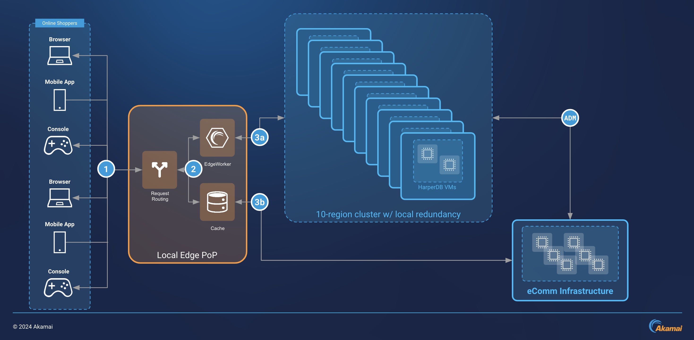

For eCommerce websites, poor page performance can increase abandonment of transactions. Caching with content delivery networks has historically been used to reduce page loading times. But even with a robust caching implementation, consumers can still experience wait times when visiting these websites from mobile networks.

A new industry standard called [Early Hints](https://developer.mozilla.org/en-US/docs/Web/HTTP/Status/103) was recently introduced and adopted by the most popular web browsers. This protocol helps web browsers preload assets for a website (like image thumbnails and stylesheet data) while it is rendering. To enable this, a website’s hosting infrastructure must be configured to *hint* to the browser which assets should be retrieved. Akamai edge servers provide an Early Hints implementation to support this traffic flow.

This guide outlines an architecture that improved page performance for a large eCommerce retailer. This architecture features services that work together across the Akamai edge and a collection of core computing regions. In particular, it relies on Akamai EdgeWorkers to intelligently process requests and HarperDB to store asset URLs. These services are configured to return early hints for the thumbnail URLs of the images that appear on pages throughout the site. In testing of the implementation on a mobile network, observed page rendering time was reduced from over 3 seconds down to 2 seconds, a one-third improvement.

## Early Hints and HarperDB Workflow

1. A user makes a request for a page on the eCommerce website, and it is processed by an Akamai edge server.
1. An EdgeWorker on the edge server sends the page URL in a request to a HarperDB cluster. This database maintains a record of thumbnail URLs for each page (not the thumbnails themselves, but the URLs for those thumbnails).
1. The EdgeWorker receives the thumbnail URL for the page from HarperDB.
1. The edge server sends an HTTP 103 response to the user’s browser.
1. The user’s browser receives the 103 response and makes a request for the thumbnail with the URL it received.

## Overcoming Challenges

### Latency Sensitivity

*Identify sources of high latency and minimize the latency impact of those components.*

When a browser renders a webpage, it makes an initial request for the page’s contents, and then it makes a series of follow-up requests for the assets that appear on the page, like images, stylesheets, and JavaScript. If the initial request takes time for the origin to process (also known as *server think time*), then the browser is left waiting, because it can’t make the follow-up asset requests until it receives a response.

With Early Hints, edge infrastructure asynchronously notifies the browser that it should fetch those assets while the origin is still processing the initial request. It does this by sending an HTTP 103 response for those assets. This response contains the URLs for those assets, which allows the browser to make those followup requests while waiting for the origin’s HTTP 200 response to the initial request. Or, the browser can load those assets from its own cache, if it exists there. [The press release for Akamai Early Hints](https://www.akamai.com/blog/performance/akamai-103-early-hints-prototype-the-results-are-in) details how this traffic flow can be visualized in a web browser's developer tools.

This workflow differs from another similar technology called [Server Push](https://techdocs.akamai.com/ion/docs/manual-server-push-ion), in which the edge directly pushes important assets to the browser while waiting on origin server think time. Server Push sends these responses regardless of whether the browser already has those assets stored in its local cache, which can create unnecessary traffic.

When implementing the EdgeWorkers and HarperDB cluster, tweaks to the connection between these two services can reduce latency further. For example, it was beneficial in testing to prioritize geographical closeness over load factor for Global Traffic Management’s routing behavior. This is accomplished by adjusting the [Load Imbalance Factor](https://techdocs.akamai.com/gtm/docs/load-balancing#load-imbalance-factor).

### Scaling the eCommerce Catalog

*Scale the size of your eCommerce catalog while maintaining low latency*

The size of the eCommerce catalog that this solution needs to support scales into the millions of items. This presents a challenge when configuring Early Hints, because it would not be possible to fit this number of items within the EdgeWorker that assigns the Early Hint URLs for a given page request. For this reason, it was decided that this record should be maintained in another database cluster that supports the existing origin infrastructure. HarperDB was chosen because it can support the scaling and speed requirements of the website.

## Early Hints and HarperDB Design Diagram

This solution configures Early Hints with Akamai EdgeWorkers and creates a HarperDB cluster distributed across ten Akamai core compute regions. This HarperDB cluster maintains a record of product thumbnail URLs for each page on an eCommerce website. Akamai edge servers return these thumbnail URLs to a user’s browser.

1. A user makes a request for a product's page on the eCommerce website. The URL for this request might look like:

    https://www.example.com/products/example-product/

1. Requests are handled by an Akamai edge server. At various stages in the lifecycle for the request, an Akamai EdgeWorker can perform logic on the request. For this solution, an EdgeWorker is triggered by [the onClientRequest event](https://techdocs.akamai.com/edgeworkers/docs/event-handler-functions).

1. The edge server also keeps a cache of page content and assets for the eCommerce website, and content that is in the cache is not retrieved from the eCommerce website origin.

1. The request is processed:

    1. The EdgeWorker issues an [HTTPS sub-request](https://techdocs.akamai.com/edgeworkers/docs/http-request) to the HarperDB cluster. This request is routed through Akamai Global Traffic Management to the HarperDB instance that offers the lowest latency to the Akamai edge server. The request passes the original URL (e.g. `https://www.example.com/products/example-product/`) as a parameter.

        The Akamai edge server returns an HTTP 103 response to the user’s browser. This response contains URLs for the thumbnail image of the product and a list of critical JS and CSS files used on the page. The user’s browser makes additional requests for these assets.

    1. Any page content and assets that are stored in the edge server's cache are returned to the browser in an HTTP 200 response. If a page request is matched in the cache, early hints are not used to preload the assets. Instead, standard [preload link elements](https://developer.mozilla.org/en-US/docs/Web/HTML/Attributes/rel/preload) are used.

1. The record of thumbnail URLs in the HarperDB cluster is periodically updated with new information from the eCommerce website origin.

### Systems and Components

- **Akamai edge server**: The nearest Akamai edge server to the user. This edge server maintains a cache of the eCommerce website’s page contents and assets. EdgeWorkers run on these servers to perform logic on requests and responses.

- **[Akamai EdgeWorkers](https://techdocs.akamai.com/edgeworkers/docs/welcome-to-edgeworkers)**: Configurable JavaScript that is executed on Akamai edge servers during the lifecycle of a request and its response. For this solution, the EdgeWorker retrieves thumbnail URLs for a given eCommerce website page. With [the Akamai Early Hints API](https://techdocs.akamai.com/property-mgr/docs/early-hints), it programmatically informs the Edge server that an HTTP 103 response for those thumbnails should be sent to a user’s browser.

- **[HarperDB cluster](https://www.harperdb.io/)**: A distributed database cluster installed across ten core compute regions. This cluster maps eCommerce page URLs to thumbnail URLs for images that appear on a given page. This cluster acts as the origin for the EdgeWorker thumbnail URL requests.

- **[Global Traffic Management](https://techdocs.akamai.com/gtm/docs/welcome-to-global-traffic-management)** is used to route the early hints sub-requests from EdgeWorkers to the HarperDB cluster.

- **eComm Infrastructure**: The existing origin web servers for the eCommerce site.