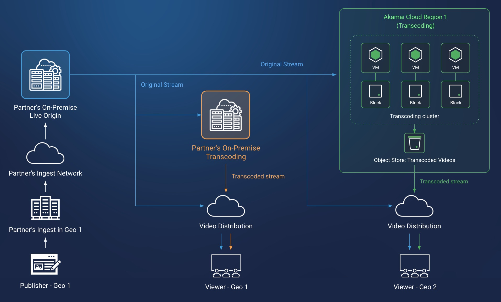

Live streaming is a key feature of many popular internet services, including social networking, video conferencing, gaming, and sports broadcasting. These services rely on live transcoding of video streams to efficiently distribute content in formats that are suited to the network and device constraints where they are viewed. Video transcoding is a compute-intensive process, so maximizing the number of video streams that can be transcoded on available hardware is a primary consideration.

This transcoding efficiency can vary between the compute offerings of different infrastructure providers, and evaluations of transcoding performance should be performed when selecting a cloud infrastructure platform. Many live streaming services are also latency-sensitive, and the geographic location of the transcoding service affects the latency of the stream. Choosing a location closer to the stream’s viewers reduces latency, so being able to run the service in compute regions that are near your audience is important.

This guide covers a live transcoding architecture for a live streaming platform. This architecture has been implemented and proven by a profiled Akamai customer that operates a popular live streaming platform for user generated content (UGC) with a global audience. This customer previously utilized on-premise transcoding services, but they experienced constraints as their traffic grew in new geographies. To support the growth, a new cloud-based live transcoding service was set up alongside their existing on-premise solution. The cloud live transcoding service offered competitive transcoding efficiency, was installed in geographically-optimal regions, and significantly reduced their total egress fees.

## Live Streaming Transcoding Workflow

1. The live streaming platform user uploads a video stream to the platform’s live origin service.

1. The live origin service directs the video stream to a live transcoding service.

1. The live transcoding service transcodes the stream into desired video formats.

1. A content delivery network accepts the transcoded video and distributes it to platform audiences.

## Overcoming Challenges

### Cost sensitivity

*Reduce costs with transcoding efficiency, scalable infrastructure, and by eliminating egress fees.*

Because video transcoding is a compute-intensive process, compute resources are a primary source of infrastructure cost for live streaming services. It’s important to select compute hardware that is performant for the software that is run by the live transcoding service. It’s also important to test example transcoding workflows on competing cloud infrastructure platforms and measure the transcoding efficiency of each. For example, this can be done by selecting cost-comparable compute instances between platforms and measuring the number of parallel streams that each can transcode on their respective instances. In testing with Akamai’s compute offerings, the live streaming platform described by this reference architecture saw a 33% transcoding efficiency advantage over another hyperscaler that was tested.

Live streaming traffic often flows in unpredictable bursts, and the practice of reserving compute instances in advance doesn’t provide cost advantages for these types of transcoding workloads. Instead, a scaling mechanism for the compute instances that make up a live transcoding service can be used to accommodate traffic bursts.

After a video stream is transcoded by the live transcoding service, it needs to be distributed to a content delivery network. This can also be a significant source of cost when there are egress fees between the live transcoding service platform and the content delivery network. By selecting Akamai compute offerings for the live transcoding service and using Akamai’s CDN, the egress fees for that traffic can be reduced by 100%.

### Latency sensitivity

*Minimize latency with cloud infrastructure close to your customers.*

Low latency is critical for live streaming services. For video conferencing, low latency helps emulate real-time conversation. For sports broadcasting, it can convey important events as they happen. For UGC platforms, low latency can help drive user engagement as users interact with and respond to their audiences.

To enable low latency, live transcoding services should be located near their audiences. By working with a cloud infrastructure platform that offers a wide selection of regions in different geographies, you can ensure the proximity of your live transcoding service as your business expands into new areas. Akamai’s global footprint of compute regions supports expansion into new audiences.

## Live Streaming Transcoding Design Diagram

This solution creates a live video transcoding service on the Akamai cloud computing platform, while retaining an existing on-premise live origin service and on-premise live transcoding service. A load balancer at the on-premise live origin directs traffic between the on-premise transcoding service and the new cloud transcoding service according to the audience for the video stream. The cloud transcoding service is composed of multiple compute instances and block storage volumes working in parallel to handle the transcoding load. Transcoded video streams are distributed by the Akamai CDN to audiences.

1. The platform ingests video streams from US-based platform users. These streams are ingested into an on-premise live origin service.

1. The live origin service directs streams to a live transcoding service. The streams are directed according to the region of the audience for the stream. For US audiences, the streams are sent to an on-premise live transcoding service. For North American, non-US audiences, the streams are directed to the cloud live transcoding service.

1. The cloud live transcoding service ingests video streams from the live origin.

1. Origin video streams are transcoded by compute instances in the transcoding cluster into desired output formats. Block storage volumes attached to each compute instance store temporary files created during the transcoding process. Live streaming traffic flows can sometimes increase in unpredictable bursts, so a scaling mechanism for the number of available compute instances can be set up.

1. Transcoded video streams are uploaded to object storage. This object storage acts as the content origin for the live streaming delivery network.

1. A content delivery network distributes video streams from the object storage content origin to North American, non-US audiences.

### Systems and Components

- **On-premise live origin**
   - Accepts video streams from platform users and directs them via an on-premise load balancer to a transcoding service. These streams are directed according to the audience’s geographic location:
      - Geographic location 1: The platform’s on-premise transcoding service.
      - Geographic location 2: The cloud live transcoding service.
- **Cloud live transcoding service**
   - **Live transcoding cluster**
      - **Live transcoding compute instance:** Accepts a video stream and transcodes it into a desired format for distribution.
      - **Block storage:** A block storage volume is attached to each transcoding instance for the temporary storage of video files that are being processed.
   - **Transcoding output storage/distribution origin:** The live transcoding instances upload transcoded video to object storage. This object storage location serves as the content origin for the live streaming delivery network.
- **Distribution:** A content delivery network retrieves transcoded video from the object storage distribution origin and delivers it to audiences.