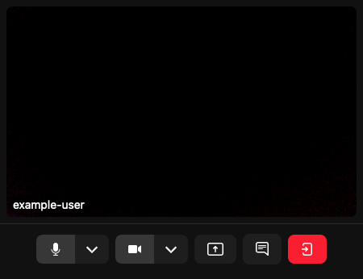
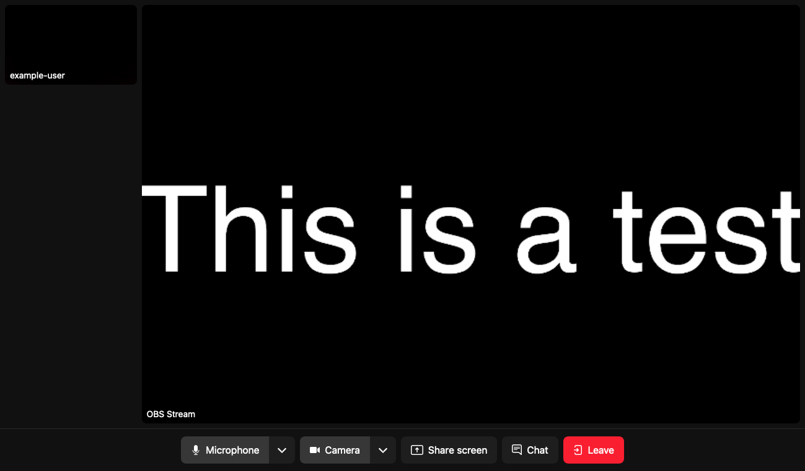

[LiveKit](https://livekit.io/) is a scalable, open source WebRTC stack for streaming audio and video. LiveKit uses APIs accessible through server-side and front-end SDKs, supports multi-user functionality, and works with a range of streaming sources, including open source tools like [OBS Studio](https://obsproject.com/).

This guide shows you how to use Docker Compose to install LiveKit on a Compute Instance, get started with a basic configuration, install OBS Studio locally, and set up an OBS stream with LiveKit.

## Before You Begin

1.  If you have not already done so, create a Linode account and Compute Instance. See our [Getting Started with Linode](/docs/products/platform/get-started/) and [Creating a Compute Instance](/docs/products/compute/compute-instances/guides/create/) guides.

1.  Follow our [Setting Up and Securing a Compute Instance](/docs/products/compute/compute-instances/guides/set-up-and-secure/) guide to update your system. You may also wish to set the timezone, configure your hostname, create a limited user account, and harden SSH access.

1.  Follow the instructions in our [How to Use Docker Compose V2](/docs/guides/how-to-use-docker-compose-v2/#how-to-install-docker-compose-and-docker-engine) guide to install **Docker Compose** and **Docker Engine**.


This guide is written for a non-root user. Commands that require elevated privileges are prefixed with `sudo`. If you’re not familiar with the `sudo` command, see the [Users and Groups](/docs/guides/linux-users-and-groups/) guide.


## LiveKit Features and Compatibility

Each LiveKit instance consists of three parts:

-   **The LiveKit server** hosts *rooms*, where streamed content becomes available. Each room can have a set of *participants*, which can either subscribe to content or broadcast content on one or more *tracks*.

-   **Ingress** controls the import of audio and video into LiveKit. LiveKit's Ingress can receive content from a WebRTC flow, as well as from RTMP, WHIP, and HTTP servers. You can also create an Ingress stream from one of its supported file types:

    - HTTP Live Streaming (HLS) segments
    - MP4
    - MOV
    - OGG
    - WEBM
    - MP3
    - M4A

-   **Egress** controls the export of audio and video from a given room or track. With LiveKit's Egress, you can make content available as an RTMP or WebSocket stream for a web application or services like Twitch and YouTube Live. You can also export content to one of the supported file types:

    - HLS segments
    - MP4
    - OGG
    - WEBM

## Installing LiveKit

This guide covers the installation and set up of LiveKit's open source stack for self-hosting, as opposed to LiveKit's fully managed cloud service. There are multiple methods for setting up a self-hosted LiveKit server:

- For a preconfigured setup, you can use LiveKit's Docker image to generate a configuration and startup script. *This is the fastest way to get started with LiveKit and is covered in this guide.*
- For a high level of control, you can install and configure all of the components manually.
- For an distributed, scalable setup, you can use LiveKit's Helm chart for a [Kubernetes deployment](https://docs.livekit.io/realtime/self-hosting/kubernetes/).

### Configuring the Host

Prior to deploying the LiveKit server, you must configure domain names for the LiveKit server and its associated TURN server, both pointing to your Compute Instance's public IP address. This requires creating two DNS A/AAAA records. Substitute  with your domain:

- For the LiveKit server, use `livekit.`.
- For the TURN server, use `livekit-turn.`. This is bundled with LiveKit to help manage traffic.

Your DNS records can be setup using the [DNS Manager](/docs/products/networking/dns-manager/get-started/) in Cloud Manager. Follow the linked guide to add your domain (e.g. ) and create A records for the `livekit` and `livekit-turn` subdomains.

### LiveKit Server Setup

1.  Run LiveKit's Docker set up. Once initiated, a series of prompts are presented to configure the LiveKit instance to your needs.

    ```command
    sudo docker run --rm -it -v$PWD:/output livekit/generate
    ```

1.  Complete the LiveKit setup's prompts as follows:

    - Choose either the **with Ingress** or **with both Egress and Ingress** option.
    - Enter the LiveKit server and TURN domains as created above in [Configuring the Host](#configuring-the-host).
    - Leave the WHIP domain empty.
    - Select **Let's Encrypt (no account required)** for SSL.
    - Choose the **latest** version of LiveKit.
    - Select **no - (we'll bundle Redis)** to have the installation bundle Redis.
    - Choose to create a **Startup Shell Script**.

    Once all options are configured, an API key and API secret are generated as output. Securely save these, as they are used to interface with the LiveKit server.

    ```output
    API Key: LIVEKIT_API_KEY
    API Secret: LIVEKIT_API_SECRET
    ```

    Also included in the output is a list of ports that need to be opened for the LiveKit server to function. For the set of responses used in this guide, the required ports should be:

    ```output
     * 443 - primary HTTPS and TURN/TLS
     * 80 - for TLS issuance
     * 7881 - for WebRTC over TCP
     * 3478/UDP - for TURN/UDP
     * 50000-60000/UDP - for WebRTC over UDP
     * 1935 - for RTMP Ingress
     * 7885/UDP - for WHIP Ingress WebRTC
    ```

1.  Open all of the required ports using your system's firewall utility. The example commands below open the above set of ports using the UFW ([Uncomplicated Firewall](https://en.wikipedia.org/wiki/Uncomplicated_Firewall)) utility.

    ```command
    sudo ufw allow http
    sudo ufw allow https
    sudo ufw allow 7881/tcp
    sudo ufw allow 3478/udp
    sudo ufw allow 50000:60000/udp
    sudo ufw allow 1935/tcp
    sudo ufw allow 7885/udp
    sudo ufw reload
    ```
    
    The exact commands you use may vary depending on your instance's distribution and firewall manager. See our guides on firewalls for documentation on other common firewall managers: [Linode Guides: Firewalls](/docs/guides/security/firewalls/)

    Likewise, if your Compute Instance is attached to a Cloud Firewall, you will want to make sure the appropriate ports are open in your Cloud Firewall configuration: [Cloud Firewall: Manage Firewall Rules](/docs/products/networking/cloud-firewall/guides/manage-firewall-rules/)
    

1.  Navigate into the newly created `livekit.` directory, replacing  with your domain:

    ```command
    cd ~/livekit.
    ```

1.  Open the `the init_script.sh` startup shell script file, located at `~/livekit./init_script.sh`, in a text editor with `sudo` permissions. The command below uses the nano text editor:

    ```command
    sudo nano init_script.sh
    ```

    By default, the startup script attempts to install Docker and Docker Compose. Since both should be installed on your system already per the [Before You Begin](#before-you-begin) section, you can avoid issues by making the edits described below and saving your changes:

    -   First, locate and disable the commands for installing Docker and Docker Compose. The commands shown below have been commented out using `#`:

        ```file {title="livekit.example.com/init_script.sh" lang="sh" hl_lines="11-14"}
        #!/bin/sh
        # This script will write all of your configurations to /opt/livekit.
        # It'll also install LiveKit as a systemd service that will run at startup
        # LiveKit will be started automatically at machine startup.

        # create directories for LiveKit
        mkdir -p /opt/livekit/caddy_data
        mkdir -p /usr/local/bin

        # Docker & Docker Compose will need to be installed on the machine
        #curl -fsSL https://get.docker.com -o /tmp/get-docker.sh
        #sh /tmp/get-docker.sh
        #curl -L "https://github.com/docker/compose/releases/download/v2.20.2/docker-compose-$(uname -s)-$(uname -m)" -o /usr/local/bin/docker-compose
        #chmod 755 /usr/local/bin/docker-compose
        ```

    -   Next, locate the section of commands that create the LiveKit `systemd` service file. Modify the `Exec` lines to point to the Docker location on your system and to use the Docker Compose plugin. By default, the Docker binary is located at `/usr/bin/docker` and may not need to be edited. To adapt the lines to use the Docker Compose plugin rather than the standalone version, edit the default commands from `docker-compose` to `docker compose`. Leave the `docker-compose.yaml` filename as is. See the edited lines below:

        ```file {title="livekit.example.com/init_script.sh" lang="sh" linenostart="148" hl_lines="13-15"}
        # systemd file
        cat << EOF > /etc/systemd/system/livekit-docker.service
        [Unit]
        Description=LiveKit Server Container
        After=docker.service
        Requires=docker.service

        [Service]
        LimitNOFILE=500000
        Restart=always
        WorkingDirectory=/opt/livekit
        # Shutdown container (if running) when unit is started
        ExecStartPre=/usr/bin/docker compose -f docker-compose.yaml down
        ExecStart=/usr/bin/docker compose -f docker-compose.yaml up
        ExecStop=/usr/bin/docker compose -f docker-compose.yaml down

        [Install]
        WantedBy=multi-user.target


        EOF
        ```

        When complete, save your changes to the script.

1.  Give the startup script executable permission, and then run the script.

    ```command
    sudo chmod +x init_script.sh
    sudo ./init_script.sh
    ```

1.  The LiveKit service may take a few minutes to start up all of the necessary components. You can check the progress with the following command:

    ```command
    sudo systemctl status livekit-docker
    ```

1.  Once the components are running, verify the LiveKit server with a cURL command in a separate terminal session. Alternatively, you can visit the URL in your browser window.

    ```command
    curl https://livekit.
    ```

    You should see the following output:

    ```output
    OK
    ```

### LiveKit CLI Installation and Configuration

The LiveKit CLI tool offers a convenient interface for managing and testing your LiveKit server. While not required, the LiveKit CLI can be helpful during the LiveKit stack setup process, including testing of the server and generating Ingress/Egress credentials.

The LiveKit CLI requires your LiveKit server's address, API key, and API secret. The following steps review how to install the LiveKit CLI, save and reference your environment variables, and how to create a user token using the CLI. *Note that setting up your environment variables are a prerequisite for the provided CLI commands.*


In a production environment, you may likely leverage [LiveKit's API](https://docs.livekit.io/reference/) for generating user tokens. However, in a testing environment, the CLI can also be a viable solution.


1.  Install the LiveKit CLI using LiveKit's installation script:

    ```command
    sudo curl -sSL https://get.livekit.io/cli | sudo bash
    ```

1.  Next, store your LiveKit parameters in environment variables so they can be referenced later on. In this example, replace  with your domain. Replace  and  with the API key and API secret output generated during your [LiveKit setup](#livekit-server-setup).

    ```command
    export LIVEKIT_URL=https://livekit.
    export LIVEKIT_API_KEY=
    export LIVEKIT_API_SECRET=
    ```

1.  Generate a token. The token here designates a room (`example-room`) and a user (`example-user`), both of which are created if they do not already exist. The token is valid for 24 hours.

    ```command
    livekit-cli create-token \
        --join --room example-room --identity example-user \
        --valid-for 24h
    ```

Further on, you will use the LiveKit CLI to create Ingress credentials for streaming from OBS Studio. LiveKit's documentation provides more information on this and additional uses for the CLI, such as load testing with simulated streams and subscribers:
- [LiveKit CLI](https://github.com/livekit/livekit-cli)
- [LiveKit Benchmarking](https://docs.livekit.io/realtime/self-hosting/benchmark/)

### Initial Test

With the CLI-generated token, you can test your LiveKit server's streaming capabilities using LiveKit's Meet example application. This acts as the frontend for a given LiveKit server.

1.  In your browser, navigate to the [LiveKit Meet](https://meet.livekit.io/?tab=custom) example application.

1.  Enter your LiveKit server's domain with the WebSocket protocol (e.g. `wss://livekit.`) and the user token generated above.

1.  Click **Connect**. To test video and audio functionality, allow access to your camera and microphone when prompted.

    

1.  When done, click **Leave** and close the browser tab.

## Configuring OBS for Streaming

Open Broadcaster Software (OBS) Studio is an open source tool for recording and live-streaming video. Its high-performance, real-time capturing can effectively create custom streams from your device. OBS Studio can integrate as an Ingress (input) stream with a LiveKit server.

The instructions below show you how to: configure LiveKit for Ingress, install OBS Studio on your local machine, and set up streaming from OBS Studio to your LiveKit instance.

### Configuring the LiveKit Ingress

First, LiveKit requires an Ingress instance designated for streaming from OBS Studio. The LiveKit CLI includes a command for creating a new Ingress, and the Ingress can be configured with a short JSON file. Learn more from [LiveKit's Ingress Overview documentation](https://docs.livekit.io/egress-ingress/ingress/overview/).

1.  Create and open a JSON configuration file for the Ingress using the text editor of your choice. The below command uses the nano text editor:

    ```command
    sudo nano ingress.json
    ```

    In your JSON file, paste the below Ingress configuration to support an OBS stream. The `"input_type": 0` indicates an RTMP stream, while the remaining parameters name the Ingress, identify the room, and create a participant for content broadcasting.

    ```file {title="ingress.json" lang="json"}
    {
        "input_type": 0,
        "name": "obs-stream",
        "room_name": "example-room",
        "participant_identity": "obs-streamer",
        "participant_name": "OBS Stream"
    }
    ```

    When complete, save your changes.

1.  Now that you have a configuration file, create the Ingress. This example assumes you named your configuration file `ingress.json` and that you have your LiveKit server's parameters in environment variables as setup in [LiveKit CLI Installation and Configuration](#livekit-cli-installation-and-configuration).

    ```command
    livekit-cli create-ingress --request ingress.json
    ```

1.  The CLI command above outputs important information about the Ingress. The `URL` and `Stream Key` values are used to configure your OBS Studio stream. Example output:

    ```output
    Using url, api-key, api-secret from environment
    IngressID: IN_oQ7SV4GNzdkq Status: ENDPOINT_INACTIVE
    URL: rtmp://livekit.:1935/x Stream Key: 6fBdud6A3NYb
    ```

### Setting Up OBS Studio

You need to install the OBS Studio client on the machine from which you want to stream content (e.g. your local computer).

1.  Navigate to the [OBS website](https://obsproject.com/), and download the OBS Studio installer for your operating system.

1.  Run the installer to get OBS Studio installed on your system. You may wish to refer to the [OBS Studio Quickstart](https://obsproject.com/wiki/OBS-Studio-Quickstart) guide for more on configuring your OBS Studio installation.

1.  Start OBS Studio. Depending on your streaming needs, grant permissions for OBS to record your screen and access your camera and microphone.

1.  During the setup steps, indicate that you are using OBS for streaming. Then, when prompted for stream information, complete the form as follows:

    - **Service**: *Custom*
    - **Server**: Your LiveKit's Ingress URL (e.g. `rtmp://livekit.:1935/x` from the example output above)
    - **Stream Key**: Your LiveKit's Ingress stream key (e.g. `6fBdud6A3NYb` from the example output above)

When you have completed the setup, you should be taken to the main OBS Studio dashboard.

### Viewing the Stream

Once you've configured OBS Studio to send streams to your LiveKit instance, you can create a stream in OBS and use LiveKit's Meet example application to test the stream.

Follow the instructions in each application below to set up and broadcast a test stream.

**From OBS Studio**

1.  Add a video source, using the **+** icon in the **Sources** pane. To check functionality, use the **Text** source with the text `This is a test`. Other sources are also optional for testing.

1.  Click **Start Streaming** to have OBS begin streaming the source (or sources) to the LiveKit Ingress.

**From LiveKit Meet**

Visit [LiveKit Meet](https://meet.livekit.io/?tab=custom), enter your LiveKit server URL and participant token, and then click **Connect**. Make sure your LiveKit participant token is associated with the same room as the OBS Ingress (this was `example-room` in the previous examples).

You should see your participant stream and the OBS stream with video from the source(s) you created.

