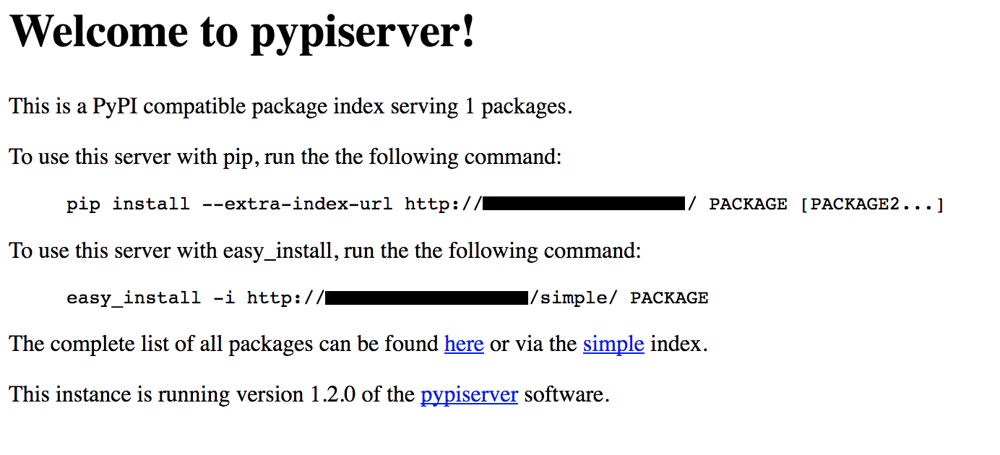

## How Does Python Handle Package Management?

Package management in Python is available through a variety of different programming tools:

- `Pip` remains one of the most popular choices because it virtually eliminates manual installs and updates of software packages to operating systems. `Pip` manages full lists of packages and their corresponding version numbers, which fosters precise duplication of entire package groups in a distinct, separate environment.

- PyPI (Python Package Index) is a public repository of user-submitted packages that can be installed using `pip install package`. This guide breaks down the basic scaffolding of a Python package, then using PyPiServer, creates a PyPi private repository by uploading the package to a Linode.

## Before You Begin

1.  Familiarize yourself with our [Getting Started](/docs/products/platform/get-started/) guide and complete the steps for setting your Linode's timezone.

2.  This guide assumes usage of Python 3 and a working installation of `pip` along with `setuptools`. Starting with Python 3.4, `pip` comes with the default installation. On Debian distributions, `pip` can be installed using the apt package manager with `sudo apt install python-pip`.

3.  Apache 2.4 is used in this guide. Older versions may lack identical directives and will have slightly different configurations.

## Minimalist Python Package

The basic scaffolding of a Python package is a `__init__.py` file containing code that interfaces with the user.

1.  Create a directory with your intended package name. This guide will use **linode_example**.

        mkdir linode_example

    
If you choose to make your package public, there are additional considerations for deciding on a package name. The official documentation suggests using only lowercase characters - unique to PyPI - and the underscore character to separate words if needed.


2.  Navigate into the newly created directory. Create a file called `setup.py` and another directory called **linode_example**, containing `__init__.py`. The directory tree should look like this:

    
linode_example/
    linode_example/
        __init__.py
    setup.py
    setup.cfg
    README.md


3.  Edit `setup.py` to contain basic information about your Python package repository:

    
from setuptools import setup

setup(
    name='linode_example',
    packages=['linode_example'],
    description='Hello world enterprise edition',
    version='0.1',
    url='http://github.com/example/linode_example',
    author='Linode',
    author_email='docs@linode.com',
    keywords=['pip','linode','example']
    )


4.  Add an example function to `__init__.py`:

    
def hello_word():
    print("hello world")



5.  The `setup.cfg` file lets PyPI know the README is a Markdown file:

    
[metadata]
description-file = README.md


6.  Optionally, add a `LICENSE.txt` or information to `README.md`. This is good documentation practices, and helpful if you ever plan to upload the Python package into the public PyPI repository.

7.  The Python package repository needs to be compressed before it can be available for download on your server. Compress the package:

        python setup.py sdist

    A **tar.gz** file will be generated in `~/linode_example/dist/`.

## Install PyPI Server

Next, set up a server to host a package index. This guide will use `pypiserver`, a wrapper built on the Bottle framework that makes setting up a package index on a server much easier.

1.  Install virtualenv if it's not already installed:

        pip install virtualenv

2.  Create a new directory which will be used to hold Python packages as well as files used by Apache. Create a new virtual environment called `venv` inside this directory, then activate:

        mkdir ~/packages
        cd packages
        virtualenv venv
        source venv/bin/activate

3.  Download the package through `pip` in the newly created virtual environment:

        pip install pypiserver

    
Alternatively, [download pypiserver from Github](https://github.com/pypiserver/pypiserver), then navigate into the downloaded pypiserver directory and install packages with `python setup.py install`.


4.  Move `linode_example-0.1.tar.gz` into `~/packages`:

        mv ~/linode_example/dist/linode_example-0.1.tar.gz ~/packages/

5.  Try the server by running:

        pypi-server -p 8080 ~/packages

6.  Currently the server is listening on all IP addresses. In a web browser, navigate to `192.0.2.0:8080`, where `192.0.2.0` is the public IP of your Linode. The browser should display:

    

    You are now able to install the `linode_example` package by declaring an external url `pip install --extra-index-url http://192.0.2.0:8080/simple/ --trusted-host 192.0.2.0 linode_example`.

## Authentication with Apache and passlib

1.  Install Apache and `passlib` for password-based authentication for uploads. Make sure you are still in your activated virtual environment (`(venv)` should appear before the terminal prompt) and then execute the following commands:

        sudo apt install apache2
        pip install passlib

2.  Create a password for authentication using `htpasswd` and move `htpasswd.txt` into the `~/packages` directory. Enter the desired password twice:

        htpasswd -sc htpasswd.txt example_user
        New password:
        Re-type new password:

3.  Install and enable `mod_wsgi` in order to allow Bottle, a WSGI framework, to connect with Apache:

        sudo apt install libapache2-mod-wsgi
        sudo a2enmod wsgi

4.  Inside the `~/packages` directory, create a `pypiserver.wsgi` file that creates an application object to connect between pypiserver and Apache:

    
import pypiserver
PACKAGES = '/absolute/path/to/packages'
HTPASSWD = '/absolute/path/to/htpasswd.txt'
application = pypiserver.app(root=PACKAGES, redirect_to_fallback=True, password_file=HTPASSWD)


5.  Create a configuration file for the pypiserver located in `/etc/apache2/sites-available/`:

    
<VirtualHost *:80>
WSGIPassAuthorization On
WSGIScriptAlias / /absolute/path/to/packages/pypiserver.wsgi
WSGIDaemonProcess pypiserver python-path=/absolute/path/to/packages:/absolute/path/to/packages/venv/lib/pythonX.X/site-packages
    LogLevel info
    <Directory /absolute/path/to/packages>
        WSGIProcessGroup pypiserver
        WSGIApplicationGroup %{GLOBAL}
        Require ip 203.0.113.0
    </Directory>
</VirtualHost>



    The `Require ip 203.0.113.0` directive is an example IP restricting access to Apache. To grant open access, replace with `Require all granted`. For more complex access control rules, consult access control in the [Apache documentation](https://httpd.apache.org/docs/2.4/howto/access.html).

    
Depending on the version of Python and virtual environment path, the `WSGIDaemonProcess` directive may require a different path.


6.  Give the user **www-data** ownership of the `~/packages` directory. This will allow uploading from a client using `setuptools`:

        sudo chown -R www-data:www-data packages/

7.  Disable the default site if needed and enable pypiserver:

        sudo a2dissite 000-default.conf
        sudo a2ensite pypiserver.conf

8.  Restart Apache:

        sudo service apache2 restart

    The repository should be accessible through `192.0.2.0` by default on port 80, where `192.0.2.0` is the public of the Linode.

## Download From a Client

Recall the rather long flags declared with `pip` in order to download from a specified repository. Creating a configuration file containing the IP of your public server will simplify usage.

1.  On the client computer, create a `.pip` directory in the home directory. Inside this directory, create `pip.conf` with the following:

    
[global]
extra-index-url = http://192.0.2.0:8080/
trusted-host = 192.0.2.0


2.  Install the `linode_example` package:

        pip install linode_example

    
Both the terminal output and showing all packages with `pip list` will show that the underscore in the package name has transformed into a dash. This is expected because `setuptools` uses the `safe_name` utility. For an in-depth discussion about this, [see this mailing list thread](https://mail.python.org/pipermail/distutils-sig/2010-March/015650.html).


3.  Open up a Python shell and try out the new package:

    
>>from linode_example import hello_world
>>hello_world()
    hello world


## Upload Remotely Using Setuptools

Although it's possible to use `scp` to transfer tar.gz files to the repository, there are other tools such as `twine` and `easy_install` which can also be used.

1.  On a client computer, create a new configuration file in the home directory called `.pypirc`. The remote repository will be called `linode`:

    
[distutils]
index-servers =
  pypi
  linode
[pypi]
username:
password:
[linode]
repository: http://192.0.2.0
username: example_user
password: mypassword



    Uploading to the official Python Package Index requires an account, although account information fields can be left blank. Replace *example_user* and *mypassword* with credentials defined through `htpasswd` from earlier.

2.  To upload from the directory of the Python package:

        python setup.py sdist upload -r linode

    If successful, the console will print the message: `Server Response (200): OK`.
