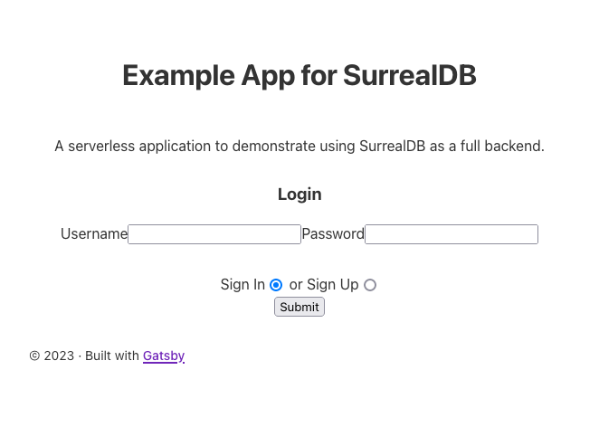

The SurrealDB server includes an API layer that can be schematized alongside the underlying database. This means that a go-between, server-side application is often no longer necessary. Most frontend applications can get all they need directly from SurrealDB's robust API. SurrealDB's approach is especially compelling with modern, adaptable architectures like Jamstack.

Learn more about SurrealDB's APIs and building frontend application with them in this tutorial. See how to set up a SurrealDB instance and example static frontend that leverages SurrealDB's all-in-one design.

## How to Prepare SurrealDB

Before working with SurrealDB as a backend for your web application, you need to have a SurrealDB instance ready for the role. This section of the tutorial shows how to set up a basic SurrealDB instance to support an example web application.

Many of the steps here build on mechanics covered in our other SurrealDB guides linked below. Refer to those in full when you are ready to learn more and expand on the fundamentals.

### Setting Up a SurrealDB Instance

The first step is to have a SurrealDB server installed and running. Additionally, the server should operate with some basic security considerations, since you intend to start using it in your application right away.

To lay this foundation, follow two of our previous guides:

-   Use [Getting Started with SurrealDB](/docs/guides/getting-started-with-surrealdb/) to learn how to install and run SurrealDB.

-   Use [Managing Security and Access Control for SurrealDB](/docs/guides/managing-security-and-access-for-surrealdb/) to learn about creating limited users and disabling root access.

Referencing those two guides, you need to do the following to keep up with the rest of this tutorial:

1.  See the relevant section of the **Getting Started** guide linked above to install SurrealDB.

1.  Start SurrealDB on `localhost` with an initial root user and local file storage:

    ```command
    surreal start --bind 127.0.0.1:8000 --user root --pass exampleRootPass file:///home/example-user/.surrealdb/example.db
    ```

1.  Access SurrealDB CLI as the root user within the namespace `application` and the database `todo`:

    ```command
    surreal sql --conn http://localhost:8000 --user root --pass exampleRootPass --ns application --db todo --pretty
    ```

1.  Create a limited user with database-level access. This example names the user `exampleUser`.

    ```command
    DEFINE USER exampleUser ON DATABASE PASSWORD 'examplePass';
    ```

1.  Close the SurrealDB CLI and stop the SurrealDB server with the <kbd>Ctrl</kbd> + <kbd>C</kbd> key combination.

1.  Open the default port (`8000`) for the SurrealDB server in your system's firewall:

    
    
    On a Debian or Ubuntu system, refer to our [How to Configure a Firewall with UFW](/docs/guides/configure-firewall-with-ufw/) guide, and use commands like the following to open the port:

    ```command
    sudo ufw allow 8000/tcp
    sudo ufw reload
    ```
    
    
    On a CentOS or similar system (e.g. AlmaLinux and Rocky Linux), refer to our [Configure a Firewall with Firewalld](/docs/guides/introduction-to-firewalld-on-centos/) guide, and use commands like the following to open the port:

    ```command
    sudo firewall-cmd --zone=public --add-port=8000/tcp --permanent
    sudo firewall-cmd --reload
    ```
    

1.  Start the SurrealDB server using the same local file storage as before, but remove the root user and bind the server to any address:

    ```command
    surreal start --bind 0.0.0.0:8000 file:///home/example-user/.surrealdb/example.db
    ```

### Configuring the SurrealDB Schemas

To prepare the SurrealDB database for the application, you should define the schemas that your application needs. The schemas your application needs vary widely depending on your application, and you need to plan out its features to model your databases effectively.

Since this tutorial uses an example to-do list application to demonstrate, the steps here can provide a basic model. Follow along to see how you can use SurrealDB's `DEFINE` commands to craft a database for your own application's needs.

For more on modeling databases in SurrealDB, take a look at the SurrealDB documentation linked at the end of this guide. For more advanced modeling ideas, check out our [Modeling Data with SurrealDB’s Inter-document Relations](/docs/guides/surrealdb-interdocument-modeling/) guide.

1.  Create a file to store your SurrealQL queries. This tutorial names the file `surreal.surql`. To execute SurrealDB queries over HTTP using cURL, it is easiest to work with queries stored in a file like this.

    ```command
    nano surreal.surql
    ```

    Each set of SurrealQL commands below should be added to this file. The last step in this section then shows how to execute all of the commands together using a single cURL command.

1.  Define a user account scope, called `account`, and give the scope `SIGNUP` and `SIGNIN` functions. This single command lays the basis for user access that the example application can use for full login functionality.

    To learn more, take a look at the section on scoped user accounts in our [Managing Security and Access Control for SurrealDB](/docs/guides/managing-security-and-access-for-surrealdb/#how-to-manage-scoped-user-accounts-and-access-in-surrealdb) guide.

    ```file {title="surreal.surql" lang="sql"}
    DEFINE SCOPE account SESSION 24h
        SIGNUP (CREATE user SET username = $username, pass = crypto::argon2::generate($pass))
        SIGNIN (SELECT * FROM user WHERE username = $username AND crypto::argon2::compare(pass, $pass));
    ```

1.  Define the `item` table for storing to-do items. The table is defined as `SCHEMAFULL`, meaning that it has a defined schema (provided in the next step) that data must adhere to.

    The table also has a set of permissions that apply to scoped user accounts. A record can only be viewed (`select`) and modified (`update`) by a user with an ID matching the record's `owner` field. A record can be created by any user account, but no user can delete a record.

    ```file {title="surreal.surql" lang="sql" linenostart="4"}
    DEFINE TABLE item SCHEMAFULL
        PERMISSIONS
            FOR select, update WHERE owner = $token.ID
            FOR create WHERE $scope = "account"
            FOR delete NONE;
    ```

1.  Define the fields for the `item` table. Doing so essentially sets up the table's schema.

    Using `ASSERT` allows limits to be placed on a field's possible contents. `VALUE` allows the field to define default content. The `$value` variable corresponds to the input value for that field.

    ```file {title="surreal.surql" lang="sql" linenostart="9"}
    DEFINE FIELD description ON TABLE item TYPE string
        ASSERT $value != NONE;
    DEFINE FIELD completed ON TABLE item TYPE bool
        VALUE $value OR false;
    DEFINE FIELD owner ON TABLE item TYPE string
        VALUE $value OR $token.ID;
    DEFINE FIELD date ON TABLE item TYPE datetime
        VALUE time::now();
    ```

1.  When done, press <kbd>CTRL</kbd>+<kbd>X</kbd>, followed by <kbd>Y</kbd> then <kbd>Enter</kbd> to save the file and exit `nano`.

1.  Execute these SurrealQL commands using cURL and the limited user login created in the previous section. The example command here uses the credentials shown above:

    ```command
    curl -X POST -H "Accept: application/json" -H "NS: application" -H "DB: todo" --user "exampleUser:examplePass" --data-binary "@surreal.surql" http://localhost:8000/sql | jq
    ```

## How to Build the Serverless Application

The SurrealDB database is now prepared to act as the backend for your application. The SurrealDB server exposes a set of HTTP APIs. Your frontend application can then leverage these APIs. In many cases, this eliminates the need for a separate backend application.

Moreover, the schema setups in the previous section allow you to work with the SurrealDB endpoints more easily. By managing the schemas' default values and restrictions, you can implement logic that distinguishes API access.

All of this makes SurrealDB an excellent backend for Jamstack architectures, which is what the rest of this guide uses. You can learn more about Jamstack through our guide [Getting Started with the Jamstack](/docs/guides/what-is-jamstack/).

Specifically, the next steps in this tutorial help you set up a basic frontend application using the [Gatsby](https://www.gatsbyjs.com/) framework. Gatsby uses React to generate static sites, and thus makes a good base for a Jamstack application. Learn more about Gatsby in our guide [Generating Static Sites with Gatsby](/docs/guides/generating-static-sites-with-gatsby/).

### Setting Up the Prerequisites

Before developing the code for the Gatsby frontend, you need to install some prerequisites. Additionally, this tutorial generates the new Gatsby project from a base template to streamline the development.

1.  First, follow along with our [Installing and Using NVM](/docs/guides/how-to-install-use-node-version-manager-nvm/#install-nvm) guide to install the Node Version Manager (NVM).

1.  Then run the commands below to install and start using the current LTS release of Node.js:

    ```command
    nvm install --lts
    nvm use --lts
    ```

1.  Install the Gatsby command-line tool as a global NPM package:

    ```command
    npm install -g gatsby-cli
    ```

1.  Generate the new Gatsby project from the default starter template, then change into the project directory. The command here creates the new project as `surreal-example-app` in the current user's home directory:

    ```command
    cd ~/
    gatsby new surreal-example-app https://github.com/gatsbyjs/gatsby-starter-default
    cd surreal-example-app/
    ```

1.  Install the SurrealDB JavaScript library to the project. While the project could interact with the SurrealDB server via HTTP, the SurrealDB library provides a much more convenient interface.

    ```command
    npm install surrealdb.js --save
    ```

1.  Customize the project's metadata as you see fit. The metadata for the Gatsby application is stored in the `gatsby-config.js` file.

    ```command
    nano gatsby-config.js
    ```

1.  Here is an example of the kinds of changes you might make:

    ```file {title="gatsby-config.js" lang="js" linenostart="11"}
      siteMetadata: {
        title: `Example App for SurrealDB`,
        description: `An example serverles web application to demonstrate SurrealDB.`,
        author: `Example User`,
        siteUrl: `https://example-user.example.com`,
      },
    ```

1.  When done, press <kbd>CTRL</kbd>+<kbd>X</kbd>, followed by <kbd>Y</kbd> then <kbd>Enter</kbd> to save the file and exit `nano`.

1.  Open the default port to be used for the Gatsby application in your system's firewall. By default, Gatsby's development server runs on port `8000`. However, since that port is used by the SurrealDB server, this tutorial adopts port `8080` for its Gatsby examples.

    
    
    On a Debian or Ubuntu system, use commands like the following to open the port:

    ```command
    sudo ufw allow 8080/tcp
    sudo ufw reload
    ```
    
    
    On a CentOS Stream or similar system (e.g. AlmaLinux or Rocky Linux), use commands like the following to open the port:

    ```command
    sudo firewall-cmd --zone=public --add-port=8080/tcp --permanent
    sudo firewall-cmd --reload
    ```
    
    

1.  Now test the default Gatsby application by running the Gatsby development server:

    ```command
    gatsby develop -H 0.0.0.0 -p 8080
    ```

1.  Open a web browser and navigate to port `8080` of your system's public IP address to see the Gatsby application.

1.  When done, stop the development server with the <kbd>Ctrl</kbd> + <kbd>C</kbd> key combination.

### Building the Application

With Gatsby installed and the base project set up, you can now start developing the example application itself. This mostly involves editing key parts of the default Gatsby application and adding a few components and services.

Throughout the example code that follows, comments are provided to help navigate what each part of the application does.

#### Defining the Display Components

1.  Open the `src/pages/index.js` file:

    ```command
    nano src/pages/index.js
    ```

1.  Delete the file's existing contents and replace it with the following:

    ```file {title="src/pages/index.js" lang="js"}
    // Import modules for building and styling the page
    import React from 'react';
    import Layout from '../components/layout';
    import * as styles from '../components/index.module.css';

    // Import the custom components for rendering the page
    import Login from '../components/login';
    import Home from '../components/home';

    // Import a function from the custom authentication service
    import { isSignedIn } from '../services/auth';

    // Render the page
    const IndexPage = () => {
        return (
            <Layout>
                { isSignedIn() ? ( <Home /> ) : ( <Login /> ) }
            </Layout>
        )
    }

    export default IndexPage
    ```

    This defines the landing page for the Gatsby application. In this example, the page simply wraps and displays one or two components, `Home` or `Login`, depending on the login status.

1.  When done, press <kbd>CTRL</kbd>+<kbd>X</kbd>, followed by <kbd>Y</kbd> then <kbd>Enter</kbd> to save the file and exit `nano`.

1.  Now open the `src/components/layout.js` file:

    ```command
    nano src/components/layout.js
    ```

1.  Make two changes to the file:

    -   First, add an `import` statement for a `NavBar` component. Place this line alongside the other `import` statements near the beginning of the file.

        ```file {title="src/components/layout.js" lang="js" linenostart="10"}
        import NavBar from './nav-bar';
        ```

    -   Modify the `return` section to remove the `Header` component and add the `NavBar` component just above the `main` element:

        ```file {title="src/components/layout.js" lang="js" linenostart="25"}
          return (
            <>
              <div
                style={{
                  margin: `0 auto`,
                  maxWidth: `var(--size-content)`,
                  padding: `var(--size-gutter)`,
                }}
              >
                <NavBar />
                <main>
                  {children}
                </main>
                <footer
                  style={{
                    marginTop: `var(--space-5)`,
                    fontSize: `var(--font-sm)`,
                  }}
                >
                  © {new Date().getFullYear()} &middot; Built with
                  {` `}
                  <a href="https://www.gatsbyjs.com">Gatsby</a>
                </footer>
              </div>
            </>
          )
        ```

1.  When done, press <kbd>CTRL</kbd>+<kbd>X</kbd>, followed by <kbd>Y</kbd> then <kbd>Enter</kbd> to save the file and exit `nano`.

1.  Create a `src/components/nav-bar.js` file:

    ```command
    nano src/components/nav-bar.js
    ```

1.  Give the file the contents below to create the `NavBar` component, which houses the **Logout** option for the application:

    ```file {title="src/components/nav-bar.js" lang="js"}
    // Import React for rendering
    import React from 'react';

    // Import functions from the custom authentication service
    import { isSignedIn, handleSignOut } from '../services/auth';

    // Render the component
    export default function NavBar() {
        return (
            <div
                style={{
                    display: "flex",
                    flex: "1",
                    margin: "1em",
                    justifyContent: "space-between",
                }}
            >
                <span></span>

                <nav>
                    { isSignedIn() ? (
                        <a href="/" onClick={ event => { handleSignOut(); window.location.reload(); } }>Logout</a>
                    ) : (
                        <span></span>
                    ) }
                </nav>
            </div>
        )
    }
    ```

1.  When done, press <kbd>CTRL</kbd>+<kbd>X</kbd>, followed by <kbd>Y</kbd> then <kbd>Enter</kbd> to save the file and exit `nano`.

1.  Create a `src/components/login.js` file:

    ```command
    nano src/components/login.js
    ```

1.  Give it the contents here to create a `Login` component used to render the page for user logins:

    ```file {title="src/components/login.js" lang="js"}
    // Import modules for rendering the component and for React's state and
    // effect features
    import React, { useState, useEffect } from 'react';
    import * as styles from '../components/index.module.css';

    // Import functions from the custom authentication service
    import { handleSignUp, handleSignIn } from '../services/auth';

    const Login = () => {
        // Initialize the components state variables, used for the login form
        // submission
        const [usernameInput, setUsernameInput] = useState('');
        const [passwordInput, setPasswordInput] = useState('');
        const [isSignUp, setIsSignUp] = useState(false);

        // Define a function for handling user login
        const handleSignInSubmit = (e) => {
            e.preventDefault();

            if (!isSignUp) {
                handleSignIn(usernameInput, passwordInput)
                    .then( () => {
                        window.location.reload();
                    });
            } else {
                handleSignUp(usernameInput, passwordInput)
                    .then( () => {
                        window.location.reload();
                    });
            }
        }

        // Render the component
        return (
            <div className={styles.textCenter}>
                <h1>
                    Example App for SurrealDB
                </h1>
                <p className={styles.intro}>
                    A serverless application to demonstrate using SurrealDB as a full backend.
                </p>
                <div className={styles.textCenter}>
                    <h3>
                        Login
                    </h3>
                    <form onSubmit={handleSignInSubmit}>
                        <div style={{ marginBottom: '2em' }}>
                            <label>
                                Username
                                <input type='text' name='username' id='username'
                                    onChange={ (e) => setUsernameInput(e.target.value) }
                                />
                            </label>
                            <label>
                                Password
                                <input type='password' name='password' id='password'
                                    onChange={ (e) => setPasswordInput(e.target.value) }
                                />
                            </label>
                        </div>
                        <div>
                            <label>
                                Sign In
                                <input type='radio' name='signinRadio' checked
                                    onClick={ () => setIsSignUp(false) }
                                />
                            </label>
                            {' '} or {' '}
                            <label>
                                Sign Up
                                <input type='radio' name='signinRadio'
                                    onClick={ () => setIsSignUp(true) }
                                />
                            </label>
                        </div>
                        <div>
                            <input type='submit' value='Submit' />
                        </div>
                    </form>
                </div>
            </div>
        )
    }

    export default Login
    ```

1.  When done, press <kbd>CTRL</kbd>+<kbd>X</kbd>, followed by <kbd>Y</kbd> then <kbd>Enter</kbd> to save the file and exit `nano`.

1.  Create a `src/components/home.js` file:

    ```command
    nano src/components/home.js
    ```

1.  Give it the contents below to create the `Home` component, rendering the to-do list for a logged-in user:

    ```file {title="src/components/home.js" lang="js"}
    // Import modules for rendering the component and for React's state and
    // effect features
    import React, { useState, useEffect } from 'react';
    import * as styles from '../components/index.module.css';

    // Import functions for working with to-do items from the custom service
    import { fetchItems, submitItem, completeItem } from '../services/todo';

    const Home = () => {
        // Initialize the state variables:
        // - For the loaded list of items
        const [itemsList, setItemsList] = useState([]);
        const [itemsLoaded, setItemsLoaded] = useState(false);
        // - For the list of items marked for completion
        const [completionList, setCompletionList] = useState([]);
        // - For any new item being entered
        const [newTodoItem, setNewTodoItem] = useState('');

        // Define an effect for loading the list of items
        useEffect(() => {
            const fetchData = async () => {
                await fetchItems()
                    .then(result => {
                        setItemsList(result[0].result);
                        setItemsLoaded(true);
                    });
            }

            fetchData();
        }, []);

        // Define a function to keep the list of items marked for completion
        // updated
        const processCompletions = (e) => {
            setCompletionList(e.target.checked
                ? completionList.concat(e.target.id)
                : completionList.filter(item => item !== e.target.id));
        }

        // Define a function for submitting items for completion
        const submitCompletions = async () => {
            for (const item of completionList) {
                const result = await completeItem(item);
            }

            window.location.reload();
        }

        // Define a function for submitting a new item
        const addNewTodoItem = async (e) => {
            e.preventDefault();

            if (newTodoItem !== '' && newTodoItem.length > 0) {
                const result = await submitItem(newTodoItem);

                if (result) {
                    window.location.reload();
                } else {
                    alert('An error occurred');
                }
            }
        }

        // Render the component
        return (
            <div className={styles.textCenter}>
                <h1>
                    To-do List
                </h1>
                <p className={styles.intro}>
                    An example application using SurrealDB.
                </p>
                <div className={styles.textCenter} style={{ marginBottom: '2em' }}>
                    { itemsList.map(item => (
                        <div key={item.id} className={styles.textCenter}>
                            <input type='checkbox' id={item.id} checked={completionList.includes(item.id)} onChange={ (e) => processCompletions(e) } />
                            <span>{' ' + item.description}</span>
                        </div>
                    )) }
                    <input type='button' value='Complete Selected' onClick={ () => submitCompletions() } />
                </div>
                <div className={styles.textCenter} style={{ marginBottom: '2em' }}>
                    <form onSubmit={addNewTodoItem}>
                        <label>
                            New To-do Item
                            <input type='text' name='newTodo' id='newTodo' onChange={ (e) => setNewTodoItem(e.target.value) } />
                        </label>
                        <input type='submit' value='Add Item' />
                    </form>
                </div>
            </div>
        )
    }

    export default Home
    ```
1.  When done, press <kbd>CTRL</kbd>+<kbd>X</kbd>, followed by <kbd>Y</kbd> then <kbd>Enter</kbd> to save the file and exit `nano`.

#### Defining the Service Interfaces

1.  Create a `src/services` directory to store files that provide interfaces to external services. In this case, the files expose functions that leverage the SurrealDB JavaScript library to authenticate sessions and fetch and submit data.

    ```command
    mkdir src/services
    ```

1.  Create a `src/services/auth.js` file:

    ```command
    nano src/services/auth.js
    ```

1.  Give it the contents below to create a set of service functions for authenticating SurrealDB user sessions. Make sure to replace `<SurrealDB-Server-IP-Addres-Or-Domain-Name>` with your actual SurrealDB server's IP address or domain name, if configured.

    ```file {title="src/services/auth.js" lang="js" hl_lines="6"}
    // Import the SurrealDB library
    import Surreal from 'surrealdb.js';

    // Define the URL for your SurrealDB service; /rpc is the server's endpoint
    // for WebSocke/library connections
    const SURREAL_URL = 'http://<SurrealDB-Server-IP-Addres-Or-Domain-Name>:8000/rpc';

    // Define convenience functions for fetching and setting a userToken within
    // the browser's local storage, giving session persistence
    const getCurrentToken = () => {
        if (typeof window !== 'undefined' && window.localStorage.getItem('userToken')) {
            return window.localStorage.getItem('userToken');
        } else {
            return null;
        }
    }

    const setCurrentToken = (userToken) => {
        window.localStorage.setItem('userToken', userToken);
    }

    // Define a function for checking whether a user is logged in by referring
    // to the current userToken stored in the browser
    export const isSignedIn = () => {
        const currentToken = getCurrentToken();
        return (currentToken !== null && currentToken !== '');
    }

    // Define a function for generating an authenticated database session; used
    // mostly by other services to eliminate repetitious log-in code
    export const generateAuthenticatedConnection = async () => {
        if (isSignedIn()) {
            const db = new Surreal(SURREAL_URL);
            await db.authenticate(getCurrentToken());
            await db.use({ ns: 'application', db: 'todo' });

            return db
        } else {
            return null
        }
    }

    // Define a set of functions for handling logins; the handleSignUp and
    // handleSignIn functions call the postSignIn function with a flag
    // indicating the type of authentication needed
    const postSignIn = async (username, password, isSignUp) => {
        if (username && password && username !== '' && password !== '') {
            const db = new Surreal(SURREAL_URL);

            const signInData = {
                NS: 'application',
                DB: 'todo',
                SC: 'account',
                username: username,
                pass: password
            }

            if (isSignUp) {
                await db.signup(signInData)
                    .then(response => {
                        setCurrentToken(response);
                        db.close();
                    });
            } else {
                await db.signin(signInData)
                    .then(response => {
                        setCurrentToken(response);
                        db.close();
                    });
            }
        } else {
            handleSignOut();
        }
    }

    export const handleSignUp = async (username, password) => {
        await postSignIn(username, password, true);
    }

    export const handleSignIn = async (username, password) => {
        await postSignIn(username, password, false);
    }

    // Define a function to log out by removing the userToken from browser storage
    export const handleSignOut = () => {
        setCurrentToken('');
    }
    ```

1.  When done, press <kbd>CTRL</kbd>+<kbd>X</kbd>, followed by <kbd>Y</kbd> then <kbd>Enter</kbd> to save the file and exit `nano`.

1.  Create a `src/services/todo.js` file:

    ```command
    nano src/services/todo.js
    ```

1.  Give it the following contents to define a set of service functions for the application to fetch and submit changes to to-do items:

    ```file {title="src/services/todo.js" lang="js"}
    // Import the SurrealDB library
    import Surreal from "surrealdb.js";

    // Import the authentication service for generating an database connection
    import { generateAuthenticatedConnection } from "../services/auth";

    // Define a function for fetching items that are not marked completed;
    // already the database handles limiting the results to those matching
    // the current user's ID
    export const fetchItems = async () => {
        const db = await generateAuthenticatedConnection();

        if (db) {
            const query = db.query('SELECT id, description, date FROM item WHERE completed = false ORDER BY date;');
            return query
        } else {
            return []
        }
    }

    // Define a function for submitting a new item; new items only need a
    // description, as the schema generates the rest of the data
    export const submitItem = async (itemDescription) => {
        const db = await generateAuthenticatedConnection();

        if (db) {
            const query = await db.create('item', { description: itemDescription });
            return query
        } else {
            return null
        }
    }

    // Define a function for marking an item completed
    export const completeItem = async (itemId) => {
        const db = await generateAuthenticatedConnection();

        if (db) {
            const query = await db.merge(itemId, { completed: true });
            return query
        } else {
            return null
        }
    }
    ```

1.  When done, press <kbd>CTRL</kbd>+<kbd>X</kbd>, followed by <kbd>Y</kbd> then <kbd>Enter</kbd> to save the file and exit `nano`.

## How to Run the Serverless Application with a SurrealDB Backend

Now it's time to see the whole setup in action. With the server configured, running, and the application built, you can start the Gatsby development server to see the example application.

Follow along with the steps here to ensure that everything is in place and start using the application.

Further on you can find a suggestion for how to prepare the application for production deployment. It specifically focuses on using object storage for an efficient Jamstack deployment.

1.  Make sure the SurrealDB server is running on the expected address and port and using the database file from before:

    ```command
    surreal start --bind 0.0.0.0:8000 file:///home/example-user/.surrealdb/example.db
    ```

1.  Start the Gatsby development server again using the same address and port as when you initially tested the Gatsby project further above:

    ```command
    gatsby develop -H 0.0.0.0 -p 8080
    ```

1.  Open a web browser and navigate to port `8080` on your system's public IP address.

You should now see the login page for the example to-do list application:



Use the **Sign Up** option to create a user account. From there, you should be logged in and viewing the to-do list page. You can add items using the form, which should produce a list of those items, like so:


### Deploying the Application to Object Storage

There are several options for deploying a Jamstack application like the one shown throughout this tutorial. With the SurrealDB server providing an accessible backend and a static site for the frontend, you have a lot of versatility for hosting.

See the deployment section of the [Gatsby guide](/docs/guides/generating-static-sites-with-gatsby/#deploy-a-gatsby-static-site) linked above for more ideas.

For a more traditional static-site deployment process, read [Set up a Web Server and Host a Website on Linode](/docs/guides/set-up-web-server-host-website/). Additionally, our guide on how to [Deploy a Static Site using Hugo and Object Storage](/docs/guides/host-static-site-object-storage/) showcases a modern and streamlined process using object storage.

Object storage provides an efficient and powerful possibility for hosting the static frontends of Jamstack applications.

The steps that follow outline a method for deploying the Gatsby application created in this tutorial to Linode Object Storage. These steps are stated broadly, so supplement them with the more specific instructions in the guides linked above as needed.

1.  Build the Gatsby application. To do so, execute the command here in the project's directory. Gatsby renders the application in a set of static files that can be served.

    ```command
    gatsby build
    ```

1.  Install `s3cmd` and configure it for your Linode Object Storage credentials and settings. See how to do that in our guide [Using S3cmd with Object Storage](/docs/products/storage/object-storage/guides/s3cmd/).

1.  Use `s3cmd` to create a new bucket, initialize the bucket as a website, and sync the application's static files to the bucket:

    ```command
    s3cmd mb s3://example-surreal-app
    s3cmd ws-create --ws-index=index.html --ws-error=404.html s3://example-surreal-app
    s3cmd --no-mime-magic --acl-public --delete-removed --delete-after sync public/ s3://example-surreal-app
    ```

1.  At this point, you can access the application at the Linode Object Storage website URL, such as `example-surreal-app.website-[cluster-id].linodeobjects.com`.

1.  **Optional**: If using a custom domain name, create a `CNAME` domain record mapping the object storage bucket's URL to the same domain name as your SurrealDB server. Doing so can help prevent CORS-related difficulties. See how to do this in the *Next Steps* section of the [object storage deployment guide](/docs/guides/host-static-site-object-storage/#optional-next-steps).

## Conclusion

This tutorial provides the tools needed to start implementing SurrealDB as a backend for applications. Doing so can often save significant time and effort in creating and maintaining backend APIs.

More importantly, leveraging SurrealDB's APIs can make applications more adaptable. Whether it's for a traditional frontend, or a modern architecture like Jamstack with a static site generator, SurrealDB can be a full backend resource. This provides a lot of flexibility.

Be sure to look at our other guides on SurrealDB, linked earlier in this tutorial. Additionally, learn more about schemas and document relations with our guide on [Modeling Data with SurrealDB’s Inter-document Relations](/docs/guides/surrealdb-interdocument-modeling/).
