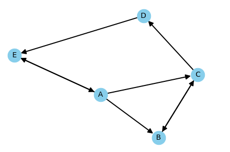
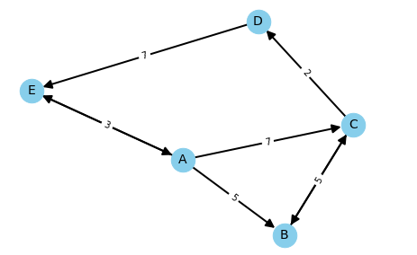

Graphical representations of data are an essential element of data presentation. As an analogy to demonstrate this, imagine the difficulty in navigating a city using a list of street connections rather than the graphical equivalent of a map. Data graph structures provide a pictorial presentation of the connections between nodes on a network. These pictorial presentations find use in all sorts of ways in real life, such as the GPS map in your car or a troubleshooting display of the hardware on a network.

## Defining What a Graph Is All About

A *graph* is a picture of interconnected data like the one shown in Figure 1. It usually relies on circles for nodes and lines to show the relationships between nodes. The nodes, also called vertices, are data points of some sort, such as a location in a city, a conversational hierarchy in email, or a list of data points as in Figure 1.

{.flex .justify-center .items-center}

*Figure 1*
{.text-center}

### A Quick Overview of Graph Terminology

- **Node (vertex)**: A *data point* could be a letter, number, or special character and it may be the only element that defines nodes in a graph. When working with two-dimensional graphs, a *coordinate* provides an x and y location that orients the node with regard to other nodes in the graph space. The node normally has a name (often the data point value) to make referencing it easier.

- **Edge**: A tuple containing two node names. The first node name in the tuple connects to the second node name. This preciseness of reference is important when working with *directed graphs*, those that show a direction of connection, such as that used on maps to indicate one-way streets.

- **Adjacency**: Defines whether one node connects to another node through an edge. If A connects to B, then A is adjacent to B, even if A and B are widely separated pictorially in the graph space.

- **Path**: The listing of adjacent node names between two nodes. For example, if A connects to B, and B connects to C, then the path between A and C is ABC.

### Directed Versus Undirected Graphs

Figure 2 shows an example of a graph with both directed and undirected elements. A *directed graph* is one in which a relationship between two adjacent nodes is one way, like the one-way streets on a map. An *undirected graph* is one in which there is a relationship in both directions between two adjacent nodes, such as the connection between B and C in Figure 2. In some graphs, you may actually see an undirected element shown as two edges with one edge pointing in one direction and the other edge pointing in the other direction. For example, a flow diagram would, of necessity, have to show two-way connections between nodes (such as valves). When a graph shows only undirected elements, the arrows are commonly left out, as shown in Figure 1.

{.flex .justify-center .items-center}

*Figure 2*
{.text-center}

## Essential Graph Algorithms and Approaches

Creating a data graph is only part of the task. The next step is to search, evaluate, and understand the data graph using algorithms.

### Depth First Search (DFS) Versus Breadth First Search (BFS)

Finding what is needed is one of the primary goals of constructing a data graph. A *Depth First Search* (DFS) starts at an arbitrary point in a data graph, the source, and searches to the end of the data graph before it begins searching the next connection to the source. Using Figure 1 as a reference and A as the source, a DFS would search the nodes ABCDE first, then AC. This is how a DFS is commonly used:

- Finding connected components
- Performing topological sorting in a Directed Acyclic Graph (DAG)
- Locating the bridges in a graph (such as the connection between A and C)
- Solving puzzles with only one solution (such as a maze)

A *Breadth First Search* (BFS) starts at an arbitrary point in a data graph and searches the neighboring nodes first, before moving on to the next level of nodes. Again using Figure 1 as a reference, the search pattern in this case would be AB, AC, and AE, then ACD and AED. There are advantages to each approach. This is how BFS is commonly used:

- Performing memory garbage collection using [Cheney’s algorithm](https://www.cs.york.ac.uk/fp/cgo/lectures/chapter10.pdf)
- Finding the shortest path between two points
- Test if a data graph is [bipartite](https://www.techiedelight.com/bipartite-graph/)
- Implementing a web crawler

### Understanding Directed Acyclic Graphs (DAGs) and Kahn’s Algorithm

Certain kinds of problem resolution require a specific kind of data graph. A *Directed Acyclic Graph* (DAG) is a directed graph that contains no cycles. Using Figure 2 as an example, there is a cycle created by the nodes ACDE because it’s possible to go around in a circle using those nodes. It’s not possible to solve problems such as spreadsheet calculations, evolution, family trees, epidemiology, citation networks, and scheduling when the data graph has cycles in it. To locate potential cycles and make data graph node access less complicated, applications perform topological sorting using algorithms such as [Kahn’s algorithm](https://www.geeksforgeeks.org/topological-sorting-indegree-based-solution/).

### Working with Minimum Spanning Trees (MSTs)

To solve certain problems, such as laying new cable in a neighborhood, it’s essential to calculate not only the shortest path between nodes but also the path that contains the lowest cost, perhaps the price of burying the cable. A Minimum Spanning Tree (MST) uses a data graph similar to the one shown in Figure 3 (without the cycle in it) to perform this task. The tree is a separately constructed graph that expresses the list of nodes that provide the minimum weighted values from the source to the destination. There are many different algorithms for solving the MST problem, but here are some of the most popular ones:

- [Boruvka’s algorithm](https://www.geeksforgeeks.org/boruvkas-algorithm-greedy-algo-9/)
- [Prim’s algorithm](https://www.geeksforgeeks.org/prims-minimum-spanning-tree-mst-greedy-algo-5/)
- [Kruskal’s algorithm](https://www.geeksforgeeks.org/kruskals-minimum-spanning-tree-algorithm-greedy-algo-2/)

## Considering Graph Weights

A *graph weight* is a measurement placed on an edge that indicates some type of cost for that edge as shown in Figure 3. It could be a distance, amount of fuel usage, time to travel, or anything else that the designer uses to compare the paths between two points. In Figure 3 the cost of going from A to E to D (a value of 10) is more than the cost of going from A to C to D (a value of 9), even though the result (the starting point is A and the ending point is D) and the number of nodes traversed is the same. Fortunately, it isn’t necessary to calculate these costs by hand. The Choosing Between Algorithms article describes how the use of the Dijkstra, Bellman-Ford, and Floyd-Warshall algorithms locate the shortest route between nodes.

{.flex .justify-center .items-center}

*Figure 3*
{.text-center}

### Uses for Weighted Graphs

Weighted graphs not only show the relationships between nodes, they also associate a cost with those relationships so it’s less complex for the viewer to objectively evaluate costs associated with moving from one node to another. A node can represent anything, as can the edges between nodes. Consequently, while many people associate weighted graphs with applications like GPS, where time, distance, and fuel costs are all important measures, the same technology may also address needs like making a decision within an organization based on goals, and the costs to achieve them. A weighted graph can also show benefits, rather than costs. A properly constructed graph shows the path most likely to produce maximum profit for a venture based on current information. The uses for graphs are limitless, depending solely on the creativity of the person developing them.

### Defining Goals for Graph Weighting

A graph must meet the goals set for it and those goals must be reasonable and useful. In creating a GPS application, most designers focus solely on distance, but this approach definitely leaves the user with an inaccurate view of the driving environment. A more useful GPS considers:

- Distance
- Fuel costs
- Travel time
- Construction delays
- Traffic delays
- Weather
- Complexity (number of nodes traversed)

The weighting of these considerations needs to be in the user’s hands. Perhaps the user is most interested in keeping fuel costs low, so that distance and travel time have a lower priority in determining the best route. Complexity is also an issue because some GPS routes a driver uses more turns through some of the least traveled and inhospitable areas just to save a few miles and a little time.

## Conclusion

Using data graphs correctly greatly enhances an organization’s ability to visualize relationships between any set of data points. Performing this analysis can require some [significant computing horsepower](https://www.linode.com/) when the number of data elements is high, but the benefits far outweigh the costs in most cases. The essential element to success is to ensure that the data graph meets the goals needed to address a particular requirement using the correct algorithm(s) for the task.