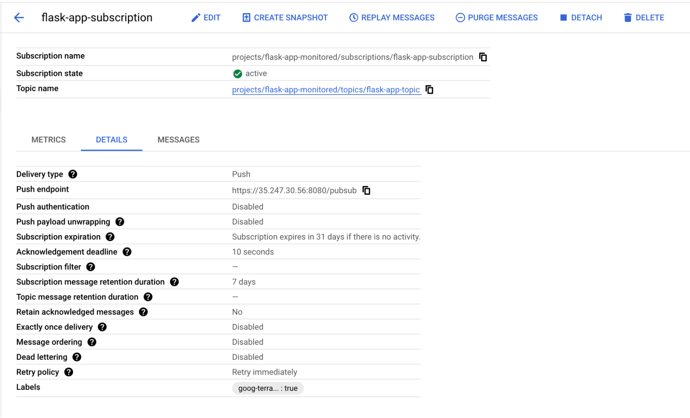
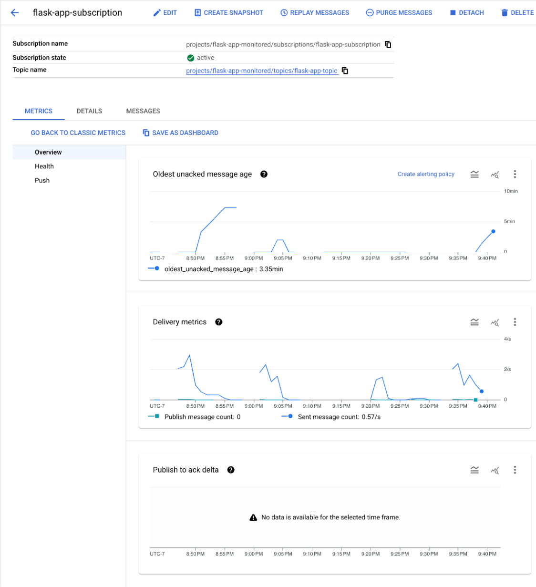
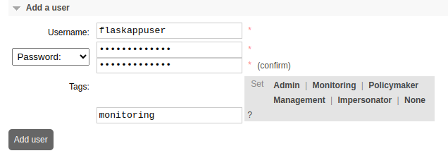

Google Cloud Platform (GCP) Pub/Sub is a fully managed, topic-based messaging service designed for real-time, event-driven architectures. It facilitates communication between independent applications with high throughput and automatic scalability.

RabbitMQ is an open source alternative message broker that uses queue-based messaging to provide flexibility with advanced routing mechanisms. Migrating to RabbitMQ can offer developers more control over their messaging systems, including features like multi-protocol support.

This guide includes steps and recommendations on how to migrate from GCP Pub/Sub to RabbitMQ running on Akamai. To help illustrate the migration process, an example Flask-based Python application running on a separate instance is used as a placeholder for your application or workload.

## Feature Comparison

GCP Pub/Sub and RabbitMQ share many key features in common, though there are some notable differences between the two:

| Feature | GCP Pub/Sub | RabbitMQ |
| ----- | ----- | ----- |
| **Type** | Managed messaging service | Message broker |
| **Message Model** | Pub/Sub with topics and subscriptions | Brokered queues, exchanges, and topics |
| **Management** | Fully managed by Google Cloud | Self-managed, flexible deployment options |
| **Use Cases** | Real-time event streaming, integration between cloud services | Complex messaging patterns, low-level control |
| **Scaling** | Automatic scaling | Horizontal, manual configuration often required |
| **Guaranteed Delivery** | Yes, at least once | Yes, with various modes (at least once, exactly once) |
| **Integrations** | Strong integration with GCP services, HTTP push/pull models | Various protocols (AMQP, MQTT, STOMP) |

## Before You Begin

1.  Read our [Getting Started](https://techdocs.akamai.com/cloud-computing/docs/getting-started) guide, and create an Akamai Cloud account if you do not already have one.

1.  Migrating from GCP Pub/Sub to RabbitMQ on Akamai requires choosing between a single Linode instance or a larger scale, more fault-tolerant environment with Linode Kubernetes Engine (LKE). Follow the appropriate guide below based on your needs:

    -   [Deploy RabbitMQ through the Linode Marketplace](/docs/marketplace-docs/guides/rabbitmq/)
    -   [Deploying RabbitMQ on a Linode](/docs/guides/deploying-rabbitmq-on-a-linode/)
    -   [Deploying RabbitMQ on Kubernetes with LKE](/docs/guides/deploying-rabbitmq-on-kubernetes-with-lke/)

1.  You must have access to your Google Cloud account with sufficient permissions to work with Pub/Sub resources.


This guide is written for a non-root user. Commands that require elevated privileges are prefixed with `sudo`. If you’re not familiar with the `sudo` command, see the [Users and Groups](/docs/guides/linux-users-and-groups/) guide.


## Migrate from GCP Pub/Sub to RabbitMQ

RabbitMQ exchanges various routing mechanisms to handle message delivery and offers control over routing for advanced messaging patterns:

-   **Direct** exchanges deliver messages to queues with a specific routing key.
-   **Topic** exchanges enable pattern-based routing, which allow wildcard matches.
-   **Fanout** exchanges broadcast messages to all bound queues, similar to GCP Pub/Sub topics.
-   **Header** exchanges route messages based on their headers for more nuanced filtering.

Migrating your messaging broker service involves porting any applications that depend on GCP Pub/Sub to use RabbitMQ instead. To illustrate the process, this guide uses an [example Flask application](https://github.com/linode/docs-cloud-projects/tree/main/demos/rabbitmq-migrations-main) running on a Linode instance that is subscribed to a Pub/Sub topic.

### Assess Current Messaging Needs

Using the example Flask app integration, GCP Pub/Sub provides a single topic for pushing messages. The UI displays the current subscribers to a given topic. This provides guidance as to which services may need to be updated when migrating to RabbitMQ.



GCP provides a UI for publishing messages to all subscribers of a topic. This has a similar interface to `rabbitmqadmin` for command line interactions with topics.


This message should appear in the example application’s logs as the following:

```output
2024-11-22 04:34:33,122 - INFO - Received a GET request
2024-11-22 04:41:29,341 - INFO - Received Pub/Sub message.
2024-11-22 04:41:29,342 - INFO - Received message: Hello, World!
2024-11-22 04:41:29,342 - INFO - Attributes: {'key': 'value'}
```

GCP Pub/Sub also provides a logging and monitoring system:



### Convert Authentication to be Compatible with RabbitMQ

RabbitMQ does not work with GCP IAM. As an alternative, select an authentication method compatible with RabbitMQ such as username/password or SSL/TLS certificates. This guide uses username/password for authentication. The following steps create a new read-only RabbitMQ user (e.g. `flaskappuser`) to interact with the example Flask application.

1.  To create a new user, open a web browser and navigate to the following URL over port 15672, replacing  with the external IP address of your Linode instance or LKE node running RabbitMQ:

    ```command
    http://:15672
    ```

1.  Log in to the RabbitMQ web interface as an administrator user.

    
    If you set up RabbitMQ manually on a single Linode instance, the default administrative username (`guest`) and password (`guest`) are only permitted to log in via `localhost`. Therefore, you must create a new administrative user.

    1. Use the following command to create a new RabbbitMQ user:

        ```command
        rabbitmqctl add_user  
        ```

    1.  The following commands tag that user as an `administrator` and grant them administrative permissions:

        ```command
        rabbitmqctl set_user_tags <username> administrator
        rabbitmqctl set_permissions -p / <username> ".*" ".*" ".*"
        ```
    

1.  Open the **Admin** tab and click the **Add user** button. Provide a **Username** (e.g. `flaskappuser`) and **Password** and apply the **Monitoring** tag:

    

1.  Take note of the username/password for the newly created RabbitMQ user, as these credentials must be added to your application for authentication. Later in the guide, these are added directly to the example Flask app configuration.


It's considered a best practice to create a separate set of credentials for each application interacting with RabbitMQ.


### Create a RabbitMQ Exchange and Queue Your Application

1.  To create a new exchange for your application, open the **Exchanges** tab. Under **Add a new exchange**, provide a **Name** (e.g. `flask_app_exchange`) and set the **Type** to `fanout`. Leave the default values in the rest of the fields, then click **Add exchange**:

    

1.  To create a new queue, open the **Queues and Streams** tab. Under **Add a new queue**, specify a **Name** (e.g. `flask_queue`) and leave the default values in the rest of the fields, then click **Add queue**:

    

1.  Select the name of the newly created queue in the list to bring up their details. Expand the **Bindings** section and add a new binding by setting **From exchange** to the name of the newly created exchange (e.g. `flask_app_exchange`), then click **Bind**:

    


It's considered a best practice to create a distinct exchange and queue for each application.


### Set Permissions for RabbitMQ User

Return to the **Admin** page and select the newly created user to bring up its permission details. The following permissions are recommended:


-   The **Configure** permission allows the user to create or modify queues. By setting this to the regular expression `^$`, the user is prohibited from making any configuration changes. Your application assumes the queue(s) it subscribes to already exist.
-   The **Write** permission allows the user to publish messages to the queue. The example application in this guide does not write to the queue, so specifying `^$` denies write access.
-   The **Read** permission, set to `^flask_queue$`, grants the user read access to the previously created queue (`flask_queue`). Replace `flask_queue` with the name of your application's queue.

### Configure Example Flask Server

This guide demonstrates the migration process using an [example Flask server](https://github.com/linode/docs-cloud-projects/tree/main/demos/rabbitmq-migrations-main) that reads messages from RabbitMQ. The example app is deployed on a separate Linode instance to emulate a remote application in production.

1.  Create a new Compute Instance (a [Nanode](https://techdocs.akamai.com/cloud-computing/docs/how-to-choose-a-compute-instance-plan) is sufficient) on which to install and configure Flask. See our [Get Started](https://techdocs.akamai.com/cloud-computing/docs/getting-started-with-compute-instances) guide for information on deploying an instance.

1.  Follow our [Set Up and Secure](https://techdocs.akamai.com/cloud-computing/docs/set-up-and-secure-a-compute-instance) guide to update your system and create a limited user account. You may also wish to set the timezone, configure your hostname, and harden SSH access.

1.  If you haven't done so already, log in to your instance via SSH as a limited user with `sudo` privileges. Replace  with your limited username and  with the IP address your new instance:

    ```command
    ssh @
    ```

1.  Use `apt` to install Flask:

    ```command
    sudo apt install python3-flask
    ```

1.  Use `git` to clone the `docs-cloud-projects` GitHub repository. This includes all playbooks, configurations, and files for all project directories in the repository, including those for the example Flask app.

    ```command
    git clone https://github.com/linode/docs-cloud-projects.git
    ```

    
    Depending on the distribution installed on your instance, you may need to install the `git` utility prior to cloning the docs-cloud-projects repository.

    See GitHub's documentation on [installing git](https://github.com/git-guides/install-git).
    

1.  Navigate to the `main/demos/rabbitmq-migration-main` directory within the cloned `docs-cloud-projects` repository:

    ```command
    cd docs-cloud-projects/demos/rabbitmq-migrations-main
    ```

1.  Confirm the `rabbitmq-migration-main` directory contents on your system:

    ```command
    ls
    ```

    The following contents should be visible:

    ```output
    rabbitmq-changes  README.md
    ```

### Convert Existing Applications from GCP Pub/Sub to RabbitMQ


The specific steps for converting applications from GCP Pub/Sub to RabbitMQ depend on your application configuration and type.

The conversion steps in this guide are specific to the featured example Flask Python app, however the concepts still apply. When converting your message broker service to RabbitMQ, ensure you are configuring it to authenticate to your RabbitMQ exchange and queue as described.


In the example, the Flask application receives and decodes GCP Pub/Sub messages using standard Python libraries. In order to use RabbitMQ, corresponding code must be carefully switched from GCP Pub/Sub tooling to RabbitMQ. For Python applications like the Flask app in this guide, RabbitMQ support is provided through the [Pika](https://pypi.org/project/pika/) library, which is an AMQP provider with RabbitMQ bindings.

1.  Use `apt` to install Pika:

    ```command
    sudo apt install python3-pika
    ```

1.  Using a text editor of your choice, edit the [`app.py`](https://github.com/linode/docs-cloud-projects/blob/main/demos/rabbitmq-migrations-main/rabbitmq-changes/app.py) file located in the `rabbitmq-migrations-main/rabbitmq-changes` directory to apply the changes required to subscribe to the `flask_queue` queue. Save your changes when complete:

    ```command
    nano rabbitmq-changes/app.py
    ```

    The resulting file should look like this, replacing ,  and  with your actual RabbitMQ IP address, username, and password:

    ```file {title="rabbitmq-changesapp.py" lang="python" hl_lines="23,25"}
    from flask import Flask
    import pika
    import threading
    import json
    import logging

    logging.basicConfig(level=logging.INFO)

    app = Flask(__name__)

    def rabbitmq_listener():
        """
        Opens listener to the desired RabbitMQ queue and handles incoming messages
        """
        def callback(ch, method, properties, body):
            """
            Callback function to handle incoming messages from RabbitMQ
            """
            app.logger.info(body.decode('utf-8'))
            # Do other processing here as needed on messages

        connection = pika.BlockingConnection(pika.ConnectionParameters(
            host="",
            port=5672,
            credentials=pika.PlainCredentials("", ""),
        ))

        channel = connection.channel()
        channel.basic_consume(queue="flask_queue", on_message_callback=callback, auto_ack=True)
        app.logger.info("Started listening to RabbitMQ...")
        channel.start_consuming()

    # Start RabbitMQ listener in a separate thread
    listener_thread = threading.Thread(target=rabbitmq_listener, daemon=True)
    listener_thread.start()

    @app.route("/", methods=["GET"])
    def default_handler():
        app.logger.info("Request received.")
        return "RabbitMQ Listener Active", 200

    if __name__ == "__main__":
        app.run(host="0.0.0.0", port=5000)
    ```

1.  Run the updated application:

    ```command
    python3 app.py
    ```

    Ensure the logs show `Started listening to RabbitMQ...`, indicating a successful connection and listener setup:

    ```output
     * Serving Flask app 'app'
     * Debug mode: off
    INFO:pika.adapters.utils.connection_workflow:Pika version 1.3.2 connecting to ('172.235.61.66', 5672)
    INFO:pika.adapters.utils.io_services_utils:Socket connected: <socket.socket fd=9, family=AddressFamily.AF_INET, type=SocketKind.SOCK_STREAM, proto=6, laddr=('192.168.86.203', 50052), raddr=('172.235.61.66', 5672)>
    ...
    INFO:werkzeug:Press CTRL+C to quit
    INFO:app:Started listening to RabbitMQ...
    ```

1.  Next, publish a message to the queue where this application has subscribed. Return to the RabbitMQ Web UI in your browser and log in using your administrative credentials (*not* `flaskappuser`):

    ```command
    http://:15672
    ```

1.  Open the **Queues and Streams** tab and select **flask_queue** from the list of queues. Expand **Publish message** and enter a message in the **Payload** section (e.g. `Hello, Flask app!`), then click **Publish message**:

    

    In the log output for the running Python application, you should see an update with the message from the subscribed queue:

    ```output
    INFO:app:Hello, Flask app!
    ```

## Production Considerations

Considerations to weigh when migrating your application messaging from GCP Pub/Sub to RabbitMQ include authentication, security, performance, and overall architecture.

### Authentication and Authorization

GCP Pub/Sub uses IAM roles and policies for authentication, while RabbitMQ supports multiple methods like username/password and OAuth2. For production-level security, RabbitMQ should use federated authentication services or certificates. Also consider implementing access controls through RabbitMQ’s virtual hosts and user permissions to match or exceed the granular controls GCP provides with IAM policies.

### Message Reliability, Durability, and Delivery

RabbitMQ offers persistent storage for messages by default. You can also configure queues to be durable, meaning they can survive a RabbitMQ broker restart.

RabbitMQ offers different delivery guarantees that help control message reliability and how it behaves under failure scenarios:

-   **At-least-once delivery**  delivers messages to consumers at least once. This is the default delivery model in RabbitMQ.
-   **At-most-once delivery** removes messages from the queue as soon as they are sent to the consumer. This mode is generally suitable for non-critical or low-stakes messages.

To handle messages that can’t be processed after multiple retries, configure a Dead-Letter Exchange (DLX). A DLX redirects unprocessed messages to a separate queue after exceeding the configured retry limit. A DLX is a best practice to mitigate temporary outages or network errors that cause message failures, retrying delivery without affecting primary processing. Failed messages can be inspected or logged for later analysis after landing the DLX.

Adopt the following best practices for delivery and ordering:

-   When ordering is critical, use a single consumer per queue to avoid parallel consumption.
-   For messages with critical processing requirements, implement deduplication to avoid issues from at-least-once delivery.
-   Use manual acknowledgment to control when messages are marked as processed and ensure that RabbitMQ can deliver unacknowledged messages again.
-   Use DLX for retry handling and separating failed messages for special processing, preventing interference with successful message flows.

### Monitoring and Observability

GCP Pub/Sub is directly connected to GCP Cloud Monitoring. Basic monitoring of RabbitMQ is available through the RabbitMQ Management plugin. You can also use tools such as Prometheus and Grafana for real-time performance tracking.

### Scaling, Load Balancing, and Availability

While RabbitMQ does not offer auto-scaling like GCP Pub/Sub, it supports clustering and federation for scaling options. For load balancing, configure multiple nodes and use connection sharding. You can set up cross-node distribution by configuring queues and connections across multiple nodes to balance load. Avoid single points of failure by ensuring that both applications and consumers can failover to different nodes within the cluster.

If RabbitMQ nodes span different data centers, use the [Federation](https://www.rabbitmq.com/docs/federation) or [Shovel](https://www.rabbitmq.com/docs/shovel) plugins. Federation allows controlled mirroring across remote clusters, while Shovel enables continuous transfer of messages from one RabbitMQ instance to another, even across data centers.

Use persistent storage for durable messages and mirrored or quorum queues that require substantial disk I/O. When taking this approach, ensure that disks have enough I/O capacity. Enable disk alarms in RabbitMQ to prevent scenarios where disk space runs out, which could lead to node crashes.