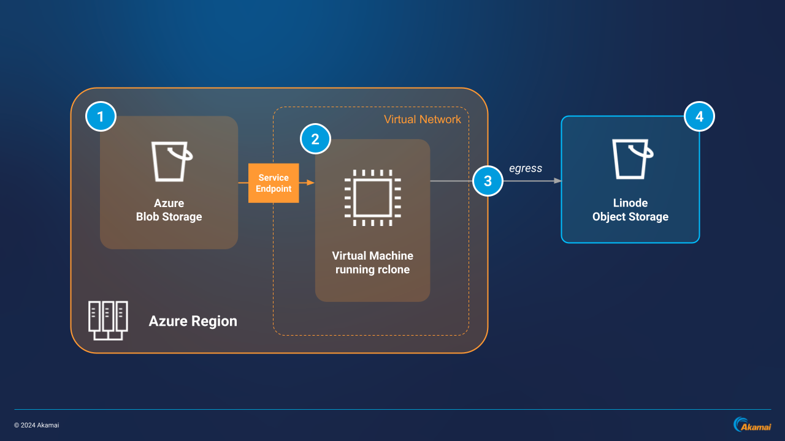
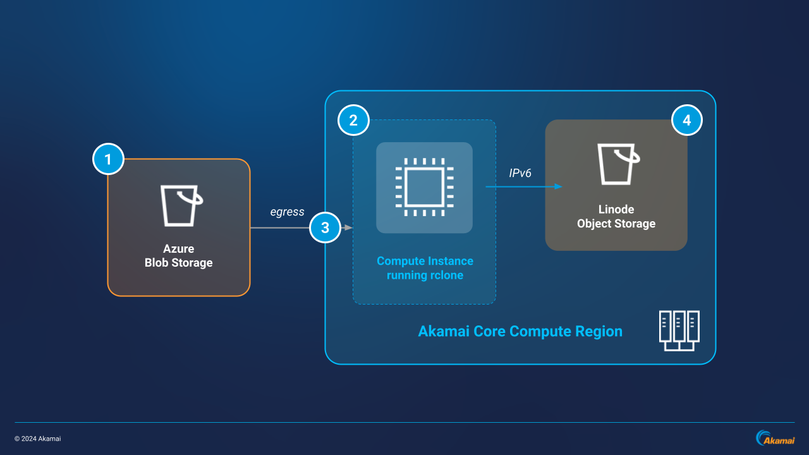
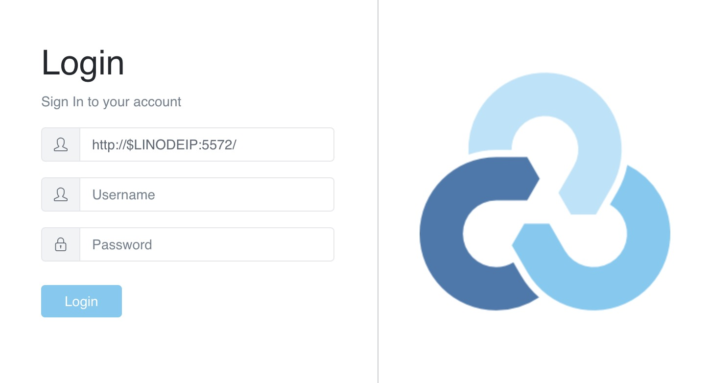
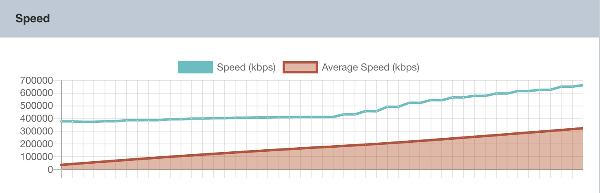

Linode Object Storage is an Amazon S3-compatible service used for storing large amounts of unstructured data. This guide includes steps on how to migrate up to 100TB of static content from Azure Blob Storage to Linode Object Storage using rclone, along with how to monitor your migration using rclone’s WebUI GUI.

## Migration Considerations

-   **Migration time:** Migration time varies depending on various factors, including: the size and type of data being copied, the number of overall objects, network conditions, and the hardware limits of the infrastructure involved (i.e. bandwidth and throughput limits, network interfaces, CPU cores, RAM, etc.).

-   **Egress:** Egress is the measurement of outbound data being transferred and often results in a cost to the user. Egress costs may vary depending on provider rates and the amount of data being transferred. See your provider for specific egress rates.

-   **Bucket architecture:** The example in this guide shows steps for migrating content from a single Azure storage container to a single Linode Object Storage bucket.

    Azure blobs live within containers with throughput rates scaled by blob, whereas Linode Object Storage scales per bucket with each bucket having its own rate limit. How you map from containers or blobs to Object Storage buckets will vary depending on your use case and performance needs. See: [Scalability and performance targets for Blob storage](https://learn.microsoft.com/en-us/azure/storage/blobs/scalability-targets)

    Migrating content and changing over workloads intermittently is recommended to ensure maximum uptime and reliability.

-   **Multiple machines running in parallel:** This guide provides steps for initiating and monitoring a single rclone copy job for a single object storage bucket. One option for speeding up a distributed workload migration is to run multiple rclone instances to migrate multiple buckets at the same time.

    See Linode Object Storage’s [technical specifications](https://techdocs.akamai.com/cloud-computing/docs/object-storage#technical-specifications-and-considerations) for rate and bandwidth limits if you are running multiple virtual machines in parallel.

-   **Large amounts of data:** This guide assumes you are migrating less than 100 million objects and 100TB of static data. If you require a larger amount of data transferred, contact our [sales](https://www.akamai.com/why-akamai/contact-us/contact-sales) and [professional services](https://www.akamai.com/site/en/documents/akamai/akamai-professional-services-and-support.pdf) teams.

## Migration Architecture Diagram

There are two architecture options for completing a data migration from Azure Blob Storage to Linode Object Storage. One of these architectures is required to be in place prior to initiating the data migration:

**Architecture 1:** Utilizes an Azure Virtual Machine running rclone in the same region as the source Blob Storage container. Data is transferred internally from the Blob Storage container to the Virtual Machine and then over the public internet from the Virtual Machine to the target Linode Object Storage bucket.

-   **Recommended for:** speed of transfer, users with Azure platform familiarity

**Architecture 2:** Utilizes a Linode instance running rclone in the same region as the target Object Storage bucket. Data is transferred over the public internet from the Blob Storage container to the Linode instance and then internally via IPv6 to the Linode Object Storage bucket.

-   **Recommended for:** ease of implementation, users with Akamai platform familiarity


Rclone generally performs better when placed closer to the source data being copied. During testing for both architectures, Architecture 1 achieved about 20% higher transfer speed than Architecture 2.


### Architecture 1

1.  A source Azure Blob Storage container with the content to be transferred.

1.  An Azure Virtual Machine running rclone in the same region as the source container. The Azure Blob Storage container communicates with the Virtual Machine through a Service Endpoint within the Azure region inside a Virtual Network.

1.  Data is copied across the public internet from the Azure Virtual Machine to a target Linode Object Storage bucket. This results in egress (outbound traffic) being calculated by Azure.

1.  The target Linode Object Storage bucket receives data from the source Azure Virtual Machine. The migration status can be monitored using rclone’s WebUI.



### Architecture 2

1.  A source Azure Blob Storage container with the content to be transferred.

1.  A Compute Instance running rclone in the same Akamai core compute region as the target Linode Object Storage bucket.

1.  Data is copied across the public internet from the Azure Blob Storage container to the target Linode instance. This results in egress being calculated by Azure.

1.  The target Linode Object Storage bucket receives the data via IPv6 from the Compute Instance on the region’s private network. Inbound, private IPv6 data to Linode Object Storage is free of charge. The migration status can be monitored using rclone’s WebUI.



## Prerequisites and Required Information

-   **A virtual machine with rclone installed**. This guide recommends a 16GB dedicated virtual machine with 8 CPU cores. The plan you require may vary depending on your workload.

-   The **public IPv4 address** of your virtual machine.

-   As a security best practice, **use a firewall to only allow inbound port 5572**. This is the default port used by rclone and enables more secure access to the WebUI since it is served over HTTP. For an additional layer of security, consider setting up an HTTPS gateway.

-   **An up-to-date web browser**. This is used to access the rclone WebUI while monitoring the migration.

-   **SSH access to the virtual machine** with sudo user privileges.

-   An **Azure storage account**.

-   An existing **Azure Blob Storage container** with:

    -   Storage account name
    -   Azure key
    -   Container name

-   If using Architecture 1, an **Azure Virtual Network** enabled to communicate with the Azure Blob Storage container and Virtual Machine through a [Service Endpoint](https://learn.microsoft.com/en-us/azure/virtual-network/virtual-network-service-endpoints-overview) is required.

-   An **existing Linode Object Storage bucket** with:

    -   Bucket name
    -   Access key
    -   Secret key
    -   Region ID and endpoint URL

    
    When creating Object Storage access keys, it is a best practice to limit individual bucket access by region along with read/write permissions. See: [Manage access keys](https://techdocs.akamai.com/cloud-computing/docs/manage-access-keys)
    

## Migration Steps

### Initiating the Data Migration

1.  On the instance running rclone, configure rclone to communicate with your source Azure Blob Storage container and your target Linode Object Storage bucket.

    To view the location of the rclone config file, run:

    ```command
    rclone config file
    ```

    If the file does not exist yet, you should see output similar to the following:

    ```output
    Configuration file doesn't exist, but rclone will use this path:
    /home/user/.config/rclone/rclone.conf
    ```

1.  Using the text editor of your choice, add the following configuration to your config file. Replace the following fields with your own corresponding provider and bucket values. Save your changes when complete:

    **Azure Blob Storage**
    -   : The name of the Azure storage account
    -   : Your Azure key

    **Linode Object Storage**
    -   : Your Linode Object Storage access key
    -   : Your Linode Object Storage secret key
    -   : The region ID for your Linode Object Storage bucket

    ```file
    [azure]
    type = azureblob
    account = 
    key = 

    [linode]
    type = s3
    provider = Ceph
    access_key_id = 
    secret_access_key = 
    endpoint = .linodeobjects.com
    acl = private
    ```

    
    The lines `[azure]` and `[linode]` define the remote providers for your source and target endpoints, respectively. See [Supported Providers](https://rclone.org/#providers) for a complete list of supported rclone providers.
    

1.  Confirm connectivity to the Azure storage account using your defined remote provider, `azure`:

    ```command
    rclone lsd azure:
    ```

    If successful, you should see a list of available buckets:

    ```output
              -1 2024-08-30 09:10:47        -1 azure-container-name
    ```

1.  Confirm connectivity to Linode Object Storage using the other defined remote provider, `linode`:

    ```command
    rclone lsd linode:
    ```

    Similar to above, you should see a list of available buckets:

    ```output
              -1 2024-08-28 14:46:47        -1 linode-bucket-name
    ```

1.  Run the rclone copy command to initiate the migration.

    Replace  and  with the names of your Azure and Linode Object Storage buckets, respectively. Replace  and  with the username and password you want to use to access the rclone WebUI.

    If using Architecture 2, also include the `--bind ::0` flag to write data from your Compute Instance to your Object Storage bucket using IPv6:

    ```command
    rclone copy azure:/ linode:/ --transfers 50 --rc --rc-addr=0.0.0.0:5572 --log-file=rclone.log --log-level=ERROR --rc-web-gui --rc-user  --rc-pass 
    ```

#### Rclone Copy Command Breakdown

-   `azure:azure-container-name/`: The Azure remote provider and source Blob Storage container. Including the slash at the end informs the `copy` command to include everything within the bucket.

-   `linode:linode-bucket-name/`: The Linode remote provider and target Object Storage bucket.

-   `--transfers 50`: The `transfers` flag tells rclone how many items to transfer in parallel. Defaults to a value of 4. `50` here speeds up the transfer process by moving up to 50 items in parallel at a given time.

    Your `transfers` value may be different depending on how many objects you are transferring, and you may need to experiment to find the value that works best for your use case. High enough values may result in bandwidth limits being reached. Increasing this value also increases the CPU usage used by rclone.

-   `--rc`: Stands for “remote control”. The `rc` option deploys the http listen server for remote requests.

-   `--rc-addr=0.0.0.0:5572`: Specifies the web address and port number used to access the WebUI GUI. `0.0.0.0` instructs the remote to listen on all IPv4 addresses, and `5572` is the default port number used by rclone to access the WebUI.

-   `--log-file=rclone.log`: The file where rclone writes logs. This file is created in the working directory from where the `copy` command is run.

-   `--log-level=ERROR`: The type of logs to be written to your log file. `ERROR` here specifies only errors are written to the `rclone.log` file.

-   `--rc-web-gui`: Serves the WebUI GUI on the default rclone port (5572).

-    `--rc-user  and --rc-pass `: The username and password used to access the WebUI GUI.


An alternative to the `--rc-user` and `--rc-pass` combination is the `--rc-htpasswd` flag. This creates a `htpasswd` file containing a generated username and password combination you can use to log into the rclone WebUI. See [Remote controlling rclone with its API](https://rclone.org/rc/#rc-htpasswd-path)


-   `--bind ::0` (for use with Architecture 2): Tells rclone to write data via IPv6. Note that writing data over IPv6 from a Linode instance to an Object Storage bucket in the same region is free of charge.

#### Optional Flags

-   `--tpslimit ` : Specifies the number of HTTP transactions per second. For larger transfers, it is considered a best practice to set the `tpslimit` below the infrastructure requests per second (rps) limit. Should an rps limit be reached, a 503 `SlowDown` error may result.

    **Example:** If the infrastructure’s requests per second limit is 750 rps, set the tpslimit to 725:

    ```command
    --tpslimit 
    ```

### Monitoring the Migration

To monitor the status of the `rclone copy` command above, you can access the rclone WebUI GUI from a web browser.

1.  In a web browser window, navigate to your instance’s address over port 5572. Replace  with the IPv4 address of your instance:

    ```command
    http://:5572
    ```

1.  When prompted, enter the username and password you specified with the `--rc-user` and `--rc-pass` flags:

    

1.  Once logged in, you should see active running jobs along with multiple monitoring statistics, including: job status, throughput and speed, bandwidth max speed, total objects transferred, amount of data transferred, and more.

    

    

1.  The WebUI will disconnect automatically when the copy job is complete.

## Verify the Migration

You can compare the number of objects in both your source and target buckets along with the total size of the buckets to verify full completion of the copy job.

### From the Command Line

**Azure Blob Storage:**

```command
rclone size azure:azure-container-name/
```

```output
Total objects: 87.275k (87275)
Total size: 647.612 GiB (695368455398 Byte)
```

**Linode Object Storage:**

```command
rclone size linode:linode-bucket-name/
```

```output
Total objects: 87.275k (87275)
Total size: 647.612 GiB (695368455398 Byte)
```

### From a Browser

Alternatively, you can compare the number of objects and total bucket sizes from the Azure Portal and Cloud Manager on Akamai:

**Azure Portal:**

-   Navigate to your storage account
-   Select the **Monitoring** dropdown
-   Click the **Metrics** tab
-   Under **Metric Namespace**, select **Blob**
-   To see the container size, select **Blob Capacity** under **Metric**
-   To see the total number of objects, select **Blob Count** under **Metric**

**Cloud Manager:**

-   Navigate to **Object Storage**
-   Find your target bucket name
-   See the **Size** column for the total bucket size and the **Objects** column for the total number of objects

## Next Steps

There are several next steps to consider after a successful object storage migration:

-   **Change over your object storage endpoints to your new target bucket.** For example, if you have backups or logs being sent to your old source bucket, edit your jobs to point to the new bucket endpoints.

-   **Edit your configurations to match your new object storage credentials.** In addition to changing the target endpoints for your workloads, your access keys and secret keys need to be updated to your new Linode Object Storage keys.

-   **Confirm the changeover is functioning as expected.** Allow some time to make sure your updated workloads and jobs are interacting successfully with Linode Object Storage. Once you confirm everything is working as expected, you can safely delete the original source bucket and its contents.

-   **Take any additional steps to update your system for Amazon S3 compatibility.** Since the Azure Blob Storage API is not Amazon S3-compatible, you may need to make internal configuration changes to ensure your system is set up to communicate using S3 protocol. This means your system should be updated to use an Amazon S3-compatible [SDK](https://docs.aws.amazon.com/AmazonS3/latest/userguide/UsingAWSSDK.html) like [Boto3](https://aws.amazon.com/sdk-for-python/) or Amazon S3-compatible command line utility like [s3cmd](https://s3tools.org/s3cmd). The [AWS SDK](https://techdocs.akamai.com/cloud-computing/docs/using-the-aws-sdk-for-php-with-object-storage) can also be configured to function with Linode Object Storage.