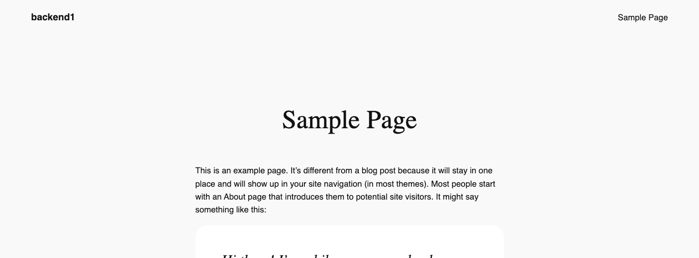
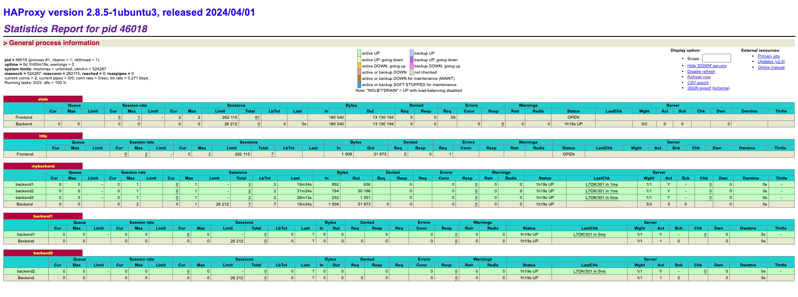

[HAProxy](http://www.haproxy.org) is an intermediary gateway application that manages traffic between frontend clients and backend server resources. HAProxy can be configured to load balance traffic between a set of backend servers, and it can be configured to route HTTP requests according to the URL path of the request.

This guide is the second part in a series on HAProxy. The first guide, [Getting Started with HAProxy TCP Load Balancing and Health Checks](/docs/guides/getting-started-with-haproxy-tcp-load-balancing-and-health-checks/), provided steps to build a minimally configured network of Nanodes:

- An HAProxy node was set up as a TCP load balancer
- Three Linode Marketplace WordPress servers served as the backends
- TCP health checks were configured on the HAProxy node

This second guide presents another configuration for this server cluster that demonstrates how to use path-based routing and HTTP health checks.

## Before You Begin

Follow the [Before You Begin](/docs/guides/getting-started-with-haproxy-tcp-load-balancing-and-health-checks/#before-you-begin) and [Install HAProxy](/docs/guides/getting-started-with-haproxy-tcp-load-balancing-and-health-checks/#install-haproxy) sections of the [Getting Started with HAProxy TCP Load Balancing and Health Checks](/docs/guides/getting-started-with-haproxy-tcp-load-balancing-and-health-checks/) guide.


This guide is written for a non-root user. Commands that require elevated privileges are prefixed with `sudo`. If you’re not familiar with the `sudo` command, see the [Users and Groups](/docs/guides/linux-users-and-groups/) guide.


## HTTP Path-based Routing

By using the `acl` and `use_backend` directives, HAProxy can direct URL requests to specific backend servers based on the incoming HTTP request string.

### The `acl` Directive

An [*ACL* (Access Control List)](https://www.haproxy.com/documentation/haproxy-configuration-tutorials/core-concepts/acls/#acl-syntax) directive can be used to match a specific URL path. The syntax for an ACL is:

```file {title="/etc/haproxy/haproxy.conf"}
acl   
```

An ACL *fetch* method is used to retrieve information from the HTTP request. The `path` fetch method gets the URL for the request. For example, this directive is named `match_foo` and evaluates to true if the URL path for the request is `/foo`:

```file {title="/etc/haproxy/haproxy.conf"}
acl match_foo path /foo
```

There are [variants of the `path` method](https://docs.haproxy.org/2.4/configuration.html#7.3.6-path) that provide similar functionality. For example, `path_beg` checks that the beginning of the path matches the URL string provided. As well, there are fetch methods for other request information, like the source IP of the address or any URL parameters that were present.

When you define an ACL, you specify a unique name for it. That name is later referenced in your configuration (demonstrated in the next [`use_backend` Directive](#the-use_backend-directive) section) to direct requests to specific backends.

### The `use_backend` Directive

A `use_backend` HAProxy directive routes requests to specific backend servers. This directive references a previously-declared `acl` directive by the unique name associated with it. If that ACL evaluated to true for the request, then the request is routed to that specific backend. The syntax for this is:

```file {title="/etc/haproxy/haproxy.conf"}
use_backend  if 
```

### Path-based Routing Example

To demonstrate how path-based routing works in practice, follow these steps for the HAProxy and WordPress cluster:

1. Edit the HAProxy configuration to include this `frontend` section:

    ```file {title="/etc/haproxy/haproxy.cfg"}
    frontend http
      bind *:80
      mode http
      acl sample-page path_beg /index.php/sample-page/
      acl author-archive path_beg /index.php/author/admin/
      use_backend backend1 if sample-page
      use_backend backend2 if author-archive
      default_backend mybackend
    ```

    Here's an explanation for each line:

    -   `frontend http`: Defines a frontend named `http` that handles incoming HTTP connections.
    -   `bind *:80`: Binds the frontend to all available IP addresses on port `80`, listening for incoming traffic.
    -   `mode http`: Sets the mode to HTTP, allowing traffic to be processed at the application layer.
    -   `acl sample-page path_beg /index.php/sample-page/`: Defines an ACL named `sample-page` to match requests starting with `/index.php/sample-page/`.
    -   `acl author-archive path_beg /index.php/author/admin/`: Defines an ACL named `author-archive` to match requests starting with `/index.php/author/admin/`.
    -   `use_backend backend1 if sample-page`: Routes requests to `backend1` if the `sample-page` ACL is matched.
    -   `use_backend backend2 if author-archive`: Routes requests to `backend2` if the `author-archive` ACL is matched.
    -   `default_backend mybackend`: Routes all other requests to the default backend, `mybackend`, if no ACL matches.

1. The HAProxy configuration must also include two additional `backend` sections. These direct incoming frontend requests to the correct backend server. Update the configuration file to include these sections. Replace the placeholder IP addresses with the addresses from the WordPress servers:

    ```file {title="/etc/haproxy/haproxy.cfg"}
    backend mybackend
      mode http
      balance roundrobin
      server backend1 :80
      server backend2 :80
      server backend3 :80

    backend backend1
      mode http
      server backend1 :80

    backend backend2
      mode http
      server backend2 :80
    ```

    Here's an explanation of each line:

    -   `backend mybackend`: Defines a backend pool called `mybackend` that handles client requests directed to it.
        -   `mode http`: Sets the backend mode to HTTP, processing traffic at the application layer.
        -   `balance roundrobin`: Distributes incoming requests evenly across the servers in the `mybackend` pool.
        -   `server backend1/backend2/backend3`: Lists three servers (`backend1`, `backend2`, `backend3`) in the `mybackend` pool, each assigned their respective VLAN IP addresses and listening on port `80`.
    -   `backend backend1`: Defines an individual backend for `backend1`, allowing specific configuration.
        -   `server backend1`: Adds `backend1` with its VLAN IP address and port `80` to this backend.
    -   `backend backend2`: Defines an individual backend for `backend2`, similar to the setup for `backend1`.
        -   `server backend2`: Adds `backend2` with its VLAN IP address and port `80`.

## HTTP Health Checks

In [Getting Started with HAProxy TCP Load Balancing and Health Checks](/docs/guides/getting-started-with-haproxy-tcp-load-balancing-and-health-checks/), the HAProxy gateway was configured to test TCP and Layer 4 connectivity, marking servers as down when errors accumulate over time. HTTP health checks work similarly, but use standard HTTP response codes to mark servers as "down" based on their performance over a specified interval.

Like TCP health checks, HTTP health checks continue to test a server marked as "down" to see if it begins to respond. If it starts responding correctly, the server is added back to the pool of active servers.

You can also configure HTTP health checks to look for specific values rather than standard HTTP response codes. This can be done using *REGEX* (regular expressions) or simple text matches within the first 16 KB of the backend server's response. For example, a string could match phrases like "Alive" or "Logged In" within a session.

### Basic HTTP Health Checks

Like with TCP health checks, adding the `check` directive to the `server` lines within the `backend` section of your HAProxy configuration file monitors the health of backend servers. However, this is only a TCP health check. In order to activate an HTTP health check, you also need to add the `option httpchk` to the `backend` section.

To demonstrate this with the example HAProxy and WordPress cluster, add these new directives to the `backend mybackend` section of your HAProxy configuration:

```file {title="/etc/haproxy/haproxy.cfg"}
backend mybackend
    option httpchk
    server backend1 :80 check
    server backend2 :80 check
    server backend3 :80 check
```

-   `check`: Appending this keyword to each `server` entry activates the health check on that server.
-   `option httpchk`: Adding this option allows HAProxy to perform HTTP health checks. By default, standard responses from the server in the `200`-`399` range indicate that the server is healthy. Meanwhile, responses in the `500` range mark the server as down and remove it from the active pool until it recovers.


By default, the `option httpchk` directive sends a `GET` request to the `/` endpoint to determine server health. However, this can be customized for a specific endpoint, such as `/health`:

```file {title="/etc/haproxy/haproxy.cfg"}
backend mybackend
    option httpchk GET /health
```


### String-based HTTP Health Checks

With the `http-check expect string` directive, HTTP health checks can also query and match specific strings in the backend server's responses. However, only the first 64 KB of the response is examined. If headers are lengthy or include large elements like inline graphics, the desired string may not be within this limit, and it is then missed by the health check.

To demonstrate this with the example HAProxy and WordPress cluster, add this new directive to the `backend mybackend` section of your HAProxy configuration:

```file {title="/etc/haproxy/haproxy.cfg"}
backend mybackend
  option httpchk
  http-check expect string OK
  server backend1 :80 check
  server backend2 :80 check
  server backend3 :80 check
```

-   `http-check`: This directive checks a server response three times before marking the server as "down". The code above configures HAProxy to check that a response was returned the string `OK`. You can adjust this string to match any other server response that indicates a healthy state.

### The HAProxy Stats Page

HTTP health checks offer a more approachable way to monitor the health of your servers than TCP health checks. While HTTP health checks can still be viewed from log files, they can also be viewed from HAProxy's web-based graphical stats page.

Enable the stats page by adding a `listen` section to the HAProxy configuration file::

```file {title="/etc/haproxy/haproxy.cfg"}
listen stats
  bind *:8404
  mode http
  stats enable
  stats uri /stats
  stats refresh 10s
  stats auth admin:password  # Set a username and password for access
```

-   `listen` creates a new listen section named `stats`.
-   `bind` tells HAProxy to listen on all available network interfaces (`8`) on port `8404`.
-   `mode` is set to HTTP.
-   `stats enable` enables the stats function.
-   `stat uri/stats` defines the URL where the stats page can be accessed (`http://:8404/stats`)
-   `stats refresh 10s` sets the auto-refresh interval at 10 seconds.
-   `stats auth admin:password` configures basic credentials for the stats page. Replace `admin` and `password` with the username and password of your choice.

## Test HTTP Load Balancing with Health Checks

Follow these steps to test the concepts from the previous sections:

1. After including all of the directives described in the previous sections, your HAProxy configuration should now resemble the following. Verify that your configuration matches this:

    ```file {title="/etc/haproxy/haproxy.cfg"}
    listen stats
      bind *:8404
      mode http
      stats enable
      stats uri /stats
      stats refresh 10s
      stats auth admin:password  # Set a username and password for access

    frontend http
      bind *:80
      mode http
      acl sample-page path_beg /index.php/sample-page/
      acl author-archive path_beg /index.php/author/admin/
      use_backend backend1 if sample-page
      use_backend backend2 if author-archive
      default_backend mybackend

    backend mybackend
      mode http
      balance roundrobin
      option httpchk
      server backend1 :80 check
      server backend2 :80 check
      server backend3 :80 check

    backend backend1
      mode http
      option httpchk
      server backend1 :80 check

    backend backend2
      mode http
      option httpchk
      server backend2 :80 check
    ```

1.  Reload HAProxy for the changes to take effect:

    ```command
    sudo systemctl reload haproxy
    ```

    
    If you encounter any errors after reloading HAProxy, run the following command to check for syntax errors in your `haproxy.cfg` file:

    ```command
    sudo haproxy -c -f /etc/haproxy/haproxy.cfg
    ```

    An error message is returned if the configuration file has logical or syntax errors. When the check is complete, each error is listed one per line. This command only verifies the syntax and basic logic of the configuration, it does not guarantee that the configuration works as intended when running.
    

1.  Open a web browser and access the HAProxy server’s IP address:

    ```command
    http://
    ```

    
    If your browser warns of no HTTPS/TLS certificate, ignore the warning or use the advanced settings to reach the site.
    

    This page is served by the `mybackend` pool that consists of all three WordPress instances:

    

1.  Open the default WordPress Sample Page:

    ```command
    http:///index.php/sample-page/
    ```

    This URL should only be served by `backend1`:

    

1.  Navigate to the default WordPress author archive for `admin`:

    ```command
    http:///index.php/author/admin/
    ```

    This URL should only be served by `backend2`:

    

1.  Open a web browser and navigate the HAProxy server's public IP address with `:8404/stats` appended to the URL:

    ```command
    http://:8404/stats
    ```

1.  When prompted, enter your username and password from the `listen` section of the HAProxy configuration file.

1.  You should now see the HAProxy stats page showing `mybackend`, `backend1`, and `backend2`:

    

    This page holds a wealth of information regarding the health of your servers, including status, sessions, bytes in/out, errors, warnings, and more.