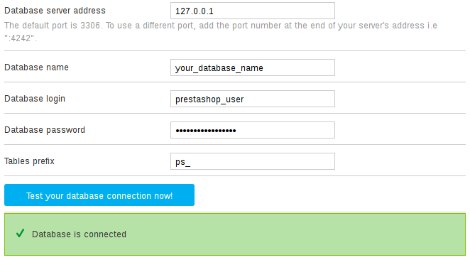
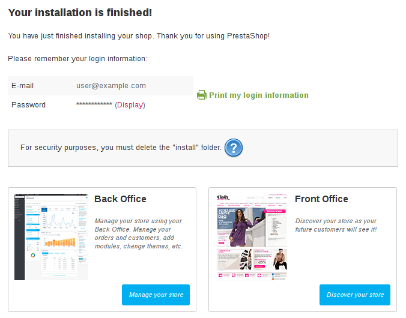
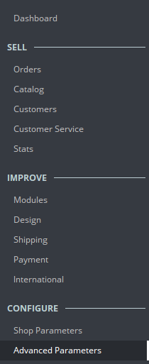
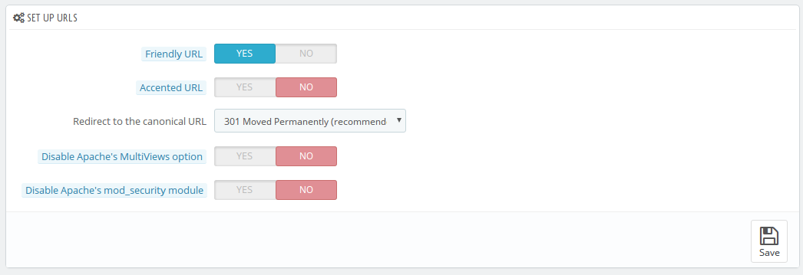
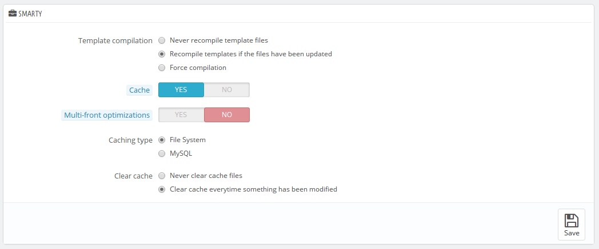
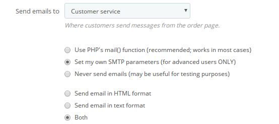

## What is PrestaShop?

If you've ever thought about opening an online store, you may have felt overwhelmed by variety of free, open-source ecommerce solutions available.  While having so many options means that there is almost certainly an available and effective solution for your particular situation, it can also be confusing for newcomers. One of those options, the subject of this guide, is [PrestaShop](https://www.prestashop.com/en), a comprehensive ecommerce solution used by thousands of merchants around the world.

PrestaShop's ecommerce breadth can make it seem daunting to learn; however, its menus are neatly structured, terms are intuitive, and interface is easily navigable. In addition, customizing your website with PrestaShop's many *What You See Is What You Get* (WYSIWYG) tools makes for a user-friendly set up, without having to inspect and edit source code. Also, PrestaShop comes with many out-of-the-box features and plug-ins that streamline setup and use.

Installing Prestashop on a remote server is more involved and time-consuming than using cloud hosting, but the rewards are greater: you will have better performance, since you have conserved server resources, and greater flexibility, with the freedom to tweak your settings as you see fit. You won't ever have to wait for a cloud-host support team to change PHP settings for you. Furthermore, [high availability](/docs/guides/introduction-to-high-availability/), [load balancing](/docs/products/networking/nodebalancers/get-started/), advanced [backup schemes](/docs/products/storage/backups/), and other features become easily accessible, allowing you to scale your business and increase your site's reliability.

## Before You Begin

1.  If you have not already done so, create a Linode account and Compute Instance. See our [Getting Started with Linode](/docs/products/platform/get-started/) and [Creating a Compute Instance](/docs/products/compute/compute-instances/guides/create/) guides.

1.  Follow our [Setting Up and Securing a Compute Instance](/docs/products/compute/compute-instances/guides/set-up-and-secure/) guide to update your system. You may also wish to set the timezone, configure your hostname, create a limited user account, and harden SSH access.

1.  In order to obtain a free SSL certificate from [Let's Encrypt](https://letsencrypt.org/), you will need to buy a Fully Qualified Domain Name (FQDN) and set it to point to your Linode. See our [DNS Manager Overview](/docs/products/networking/dns-manager/) guide for more information.

    
Throughout this guide, replace `example.com` with the public IP address or Fully Qualified Domain Name (FQDN) of your Linode.


## Server Requirements

In most cases, you can start out with an Ubuntu 16.04 instance with 1GB of RAM. As your online store grows, keep an eye on your memory usage; scale to a bigger Linode when necessary. If your business becomes especially large, it may be a good idea to separate your store across at least three servers: one that runs Apache and hosts the PHP code running the ecommerce platform, one for the database, and one for storing static content, like .jpg images.

## Install Apache and MariaDB

This guide will run PrestaShop on a modified LAMP stack using MariaDB instead of MySQL. You can read more about MariaDB and its features [here](https://mariadb.com/kb/en/the-mariadb-library/mariadb-vs-mysql-features/). If you would prefer to use a traditional LAMP stack, please see our guide, [How to Install a LAMP Stack on Ubuntu 16.04](/docs/guides/install-lamp-stack-on-ubuntu-16-04/).

1. Install Apache, PHP, and MariaDB:

        sudo apt-get install apache2 libapache2-mod-php mariadb-server

2. Use the following command to secure your MariaDB installation:

        sudo mysql_secure_installation

  This script will ask a series of questions. You can leave the first question (for MariaDB's root password blank), then choose 'n' ("No") to decline to create a new root password. Answer 'y' (Yes) for the remaining questions.

### Configure Apache

1. The next step is to create a basic configuration file for Apache, telling it where it will find your website files and what your domain name is. Start by copying the default config file to use it as a template:

        sudo cp /etc/apache2/sites-available/000-default.conf /etc/apache2/sites-available/example.com.conf

2. Edit the configuration file. Uncomment the `ServerName` line, replace `example.com` with your Linode's domain name or IP address, and edit the remaining lines as follows:

    
. . .
ServerName example.com

ServerAdmin webmaster@example.com
DocumentRoot /var/www/html/example.com
. . .



3. Create the directory for our website files:

        sudo mkdir /var/www/html/example.com

4. Disable the default configuration file and enable the newly created one:

        sudo a2dissite 000-default.conf
        sudo a2ensite example.com.conf

5. Restart Apache:

        sudo systemctl restart apache2.service

### Allow PrestaShop to Use .htaccess Files

PrestaShop can make use of `.htaccess` files. This allows it to automatically adjust Apache's settings and makes it possible to enable advanced features such as "pretty links," web page compression, or **https** redirects from the administration backend (PrestaShop's admin page).

1.  Edit the config file to enable .htaccess overrides:

  
<Directory /var/www/html/example.com>
    AllowOverride All
</Directory>



## Install TLS (SSL) Certificate to Encrypt Website Traffic

Obtaining an SSL certificate for your store will help keep your customers' data secure, and will avoid Google search ranking penalties for sites that don't use `https`. It is not possible to complete this step using the public IP address of a Linode; you need to have a FQDN that is already listed in the DNS servers.

1. Check to see if your domain name has propagated to the DNS servers:

        dig @8.8.8.8 example.com

    You should receive a response that looks like this:

        example.com        36173   IN  A   203.0.113.10

    If the **A** value is equal to the IP address of your server, you can continue. Otherwise, check the DNS configuration of your Linode, and then repeat this step after a few minutes.

2. Add the official Personal Package Archive (PPA) of the Let's Encrypt Team, update the package repository, and install certbot:

        sudo apt-get install software-properties-common
        sudo add-apt-repository ppa:certbot/certbot
        sudo apt-get update
        sudo apt-get install python-certbot-apache

3. Request and install the TLS certificate:

          sudo certbot --apache

4. When asked if you want https redirection answer **2**.

        Please choose whether or not to redirect HTTP traffic to HTTPS, removing HTTP access.
        -------------------------------------------------------------------------------
        1: No redirect - Make no further changes to the webserver configuration.
        2: Redirect - Make all requests redirect to secure HTTPS access. Choose this for
        new sites or if you're confident your site works on HTTPS. You can undo this
        change by editing your web server's configuration.
        -------------------------------------------------------------------------------
        Select the appropriate number [1-2] then [enter] (press 'c' to cancel):

5. Make sure https is working correctly before continuing. You do this by navigating to `https://example.com` in your web browser.

6. Since certificates expire after 90 days, it's a good idea to set up automatic renewal:

        sudo crontab <<< "33 3 * * Sat /usr/bin/certbot renew -q"

## Prepare Environment for PrestaShop and Install Dependencies

Set ownership of `/var/www/html/example.com` to allow PrestaShop to enable plug-ins, automatic updates, and other features.

    sudo chown www-data: /var/www/html/example.com/

You can also use:

    chown -R www-data *
    chgrp -R www-data *

### Download and Unzip PrestaShop's Files

1. Change the working directory to where the website's code will be installed:

        cd /var/www/html/example.com/

2. Download the zip archive containing all of the necessary files. At the time of writing this tutorial, the latest version was `1.7.2.1`. Check this website for the newest version available: [PrestaShop's Download Page](https://www.prestashop.com/en/download) and change the link in the following command so that it reflects the current release:

        sudo curl -O https://download.prestashop.com/download/releases/prestashop_1.7.2.1.zip

3. Install the `unzip` package:

        sudo apt-get install unzip

4. Decompress the zip archive:

        sudo unzip prestashop_1.7.2.1.zip

### Install and Configure PrestaShop Dependencies

1. Install PrestaShop's PHP dependencies:

        sudo apt-get install php7.0-curl php7.0-gd php7.0-mysql php7.0-zip php7.0-xml php7.0-intl

    These modules allow PrestaShop to download content, process images, access the database, unzip files, process XML data, and access internationalization functions.

2. Enable the Apache `rewrite` module:

        sudo a2enmod rewrite

3. Restart Apache:

        sudo systemctl restart apache2.service

4. PrestaShop makes use of a SQL database to store information about products, users, categories and so on. Log in as the superuser (root) to MariaDB:

        sudo mysql

5. Create a database and a user with the appropriate permissions. Replace `your_database_name`, `prestashop_user` and `choose_password` below. Record the information for later use.

        CREATE DATABASE your_database_name;
        CREATE USER 'prestashop_user'@'localhost' IDENTIFIED BY 'choose_password';
        GRANT ALL ON your_database_name.* TO 'prestashop_user'@'localhost';
        exit

## Install PrestaShop

1. Navigate to `https://example.com` in a browser. Be sure to include the `https` so your connection is secure.

    An install wizard will guide you through the setup process. When prompted, fill in the database credentials you set up earlier. Leave the first field as it is: **127.0.0.1**. The **table prefix** can be left unchanged as well.

    

2. Test your connection to the database server.

3. After clicking **Next** the installer will create the necessary tables and finalize setting up the store. You will see a page that looks something like this:

  

4. Remove the `install` directory and `zip` archive:

        cd /var/www/html/example.com
        sudo rm -r install prestashop_1.7.2.1.zip

## Optimize Prestashop and Enable TLS/SSL

1. Enable https redirection. In the PrestaShop backend, in the far-left menu, look for **CONFIGURE**. Click on **Shop Parameters** under it.

    

    Choose **YES** for **Enable SSL** and **Enable SSL on all pages**. Scroll down and click **Save**.

    If you can't switch on **Enable SSL on all pages**, try again after enabling SSL and saving your settings.

    

2. Go back to the left menu, and as your mouse pointer hovers on top of **Shop Parameters** you'll see a submenu pop up. Click on **Traffic and SEO**. Scroll down until you find the settings pictured below:

    

    Select **YES** for **Friendly URL** and **301 Moved Permanently** for **Redirect to the canonical URL**. Save your settings.

3. Out of the box, PrestaShop includes some features that help it render pages faster for your clients. You can access these from the far-left menu. Under **CONFIGURE**, hover over **Advanced Parameters** and click on **Performance** in the submenu that opens up. Select **Recompile templates if the files have been updated** under **Template compilation** and **YES** for **Cache**. This will activate Smarty cache and decrease the need for your server to compile parts of the PHP code, decreasing load times for the frontend. The final settings should look like this:

    

4. Scroll down until you find **CCC (COMBINE, COMPRESS AND CACHE)**. Switch everything there to **YES**. Save your settings.

    

5. Open `/etc/php/7.0/apache2/php.ini` in a text editor and look for the following three settings:

    
memory_limit = 128M
upload_max_filesize = 2M
max_execution_time = 30



    Change `upload_max_filesize` to 10M to enable uploading of larger images. The other two settings don't need to be changed at this point, but if your site's memory usage increases or you install a plug-in whose scripts run slowly, you may want to consider increasing `memory_limit` or `max_execution_time`, respectively.

6. Restart Apache:

        sudo systemctl restart apache2.service

## Set Up Mail Delivery

{}

Setting up mail delivery in PrestaShop is vital because so much happens through email: customer account confirmations, subscriptions, delivery statuses, order confirmations, etc. Although an email server [like this one](/docs/guides/email-with-postfix-dovecot-and-mysql/) can be hosted on a Linode, it can be complicated to set up and maintain.

It's also possible to use an all-in-one solution like [Mail-in-a-Box](/docs/guides/mail-in-a-box-email-server/), but the easiest approach is to use a dedicated solution like [Google Workspace](/docs/guides/using-google-workspace-for-email/) or [Fastmail](https://www.fastmail.com/). This way you can focus on maintaining your store and get dependable email service without worrying about the technical details.

Once you have decided on an email provider, configure PrestaShop's email system: in the left menu, under **CONFIGURE**, hover over **Advanced Parameters** and click **E-mail** in the submenu. Once the page loads, look for **Set my own SMTP parameters (for advanced users ONLY)**.

New options will appear further down in the page:

## Next Steps

Now that you have PrestaShop up and running, you can begin to customize the site to meet the needs of your store. The official PrestaShop site has a list of [modules](https://addons.prestashop.com/en/) that can be installed to add features such as online chat, SEO optimization, and product statistics. It is also important to maintain the security of your site. Make sure to frequently update PrestaShop, any installed modules or plug-ins, as well as your Linode system.
