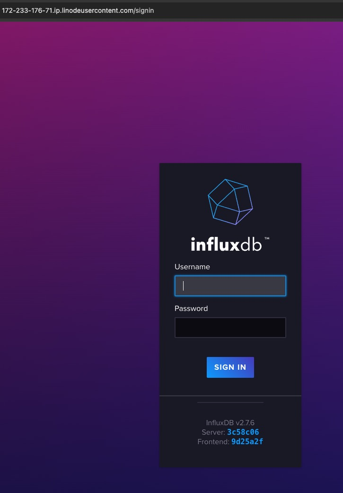
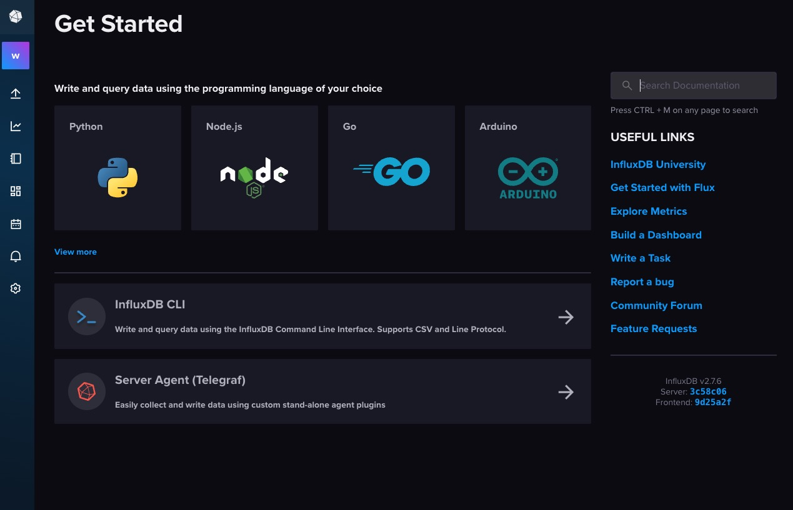

[InfluxDB](https://www.influxdata.com/) is a high-performance time series database designed to handle massive volumes of data with ease. Its intuitive query language and powerful visualization capabilities make it the go-to choice for monitoring, analytics, and IoT applications.

## Deploying a Marketplace App

{}

{}


**Estimated deployment time:** InfluxDB should be fully installed within 5-10 minutes after the Linode has finished provisioning.


## Configuration Options

- **Supported distributions:** Ubuntu 22.04 LTS
- **Suggested plan:** All plan types and sizes can be used.

### InfluxDB Options

- **Email address** *(required)*: Enter the email address to use for generating the SSL certificates.
- **Admin Username** *(required)*: Username for InfluxDB admin.
- **Organization Name** *(required)*: Name of the InfluxDB organization.
- **Bucket Name** *(required)*: Name of initial InfluxDB bucket.

{}

{}

{}

## Getting Started after Deployment

### Accessing the InfluxDB Server

1. Access InfluxDB's welcome page by launching your preferred web browser and navigating to either the custom domain designated during deployment or your Linode's rDNS domain, such as `192-0-2-17.ip.linodeusercontent.com`. If you need assistance in finding your Linode's IP addresses and rDNS information, refer to the [Managing IP Addresses](/docs/products/compute/compute-instances/guides/manage-ip-addresses/) guide for detailed instructions.

    

1. Enter the username `admin` and the generated password provided in the compute instance's `/home/$SUDO_USER/.credentials` file. This lets you access the dashboard and begin using InfluxDB.

    

### More Information

You may wish to consult the following resources for additional information on this topic. While these are provided in the hope that they will be useful, please note that we cannot vouch for the accuracy or timeliness of externally hosted materials.

- [InfluxData](https://www.influxdata.com/)
- [InfluxDB Documentation](https://docs.influxdata.com/influxdb/v2/)

{}