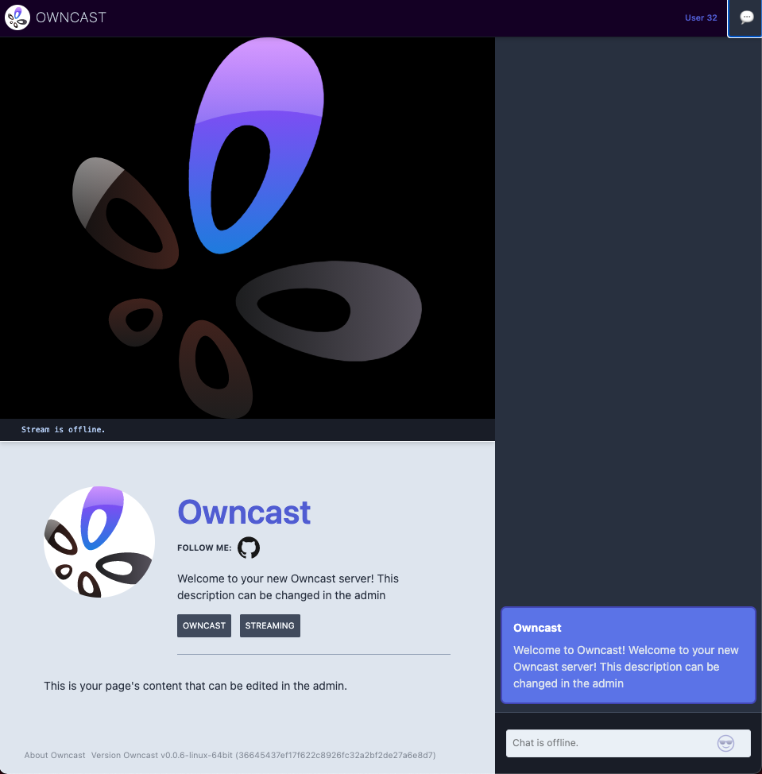

[Owncast](https://owncast.online/) is a self-hosted, "Twitch in a box" live streaming and chat server for use with popular broadcasting software such as OBS. You can use Owncast to live stream anything from gaming with your friends to live events for you and your clients. Like other popular streaming platforms, you can use Owncast's APIs to build things such as chat bots and stream overlays to drive further audience engagement.

## Deploying a Marketplace App

{}

{}


**Estimated deployment time:** Owncast should be fully installed within 2-5 minutes after the Compute Instance has finished provisioning.


## Configuration Options

- **Supported distributions:** Ubuntu 24.04 LTS
- **Suggested plan:** All plan types and sizes can be used with Owncast.

### Owncast Options

- **Hostname**: Your public hostname for your Owncast server. Required for SSL.
- **Email**: Your email address for configuring SSL.

{}

{}

## Getting Started after Deployment

Once the app is deployed, you need to obtain the credentials from the server.

To obtain credentials:

1.  Log in to your new Compute Instance using one of the methods below:

    - **Lish Console**: Log in to Cloud Manager, click the **Linodes** link in the left menu, and select the Compute Instance you just deployed. Click **Launch LISH Console**. Log in as the `root` user. To learn more, see [Using the Lish Console](/docs/products/compute/compute-instances/guides/lish/).
    - **SSH**: Log in to your Compute Instance over SSH using the `root` user. To learn how, see [Connecting to a Remote Server Over SSH](/docs/guides/connect-to-server-over-ssh/).

1.  Run the following command to access the credentials file:

    ```command
    cat /home/$USERNAME/.credentials
    ```

This returns passwords that were automatically generated when the instance was deployed. Save them. Once saved, you can safely delete the file.

## Using Owncast

After Owncast has finished installing, you can access your server with your Linode's custom domain or Reverse DNS.

With Owncast running, you can begin to configure your new server. Visit the Admin settings, located at `/admin` (for example `example.com/admin`) and use the credentials (for the `admin` user) you obtained in the previous section to log in.



### Connecting Your Streaming Software

To start streaming with Owncast:

1. Log in to the Owncast admin panel at `/admin`.
1. Go to the **Stream Keys** section and copy your streaming key.
1. Open your broadcasting software, for example OBS Studio.
1. Configure your streaming settings with following values:
   - **Service**: **Custom**,
   - **Server**: `rtmp://your-domain-or-ip/live`,
   - **Stream Key**: The key you copied from the admin panel.

For more detailed instructions on configuring specific streaming software, refer to the [Owncast Documentation](https://owncast.online/docs/broadcasting/).

On the server, Owncast is installed in the  `/opt/owncast` directory. You'll find all your data files there. This is also where you can upgrade your Owncast server in the future.


{}
