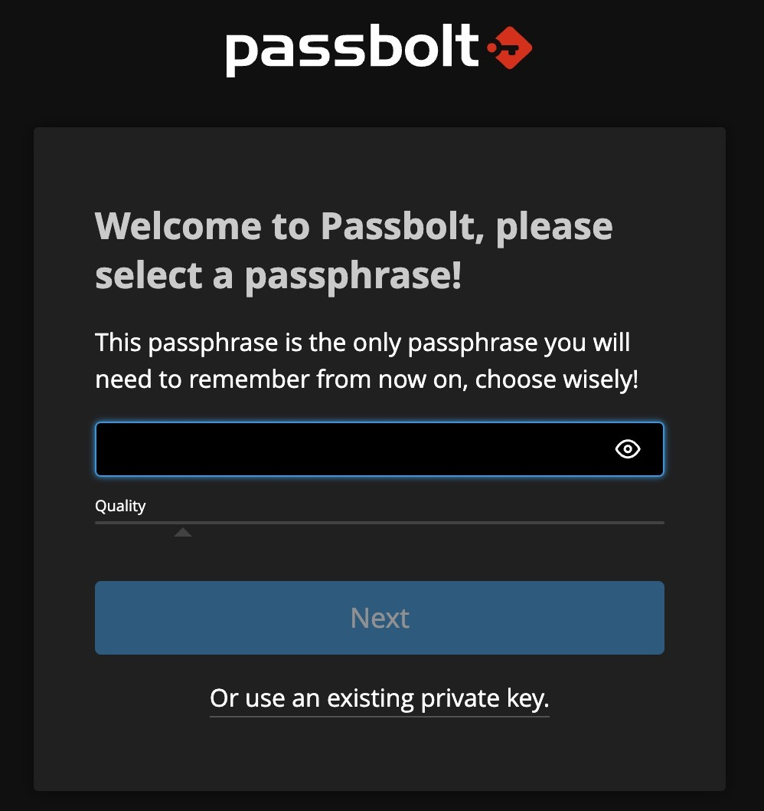
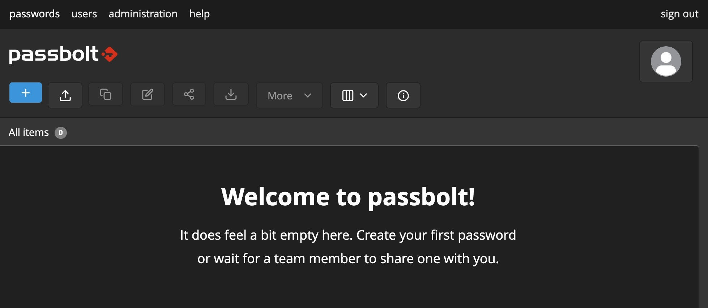

This Marketplace App deploys the latest unmodified version of [Passbolt Community Edition](https://github.com/passbolt/passbolt_api), an open-source password manager designed for teams and businesses. It allows users to securely store, share, and manage passwords.


Passbolt and the Passbolt logo are registered trademarks of Passbolt S.A.
This service is provided by Akamai and is not affiliated with Passbolt S.A.


## Deploying a Marketplace App

{}

{}


**Estimated deployment time:** Passbolt Community Edition should be fully installed within 5-10 minutes after the Compute Instance has finished provisioning.


## Configuration Options

- **Supported distributions:** Ubuntu 22.04 LTS
- **Suggested plan:** For best results, 4GB Dedicated CPU or Shared Compute instance for Passbolt.

### Passbolt Options

{}

## Getting Started after Deployment

To start registration follow the link provided in `/etc/motd` to visit the DNS you choose during deployment.

```output
cat /etc/motd
*********************************************************
Akamai Cloud passbolt Marketplace App

Registering admin user: https://$DNS_NAME/setup/start/$UUID

App URL: https://$DNS_NAME
Credentials File: /home/$SUDO_USER/.credentials
Documentation: https://www.linode.com/marketplace/apps/linode/passbolt/
*********************************************************
To delete this message of the day: rm /etc/motd
```

Be sure to download the `passbolt-recovery-kit.txt` file and store it in a safe place. This PGP Private Key Block  (and the passphrase you set here) will be required if you ever need to go through account recovery.

You will need to create a passphrase to access Passbolt.



Once the passphrase is set you will be able to view the Passbolt main screen.



For more information, visit [Passbolt Community Edition Installation Documentation](https://help.passbolt.com/hosting/install/ce/ubuntu/ubuntu.html) for details on how to configure Passbolt.

### Email Configuration

Postfix is installed as part of the Marketplace App, allowing you to send a test email. Unless you've manually configured your own SMTP provider, to send a test email through the SMTP screen (https://<example.com>/app/administration/smtp-settings), use the following (replace `example.com` with your FQDN):

* **Email provider**: Other
* **Authentication method**: None
* **SMTP host**: localhost
* **Use TLS?**: No
* **Port**: 25
* **SMTP client** leave blank
* **Sender name**: root
* **Sender email**: root@<example.com>


To make the most out of Passbolt you need a working email setup for email notifications (e.g. - account registration, password recovery and other critical notifications). For more information on setting this up, see the [Configure Email Providers](https://help.passbolt.com/configure/email/setup) page on Passbolt's website.

Regardless of how you configure your mail server, we suggest that you follow the best practices to ensure mail deliverability. For more information, see the [Running a Mail Server](https://www.linode.com/docs/guides/running-a-mail-server/) guide.


### Account Recovery
If you ever need to recover your account, you will be prompted for the PGP private key block you downloaded after entering your passphrase for the first time.

{}
