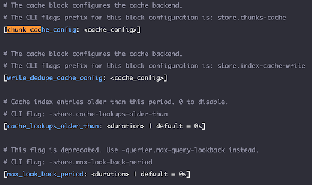
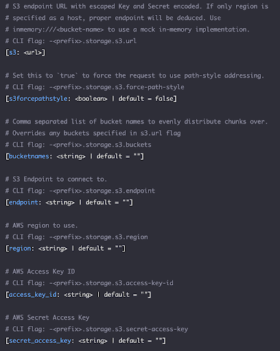
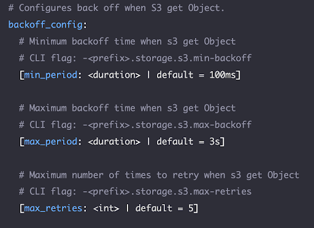
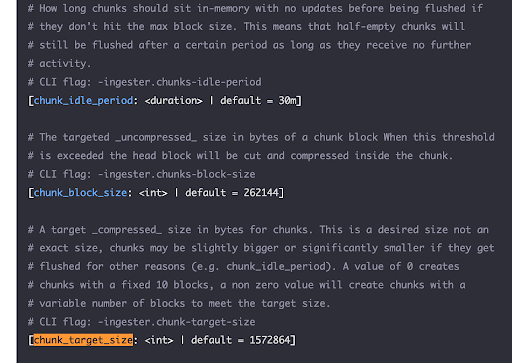

Grafana Loki is a log aggregation and visualization system for cloud-native environments. It offers a cost-effective, scalable solution for processing large volumes of log data generated by modern applications and microservices. With Grafana Loki, users can query and visualize logs from cloud-native workloads. Loki uses a label-based indexing system. This makes it an ideal choice for observability, monitoring, alerting and data analysis.

## Before you start

[Grafana Loki](https://grafana.com/docs/loki/latest/configure/) can integrate with Linode Object Storage as a back-end storage solution using the S3 protocol and S3 storage configuration.

Before you apply the Best Practices to your configuration, review these basic concepts to understand the Loki caching and storage workflow.

### Memcached Cache Store

- The best practices examples use Memcached, the most popular local caching system. Memcached serves as Loki's cache store to provide a fast, distributed caching layer.
- The Memcached configuration stores chunks of log data and associated metadata in its key-value store.

### Chunk Indexing and Caching

- Logs ingested into Loki are typically grouped into chunks. These chunks represent a time-bound segment of log data. The structure of the chunks allows efficient querying based on time ranges and labels.
- The Loki ingester indexes and caches chunks in Memcached for rapid retrieval.
- When a Loki query occurs, the query engine first checks Memcached for the required chunks.

### Caching During Writing

- During ingestion, chunks may be cached in Memcached immediately after they are written to the back-end storage such as, Linode Object Store.
- This proactive caching ensures that recently ingested log data is available for querying. It also avoids the latency that occurs when fetching it from the back-end storage.
- Loki manages the indexes and chunks separately even though it may use the same back-end storage for both.

### Caching During Reading

- When a query occurs the query engine checks Memcached for the required chunks.
- If the query finds the chunks in the cache, it retrieves the chunks directly from Memcached. This results in low-latency query responses.
- Loki fetches chunks that are not present in the cache or chunks evicted due to caching policies from the back-end storage.

### Eviction and Management

- Memcached manages its own eviction policies. These policies use factors such as memory usage, access patterns, and expiration times.
- Chunks that are the least frequently accessed or have exceeded their time-to-live (TTL) may be evicted from the cache. This makes room for new data.
- Loki's configuration may include parameters for tuning the eviction policies and cache size to optimize performance and resource utilization.

## Best Practices

Review these best practices for leveraging Linode Object Storage with Grafana Loki. These tips focus on Loki’s caching and storage configuration and provide specific recommendations for the integration.

### Enable caching on Loki

Caching helps to balance Loli's query performance, resource utilization, and data durability. By intelligently managing caching, eviction, and storage operations Loki optimizes the trade-offs between responsiveness and scalability in log aggregation and visualization. Any caching configuration, or lack of it, has direct implications on the number of requests, such as `GETs`, going forward to Object Storage. Today Object Storage supports 750 mixed requests per second (RPS) per bucket. Caching helps to ensure that requests and throughput are not rate-limited. It can also promote optimal latency for typical enterprise workloads.

### Choose a multi-tenancy workload type with an independent storage config

You should understand your Loki workload type and evaluate whether it’s single or multi-tenant. Multi-tenancy is the default for Loki and is common for enterprise solutions. Please see the [Grafana Loki documentation](https://grafana.com/docs/loki/latest/operations/multi-tenancy/) for information about multi-tenancy configurations. Each Loki tenant has a separate configuration per tenant that includes caching, such as Memcached, and storage, such as Linode Object Storage.

In addition to providing data isolation, the multi-tenancy model allows for horizontal scalability and storage load sharding per tenant. Consider this example to understand the impact of the multi-tenancy workload type.

A configuration with one tenant and one bucket only supports 750 mixed RPS for your entire workload. This means that if you have an aggregated workload of 10K queries per second across all your Grafana graphs with a cache configuration that yields a 90% hit ratio:
- ~1K of the requests will land on the back-end Object Storage bucket.
- With one tenant and one bucket, your workload will already exceed the rate limit for the bucket.

Alternatively, a configuration with two tenants and two buckets, one each for the org/division/workload type, gets twice the RPS and the workload is unlikely to be rate limited.

### Configure the Loki cache

Loki supports several configurable caching parameters. Review these recommended options to learn more.

#### Use an optimized cache store like Memcached

In-memory cache is auto-enabled in Loki. It is, however, recommended than you use an optimized cache store like Memcached. To configure Memcached, refer to the [Grafana documentation](https://grafana.com/docs/loki/latest/operations/caching/).

#### Configure the `chunk_store_config` block

The `chunk_store_config` block lets you configure how chunks are cached and how long to wait before saving them to the backing store.

Some of the key config parameters include `max_chunk_age` and `chunk_idle_period`. These parameters determine how long the chunks are cached before being flushed out.

Use the `default_validity` parameter for results caching and the `chunk_target_size` parameter to configure the compressed chunk size.

To determine the right values for these parameters for your use-case, it’s critical to consider the following:
- **Load**: The amount of log data in bytes produced per day by your tenant workload. For example, GBs/day.
- **Log access patterns**: Determine whether the log data access patterns for your use-case skews towards recent data only such as, <12h old, or older data such as, >4-5 days.
- **Cache capacity considerations**: Determine whether your Loki deployment has enough resources such as RAM, CPU, and local disk space available allocated for caching.
- **Cost considerations**: Estimates costs for managing the cache locally for Loki, given the memory and disk space capacity requirements.

To learn more you can read the [Grafana Cloud blog post](https://grafana.com/blog/2023/08/23/how-we-scaled-grafana-cloud-logs-memcached-cluster-to-50tb-and-improved-reliability/) that discusses how appropriate cache sizing impacts performance and reliability.

## Loki Storage Configuration

The `s3_storage_config` block configures the connection to the Linode S3 Object Storage back end.

The `bucketnames` storage config parameter allows the Loki tenant workloads to specify more than one bucket. This enables sharding of log data chunks across multiple buckets. It’s highly recommended that you configure more than one bucket, and possibly many depending on the load. This helps with scalability and load balancing since rate limits are enforced at the bucket level.

The following storage `backoff` settings are also important.

These parameters determine how Loki manages the storage requests when Linode Object Storage enforces rate limits. Rate limits may be enforced, for example, due to request rates higher than the allowed limits. If not configured properly, there can be a cascading effect where the retries contribute further to the request rates. This can result in perpetual or longer than ideal limits enforcement.

Given the Linode Object Storage rate-limiting implementation, the following values are highly recommended:
- `min_period` - 2 seconds
- `max_period` - 5 seconds
- `max_retries` - 5

#### Loki Chunk Size Configuration

The following chunk size and related config parameters are supported.

You should configure chunk sizes between 1.5 MB and 2 MB. The `chunk_target_size` directly translates to the object sizes in Linode Object storage and determines the:
- Number of overall `PUT` requests.
- Number of objects stored in the buckets.
- Effective bandwidth required for the Object Storage operations.

Review the following example to learn why it’s important  to choose the `chunk_target_size` value carefully.

If your workload generates 5 TB of logging data per day and the chunk size is 1.5 MB, then on an average, even distribution it will generate:
- ~38 `PUT` requests per second.
- 57 MBps (456 Mbps) of throughput out to the storage.
- ~ 3.3 million objects per day.

If, as an alternative, the chunk size is 2 MB then on an average, even distribution it will generate:
- ~29 `PUT` requests per second  for the same aggregate throughput to the storage but with ~2.5 million objects per day.

The number of requests and throughput for `GET` requests per second are highly dependent on the window size and period of time for which logs are being pulled and whether they are in cache or not. For example, ~500 `GET` requests per second missing cache with 2 MB chunk size would result in approximately ~1 GBps (8 Gbps) of egress throughput from Object Storage.

For example, ~500 `GET` requests per second missing cache with 2 MB chunk size would result in approximately ~1 GBps (8 Gbps) of egress throughput from Object Storage.

### Maintain your Loki deployment

Here are some additional best practices to help ensure the operational healthiness of your Loki deployment:
- Monitor the cache utilization and query performance using Grafana dashboards and Prometheus metrics.
- Experiment with different cache configurations to find the optimal balance between memory usage and query responsiveness.
- Regularly review and adjust cache parameters based on the changing workload characteristics and system resource availability.
- Periodically delete and re-configure Linode Object Storage bucket lifecycle policies to delete objects, such as log data, that are no longer required for your use-case.