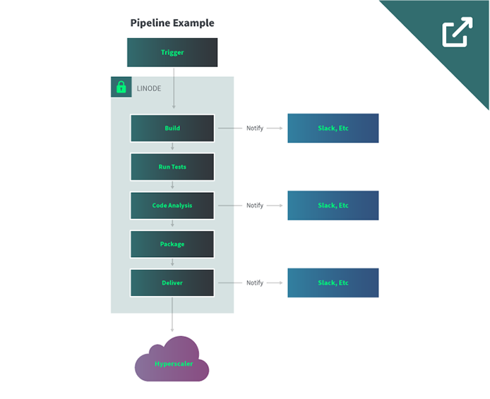
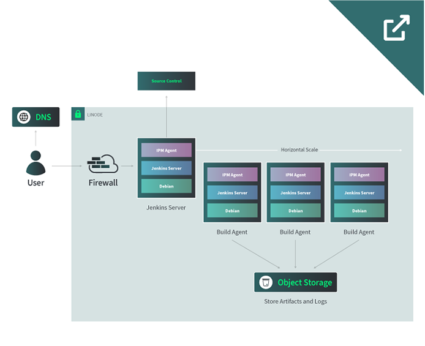

## Abstract

This reference architecture showcases a [Jenkins](https://www.jenkins.io/) CI/CD system hosted on the Linode platform that can automate deployments to Linode or other hosting platforms (including AWS, Azure, and GCP). The Jenkins server is used to manage the pipelines and agents and host the dashboard for end-users. Depending on the scale and requirements, developers can deploy N-number of build agent servers to handle concurrent processes. This process can be automated using [Terraform](https://www.terraform.io/) to scale build agent servers horizontally.

## Technologies Used

- [Jenkins](https://www.jenkins.io/)
- [Terraform](https://www.terraform.io/)
- **Linode Services**:
    - [Compute](/docs/products/compute/dedicated-cpu/)
    - [Firewall](/docs/products/networking/cloud-firewall/)
    - [Object Storage](/docs/products/storage/object-storage/)

## Business Benefits

- Reduce costs of large CI/CD deployments
- Granular control of environments
- Improved customizability
- Most control is in the hands of the developers

## Diagrams

